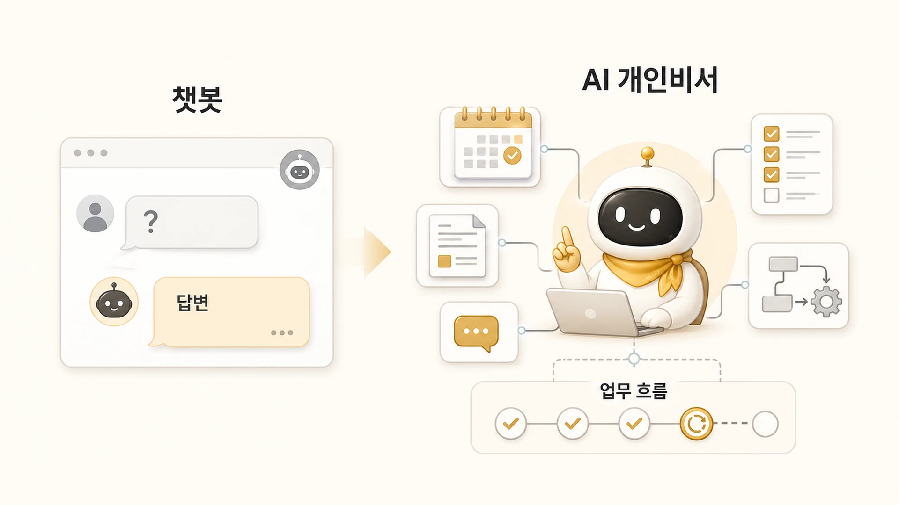

## AI 챗봇과 AI 개인비서는 어떻게 다를까

AI 챗봇은 질문에 답한다. AI 개인비서는 요청을 받아 업무 흐름을 만든다. 에르메스 에이전트(Hermes Agent)로 AI 업무 자동화를 시작할 때도 둘의 차이를 먼저 알아야 한다.

챗봇은 “이 내용을 요약해줘”, “문장을 다듬어줘”처럼 한 번의 대화 안에서 끝나는 작업에 강하다. 반면 AI 개인비서는 요청을 해석하고, 필요한 역할을 나누고, 도구를 연결하고, 결과를 다시 쓸 수 있는 기록으로 남기는 쪽에 가깝다.

[에르메스 에이전트(Hermes Agent)](https://wikidocs.net/346055)를 업무에 붙일 때 중요한 차이는 여기에 있다. 좋은 답변을 받는 것에서 끝낼지, 아니면 조사/정리/실행/기록이 이어지는 반복 가능한 업무 흐름을 만들지 먼저 정해야 한다.

[TOC]

## 처음에 착각하기 쉬운 것

처음에는 AI가 답변만 잘하면 충분해 보인다. 실제로 짧은 작업은 그 방식으로도 잘 된다.

하지만 업무가 반복되면 금방 다른 문제가 생긴다.

- 지난번에 어디까지 확인했는지 다시 찾아야 한다.
- 조사 결과와 해석이 섞여서 근거가 흐려진다.
- 글은 매끄럽지만 읽는 사람에게 필요한 구조가 부족하다.
- 도구 실행 결과가 기록으로 남지 않는다.
- 같은 종류의 작업을 매번 처음부터 설명하게 된다.

이때 필요한 것은 더 긴 프롬프트가 아니라 역할과 기록의 구조다. AI 개인비서는 한 번의 답변보다 “다음 단계가 무엇인지”와 “어떤 역할이 맡아야 하는지”를 정리하는 데 초점이 있다.

## 실제 업무에서 보이는 차이

같은 요청도 챗봇 관점과 AI 개인비서 관점에서는 다르게 처리된다.

| 요청 | 챗봇 관점 | AI 개인비서 관점 |
|---|---|---|
| 이 주제 조사해줘 | 검색 결과를 요약한다 | 조사 범위, 근거, 반례, 후속 질문을 나눈다 |
| 이 내용을 글로 바꿔줘 | 문장을 자연스럽게 고친다 | 독자, 목적, 구조, CTA, 발행 채널을 맞춘다 |
| 이걸 자동화해줘 | 가능한 방법을 설명한다 | 도구, 권한, 스케줄, 실패 시 확인 순서를 정한다 |
| 이전 작업 이어서 해줘 | 현재 대화에서만 찾는다 | 세션 기록, 문서, GitHub, 위키 등 원본 기준을 확인한다 |
| 공유 문서로 정리해줘 | 내용을 보기 좋게 요약한다 | 읽는 사람에게 필요한 이야기와 빼야 할 내부 정보를 구분한다 |

AI 개인비서는 모든 일을 직접 하는 존재가 아니다. 오히려 “이 일은 조사형에게, 이 일은 정리형에게, 이 일은 실행형에게”처럼 [역할형 에이전트](https://wikidocs.net/345925)를 나누고 최종 결과를 묶는 입구에 가깝다.

## Slack 요청은 왜 운영 티켓에 가까울까

실제 업무 요청은 대부분 짧다. “이 스레드 정리해줘”, “공식 문서와 맞는지 봐줘”, “본문 링크가 자연스러운지 확인해줘”처럼 한 줄로 시작한다.

겉으로는 간단한 질문처럼 보이지만, 안에는 여러 일이 숨어 있다.

1. 무엇을 확인해야 하는가?
2. 어떤 자료를 먼저 봐야 하는가?
3. 어느 역할이 맡는 게 좋은가?
4. 결과는 문서, 보고, 실행 중 어떤 형태로 끝나야 하는가?
5. 나중에 다시 쓸 수 있게 무엇을 남겨야 하는가?

이 질문에 답하지 않으면 AI는 그럴듯한 답변은 만들 수 있어도 업무를 안정적으로 이어가지는 못한다. 그래서 AI 개인비서는 질문 응답기가 아니라 요청을 운영 단위로 바꾸는 메인 창구가 된다.

## Hermes Agent에서 이 차이가 중요한 이유

Hermes Agent에는 memory, skill, cron, MCP, gateway, profile 같은 기능이 있다. 기능 이름만 보면 각각 따로 배워야 할 것처럼 보인다.

하지만 AI 개인비서 관점으로 보면 연결이 단순해진다.

- memory는 계속 기억해야 할 기준을 남긴다.
- skill은 반복 절차를 재사용 가능한 방식으로 남긴다.
- cron은 정해진 시간에 일을 시작한다.
- MCP와 외부 도구는 실제 업무 시스템과 연결한다.
- profile은 역할과 상태의 경계를 나눈다.
- gateway는 외부 요청을 받을 입구가 된다.

기능을 외우는 것이 목적이 아니다. “어떤 업무 흐름에서 이 기능이 필요한가”를 판단하는 것이 중요하다.

## AI 개인비서로 넘길지 판단하는 기준

AI를 챗봇처럼 쓸지, AI 개인비서처럼 운영할지는 다음 질문으로 가르면 된다.

- 이 작업은 한 번 답하면 끝나는가, 아니면 다음 단계가 이어지는가?
- 조사, 정리, 실행, 기록 중 둘 이상이 섞여 있는가?
- 같은 종류의 요청이 반복되는가?
- 결과를 나중에 다시 꺼내 써야 하는가?
- 여러 도구나 문서를 확인해야 하는가?
- 책이나 팀 문서로 정리할 때 읽는 사람에게 필요한 정보와 불필요한 정보를 나눠야 하는가?

이 질문에 많이 해당할수록 챗봇보다 AI 개인비서 구조가 필요하다.

## 첫 업무를 고르는 빠른 분기

처음 Hermes Agent를 붙일 업무는 거창할 필요가 없다. 아래처럼 고르면 된다.

| 증상 | 챗봇으로 충분한 경우 | AI 개인비서가 필요한 경우 |
|---|---|---|
| 질문이 짧다 | 한 번 답하면 끝난다 | 답변 뒤에 확인/수정/발행이 이어진다 |
| 자료가 많다 | 사용자가 이미 근거를 골랐다 | 근거, 반례, 최신성 확인이 필요하다 |
| 문서가 필요하다 | 문장만 다듬으면 된다 | 독자, 구조, 본문 링크, 다음 액션이 필요하다 |
| 도구가 필요하다 | 방법 설명만 필요하다 | 파일 수정, 테스트, 배포, 화면 확인이 필요하다 |
| 반복된다 | 매번 상황이 다르다 | 같은 절차를 skill이나 체크리스트로 남길 수 있다 |

이 표에서 오른쪽 항목이 두 개 이상이면 AI 개인비서 구조로 시작하는 편이 좋다. 메인 창구가 요청을 받고, 필요한 순간에 조사형/정리형/실행형 에이전트로 나누는 방식이다.

## FAQ

### 챗봇을 잘 쓰는 것과 AI 개인비서를 운영하는 것은 뭐가 다른가요?

챗봇은 답변 품질이 중심이다. AI 개인비서는 요청 해석, 역할 분리, 도구 연결, 기록까지 포함한 흐름이 중심이다.

### 프롬프트만 잘 쓰면 충분하지 않나요?

짧은 작업은 가능하다. 하지만 반복 업무, 도구 실행, 문서화, 발행까지 이어지면 프롬프트보다 운영 구조가 더 중요해진다.
