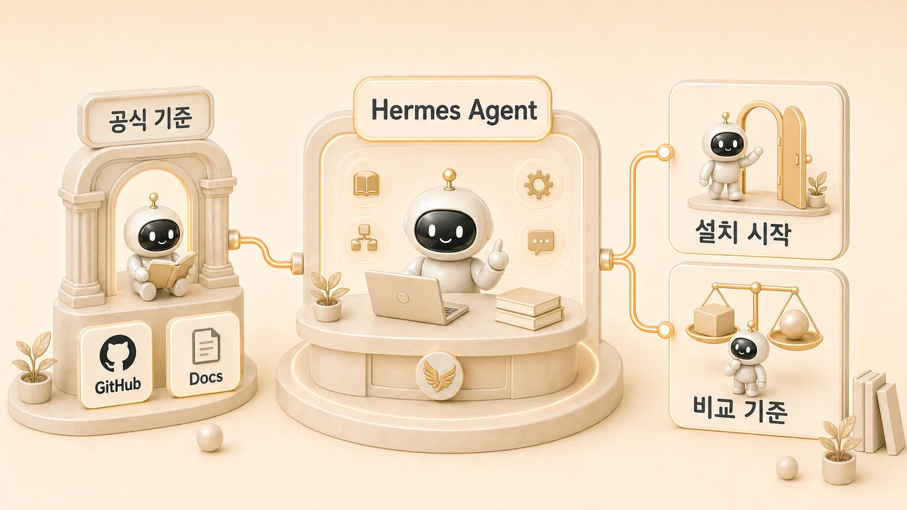

## 0장. 에르메스 에이전트(Hermes Agent) 기초 가이드



에르메스 에이전트(Hermes Agent)를 처음 시작할 때 가장 위험한 흐름은 설치 명령부터 복사하고, 곧바로 Slack/gateway/cron/MCP를 붙이는 것이다. 공식 docs와 GitHub는 Hermes Agent를 self-improving AI agent, CLI/TUI, messaging gateway, memory, skill, tool, cron, MCP를 갖춘 실행 환경으로 설명한다. 그래서 0장은 기능을 모두 외우는 장이 아니라 “어떤 순서로 확인해야 안전하게 실제 업무에 붙일 수 있는가”를 잡는 입문 흐름이다.

이 책은 공식 문서를 대체하지 않는다. 공식 GitHub와 docs에서 설치/명령/설정 기준을 확인하고, 이 책에서는 AI 개인비서와 역할형 에이전트 운영 관점으로 다시 해석한다. 처음 독자는 0장을 따라가며 정의, 공식 자료, 설치, 첫 대화, provider/model/config, 비교, Docker/Gateway, 채널, 업데이트 검증 순서로 보면 된다.

## 0장을 읽는 순서

| 순서 | 페이지 | 먼저 답하는 질문 |
|---|---|---|
| 00-01 | 에르메스 에이전트(Hermes Agent)란 무엇인가 | Hermes Agent가 챗봇/IDE copilot과 무엇이 다른가 |
| 00-02 | 공식 GitHub/docs는 어디서 볼까 | 공식 source of truth와 이 책의 역할은 어떻게 다른가 |
| 00-03 | 설치와 세팅은 어떻게 시작할까 | 설치 명령보다 먼저/나중에 무엇을 검증해야 하는가 |
| 00-04 | CLI 첫 대화는 어떻게 시작할까 | 설치 후 첫 대화, 세션, slash command를 어떻게 확인하는가 |
| 00-05 | provider/model/config는 어떻게 확인할까 | 모델 라우팅과 설정 파일은 어디서 흔들리는가 |
| 00-06 | OpenClaw와 무엇이 다를까 | 기존 환경에서 Hermes로 넘어올 때 무엇을 버리고 가져올까 |
| 00-07 | Claude Code/Codex와 어떻게 다를까 | 코딩 에이전트와 운영형 개인비서는 어떻게 다르게 쓸까 |
| 00-08 | Docker/Gateway는 언제 필요할까 | 로컬 실습과 상시 운영의 경계는 어디인가 |
| 00-09 | 어떤 채널에서 쓸 수 있을까 | CLI/Slack/Telegram/Discord/Webhook 중 어디서 부를까 |
| 00-10 | 업데이트 전후 무엇을 점검할까 | 운영 중인 gateway/cron/skill을 깨지 않으려면 무엇을 볼까 |

## 공식 docs 기준으로 먼저 알아야 할 것

공식 Hermes Agent docs는 Quick Links에서 Installation, Quickstart, Learning Path, Configuration, Messaging Gateway, Tools & Toolsets, Memory System, Skills System, MCP Integration, Voice Mode, Personality/SOUL.md, Context Files, Security, Architecture, FAQ를 안내한다. 이 목록은 “기능이 많다”는 뜻이 아니라, Hermes Agent가 대화창 하나가 아니라 운영 환경이라는 뜻이다.

GitHub README도 같은 방향을 강조한다. Hermes Agent는 Nous Research가 만든 self-improving AI agent이며, built-in learning loop, skill creation, memory, session search, messaging gateway, scheduled automation, delegation/parallel workstreams를 주요 특징으로 둔다. 그래서 처음 설치한 뒤 바로 업무 자동화를 기대하기보다, 아래 순서로 좁혀 가는 편이 안전하다.

```text
공식 GitHub/docs 확인
        ↓
설치와 기본 실행 확인
        ↓
첫 CLI 대화와 세션 확인
        ↓
provider/model/config 확인
        ↓
필요한 tool/toolset만 켜기
        ↓
gateway/채널 연결
        ↓
cron/skill/MCP 같은 운영 기능 확장
        ↓
업데이트/복구/보안 기준 마련
```

## 처음 세팅할 때의 운영 기준

| 구분 | 성급한 접근 | 안정적인 접근 |
|---|---|---|
| 설치 | 설치 명령만 복사한다 | 공식 docs와 GitHub를 확인하고 지원 환경을 먼저 본다 |
| 첫 실행 | gateway부터 켠다 | CLI에서 기본 chat과 세션을 먼저 확인한다 |
| 모델 | 아무 모델이나 붙인다 | provider/model/config 저장 위치와 라우팅 기준을 본다 |
| 도구 | 모든 tool을 켠다 | 필요한 toolset만 켜고 위험 작업 승인 기준을 둔다 |
| 메시징 | Slack/Telegram/Discord를 한 번에 붙인다 | 주 채널 하나를 먼저 안정화한다 |
| 자동화 | cron을 바로 만든다 | fresh session에서 혼자 실행될 prompt인지 확인한다 |
| 업데이트 | 최신 버전이면 바로 올린다 | gateway, cron, config, skill, 로그를 전후로 확인한다 |

0장에서 중요한 것은 “다 알기”가 아니다. 지금 내가 어느 단계에서 막혔는지 구분하는 것이다. 설치 문제인지, provider 문제인지, config 문제인지, gateway 문제인지, 권한 문제인지가 분리되어야 이후 장의 AI 개인비서/역할형 에이전트 운영이 흔들리지 않는다.

## 이 책과 공식 문서를 함께 보는 법

공식 문서는 기능의 source of truth다. 설치 명령, CLI command, config option, messaging gateway 설정, security boundary, architecture처럼 바뀔 수 있는 내용은 공식 docs를 먼저 확인해야 한다.

이 책은 그 기능을 실제 업무에 붙일 때의 운영 기준을 다룬다. 예를 들어 공식 docs가 `hermes gateway setup`을 설명한다면, 이 책은 “왜 gateway status와 실제 Slack delivery를 따로 확인해야 하는가”를 설명한다. 공식 docs가 skills system을 설명한다면, 이 책은 “어떤 반복 업무를 skill로 남기고 어떤 정보는 memory에 남기면 안 되는가”를 다룬다.

## 다음 글

먼저 [에르메스 에이전트(Hermes Agent)란 무엇인지](https://wikidocs.net/346055) 확인한다. 그다음 공식 GitHub/docs, 설치, [CLI 첫 대화](https://wikidocs.net/346251), [provider/model/config 설정](https://wikidocs.net/346252), 비교, Docker/Gateway, 채널, [업데이트 검증](https://wikidocs.net/346253) 순서로 보면 0장이 하나의 체크리스트처럼 작동한다.
