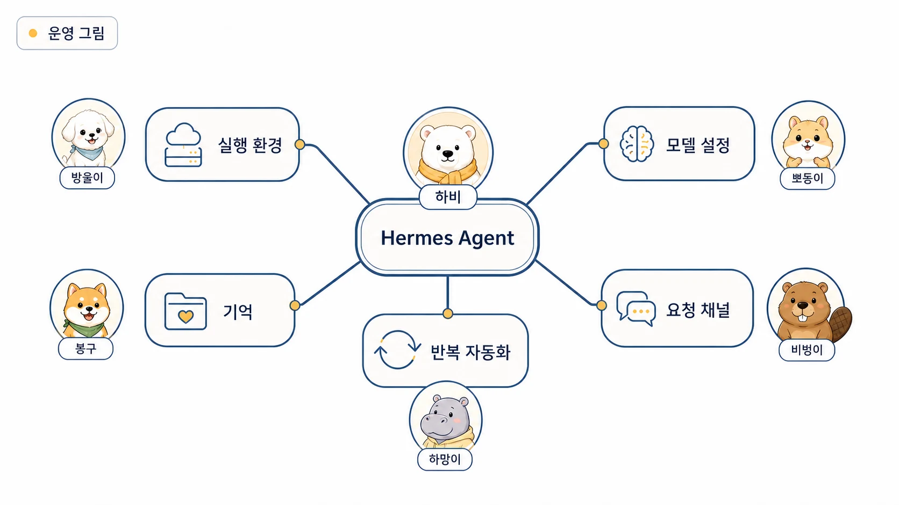

## 0장. 에르메스 에이전트(Hermes Agent) 기초 가이드

AI에게 일을 시켜봤는데, 매번 처음부터 설명해야 한다.

지난번에 정한 문체도 다시 말해야 하고, 어디까지 조사했는지도 다시 붙여야 하고, 반복 작업인데도 매번 새 프롬프트를 짜야 한다. 답변은 빠른데 업무는 생각보다 줄지 않는다. 많은 사람이 AI 개인비서나 AI 에이전트를 처음 쓸 때 여기서 막힌다.

문제는 프롬프트 길이가 아니다. **기억할 것, 다시 찾을 것, 반복 절차로 남길 것, 외부 도구로 실행할 것**이 한 구조 안에 잡혀 있지 않기 때문이다. Hermes Agent는 이 지점을 해결하기 위해 memory, session search, Skill, cron, MCP, gateway를 하나의 업무 운영 흐름으로 묶는다.

그래서 에르메스 에이전트(Hermes Agent)를 시작할 때 설치 명령보다 먼저 정해야 할 것은 **내 업무에 어떤 순서로 붙일지**다. CLI, provider, memory, Skill, cron, MCP, gateway는 모두 강력하지만 한꺼번에 켜면 문제 원인을 찾기 어렵다. 먼저 “어디서 부르고, 무엇을 기억하고, 어떤 일을 반복할지”를 잡아야 한다.

0장은 기능 소개 장이 아니다. Hermes Agent를 실제 AI 개인비서와 업무 자동화 환경으로 쓰기 전에, 무엇을 먼저 확인하고 어디까지 확장할지 잡는 입문 지도다. 처음에는 [에르메스 에이전트(Hermes Agent)란 무엇인가](https://wikidocs.net/346055)를 먼저 읽고, 설치보다 운영 그림을 먼저 잡는다.


이 책은 공식 문서를 대체하지 않는다. 설치 명령, CLI 옵션, 설정값처럼 바뀔 수 있는 내용은 공식 GitHub와 문서를 기준으로 확인한다. 이 책은 그 기능을 실제 업무에 붙일 때의 순서와 판단 기준을 다룬다. memory/shared-memory에는 오래 남길 기준을 두고, session search로 과거 작업을 다시 찾고, 반복 절차는 Skill로 만들고, 정기 작업은 cron으로 시작하고, 외부 업무 시스템은 MCP/gateway로 연결한다. 이 흐름을 잡아야 이후 장의 AI 개인비서, 역할형 에이전트, 기억 시스템, Skill 운영이 하나의 구조로 이어진다.



[TOC]

## 0장을 읽는 순서

| 순서 | 페이지 | 먼저 답하는 질문 |
|---|---|---|
| 00-01 | 에르메스 에이전트(Hermes Agent)란 무엇인가 | Hermes Agent가 챗봇/IDE copilot과 무엇이 다른가 |
| 00-02 | 공식 GitHub와 문서는 어디서 볼까 | 공식 원본 기준과 이 책의 역할은 어떻게 다른가 |
| 00-03 | 설치와 세팅은 어떻게 시작할까 | 설치 명령보다 먼저 무엇을 확인해야 하는가 |
| 00-04 | CLI 첫 대화는 어떻게 시작할까 | 설치 후 첫 대화와 세션을 어떻게 확인하는가 |
| 00-05 | provider/model/config는 어떻게 확인할까 | 모델 라우팅과 설정 파일은 어디서 흔들리는가 |
| 00-06 | OpenClaw와 무엇이 다를까 | 기존 환경에서 Hermes로 넘어올 때 무엇을 버리고 가져올까 |
| 00-07 | Claude Code/Codex와 어떻게 다를까 | 코딩 에이전트와 운영형 개인비서는 어떻게 다르게 쓸까 |
| 00-08 | Docker/Gateway는 언제 필요할까 | 로컬 실습과 상시 운영의 경계는 어디인가 |
| 00-09 | 어떤 채널에서 쓸 수 있을까 | CLI/Slack/Telegram/Discord/Webhook 중 어디서 부를까 |
| 00-10 | 업데이트 전후 무엇을 점검할까 | 운영 중인 gateway/cron/skill을 깨지 않으려면 무엇을 볼까 |
| 00-11 | 맥미니 상시 운영은 무엇을 세팅할까 | 전용 Mac mini에서 상시 운영 기준을 어떻게 나눠 볼까 |

## 0장에서 잡아야 할 운영 그림

처음부터 모든 기능을 외울 필요는 없다. 아래 다섯 가지 질문에 답할 수 있으면 1장 이후의 흐름을 훨씬 안정적으로 따라갈 수 있다.

| 질문 | 확인할 것 | 이어지는 장 |
|---|---|---|
| 어디서 실행할까 | macOS/Linux/WSL2/Docker, 로컬/서버/맥미니 | 00-03, 00-08, 00-11 |
| 어떤 모델을 쓸까 | provider, model, config 위치, 비용 기준 | 00-05 |
| 어디서 부를까 | CLI만 쓸지 Slack/Telegram/Discord/Webhook까지 붙일지 | 00-09, 5장 |
| 무엇을 기억할까 | memory/shared-memory/session search의 역할 구분 | 4장 |
| 무엇을 반복할까 | cron으로 시작할 일, Skill로 남길 절차 | 5장, 6장 |

핵심은 “어떤 기능을 켤까”가 아니라 “내 업무에서 무엇을 기억하고, 무엇을 반복하고, 무엇을 외부 도구와 연결할까”다. 이 질문이 정리되어야 Hermes Agent가 단순한 대화창이 아니라 AI 업무 자동화 환경으로 작동한다.


## 처음 세팅할 때 피해야 할 흐름

| 구분 | 성급한 접근 | 안정적인 접근 |
|---|---|---|
| 설치 | 설치 명령만 복사한다 | 공식 문서와 GitHub를 확인하고 지원 환경을 먼저 본다 |
| 첫 실행 | gateway부터 켠다 | CLI에서 기본 대화와 세션을 먼저 확인한다 |
| 모델 | 아무 모델이나 붙인다 | provider/model/config 저장 위치와 라우팅 기준을 본다 |
| 도구 | 모든 tool을 켠다 | 필요한 toolset만 켜고 위험 작업 승인 기준을 둔다 |
| 메시징 | 여러 채널을 한 번에 붙인다 | 주 채널 하나를 먼저 안정화한다 |
| 자동화 | cron을 바로 만든다 | fresh session에서 혼자 실행될 prompt인지 확인한다 |
| 업데이트 | 최신 버전이면 바로 올린다 | gateway, cron, config, skill, 로그를 전후로 확인한다 |

처음 세팅에서 중요한 것은 “다 아는 것”이 아니다. 문제가 생겼을 때 설치 문제인지, provider 문제인지, config 문제인지, gateway 문제인지, 권한 문제인지 분리할 수 있어야 한다.

## 0장을 마치면 남아야 할 것

0장을 지나 1장으로 넘어가기 전에는 내 Hermes Agent 환경을 한 문장으로 설명할 수 있으면 충분하다.

```text
예시:
macOS Mac mini에서 Slack gateway를 상시 운영하고,
provider는 OpenRouter를 쓰며,
cron 결과는 Slack thread로 받는다.
```

아래 항목은 비밀번호나 토큰 없이 별도 메모로 남겨두면 이후 디버깅이 쉬워진다.

```text
실행 환경:
설치 방식:
주 사용 provider/model:
config 확인 위치:
첫 CLI 대화 확인 여부:
사용할 toolset 범위:
주 사용 채널:
gateway 필요 여부:
cron/Skill/MCP 확장 예정 여부:
업데이트 전후 검증 질문:
```

이 템플릿의 목적은 내부 값을 공개하는 것이 아니라 문제를 재현할 최소 맥락을 남기는 것이다. 실제 토큰, webhook URL, channel ID, 개인 경로는 팀 내부 보안 문서나 secret store에 둔다.

## 막혔을 때 바로 가는 길

이미 막힌 상태라면 전체를 처음부터 다시 읽기보다 증상별로 들어가는 편이 빠르다.

| 지금 증상 | 먼저 읽을 곳 | 다음에 확인할 곳 |
|---|---|---|
| Hermes Agent가 무엇인지 아직 헷갈린다 | [00-01 핵심 개념](https://wikidocs.net/346055) | 01장 AI 개인비서/AI 팀 |
| 설치는 했는데 첫 대화가 안 된다 | [00-04 CLI 첫 대화](https://wikidocs.net/346251) | [00-05 provider/model/config](https://wikidocs.net/346252) |
| CLI는 되는데 Slack에서 답이 없다 | [00-08 Docker/Gateway](https://wikidocs.net/346139) | [05-02 always-on gateway](https://wikidocs.net/345906) |
| cron 결과가 어디로 갔는지 모르겠다 | [05-03 Daily Briefing Bot](https://wikidocs.net/345926) | [08-1 운영 질문 분류](https://wikidocs.net/345912) |
| 비용이 어디서 나가는지 모르겠다 | [00-05 provider/model/config](https://wikidocs.net/346252) | 5장 외부 도구/검색 비용 |
| 여러 봇이 동시에 답해 시끄럽다 | [08-2 멀티봇 스레드](https://wikidocs.net/345913) | 09장 체크리스트/복구 |

## 이 책과 공식 문서를 함께 보는 법

공식 문서는 기능의 기준점이다. 설치 명령, CLI command, config option, messaging gateway 설정, security boundary, architecture처럼 바뀔 수 있는 내용은 공식 문서를 먼저 확인해야 한다.

이 책은 그 기능을 실제 업무에 붙일 때의 판단 기준을 다룬다. 예를 들어 공식 문서가 `hermes gateway setup`을 설명한다면, 이 책은 “왜 gateway status와 실제 Slack delivery를 따로 확인해야 하는가”를 설명한다. 공식 문서가 skills system을 설명한다면, 이 책은 “어떤 반복 업무를 skill로 남기고 어떤 정보는 memory에 남기면 안 되는가”를 다룬다.

0장의 목표는 Hermes Agent 전체를 한 번에 이해시키는 것이 아니다. 이후 장을 읽을 때 같은 이야기가 반복되는 느낌이 아니라, 설치/운영/기억/자동화/복구가 한 흐름으로 이어지게 만드는 것이다.
