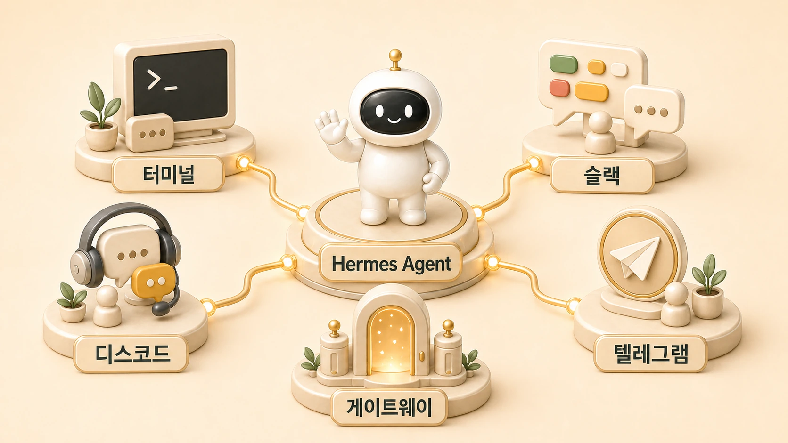

## 에르메스 에이전트(Hermes Agent)는 어떤 채널에서 쓸 수 있을까

에르메스 에이전트(Hermes Agent)는 하나의 앱 화면에서만 쓰는 도구가 아니다. `Hermes Agent Slack`, `Hermes Agent Telegram`, `Hermes Agent Discord`, `Hermes Agent gateway`를 찾는 독자라면 먼저 Hermes Agent를 CLI, Slack/슬랙, Telegram/텔레그램, Discord/디스코드, Email/이메일, Webhook/웹훅 같은 여러 채널에서 호출되는 AI 개인비서 운영 환경으로 이해하는 편이 좋다.

우리는 현재 Slack/슬랙을 주 채널로 쓴다. Slack 스레드에서 사용자가 요청을 던지면 하비가 메인 창구로 해석하고, 필요하면 방울이/뽀동이/하망이/봉구 같은 역할형 에이전트로 나눈다. 하지만 이 구조는 Slack에만 묶인 것이 아니다. 같은 Hermes Agent도 Telegram/텔레그램에서는 모바일 개인비서처럼, Discord/디스코드에서는 커뮤니티/팀 채널 봇처럼, Webhook/웹훅에서는 외부 이벤트를 받는 자동화 입구처럼 운영될 수 있다.

## 사용 가능한 채널을 먼저 보는 이유

처음에는 모델이나 프롬프트만 보게 된다. 하지만 실제 업무 자동화에서는 “어디서 부를 것인가”가 중요하다.

- 혼자 쓰는가, 팀 채널에서 쓰는가?
- 모바일에서 즉시 호출해야 하는가?
- 스레드 맥락이 중요한가?
- 외부 이벤트가 자동으로 들어와야 하는가?
- 결과를 어디로 다시 보내야 하는가?

이 질문에 따라 CLI, Slack, Telegram, Discord, Email, Webhook 중 적합한 채널이 달라진다.

## 채널별 쓰임

| 채널 | 주 용도 | 운영 기준 |
|---|---|---|
| CLI | 설치 확인, 기본 chat, 로컬 작업, 도구 권한 검증 | provider/model/tool이 먼저 안정돼야 한다 |
| Slack | 현재 우리가 쓰는 업무 채널, 스레드 기반 요청, 팀 운영 | thread 맥락, 호출 규칙, 최종 보고 위치를 정해야 한다 |
| Telegram | 모바일 개인비서, 빠른 요청, 팀 assistant | 개인/그룹 chat 권한과 응답 대상이 중요하다 |
| Discord | 커뮤니티/팀 서버, 봇형 운영 | channel 권한, thread, 멘션 규칙을 정해야 한다 |
| Email | 비동기 보고, briefing, 외부 커뮤니케이션 | 읽기/발송/삭제 권한을 분리해야 한다 |
| Webhook | 외부 이벤트 기반 자동화 | 이벤트 payload와 승인 기준을 함께 설계해야 한다 |
| Open WebUI | 웹 UI 기반 접근 | UI 편의성과 실제 도구 권한을 구분해야 한다 |
| Matrix/WhatsApp/Signal 등 | 확장 메시징 채널 | 조직에서 이미 쓰는 메신저와 권한 정책을 우선 본다 |

핵심은 채널 수가 많다는 사실이 아니다. 어떤 채널을 쓰든 요청 해석, 도구 실행, 결과 전달, 실패 로그를 하나의 운영 흐름으로 봐야 한다.

## Slack을 주 채널로 쓸 때의 장점

Slack은 업무 요청과 결과가 같은 공간에 남는다. 그래서 AI 개인비서 운영에 잘 맞는다.

1. 스레드 안에 요청 맥락이 남는다.
2. 다른 사람이 진행 상황을 볼 수 있다.
3. 조사/정리/실행 결과를 같은 흐름에서 확인할 수 있다.
4. 하비가 최종 통합하고, 뽀동이가 문서화하고, 봉구가 검증하는 식의 역할 분리가 자연스럽다.
5. 나중에 WikiDocs, 블로그, 회의록, 체크리스트로 바꿀 원천이 된다.

다만 Slack도 규칙 없이 쓰면 금방 시끄러워진다. 그래서 [멀티봇 스레드 규칙](https://wikidocs.net/345913)처럼 누가 언제 답하고, 사람 대화가 끼면 어디서 멈출지 정해야 한다.

## 메신저별 차이는 기능보다 대화 방식이다

우리는 현재 Slack을 주 채널로 운영한다. 그래서 이 책의 실제 사례는 Slack 스레드, 하비의 최종 통합, 뽀동이의 짧은 보고, cron 결과 delivery를 중심으로 설명한다. Telegram/Discord/Email/Webhook은 같은 Hermes Agent를 다른 입구로 부르는 확장 선택지로 본다.

| 채널 | 잘 맞는 장면 | 먼저 정할 것 |
|---|---|---|
| Slack | 팀 업무, 스레드 맥락, 역할형 에이전트 협업 | thread 규칙, mention 규칙, home channel, 멀티봇 침묵 규칙 |
| Telegram | 개인 모바일 비서, 빠른 알림, 짧은 요청 | 개인 chat/group chat 구분, 허용 사용자, 알림 빈도 |
| Discord | 커뮤니티/팀 서버, 채널별 봇 운영 | 서버/채널 권한, 공개 채널 위험 작업 제한, 멘션 규칙 |
| Email | 정기 보고, 외부 전달, 비동기 요약 | 발송 권한, 수신자 범위, 삭제/전달 위험 |
| Webhook | 외부 이벤트가 자동으로 들어오는 업무 | payload 검증, 인증, 재시도, 승인 필요한 실행 분리 |

Slack이 좋은 이유는 “일이 스레드로 남는다”는 점이다. 반면 Telegram은 빠르지만 맥락이 짧아지기 쉽고, Discord는 채널/권한 구조가 강한 대신 공개 공간에서 봇이 소음을 만들기 쉽다. KakaoTalk/카카오톡은 한국 사용자에게 익숙하지만, 봇 권한, 업무 로그, 파일/스레드 맥락, 공식 연동 방식이 Slack과 다르므로 “Slack처럼 바로 팀 운영 채널이 된다”고 보면 안 된다. 그래서 처음에는 채널을 많이 붙이지 말고 주 채널 하나를 안정화한 뒤 확장하는 편이 좋다.

## Telegram과 Discord를 볼 때의 기준

Telegram은 개인비서 감각이 강하다. 모바일에서 빠르게 부르고, 짧은 보고를 받고, 개인 또는 작은 팀의 assistant로 쓰기 좋다. 대신 그룹 chat에서는 호출 규칙과 응답 대상이 명확해야 한다.

Discord는 커뮤니티나 팀 서버에서 봇처럼 쓰기 좋다. 채널이 여러 개이고 권한 체계가 있으므로, 어떤 채널에서 어떤 도구를 쓸 수 있는지 나눠야 한다. 공개 채널에서 외부 공개/삭제/권한 변경 같은 위험 작업을 바로 실행하면 안 된다.

즉 Telegram/Discord는 “붙일 수 있다”보다 “어떤 대화 공간에서 어떤 권한으로 호출할 것인가”가 먼저다.

## gateway와 채널을 헷갈리지 않기

Gateway는 채널 자체가 아니라 채널과 Hermes Agent를 이어주는 always-on 운영 축이다. Slack, Telegram, Discord에서 메시지를 주고받으려면 gateway process, 인증, delivery target, 로그 확인 기준이 필요하다.

그래서 `gateway status`가 OK라고 해서 운영이 끝난 것은 아니다. 실제로는 아래를 함께 봐야 한다.

- 메시지가 들어오는가?
- 올바른 profile/agent가 응답하는가?
- 결과가 올바른 채널/thread로 돌아가는가?
- 실패했을 때 로그를 어디서 보는가?
- 위험 작업은 승인 없이 실행되지 않는가?

이 기준은 [Docker/Gateway 운영 기준](https://wikidocs.net/346139)과 [always-on gateway가 헷갈리는 이유](https://wikidocs.net/345906)에서 더 자세히 다룬다.

## 채널을 열기 전에 트리거 규칙을 정한다

Slack, Telegram, Discord 같은 메시징 채널은 편하지만, 열린 채널에 에이전트를 넣으면 호출 규칙이 곧 품질이 된다. 특히 커뮤니티나 팀 채널에서는 “모든 메시지에 반응하는 봇”이 가장 빨리 피로감을 만든다.

| 규칙 | 이유 |
|---|---|
| 멘션 또는 명시 호출을 기본으로 둔다 | 사람 대화와 봇 대화를 분리한다 |
| 봇별 역할 이름을 정한다 | 조사형/정리형/실행형/이미지형 응답이 섞이지 않는다 |
| 사람이 대화 중이면 자동 응답을 멈춘다 | 멀티봇 소음을 줄인다 |
| 채널별 허용 사용자/허용 채널을 둔다 | 원하지 않는 실행 요청을 막는다 |
| 결과 전달 채널과 작업 채널을 구분한다 | cron/delivery 실패를 찾기 쉬워진다 |

이 기준은 나중에 [멀티봇 스레드 규칙](https://wikidocs.net/345913)과 [gateway 권한](https://wikidocs.net/346261)으로 이어진다.

## FAQ

### 처음에는 어떤 채널로 시작하는 게 좋나요?

CLI가 먼저다. CLI에서 기본 chat, provider, tool 권한을 확인한 뒤 Slack/Telegram/Discord 같은 메시징 채널을 붙이는 편이 안전하다.

### Slack과 Telegram 중 무엇이 더 좋나요?

업무 스레드와 팀 협업이 중요하면 Slack이 좋고, 모바일 개인비서 감각이 중요하면 Telegram이 좋다. 중요한 것은 채널 자체가 아니라 호출 규칙, 권한, 로그, delivery target이다.

### Discord도 업무용으로 쓸 수 있나요?

가능하다. 다만 서버/채널/권한 구조가 있으므로 공개 채널과 운영 채널을 분리해야 한다.

### 채널을 여러 개 붙이면 더 좋아지나요?

무조건 그렇지 않다. 채널이 늘수록 호출 규칙과 delivery target이 복잡해진다. 먼저 주 채널 하나를 안정화하고, 필요할 때 확장하는 편이 좋다.

## 다음 글

채널 구조를 이해했다면 바로 1장으로 넘어가기 전에 [업데이트 전후 점검 기준](https://wikidocs.net/346253)을 확인한다. 상시 운영되는 gateway와 cron이 붙기 시작하면 업데이트도 운영 절차가 되기 때문이다.
