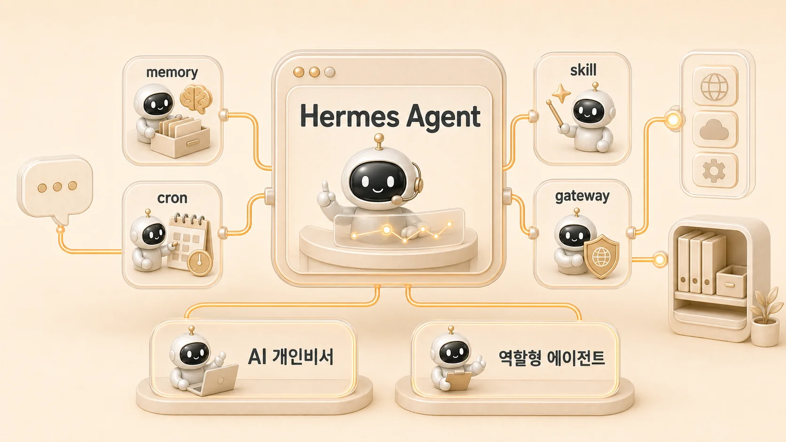

## 에르메스 에이전트(Hermes Agent)란 무엇인가

에르메스 에이전트(Hermes Agent)는 단순히 질문에 답하는 AI 챗봇이 아니라, 메모리, 프로필, 스킬, cron, MCP, gateway 같은 기능을 묶어 실제 업무 흐름을 운영하게 돕는 오픈소스 AI 에이전트이자 AI 에이전트 프레임워크다. 공식 문서의 표현을 빌리면 경험에서 스킬을 만들고 세션을 넘어 기억하는 `self-improving AI agent`, 즉 `AI agent with memory`에 가깝다. 이 책에서는 에르메스 에이전트(Hermes Agent)를 설치 기능보다 **AI 개인비서와 역할형 에이전트로 업무 자동화를 굴리는 운영 시스템**으로 설명한다.



검색으로 이 페이지에 들어온 독자라면 먼저 이것만 잡으면 된다. Hermes Agent의 핵심은 “더 긴 답변을 받는 법”이 아니라, 자율 AI 에이전트를 찾는 독자가 기대하는 것처럼 요청을 받고, 역할을 나누고, 도구를 연결하고, 결과를 기록으로 남기는 흐름을 만드는 데 있다.

## 한 문장으로 정의하면

에르메스 에이전트(Hermes Agent)는 AI 개인비서가 메인 창구가 되고, 조사형/정리형/실행형 에이전트와 외부 도구가 함께 움직이도록 만드는 업무 자동화 운영 구조다.

여기서 중요한 단어는 세 가지다.

1. **AI 개인비서**: 사용자의 요청을 먼저 받고 흐름을 정리하는 입구
2. **역할형 에이전트**: 조사/정리/실행처럼 실패 방식이 다른 일을 나누는 구조
3. **AI 자동화/업무 자동화**: 답변에서 끝나지 않고 실행, 검증, 기록, 재사용까지 이어지는 AI 워크플로우

그래서 이 책은 에르메스 에이전트(Hermes Agent)를 “무엇을 설치하느냐”보다 “어떤 업무 흐름을 안정적으로 굴리느냐”의 관점에서 다룬다.

## 한눈에 보는 핵심 개념

| 개념 | 의미 | 연결되는 장 |
|---|---|---|
| AI 개인비서 | 사용자의 요청을 먼저 받고 흐름을 정리하는 메인 창구 | [AI 개인비서 메인 창구 만들기](https://wikidocs.net/345891) |
| 역할형 에이전트 | 조사/정리/실행처럼 업무 성격에 따라 나눈 에이전트 | [조사형/정리형/실행형 에이전트 나누기](https://wikidocs.net/345898) |
| 조사형 에이전트 | 근거, 비교, 반례, 사실 확인을 맡는 역할 | [조사형 에이전트는 어디서 강하고 어디서 흔들릴까](https://wikidocs.net/345895) |
| 정리형 에이전트 | 자료를 독자에게 읽히는 구조와 문장으로 바꾸는 역할 | [정리형 에이전트는 어디서 강하고 어디서 흔들릴까](https://wikidocs.net/345896) |
| 실행형 에이전트 | 파일 수정, 명령 실행, 검증처럼 상태를 바꾸는 역할 | [역할형 에이전트는 어떤 기준으로 나눌까](https://wikidocs.net/345925) |
| memory | 오래 유지해야 할 사용자 선호와 기준 | [AI 에이전트 기억 시스템](https://wikidocs.net/345902) |
| profile | 역할과 상태를 분리하는 실행 단위 | [같은 AI 개인비서인데 기억은 왜 다르게 느껴질까](https://wikidocs.net/346126) |
| skill | 반복 절차를 재사용 가능한 작업 기준으로 남기는 기능 | [Hermes Agent 스킬은 언제 만들고 어떻게 관리할까](https://wikidocs.net/345904) |
| cron | 정해진 시간에 작업을 시작하는 자동화 방식 | [Daily Briefing Bot은 어떤 업무 자동화 패턴일까](https://wikidocs.net/345926) |
| MCP | 외부 도구와 업무 시스템을 연결하는 방식 | [외부 도구/MCP/자동화 운영](https://wikidocs.net/345907) |
| gateway | 외부 요청을 상시 받을 수 있게 하는 입구 | [always-on gateway는 왜 자주 헷갈릴까](https://wikidocs.net/345906) |
| WikiDocs | 운영 경험을 독자가 읽을 수 있는 공유 지식으로 정리하는 채널 | [WikiDocs/블로그/강의 콘텐츠 시스템](https://wikidocs.net/345911) |
| 체크리스트 | 같은 실수를 줄이기 위해 남기는 실행 기준 | [체크리스트/마이그레이션/복구 플레이북](https://wikidocs.net/345921) |

## 공식 기능을 어떻게 읽어야 할까

Hermes Agent를 처음 보면 기능 이름이 먼저 눈에 들어온다. memory, profile, skill, cron, MCP, gateway처럼 낯선 단어가 많다. 하지만 기능을 하나씩 외우는 방식으로 접근하면 금방 복잡해진다.

이 기능들은 따로 떨어진 목록이 아니라 하나의 운영 흐름 안에서 연결된다.

- memory는 오래 유지해야 할 선호와 기준을 남긴다.
- profile은 역할과 실행 상태의 경계를 나눈다.
- skill은 반복 절차를 재사용 가능한 방식으로 남긴다.
- cron은 정해진 시간에 작업을 시작한다.
- MCP는 외부 도구와 업무 시스템을 연결한다.
- gateway는 외부 요청을 받을 입구가 된다.

즉, 에르메스 에이전트(Hermes Agent)의 공식 기능은 “기능을 많이 붙이는 법”보다 “업무 흐름에서 어느 지점을 안정화할 것인가”로 읽어야 한다.

## 0장에서 잡을 것과 1장에서 이어갈 것

0장의 역할은 Hermes Agent를 설치하기 전에 **기능 지도를 먼저 잡는 것**이다. 여기서는 AI 개인비서, 역할형 에이전트, memory, profile, skill, cron, MCP, gateway가 어떤 위치에 있는지만 확인하면 충분하다.

실제 업무 흐름으로 들어가면 이야기는 1장에서 이어진다. 1장은 “챗봇과 AI 개인비서는 무엇이 다른가”, “혼자 일해도 왜 AI 팀 구조가 필요한가”, “하비/방울이/뽀동이 같은 이름을 어떻게 역할 예시로 읽을 것인가”를 다룬다.

따라서 이 페이지를 읽을 때는 세부 운영 사례를 모두 외우기보다 아래 순서만 남기면 된다.

```text
공식 기능을 이해한다
→ 내 환경에서 필요한 기능을 고른다
→ 1장에서 업무 요청을 역할 흐름으로 바꾸는 법을 본다
```

하비/방울이/뽀동이/봉구/비벙이/하망이 같은 이름은 1장에서 자세히 설명한다. 여기서는 역할을 짧게 부르기 위한 운영 예시라는 점만 기억하면 된다.

## 처음 쓰기 전에 정할 것

처음부터 모든 기능을 붙이려고 하면 운영이 복잡해진다. 먼저 아래 기준을 정하는 편이 좋다.

1. 사용자의 기본 요청 창구는 누구인가?
2. 조사/정리/실행 중 어떤 역할이 자주 섞이는가?
3. 반복되는 절차는 skill로 남길 만큼 안정됐는가?
4. 정기적으로 시작해야 할 일은 cron으로 분리할 수 있는가?
5. 외부 도구 연결은 MCP나 gateway가 필요한 업무 흐름인가?
6. 결과는 session, memory, shared-memory, GitHub, WikiDocs 중 어디에 남아야 하는가?

이 질문에 답하면 Hermes Agent가 기능 묶음이 아니라 업무 자동화 구조로 보이기 시작한다.

## FAQ

### 에르메스 에이전트(Hermes Agent)는 챗봇과 무엇이 다른가요?

챗봇은 한 번의 질문에 답하는 데 초점이 있다. 에르메스 에이전트(Hermes Agent)는 요청을 받고, 역할을 나누고, 도구를 연결하고, 결과를 기록으로 남기는 업무 흐름에 초점이 있다.

### Hermes Agent를 쓰면 바로 자동화가 되나요?

아니다. 기능을 켜는 것만으로 자동화가 완성되지는 않는다. 어떤 요청을 누가 받고, 어떤 역할로 나누고, 무엇을 검증하고, 어디에 기록할지 판단 기준을 먼저 정해야 한다.
