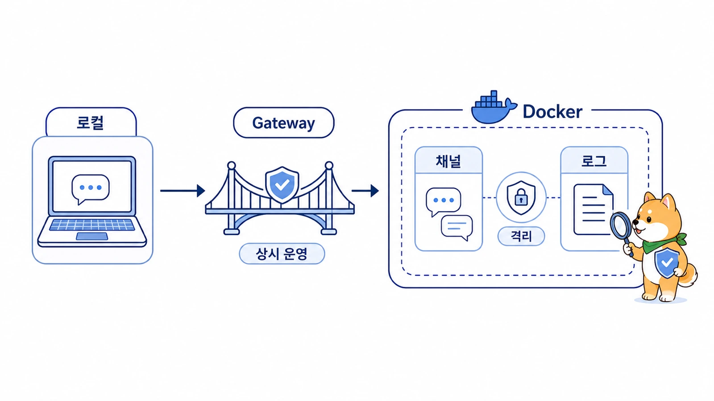

## 에르메스 에이전트(Hermes Agent) Docker/Gateway는 언제 필요할까

에르메스 에이전트(Hermes Agent) Docker와 Messaging Gateway는 “내 터미널에서 가끔 실행하는 도구”가 아니라 “항상 받을 수 있는 AI 개인비서”로 운영하고 싶을 때 중요해진다. `Hermes Agent Docker`, `Hermes Agent docker compose`, `Hermes Agent gateway`, `Hermes Agent Slack`을 찾는 독자라면 Docker는 실행 환경을 안정적으로 묶는 방식이고, Messaging Gateway는 Slack, Telegram, Discord 같은 메시징 플랫폼과 Hermes Agent를 연결하는 운영 축이라고 이해하면 된다.

여기서 말하는 gateway는 메시징 채널을 연결하는 `Messaging Gateway`다. web search, image generation, TTS, browser automation을 Nous 구독으로 라우팅하는 `Nous Tool Gateway`와는 다른 기능이다.

처음부터 Docker/Gateway를 붙일 필요는 없다. 특히 gateway는 [always-on gateway 확인 기준](https://wikidocs.net/345906)과 [설치 후 기본 검증 순서](https://wikidocs.net/346137)처럼 process, 인증, delivery target, 로그를 함께 봐야 한다. 기본 CLI chat이 안정되고, provider 설정과 tool 권한을 확인한 뒤, 상시 접속이나 메시징 delivery가 필요해질 때 붙이는 편이 안전하다.

[TOC]

## Docker가 필요한 경우

공식 Docker 문서는 두 가지 사용 방식을 구분한다. 하나는 Hermes Agent 자체를 Docker 안에서 실행하는 방식이고, 다른 하나는 Hermes Agent가 host에서 돌면서 Docker를 terminal backend/sandbox로 쓰는 방식이다.

초보자에게 중요한 질문은 “Docker를 쓸 수 있나”가 아니라 “왜 Docker가 필요한가”다.

| 상황 | Docker가 유용한 이유 |
|---|---|
| 서버에서 Hermes Agent를 계속 띄우고 싶다 | 실행 환경과 dependency를 고정할 수 있다 |
| gateway를 background로 오래 운영하고 싶다 | restart policy와 volume 관리가 쉽다 |
| 설정/세션/skill/memory를 한 디렉터리에 모으고 싶다 | host volume을 mount해 상태를 유지할 수 있다 |
| 여러 환경에서 같은 방식으로 배포하고 싶다 | image 기반으로 재현성이 좋아진다 |
| 위험한 명령 실행을 분리하고 싶다 | sandbox/terminal backend 설계와 연결할 수 있다 |

## Gateway가 필요한 경우

Gateway는 Hermes Agent가 메시징 플랫폼에서 요청을 받을 수 있게 하는 입구다. Telegram, Discord, Slack 같은 곳에서 AI 개인비서를 부르고 싶다면 gateway가 필요하다.

하지만 gateway status가 OK라고 해서 운영이 끝난 것은 아니다. 실제로는 아래를 함께 봐야 한다.

1. process가 살아 있는가?
2. 메시징 플랫폼 인증이 맞는가?
3. delivery target이 맞는가?
4. cron이나 외부 이벤트가 gateway를 통해 제대로 도착하는가?
5. 실패했을 때 로그를 어디서 볼 수 있는가?
6. 외부 공개/삭제/권한 변경 같은 위험 작업은 승인 기준이 있는가?

## 개인 실습과 상시 운영은 다르게 설계한다

커뮤니티 대화에서 반복된 질문은 “일단 켜졌는데 계속 써도 되는가”였다. Hermes Agent도 CLI에서 한 번 응답하는 것과 Slack AI 비서로 상시 운영하는 것은 다른 문제다.

| 운영 형태 | 적합한 구성 | 판단 기준 |
|---|---|---|
| 하루짜리 실습 | local CLI | 설치/모델 응답/간단한 tool 호출만 확인한다 |
| 개인 업무 보조 | local CLI + 제한된 toolset | 파일 접근 범위와 위험 명령 승인 기준을 둔다 |
| Slack 상시 비서 | gateway + profile별 env/config | 누가 호출할 수 있는지, 어느 채널로 답하는지 정한다 |
| 팀 자동화 | gateway + cron + 로그/복구 기준 | delivery target, 실패 알림, 재시작 방법을 문서화한다 |
| 위험한 실행 작업 | Docker/remote backend | host 파일과 credential을 보호한다 |

처음부터 상시 운영 구조로 가지 않아도 된다. 다만 상시 운영으로 넘어가는 순간부터는 설치 가이드가 아니라 운영 체크리스트가 필요하다. [Mac mini/맥미니 같은 전용 머신을 쓰는 경우](https://wikidocs.net/346395)에도 이 기준은 같다. Docker를 쓰지 않더라도 gateway 자동 시작, launchd/LaunchAgent, 절전 정책, 로그 확인 순서는 별도로 잡아야 한다.

## Docker/Gateway를 붙이기 전 체크리스트

- CLI에서 기본 chat이 먼저 작동하는가?
- `hermes model`로 provider와 model 설정이 끝났는가?
- 도구 권한과 toolset 범위를 확인했는가?
- 메시징 플랫폼에서 받을 요청의 범위를 정했는가?
- cron이 보낼 결과의 delivery target을 정했는가?
- 로그와 복구 순서를 문서로 남겼는가?
- API key, token, webhook 같은 보호해야 할 정보를 공유 문서에 남기지 않는가?

## 작은 운영 예시

처음에는 로컬 CLI에서 Hermes Agent를 실행해 기본 대화와 도구 호출을 확인한다. 그다음 Slack에서 요청을 받고 싶어지면 gateway를 붙인다. 매일 아침 특정 주제를 조사해 보고받고 싶다면 cron을 추가한다. 이때 Docker는 gateway와 cron이 안정적으로 돌 수 있는 실행 환경을 제공한다.

중요한 것은 순서다. CLI가 불안정한데 gateway를 붙이면 문제가 메시징인지 provider인지 모델인지 알기 어렵다. gateway가 불안정한데 cron을 붙이면 예약 실행 문제인지 delivery 문제인지 헷갈린다. 그래서 Hermes Agent 운영은 기능을 한 번에 켜는 일이 아니라, 작동 범위를 한 층씩 넓히는 일이다.

## FAQ

### 개인 사용도 Docker가 꼭 필요한가요?

꼭 필요하지는 않다. 로컬에서 가끔 쓰는 정도라면 CLI 설치로 충분하다. 다만 서버에서 계속 켜두거나 gateway를 안정적으로 운영하려면 Docker가 도움이 된다.

### Gateway만 켜면 Slack AI 비서가 완성되나요?

아니다. gateway는 입구일 뿐이다. 호출 규칙, 권한, 실행 범위, delivery target, 로그 확인 기준이 있어야 AI 비서 운영이 안정된다.
