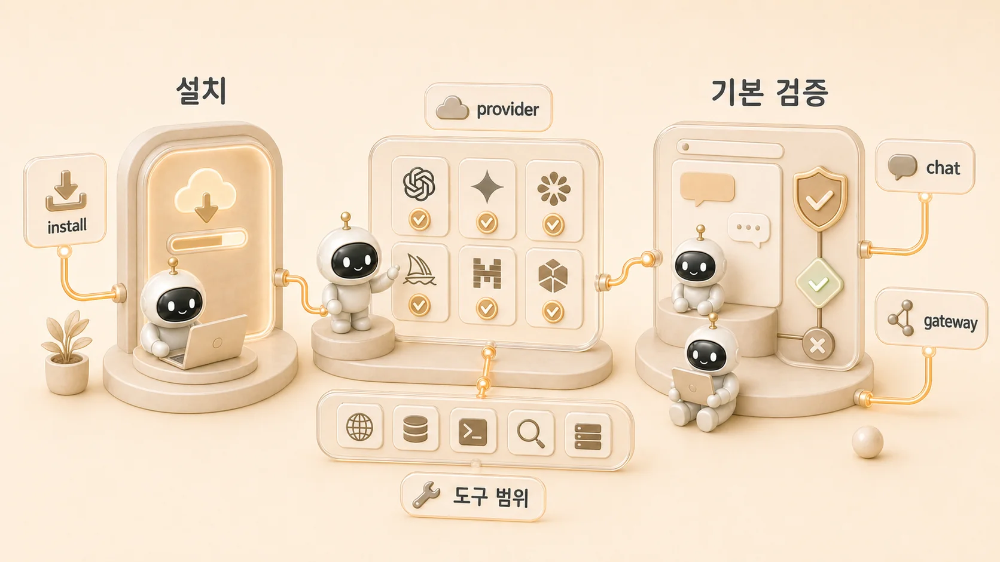

## 에르메스 에이전트(Hermes Agent) 설치와 세팅은 어떻게 시작할까

에르메스 에이전트(Hermes Agent) 설치는 공식 docs 기준으로 짧다. Linux, macOS, WSL2, Android Termux에서는 one-line installer로 시작할 수 있고, 윈도우 사용자는 보통 WSL2 경로를 먼저 본다. 하지만 실제 업무 자동화에 쓰려면 설치 명령보다 설치 후 검증 순서가 더 중요하다. 설치가 끝난 뒤에는 [CLI 첫 대화](https://wikidocs.net/346251)와 provider/model/config 설정을 이어서 확인해야 한다.



처음 목표는 모든 기능을 켜는 것이 아니다. 먼저 `hermes` 명령이 잡히는지 확인하고, 기본 chat이 되는지 보고, provider/model 설정을 안정화한 뒤, CLI 세션, tool/toolset, Docker/Gateway, cron, Skill, MCP를 순서대로 붙여야 한다. 설치 단계에서 원인을 분리해두면 나중에 Slack, Telegram, Discord, cron, gateway에서 문제가 생겨도 복구가 쉬워진다.

## 공식 설치 명령

[공식 설치 문서](https://hermes-agent.nousresearch.com/docs/getting-started/installation)는 아래 명령을 안내한다.

```bash
curl -fsSL https://raw.githubusercontent.com/NousResearch/hermes-agent/main/scripts/install.sh | bash
```

공식 문서 기준 지원 흐름은 Linux, macOS, WSL2, Android Termux다. Windows native는 공식 문서에서 직접 지원 대상으로 보지 않고, WSL2 사용을 권장한다. Nix/NixOS와 수동 개발 설치 흐름은 공식 docs의 별도 페이지를 확인하는 편이 안전하다.

## 설치 전에 확인할 것

| 확인 항목 | 왜 필요한가 |
|---|---|
| 실행 환경 | Linux/macOS/WSL2/Termux/Nix 중 어떤 경로인지에 따라 설치 방법과 의존성이 달라진다 |
| Python/Node/git/ripgrep/ffmpeg 등 의존성 | installer가 일부를 처리하더라도 실패 시 원인을 좁히는 기준이 된다 |
| 사용할 provider | 설치 후 바로 대화하려면 모델/provider 연결이 필요하다 |
| 사용할 채널 | CLI만 쓸지, Slack/Telegram/Discord gateway까지 붙일지에 따라 다음 단계가 달라진다 |
| 권한/보안 기준 | 파일/터미널/브라우저 도구를 어디까지 허용할지 먼저 정해야 한다 |

설치 전 단계에서 모든 것을 완벽히 결정할 필요는 없다. 다만 “CLI 실습”인지 “상시 gateway 운영”인지가 다르면 검증 순서가 달라진다는 점은 알아야 한다.

## 서비스형 AI 도구와 Hermes Agent는 다르다

원본 커뮤니티 질문에는 Genspark/Manus 같은 서비스형 AI 도구와 Hermes Agent를 같은 선택지로 비교하는 흐름도 있었다. 둘 다 “AI가 일을 대신한다”는 느낌은 비슷하지만 운영 방식은 다르다.

서비스형 AI 도구는 가입하면 바로 쓸 수 있고, 검색/브라우징/문서 생성이 한 화면에 묶여 있어 입문 장벽이 낮다. 대신 내부 도구, Slack gateway, local file, GitHub source of truth, profile별 memory, cron 같은 운영 경계를 직접 설계하기는 어렵다. Hermes Agent는 설치와 설정이 더 필요하지만, 내가 정한 provider, toolset, memory, Skill, gateway, cron을 조합해 “나만의 AI 업무 자동화 환경”을 만드는 쪽에 가깝다.

| 선택지 | 잘 맞는 경우 | 조심할 점 |
|---|---|---|
| Genspark/Manus 같은 서비스형 AI | 빠른 조사, 자료 생성, 비개발자 즉시 사용 | 내부 권한/로그/source of truth를 세밀하게 통제하기 어렵다 |
| ChatGPT/Claude/Codex 단독 사용 | 대화형 작업, 코드/문서 초안, 빠른 실험 | 팀 채널/gateway/cron/역할형 에이전트 운영은 별도 설계가 필요하다 |
| Hermes Agent | Slack AI 비서, 반복 업무 자동화, 역할형 에이전트, 로컬/외부 도구 연결 | 설치, provider/config, 권한, 로그, 복구 기준을 직접 잡아야 한다 |

입문자는 “어느 도구가 더 똑똑한가”보다 “내가 원하는 것이 즉시 사용 가능한 서비스인가, 오래 운영할 수 있는 AI 개인비서 환경인가”를 먼저 정하면 된다.

## 설치 환경을 고르는 기준

OpenClaw 커뮤니티 대화에서 가장 많이 반복된 질문은 “어디에 설치해야 안전하고 오래 쓸 수 있는가”였다. Hermes Agent도 마찬가지다. 설치 명령보다 먼저 운영 환경을 정해야 한다.

| 환경 | 좋은 경우 | 조심할 점 |
|---|---|---|
| 개인 노트북/macOS | CLI 실습, 짧은 개인 업무, 파일 기반 실험 | 개인 로그인 정보와 업무 파일이 많다면 위험 명령 범위를 좁힌다 |
| WSL2 | Windows 사용자가 공식 지원 경로로 시작할 때 | Windows native와 WSL 경로/HOME이 섞이지 않게 한다 |
| Mac mini/맥미니/전용 머신 | Slack AI 비서, gateway, cron을 오래 켜둘 때 | 별도 계정, 별도 작업 폴더, launchd/절전/재시작 정책을 둔다 |
| VPS/클라우드 | 팀 채널, 상시 gateway, 외부 webhook 운영 | secret/env 전달, 방화벽, 비용 알림을 먼저 잡는다 |
| Docker | 위험한 terminal 작업이나 재현 가능한 실행 환경이 필요할 때 | container에 넘기는 credential을 최소화한다 |

초보자는 “내 컴퓨터에 설치할 수 있나”보다 “이 에이전트가 내 파일과 계정에 어디까지 접근해도 되는가”를 먼저 묻는 편이 안전하다.

## 설치보다 중요한 첫 검증 순서

| 순서 | 할 일 | 확인할 것 |
|---|---|---|
| 1 | 설치 스크립트 실행 | `hermes` 명령이 잡히는가 |
| 2 | shell reload | `source ~/.bashrc` 또는 `source ~/.zshrc` 후 실행되는가 |
| 3 | provider 선택 | `hermes model` 또는 config 흐름으로 사용할 모델/provider가 연결되는가 |
| 4 | 기본 chat 실행 | `hermes` 또는 `hermes chat -q "Hello"`가 응답하는가 |
| 5 | 세션 확인 | 대화가 저장되고 이어서 볼 수 있는가 |
| 6 | tool 범위 확인 | 파일/터미널/브라우저 등 필요한 도구만 켰는가 |
| 7 | gateway 필요 여부 판단 | Slack/Telegram/Discord 같은 메시징 연결이 필요한가 |
| 8 | 자동화 후보 분리 | cron으로 돌릴 일과 사람이 직접 시킬 일을 구분했는가 |

## 좋은 시작 방식

처음부터 dashboard, gateway, cron, MCP를 모두 붙이면 문제가 생겼을 때 원인을 찾기 어렵다. 좋은 시작 순서는 단순하다.

1. Hermes Agent CLI가 작동한다.
2. provider/model 설정이 안정적이다.
3. 기본 대화가 된다.
4. 작은 파일 읽기나 검색 같은 도구 호출을 확인한다.
5. Slack/Telegram 같은 messaging gateway를 붙인다.
6. 반복 업무 하나를 cron이나 Skill 후보로 분리한다.

이 순서가 중요한 이유는 Hermes Agent가 기능이 많은 도구라서다. 기능을 많이 켜는 것보다 “어느 단계까지 정상인지”를 나눠 확인해야 복구가 쉽다.

## 설치할 때 자주 생기는 오해

### 설치가 끝나면 바로 업무 자동화가 되나요?

아니다. 설치는 실행 환경을 만든 것뿐이다. AI 업무 자동화는 요청 창구, provider, 도구 권한, 기록 위치, 검증 기준이 정해져야 시작된다. API key/OAuth/custom endpoint/model name 같은 provider 설정도 이 단계에서 함께 확인해야 한다.

### gateway나 Docker부터 시작해도 되나요?

가능하지만 추천 순서는 아니다. CLI 기본 chat이 안정된 뒤 gateway나 Docker를 붙여야 메시징 문제인지 모델/provider 문제인지 구분할 수 있다. 단순 실습은 CLI 설치가 쉽고, 상시 운영은 [Docker/Gateway](https://wikidocs.net/346139)와 [맥미니 상시 운영](https://wikidocs.net/346395) 기준을 함께 보는 편이 좋다.
