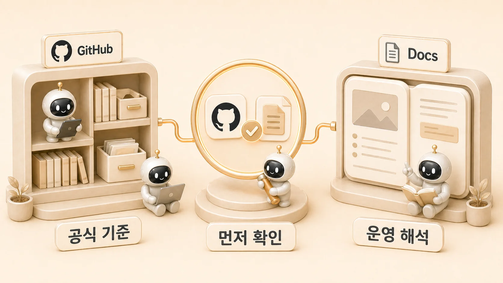

## 에르메스 에이전트(Hermes Agent) 공식 GitHub/docs는 어디서 볼까

에르메스 에이전트(Hermes Agent) 공식 GitHub는 `NousResearch/hermes-agent`이고, 공식 문서는 `hermes-agent.nousresearch.com/docs`에서 볼 수 있다. `Hermes Agent docs`, `Hermes Agent 공식 문서`, `Hermes Agent 공식 GitHub`를 찾는 독자라면 블로그 글이나 요약글보다 이 두 곳을 먼저 기준으로 잡는 편이 안전하다.

이 책은 공식 문서의 대체물이 아니다. 먼저 [공식 GitHub](https://github.com/NousResearch/hermes-agent)와 [공식 Docs](https://hermes-agent.nousresearch.com/docs/)를 확인하고, 그다음 이 책에서 실제 운영 기준으로 해석하면 된다. 공식 GitHub와 공식 docs를 기준으로 삼되, [에르메스 에이전트(Hermes Agent)란 무엇인가](https://wikidocs.net/346055), [설치와 세팅](https://wikidocs.net/346137), [OpenClaw와의 차이](https://wikidocs.net/345889)처럼 실제 업무 자동화와 AI 개인비서 운영에서 어떤 기준으로 읽어야 하는지 풀어주는 한국어 운영 해설서에 가깝다.

## 공식 링크

| 구분 | 주소 | 먼저 볼 내용 |
|---|---|---|
| 공식 GitHub | https://github.com/NousResearch/hermes-agent | README, source, install script, release/change, issue 흐름 |
| 공식 Docs | https://hermes-agent.nousresearch.com/docs/ | Installation, Quickstart, Learning Path, User Guide, Guides, Reference |
| 설치 문서 | https://hermes-agent.nousresearch.com/docs/getting-started/installation | one-line installer, 지원 환경, 설치 후 명령 |
| Quickstart | https://hermes-agent.nousresearch.com/docs/getting-started/quickstart | provider 선택, 첫 chat, session, key features 검증 |
| Learning Path | https://hermes-agent.nousresearch.com/docs/getting-started/learning-path | CLI assistant, bot, automation, custom tools/skills 등 사용 목적별 읽기 순서 |
| Configuration | https://hermes-agent.nousresearch.com/docs/user-guide/configuration | `config.yaml`, `.env`, provider, terminal backend, Docker/SSH 설정 |
| CLI / Commands | https://hermes-agent.nousresearch.com/docs/user-guide/cli | CLI/TUI, single query, model/provider/toolset 지정, slash command |
| Messaging Gateway | https://hermes-agent.nousresearch.com/docs/user-guide/messaging | Telegram, Discord, Slack, WhatsApp 등 gateway 구조와 보안 |
| Security | https://hermes-agent.nousresearch.com/docs/user-guide/security | command approval, allowlist, gateway authorization, sandbox 격리 |
| Architecture | https://hermes-agent.nousresearch.com/docs/developer-guide/architecture | agent loop, prompt assembly, provider resolution, gateway/cron/session 흐름 |
| OpenClaw migration | https://hermes-agent.nousresearch.com/docs/guides/migrate-from-openclaw | `hermes claw migrate`, dry-run, preset, migration 대상 |

## 공식 문서가 말하는 Hermes Agent의 정체성

공식 문서는 Hermes Agent를 “The self-improving AI agent built by Nous Research”라고 설명한다. 핵심은 built-in learning loop다. 경험에서 Skill을 만들고, 사용 중 Skill을 개선하고, 세션 사이에서 기억을 유지하며, 사용자에 대한 모델을 점점 깊게 만든다는 방향이다.

공식 GitHub README도 같은 방향을 강조한다. Hermes Agent는 특정 IDE에 묶인 coding copilot이나 단일 API wrapper가 아니라, CLI와 messaging gateway, scheduled automation, delegation/parallel workstreams, memory, skill을 함께 갖춘 에이전트 운영 환경에 가깝다. 여러 provider를 쓸 수 있고, `hermes model` 흐름으로 모델을 바꾸는 구조도 전제로 한다.

이 문장을 한국어 독자에게 그대로 옮기면 “자기 개선형 AI 에이전트”에 가깝다. 하지만 실무에서는 더 구체적으로 읽는 편이 좋다. 에르메스 에이전트(Hermes Agent)는 한 번 대답하고 끝나는 AI 챗봇이 아니라, memory, skills, cron, MCP, gateway, delegation을 묶어 반복 업무를 운영하게 만드는 AI 자동화 환경이다.

## 공식 문서 Quick Links를 운영 관점으로 읽기

| 공식 docs 항목 | 기능으로 보면 | 운영 기준으로 보면 |
|---|---|---|
| Installation | 설치 명령 | 지원 환경과 실패 원인을 분리하는 시작점 |
| Quickstart | 첫 대화 | provider, chat, session, key feature를 순서대로 검증하는 절차 |
| Learning Path | 문서 안내 | CLI assistant, messaging bot, automation 중 내 사용 목적을 고르는 기준 |
| Configuration | 설정 파일 | secret과 non-secret, provider/model, backend를 분리하는 기준 |
| Tools & Toolsets | 도구 목록 | 필요한 권한만 켜고 위험 작업을 검증하는 기준 |
| Memory System | 장기 기억 | 무엇을 기억하고 무엇을 세션/문서/Skill로 넘길지 나누는 기준 |
| Skills System | 재사용 절차 | 반복 업무를 운영 지식으로 만드는 기준 |
| Messaging Gateway | 플랫폼 연결 | channel, session, allowed user, delivery target을 관리하는 기준 |
| MCP Integration | 외부 도구 연결 | 계정/권한/scope/timeout을 명확히 하는 기준 |
| Security | 보안 기능 | command approval, allowlist, sandbox, gateway auth를 운영 규칙으로 만드는 기준 |
| Architecture | 내부 구조 | 문제가 생겼을 때 agent loop, prompt, provider, gateway, cron 중 어디를 볼지 나누는 지도 |

## 이 책은 공식 문서를 어떻게 다르게 읽나

공식 문서는 기능의 기준이다. 이 책은 기능을 실제 업무 기준으로 다시 묶는다.

| 공식 문서의 항목 | 이 책에서의 해석 |
|---|---|
| Installation/Quickstart | 설치보다 먼저 검증해야 할 기본 실행 흐름 |
| CLI/Commands | 첫 대화, 모델 지정, toolset 확인, slash command 진단 흐름 |
| Configuration/Provider Routing | provider/model/config/env/backend 경계를 분리하는 기준 |
| Memory/Profiles/Sessions | AI 개인비서가 무엇을 기억하고 어디까지 잊어야 하는지의 경계 |
| Skills | 반복 절차를 어떻게 재사용 가능한 운영 지식으로 만들지의 기준 |
| MCP/Tools | 외부 업무 시스템을 어떻게 안전하게 연결할지의 기준 |
| Cron/Gateway | 사람 없이 시작되는 자동화와 메시징 delivery의 운영 기준 |
| Delegation/Subagents | 조사형/정리형/실행형 에이전트로 일을 나누는 기준 |
| Security/Architecture | 운영 환경에서 어디까지 허용하고 어디서 멈출지의 기준 |
| OpenClaw migration | 과거 운영 흔적을 현재 Hermes 기준으로 정리하는 전환 절차 |

## 먼저 확인할 것

1. 내가 보는 자료가 공식 GitHub나 공식 Docs와 충돌하지 않는가?
2. 설치 명령만 따라 하는 중인가, provider와 기본 chat 검증까지 끝냈는가?
3. 기능 이름을 외우고 있는가, 실제 업무 흐름에서 어느 지점을 맡길지 정했는가?
4. secret/token과 공개 문서에 남길 수 있는 정보를 구분했는가?
5. 에르메스 에이전트(Hermes Agent)를 코딩 도구 하나로 보는가, 장기 운영되는 AI 개인비서 환경으로 보는가?

## FAQ

### 이 책만 읽고 공식 docs는 안 봐도 되나요?

아니다. 설치 명령, config option, command, gateway 설정처럼 바뀔 수 있는 정보는 공식 docs를 먼저 봐야 한다. 이 책은 그 정보를 실제 업무 자동화 운영 기준으로 해석하는 보조 가이드다.

### 공식 GitHub와 docs 중 어디를 먼저 봐야 하나요?

처음 사용자는 docs의 Installation, Quickstart, Learning Path를 먼저 보는 편이 좋다. GitHub는 README, source, release/change, issue 흐름을 확인할 때 더 유용하다.

### 한국어 자료와 공식 문서가 다르면 무엇을 믿어야 하나요?

기능 동작과 명령은 공식 docs/GitHub를 기준으로 본다. 한국어 자료는 운영 방식, 사례, 체크리스트를 이해하는 보조 자료로 쓰는 것이 안전하다.

## 다음 글

다음에는 [Hermes Agent 설치와 세팅](https://wikidocs.net/346137)을 어떻게 시작하면 좋은지 본다. 공식 설치 명령은 짧지만, 실제 운영에서는 설치 후 provider, CLI 첫 대화, config, gateway, 보안, 검증 순서가 더 중요하다.
