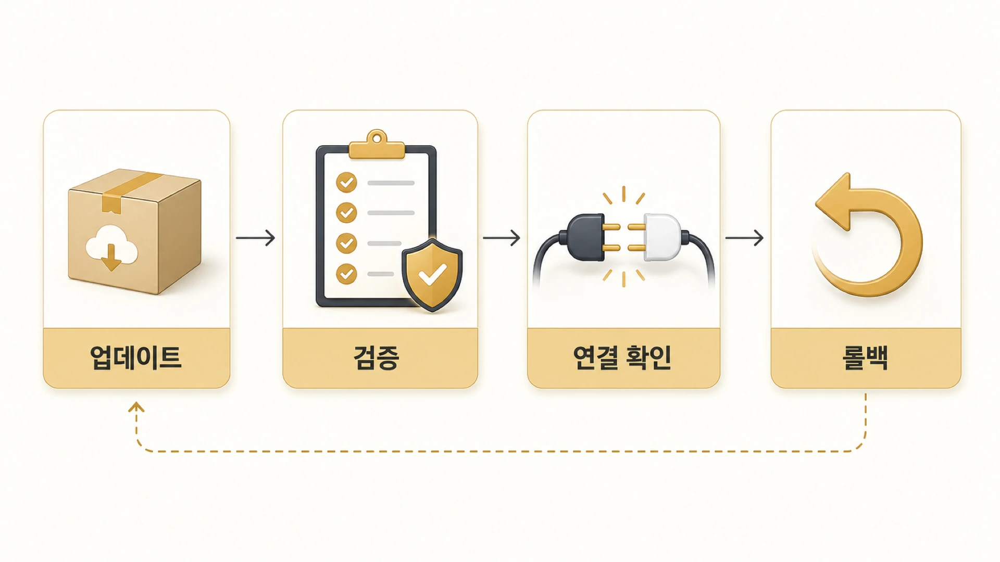

## 에르메스 에이전트(Hermes Agent) 업데이트 전후에는 무엇을 점검할까

Hermes Agent 업데이트는 최신 기능을 받는 일인 동시에 운영 중인 AI 개인비서 환경을 흔들 수 있는 작업이다. 공식 docs는 `hermes update`, update log, post-update validation, terminal disconnect 대응, messaging platform에서의 update, manual update, rollback 흐름을 안내한다. 이 책에서는 그 흐름을 실제 운영 기준으로 바꿔 본다. 특히 [Docker/Gateway 운영](https://wikidocs.net/346139)이나 Slack 같은 채널을 붙여 쓰는 환경에서는 업데이트 직후 연결 상태를 다시 확인한다.



혼자 CLI로만 쓰는 환경이라면 업데이트가 비교적 단순하다. 하지만 Slack/Telegram/Discord gateway, cron, Skill, MCP, Docker backend, custom provider를 쓰고 있다면 업데이트 전후로 확인할 것이 많아진다. 업데이트는 명령 하나가 아니라 “운영 흐름이 그대로 살아 있는지 검증하는 절차”다.

## 공식 업데이트 기본 흐름

공식 docs 기준 기본 명령은 아래와 같다.

```bash
hermes update
```

업데이트 중 터미널이 끊겨도 로그를 확인할 수 있도록 update output은 `~/.hermes/logs/update.log`에 남는 흐름을 안내한다. update 후에는 새 config option을 확인하고, gateway restart 여부와 기본 chat 동작을 검증해야 한다.

## 업데이트 전 체크리스트

| 항목 | 확인할 것 |
|---|---|
| 현재 버전 | 지금 어떤 Hermes Agent 버전을 쓰는지 확인한다 |
| GitHub/docs 변경점 | 공식 docs/GitHub에서 관련 변경 사항을 본다 |
| gateway 상태 | Slack/Telegram/Discord 등 사용 중인 gateway가 있는지 확인한다 |
| cron 목록 | 자동 실행 중인 job이 있는지 확인한다 |
| config/env 백업 | `config.yaml`과 `.env`의 경계를 확인하고 secret을 공개하지 않는다 |
| Skill 변경 가능성 | 사용 중인 Skill이 새 도구/명령과 충돌하지 않는지 본다 |
| rollback 기준 | 실패하면 어디까지 되돌릴지 정한다 |

업데이트 전에는 “지금 잘 되는 기준 상태”를 남겨야 한다. 그래야 업데이트 후 문제가 생겼을 때 원래도 안 되던 문제인지, 업데이트로 생긴 문제인지 구분할 수 있다.

## 업데이트 후 검증 순서

```text
hermes update 완료 확인
        ↓
update log 확인
        ↓
hermes config check / migrate 필요 여부 확인
        ↓
CLI 기본 chat 확인
        ↓
provider/model 응답 확인
        ↓
tool/toolset 작은 작업 확인
        ↓
gateway restart와 실제 메시지 delivery 확인
        ↓
cron job / Skill / MCP 흐름 점검
```

검증은 “프로세스가 살아 있다”에서 끝나면 안 된다. gateway가 살아 있어도 Slack thread로 답이 돌아오지 않을 수 있고, cron job이 등록되어 있어도 fresh session prompt가 새 환경에서 실패할 수 있다.

## 운영 환경별 추가 확인

| 환경 | 추가 확인 |
|---|---|
| CLI only | `hermes`, `hermes chat -q`, `/config`, `/tools` 확인 |
| Slack/Telegram/Discord | gateway process, allowed users, delivery target, thread/session 연결 확인 |
| Docker backend | image/container, mount, forwarded env, sandbox persistence 확인 |
| cron 자동화 | 다음 실행 시간, self-contained prompt, delivery 대상 확인 |
| MCP | server connection, auth header, tool filtering, timeout 확인 |
| Skill | 자주 쓰는 Skill이 여전히 로드되고 절차가 맞는지 확인 |

## 업데이트 실패를 줄이는 기준

- 운영 중인 gateway가 있으면 사람이 적게 쓰는 시간에 업데이트한다.
- update 전후로 같은 테스트 질문을 남긴다.
- CLI 확인 없이 messaging platform만 보고 판단하지 않는다.
- secret/token을 로그나 공개 문서에 복사하지 않는다.
- 실패 시 바로 재시도하기 전에 update log와 config check를 먼저 본다.
- 반복되는 업데이트 검증 절차는 Skill이나 체크리스트 후보로 남긴다.

## FAQ

### 업데이트는 자주 해도 되나요?

개인 실험 환경에서는 괜찮지만, gateway/cron이 붙은 운영 환경에서는 검증 시간을 함께 잡아야 한다. 최신 버전보다 중요한 것은 업데이트 후 실제 업무 흐름이 살아 있는지다.

### messaging platform에서도 업데이트할 수 있나요?

공식 docs는 messaging platform에서의 update 흐름도 다룬다. 다만 원격 업데이트는 로그와 gateway restart 확인이 더 중요하므로, 운영자는 update log와 실제 delivery를 같이 봐야 한다.

### 업데이트 후 config가 이상하면 무엇을 먼저 보나요?

`hermes config check`, `hermes config migrate`, update log를 먼저 본다. 그다음 provider/model, toolset, gateway, cron 순서로 좁혀 간다.

## 다음 글

0장을 마쳤다면 [AI 챗봇과 AI 개인비서의 차이](https://wikidocs.net/345923)로 넘어간다. 설치와 설정을 넘어서, Hermes Agent를 왜 하나의 대화창이 아니라 AI 개인비서 운영 환경으로 봐야 하는지 이해할 차례다.
