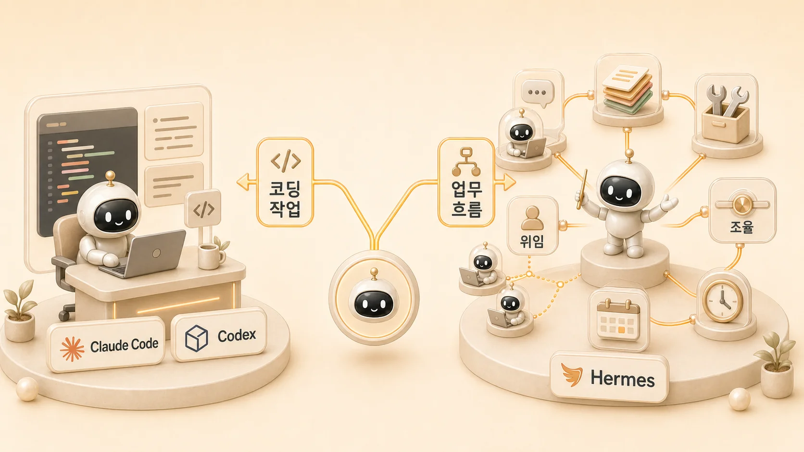

## 에르메스 에이전트(Hermes Agent)와 Claude Code/Codex는 어떻게 다를까

에르메스 에이전트(Hermes Agent)와 Claude Code/Codex는 모두 AI 에이전트처럼 보이지만 쓰임이 다르다. `Hermes Agent Claude Code 비교`, `Hermes Agent Codex 비교`, `Hermes Agent vs Claude Code`를 찾는 독자라면 먼저 기준을 나눠야 한다. Claude Code와 Codex는 주로 코드 작성, 리팩터링, PR 리뷰 같은 코딩 작업에 강한 CLI 에이전트이고, Hermes Agent는 memory, skills, cron, MCP, gateway, messaging, delegation을 묶어 장기 업무 자동화 흐름을 운영하는 환경에 가깝다.

따라서 “무엇이 더 좋나”보다 “어떤 일을 맡길 것인가”로 비교해야 한다. 이 비교는 [에르메스 에이전트(Hermes Agent)의 핵심 개념](https://wikidocs.net/346055)과 [일을 나누는 네 가지 실행 방식](https://wikidocs.net/346124)을 먼저 잡고 읽으면 더 선명하다. 코드를 깊게 고치거나 개발 작업을 위임할 때는 Claude Code/Codex가 강하고, 여러 도구와 역할형 에이전트를 묶어 Slack 요청, 정기 조사, WikiDocs 발행, 기억 관리까지 이어야 할 때는 Hermes Agent의 운영 구조가 중요해진다.

[TOC]

## 한눈에 보는 비교

| 도구 | 주 용도 | 강점 | 잘 맞는 상황 | Hermes Agent와의 관계 |
|---|---|---|---|---|
| Claude Code | 코드 작성/리팩터링/PR 작업 | Anthropic Claude 기반의 코딩 CLI, 긴 코드 작업과 리뷰 | 개발자가 코드베이스 안에서 빠르게 구현/수정할 때 | Hermes가 필요할 때 외부 코딩 에이전트로 위임할 수 있다 |
| Codex | 코드 수정/자동 구현/리뷰 | OpenAI 계열 코딩 에이전트, git repository 기반 작업 | 테스트, 수정, 리뷰처럼 개발 작업의 경계가 분명할 때 | Hermes의 autonomous-ai-agents Skill 흐름에서 호출 후보가 된다 |
| OpenClaw | 개인 컴퓨터에서 직접 일하는 AI 집사 경험 | 로컬 작업, 웹 탐색, 파일 처리 같은 체감형 자동화 | 초보자가 AI 에이전트의 “내 컴퓨터에서 일하는 느낌”을 빠르게 얻고 싶을 때 | Hermes와 같은 계열의 도구로 비교하되, Hermes는 장기 운영 구조를 더 강조한다 |
| Hermes Agent | AI 개인비서/업무 자동화/memory/Skill/messaging/cron | 여러 채널, 도구, 역할을 묶는 운영 시스템 | Slack/메일/조사/문서/이미지/발행을 하나의 업무 흐름으로 묶고 싶을 때 | Claude Code/Codex 같은 코딩 에이전트까지 포함해 작업을 조율한다 |

## 차이를 과장하지 않고 설명하는 법

Hermes Agent를 Claude Code, Codex, OpenClaw와 완전히 다른 종류의 도구로 볼 필요는 없다. 모두 LLM이 도구를 호출해 사용자의 일을 돕는 AI 에이전트 계열에 있다. 차이는 “누가 더 똑똑한가”보다 **어떤 업무 단위를 중심에 두는가**에서 생긴다.

Claude Code와 Codex는 코드베이스 안에서 깊게 파고드는 개발 작업에 강하다. OpenClaw는 개인 컴퓨터에서 AI가 직접 일하는 감각을 빠르게 보여주는 데 강하다. Hermes Agent는 Slack 요청, 메일 정리, 자료조사, 이미지 제작, WikiDocs 발행, 정기 리포트처럼 여러 업무가 이어지는 흐름을 memory, Skill, cron, MCP, gateway로 오래 굴리는 쪽에 초점을 둔다.

따라서 Hermes Agent의 질문은 “이 도구가 다른 도구보다 항상 나은가?”가 아니다. 더 정확한 질문은 “내 업무에서 반복되는 흐름을 어떤 채널에서 받고, 어떤 역할로 나누고, 어떤 기억과 절차로 남길 것인가?”다.

## Hermes에서 특히 크게 느껴지는 차이

Hermes Agent를 다른 에이전트와 비교할 때 가장 크게 느껴지는 지점은 **기억 구조와 자기 개선 루프**다. Claude Code나 Codex는 코드 작업을 깊게 처리하는 데 강하고, OpenClaw는 개인 컴퓨터에서 AI가 직접 일하는 체감을 쉽게 준다. Hermes는 거기에 더해 “이번에 배운 작업 기준을 다음에도 재사용할 수 있는가”를 운영의 중심에 둔다.

예를 들어 WikiDocs 발행 중 이미지 경로 검증을 자주 놓쳤다면, 그건 단순한 실수가 아니라 Skill 보강 후보가 된다. 메일 자동화에서 자동 발송 금지 기준을 세웠다면, 그 기준은 memory나 Skill로 분리해 다음 메일 처리에도 재사용한다. 크론 오류가 발생했다면 오류 로그를 넘기는 데서 끝내지 않고, schedule/tool/model/delivery 중 어느 레이어의 문제인지 분류하는 복구 절차로 남긴다.

이 차이는 작아 보이지만 오래 쓸수록 커진다. 에이전트가 매번 새로 똑똑해지는 것이 아니라, 사용자의 업무 방식과 실패 패턴을 기준/절차/검증 루프로 누적하기 때문이다.

## Claude Code/Codex를 먼저 쓰면 좋은 경우

- 코드베이스 안에서 버그를 고쳐야 한다.
- 파일을 읽고 수정하고 테스트를 돌리는 개발 작업이 중심이다.
- PR 리뷰나 리팩터링처럼 코드 품질 판단이 중요하다.
- 작업 범위가 하나의 git repository 안에 비교적 분명하다.

이 경우에는 Claude Code나 Codex 같은 코딩 에이전트가 바로 맞을 수 있다. 특히 코드 수정 자체가 목표라면 Hermes Agent를 앞에 둘 필요 없이 코딩 에이전트에 직접 맡기는 편이 빠르다.

## Hermes Agent를 먼저 쓰면 좋은 경우

- Slack이나 Telegram 같은 메시징 창구에서 요청을 받고 싶다.
- 조사/정리/실행/이미지 제작처럼 역할을 나눠야 한다.
- 결과를 memory, skill, Obsidian, WikiDocs, GitHub 같은 여러 저장소에 나눠 남겨야 한다.
- 매일 정해진 시간에 cron으로 조사나 보고를 돌리고 싶다.
- Google Workspace, MCP, gateway, 외부 API를 업무 흐름에 붙이고 싶다.
- 코딩 작업뿐 아니라 콘텐츠, 문서화, 리서치, 운영 체크리스트까지 이어야 한다.

이 경우 Hermes Agent는 단일 코딩 도구보다 “메인 창구와 오케스트레이터”에 가깝다. 사용자는 Hermes에게 요청하고, Hermes는 필요하면 코딩 에이전트, 조사형 에이전트, 정리형 에이전트, 실행형 에이전트를 나눠 쓰는 구조를 만들 수 있다.

## 실제 운영에서는 함께 쓴다

실제 업무에서는 둘 중 하나만 고르는 문제가 아니다. 예를 들어 “GitHub 저장소의 문서 구조를 고치고 WikiDocs에 반영해줘”라는 요청은 여러 층으로 나뉜다.

1. Hermes Agent가 요청 의도와 공개 범위를 정리한다.
2. 조사형 에이전트가 현재 문서와 공식 문서를 확인한다.
3. 정리형 에이전트가 읽기 쉬운 구조를 다시 쓴다.
4. 실행형 에이전트가 파일 수정, 검증, 발행 반영을 맡는다.
5. 코드 변경이나 복잡한 리팩터링이 필요하면 Claude Code/Codex에 위임한다.
6. 결과는 WikiDocs나 GitHub 기록으로 남는다.

이렇게 보면 Hermes Agent는 Claude Code/Codex의 경쟁자라기보다, 어떤 일을 어떤 실행 방식에 맡길지 결정하는 상위 운영 흐름에 가깝다.

## 비교할 때의 기준

1. 작업의 중심이 코드인가, 업무 흐름인가?
2. 결과가 한 번의 수정으로 끝나는가, 반복 운영으로 남아야 하는가?
3. 메시징/gateway/cron 같은 상시 운영이 필요한가?
4. memory와 skill로 다음 작업에 재사용해야 하는가?
5. 여러 역할형 에이전트를 조율할 필요가 있는가?

이 질문에서 “코드”가 중심이면 Claude Code/Codex를 먼저 보고, “업무 흐름”이 중심이면 Hermes Agent를 먼저 보면 된다.

## FAQ

### Hermes Agent가 Claude Code를 대체하나요?

완전히 대체한다고 보기 어렵다. Claude Code는 코딩 작업에 특화된 CLI 에이전트이고, Hermes Agent는 코딩을 포함한 여러 업무 흐름을 조율하는 운영 환경에 가깝다.

### Codex와 Hermes Agent를 같이 쓸 수 있나요?

가능하다. Hermes Agent의 skill과 delegation 흐름에서 Codex 같은 코딩 에이전트를 특정 작업 실행자로 볼 수 있다. 다만 인증, git repository, 권한, sandbox 기준은 별도로 확인해야 한다.
