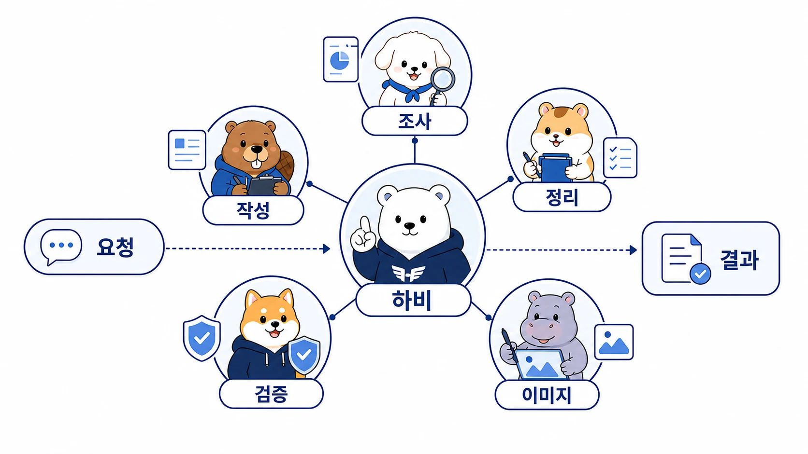

## 나만의 AI 팀은 어떻게 구성할까

나만의 AI 팀은 [에르메스 에이전트(Hermes Agent)](https://wikidocs.net/346055)에 여러 에이전트를 많이 붙이는 구조가 아니다. 핵심은 업무를 **조사/정리/실행/기록** 같은 역할로 나누고, 하나의 AI 개인비서가 그 흐름을 묶게 하는 것이다.


혼자 일하는 사람에게도 역할 분리는 필요하다. 실제 업무는 한 종류의 작업으로 끝나지 않는다. 자료를 찾고, 판단하고, 문서로 만들고, 도구를 실행하고, 결과를 다시 기록으로 남겨야 한다. 이 모든 일을 한 대화 안에서 즉흥적으로 처리하면 빠를 수는 있지만 반복할수록 품질이 흔들린다. 그래서 [AI 개인비서 메인 창구](https://wikidocs.net/345892)가 요청을 받고, 필요한 역할을 나누고, 결과를 다시 묶는 구조가 필요하다.


AI 팀은 이 흔들림을 줄이기 위한 운영 구조다.



[TOC]

## 왜 혼자 일해도 AI 팀이 필요한가

혼자 일하면 오히려 역할이 더 쉽게 섞인다. 기획하다가 조사하고, 조사하다가 글을 쓰고, 글을 쓰다가 파일을 고치고, 파일을 고치다가 기록을 놓친다.

AI도 비슷하다. 하나의 에이전트에게 모든 일을 맡기면 다음 문제가 생긴다.

- 조사 결과가 충분하지 않은데 글이 먼저 매끄러워진다.
- 실행이 필요한 일인데 설명만 길어진다.
- 기록해야 할 기준이 대화 속에 묻힌다.
- 이미지나 표가 필요한데 본문만 늘어난다.
- 반복 작업인데 매번 새로 지시하게 된다.

그래서 역할을 나누는 기준이 필요하다. 사람을 늘리는 것이 아니라, 업무의 성격을 분리하는 것이다.

## 기본 역할

처음부터 복잡하게 나눌 필요는 없다. 아래 여섯 가지 정도면 대부분의 업무 흐름을 설명할 수 있다.

| 역할 개념 | 운영 예시 이름 | 주 역할 | 흔한 실패 | 확인 기준 |
|---|---|---|---|---|
| AI 개인비서 / 메인 창구 | 하비 | 요청 해석, 우선순위, 위임, 최종 통합 | 모든 일을 직접 하다 병목이 됨 | 위임 기준, 최종 검수, 보고 형식 |
| 조사형 에이전트 | 방울이 | 확장조사, 근거 수집, 비교, 사실 확인 | 결론을 서두르거나 근거와 해석을 섞음 | 출처, 날짜, 반례, 확인 깊이 |
| 정리형 에이전트 | 뽀동이 | 문서화, WikiDocs 구조, 보고서, 글 정리 | 재료 없이 그럴듯하지만 약한 글을 만듦 | 목적, 독자, 원자료, CTA |
| 실행형 에이전트 | 봉구 | 명령 실행, 파일 수정, 배포, 반복 작업 | 범위 밖 작업이나 검증 누락 | 작업 범위, 테스트, rollback 기준 |
| 제품/기능 정리형 | 비벙이 | 요구사항, 기능 흐름, 제품 문서화 | 판단 기준 없이 기능만 나열함 | 사용자 문제, 기능 흐름, 결정 기준 |
| 이미지 제작형 | 하망이 | 썸네일, 설명 이미지, 시각 콘셉트 | 예쁘지만 메시지가 약한 이미지가 나옴 | 핵심 문장, 채널, 가독성 |

이름은 선택 사항이다. 중요한 것은 각 역할이 어떤 일을 잘하고, 어디서 흔들리는지 아는 것이다.

## 실제로는 이렇게 나뉜다

예를 들어 “새로운 주제로 공유 글을 만들고 싶다”는 요청이 있다고 하자. 이 요청은 단순 글쓰기 요청처럼 보이지만 실제로는 여러 단계로 나뉜다.

1. 조사형 에이전트가 주제의 범위, 근거, 반례를 확인한다.
2. 정리형 에이전트가 독자 문제와 글 구조를 잡는다.
3. 이미지형 에이전트가 시각 자료로 설명할 핵심 메시지를 찾는다.
4. 실행형 에이전트가 파일 수정, 검증, 발행 절차를 맡는다.
5. AI 개인비서가 전체 흐름을 통합하고 최종 상태를 보고한다.

이 구조가 있으면 사용자는 매번 모든 단계를 자세히 설명하지 않아도 된다. 요청은 짧아도 내부에서는 역할이 분리되어 움직인다.

실제 요청은 이렇게 바꿔볼 수 있다.

```text
하비야, 이 주제를 콘텐츠로 만들 수 있을지 먼저 봐줘.
방울이형으로 근거와 반례를 확인하고,
뽀동이형으로 WikiDocs 독자 흐름을 잡아줘.
필요하면 하망이형 이미지 방향도 따로 뽑고,
마지막에는 수정된 파일/검증 결과/다음 액션만 짧게 보고해줘.
```

이 요청에는 역할, 산출물, 완료 기준이 들어 있다. AI 팀 운영은 긴 프롬프트를 쓰는 기술이 아니라, 짧은 요청 안에 “누가 무엇을 끝내야 하는지”를 담는 습관에 가깝다.

## 역할 분리의 기준

AI 팀을 나눌 때는 “누가 더 똑똑한가”가 아니라 “어떤 실패를 줄일 것인가”를 기준으로 봐야 한다.

- 근거가 약한가? → 조사형 역할이 먼저 필요하다.
- 글은 매끄럽지만 구조가 약한가? → 정리형 역할이 필요하다.
- 설명만 많고 실제 변경이 안 되는가? → 실행형 역할이 필요하다.
- 결과물이 예쁘지만 메시지가 흐린가? → 이미지형 역할의 기준을 다시 잡아야 한다.
- 여러 역할이 따로 놀고 있는가? → 메인 창구가 통합해야 한다.

역할 분리는 생산성을 높이기 위한 장식이 아니다. 실패 지점을 보이게 만드는 안전장치다.

## 역할을 나눌지 판단하는 기준

나만의 AI 팀을 만들 때는 다음 순서로 시작하면 된다.

1. 자주 반복되는 업무를 고른다.
2. 그 업무를 조사/정리/실행/기록으로 나눠본다.
3. 한 역할이 계속 실패하는 지점을 찾는다.
4. 그 역할에 필요한 입력물과 완료 기준을 정한다.
5. 최종 통합은 하나의 AI 개인비서가 맡게 한다.

처음부터 완벽한 팀 구조를 만들 필요는 없다. 반복되는 업무 하나에서 역할을 나누고, 실패 기준을 확인하고, 조금씩 확장하는 편이 더 안전하다.

## AI 팀은 한 명씩 채용하듯 늘린다

AI 팀을 만든다고 처음부터 여러 에이전트를 한꺼번에 세팅할 필요는 없다. 오히려 처음부터 역할을 많이 만들면 호출 규칙, 기억 경계, 도구 권한, 최종 검수 기준이 함께 늘어나서 운영자가 더 바빠질 수 있다.

좋은 시작점은 반복 업무 하나다. 예를 들어 매일 아침 AI 동향을 확인하고 콘텐츠 초안을 만들고 싶다면 처음에는 메인 창구 또는 조사형 에이전트 하나만 둔다. 일주일 동안 같은 일을 맡겨 보면서 어떤 입력이 필요하고, 어떤 결과가 쓸 만하며, 어떤 피드백이 반복되는지 본다.

그다음에야 두 번째 역할을 붙인다. 조사 결과는 충분한데 글로 바꾸는 시간이 계속 든다면 정리형 에이전트를 추가한다. 조사형은 `오늘의 근거와 신호`를 남기고, 정리형은 그 자료를 읽어 글 초안이나 보고서로 바꾼다. 이때 협업의 핵심은 복잡한 오케스트레이션이 아니라 source of truth를 정하는 것이다. shared-memory, Obsidian, GitHub, WikiDocs, 프로젝트 파일처럼 모두가 읽을 기준점을 하나 정해야 한다.

Hermes Agent에서 이 확장은 OpenClaw의 `6명 squad`를 그대로 복사하는 방식이 아니다. Hermes에서는 profile, SOUL.md/personality, memory, Skill, toolset, cron, gateway를 역할과 실행 방식에 맞게 나눈다. 정체성은 SOUL.md나 profile에 두고, 반복 절차는 Skill에 두고, 사용자 선호는 memory/user profile에 두고, 정기 실행은 cron에 둔다.

처음 한 달의 흐름은 이렇게 잡을 수 있다.

| 기간 | 목표 | 산출물 |
|---|---|---|
| 1주차 | 반복 업무 하나를 AI 개인비서에게 맡긴다 | 메인 창구 또는 첫 역할형 에이전트, 첫 메신저 호출 규칙 |
| 2주차 | 피드백을 기억과 절차로 정리한다 | memory 기준, 사용자 선호, Skill 후보 |
| 3주차 | 두 번째 역할형 에이전트를 붙인다 | 조사형→정리형 handoff, 공통 파일 또는 지식 기록 |
| 4주차 | 정기 실행과 안전 점검을 붙인다 | cron, delivery 확인, gateway/log 점검, 보안 체크리스트 |

핵심은 “여러 AI를 만들었다”가 아니다. 하나의 반복 업무가 안정적으로 굴러가고, 피드백이 기억과 Skill로 남고, 다음 역할을 붙였을 때 품질이 더 좋아지는지 확인하는 것이다.

## FAQ

### 역할형 에이전트는 많을수록 좋은가요?

아니다. 역할이 많아질수록 관리 비용도 늘어난다. 먼저 조사형/정리형/실행형 정도로 나누고, 반복되는 실패가 보일 때 역할을 추가하는 편이 좋다.

### 내부 이름을 꼭 붙여야 하나요?

꼭 필요하지는 않다. 다만 실제로 자주 부르는 역할이라면 이름이 있는 편이 요청이 짧아지고 자연스러워진다.
