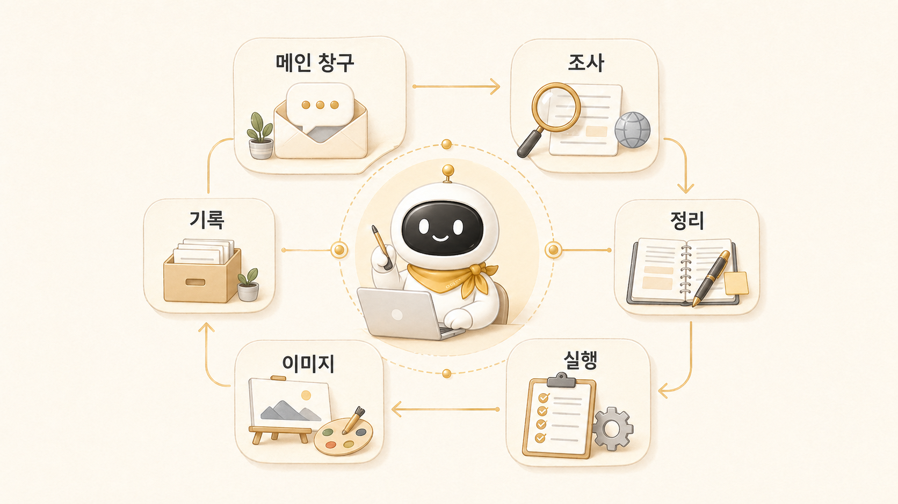

## 나만의 AI 팀은 어떻게 구성할까



이 책에서 말하는 나만의 AI 팀은 여러 AI를 많이 띄워놓는다는 뜻이 아니다. 사용자의 일을 조사, 정리, 실행, 이미지 제작, 기록, 발행 같은 흐름으로 나누고, 각 흐름에 맞는 [역할형 에이전트](https://wikidocs.net/345925)를 배치하는 운영 구조를 뜻한다.

처음에는 우리도 “좋은 AI 하나가 다 해주면 되지 않을까?”라고 생각했다. 하지만 [Hermes Agent](https://wikidocs.net/346055)를 업무에 붙여보니 한 대화 안에 모든 일을 넣을수록 문제가 흐려졌다. 자료가 부족한 문제인지, 판단이 성급한 문제인지, 글 구조가 약한 문제인지, 이미지 메시지가 약한 문제인지, 실제 실행 검증이 빠진 문제인지 구분하기 어려웠다.

그래서 나만의 AI 팀은 캐릭터를 늘리는 일이 아니라 책임 경계를 나누는 일이다. 누가 요청을 받고, 누가 근거를 찾고, 누가 결과물을 정리하고, 누가 실제 도구를 실행하며, 누가 이미지 방향을 만들고, 누가 기록으로 남길지 정해야 AI 팀이 된다.

## 왜 혼자 일해도 AI 팀이 필요한가

혼자 일할수록 머릿속에는 여러 역할이 동시에 생긴다. 조사해야 하고, 판단해야 하고, 글로 정리해야 하고, 이미지도 만들어야 하고, 발행도 해야 한다. 이 모든 일을 하나의 AI 대화창에 계속 밀어 넣으면 맥락이 금방 흐려진다.

예를 들어 Hermes Agent 관련 [WikiDocs](https://wikidocs.net/345908) 글 하나를 만들 때도 실제로는 여러 일이 섞인다.

- 공식 docs를 확인한다.
- 기존 블로그와 위키 메모를 찾는다.
- 빠진 근거와 반례를 확장조사한다.
- 내용을 독자 문제 중심으로 다시 배열한다.
- WikiDocs 전자책 규칙을 맞춘다.
- 본문 내부 링크가 실제 공개 화면에서 동작하는지 확인한다.
- 이미지나 썸네일 메시지를 정한다.
- [GitHub](https://wikidocs.net/345994)에 commit/push하고 동기화를 확인한다.

이걸 “글 하나 써줘”라고만 맡기면 결과는 그럴듯해도 약해진다. 그래서 조사형, 정리형, 실행형, 이미지 제작형, 콘텐츠형처럼 일을 나눠야 한다.

## 역할의 예시

이 책에서는 역할형 에이전트를 다음처럼 나눠 설명한다.

| 공개 개념 | 운영 이름 | 맡는 일 | 흔한 실패 | 필요한 기준 |
|---|---|---|---|---|
| AI 개인비서 / 메인 창구 | 하비 | 요청 해석, 우선순위, 위임, 최종 통합 | 모든 일을 직접 하다 병목이 됨 | 위임 기준, 최종 검수, 보고 형식 |
| 조사형 에이전트 | 방울이 | 확장조사, 근거 수집, 비교, 사실 확인 | 결론을 서두르거나 근거와 해석을 섞음 | 출처, 날짜, 반례, 확인 깊이 |
| 정리형 에이전트 | 뽀동이 | 문서화, WikiDocs 구조, 보고서, 글 정리 | 재료 없이 그럴듯하지만 약한 글을 만듦 | 목적, 독자, 원자료, CTA |
| 실행형 에이전트 | 봉구 | 명령 실행, 파일 수정, 배포, 반복 작업 | 범위 밖 작업이나 검증 누락 | 작업 범위, 테스트, rollback 기준 |
| 제품/기능 정리형 | 비벙이 | 요구사항, 기능 흐름, 제품 문서화 | 판단 기준 없이 기능만 나열함 | 사용자 문제, 기능 흐름, 결정 기준 |
| 이미지 제작형 | 하망이 | 썸네일, 설명 이미지, 시각 콘셉트 | 예쁘지만 메시지가 약한 이미지가 나옴 | 핵심 문장, 채널, 가독성 |

## 실제로는 이렇게 부른다

공개 문서에서는 조사형 에이전트, 정리형 에이전트처럼 설명하지만 실제 운영에서는 더 자연스럽게 부른다.

```text
하비야, 방울이 시켜서 이 주제 확장조사해줘.
뽀동이는 그 결과를 WikiDocs 1장 흐름에 맞게 정리해줘.
하망이는 썸네일이나 설명 이미지로 뽑을 수 있는 핵심 문장 잡아줘.
```

이 방식이 중요한 이유는 역할이 실제 행동으로 이어지기 때문이다. 방울이는 근거를 넓히고, 뽀동이는 읽히는 구조를 만들고, 하망이는 시각 메시지를 잡는다. 하비는 이 흐름을 받아 최종 결과로 묶는다.

## 실제 케이스: WikiDocs 책 보강은 한 역할로 끝나지 않았다

이번 WikiDocs 책 보강도 작은 AI 팀의 사례다. 로이드의 요청은 “내용이 축약되어 보이니 1장부터 다시 보강하자”였지만, 실제 작업은 다음처럼 나뉘었다.

| 단계 | 맡는 역할 | 독자에게 남길 이야기 |
|---|---|---|
| 이전 작업 확인 | 하비/뽀동이 | 지금 무엇이 끝났고 무엇이 부족한지 먼저 파악한다 |
| 원천 찾기 | 방울이형 조사 | 세션 기록, Slack 스레드, shared-memory, 공식 docs를 확인한다 |
| 구조화 | 뽀동이 | 독자 흐름, 제목, 본문 링크, FAQ, 체크리스트로 바꾼다 |
| 시각화 | 하망이 | 이미지가 장식이 아니라 메시지를 보강하도록 방향을 잡는다 |
| 실행/검증 | 실행형 | 파일 수정, 링크 검증, WikiDocs 규칙 검사, GitHub 반영을 확인한다 |
| 최종 통합 | 하비 | 결과, 남은 이슈, 다음 장을 짧게 보고한다 |

여기서 중요한 것은 내부 사정을 모두 공개하는 것이 아니다. 어떤 역할 분리가 품질을 올렸는지, 어떤 기준으로 민감정보를 제거했는지, 어떤 검증을 거쳐 발행했는지를 독자가 따라 할 수 있게 남기는 것이다.

## 공식 기능과 연결하면

Hermes Agent의 delegation은 이 역할 분리를 실제 작업 흐름으로 만들 수 있는 기능이다. 예를 들어 하나의 주제를 조사할 때 여러 sub-agent가 병렬로 자료를 찾고, 메인 창구가 결과를 모아 정리할 수 있다.

하지만 delegation을 쓴다고 자동으로 좋은 AI 팀이 되는 것은 아니다. 각 역할에 무엇을 맡길지, 결과를 어떻게 검수할지, 최종 판단은 누가 할지를 정해야 한다.

## 운영 기준

나만의 AI 팀을 만들기 전에 다음을 정한다.

- 메인 창구는 누구인가?
- 조사형, 정리형, 실행형 중 지금 가장 먼저 필요한 역할은 무엇인가?
- 이미지 제작형이나 콘텐츠형처럼 별도 기준이 필요한 산출물이 있는가?
- 각 역할이 맡지 말아야 할 일은 무엇인가?
- 결과물 검수 기준은 무엇인가?
- 반복되는 시행착오는 어디에 기록할 것인가?
- 공개 가능한 이야기와 제거해야 할 민감정보는 어떻게 나눌 것인가?

## FAQ

### 역할형 에이전트는 많을수록 좋은가요?

아니다. 역할이 많아질수록 호출 규칙과 검수 기준도 필요해진다. 실패 패턴이 분명히 다를 때만 나누는 것이 좋다.

### 내부 이름을 꼭 붙여야 하나요?

꼭 필요하지 않다. 이름은 운영을 친숙하게 만들 수 있지만, 책에서는 AI 개인비서, 조사형 에이전트, 정리형 에이전트처럼 역할이 먼저다.

### 실행형 에이전트는 왜 따로 조심해야 하나요?

실행형은 파일 수정, 명령 실행, 배포처럼 실제 상태를 바꿀 수 있다. 그래서 작업 범위, 검증 기준, rollback 가능성이 먼저 정해져야 한다.

### 실제 케이스를 넣으면 내부 정보가 너무 드러나지 않나요?

그래서 케이스는 그대로 복사하지 않는다. Slack 원문, 토큰, 계정, 개인 경로, 내부 채널 ID처럼 독자가 몰라도 되는 정보는 빼고, 문제 상황과 판단 기준만 남긴다.

## 다음 글

다음 글에서는 이 책에 등장하는 AI 팀 구성과 친구 이름을 먼저 정리한다.

[다음 글: 하비/방울이/뽀동이는 어떻게 읽어야 할까](https://wikidocs.net/345935)
