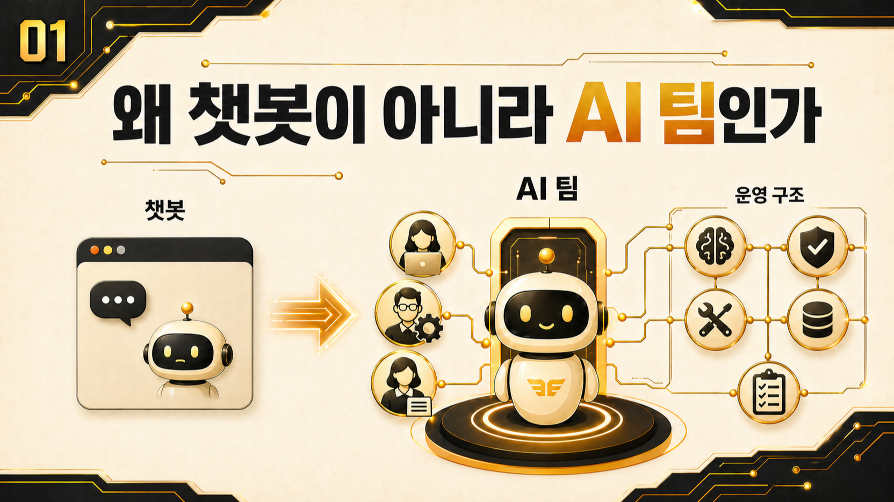

## 1장. 왜 AI 챗봇이 아니라 AI 팀인가



처음에는 좋은 AI 챗봇 하나면 충분하다고 생각했다. 질문하면 답하고, 글도 써주고, 코드도 도와주니까 더 좋은 모델을 고르면 일이 풀릴 줄 알았다. 그런데 [Hermes Agent](https://wikidocs.net/346055)를 실제 업무에 붙이면서 문제의 모양이 달라졌다.

답변 하나가 좋아도 다음 일이 계속 남았다. 방울이에게 확장조사를 맡길지, 뽀동이가 [WikiDocs](https://wikidocs.net/345908) 구조로 정리할지, 하망이에게 이미지 방향을 넘길지, 봉구가 실제 파일을 고칠지, 하비가 어디까지 최종 통합할지 매번 정해야 했다. 결국 핵심은 “누가 더 똑똑한가”가 아니라 **요청이 들어온 뒤 어떤 역할로 나뉘고 다시 하나로 묶이는가**였다.

이 장은 그 관점 전환을 다룬다. 에르메스 에이전트(Hermes Agent)를 단순 대화 도구가 아니라 AI 개인비서, [역할형 에이전트](https://wikidocs.net/345925), 기록과 검증이 함께 움직이는 업무 자동화 운영 시스템으로 이해하기 위한 출발점이다.

## 이 장에서 다루는 것

| 순서 | 글 | 핵심 질문 |
|---|---|---|
| 01-1 | AI 챗봇과 AI 개인비서는 어떻게 다를까 | 답변 도구와 업무 창구는 어떻게 다른가 |
| 01-2 | 나만의 AI 팀은 어떻게 구성할까 | 하비, 방울이, 뽀동이, 하망이는 어떤 흐름으로 일하는가 |
| 01-3 | 하비/방울이/뽀동이는 어떻게 읽어야 할까 | 내부 이름을 세계관이 아니라 운영 사례로 읽는 법은 무엇인가 |
| 01-4 | Hermes Agent는 왜 운영 시스템인가 | Hermes Agent를 왜 단순 챗봇으로 보면 부족한가 |
| 01-5 | OpenClaw에서 Hermes로 왜 넘어왔나 | 전환 과정에서 운영 기준이 어떻게 바뀌었는가 |

## 이 장의 핵심 질문

이 장의 핵심 질문은 단순하다.

```text
왜 좋은 AI 챗봇 하나로는 실무 자동화가 충분하지 않았을까?
```

실제 운영에서 부딪힌 문제는 다음과 같았다.

- 질문은 잘 답하지만, 업무 흐름은 사람이 계속 이어 붙여야 했다.
- 조사, 정리, 실행, 이미지 제작, 기록이 한 대화 안에 섞이면서 실패 원인을 찾기 어려웠다.
- 같은 AI 개인비서처럼 보여도 [profile](https://wikidocs.net/345899), memory, session 상태에 따라 다르게 느껴졌다.
- OpenClaw에서 Hermes로 넘어오며 과거 유산과 현재 기준점이 섞였다.
- 좋은 답변보다 반복 가능한 운영 기준과 체크리스트가 더 필요해졌다.

## 읽는 순서

먼저 `AI 챗봇과 AI 개인비서는 어떻게 다를까`에서 대화 도구와 운영 창구의 차이를 잡는다. 그다음 `나만의 AI 팀은 어떻게 구성할까`에서 역할형 에이전트를 왜 나누는지 본다.

이후 `하비/방울이/뽀동이는 어떻게 읽어야 할까`에서 하비, 방울이, 뽀동이, 봉구, 비벙이, 하망이가 각각 어떤 운영 이름인지 먼저 확인한다. 이 안내를 읽고 나면 뒤에서 친구들 이름이 나와도 내부 세계관이 아니라 실제 운영 사례로 이해하기 쉽다.

그다음 `Hermes Agent는 왜 운영 시스템인가`를 읽으면 Hermes를 메인 창구, 역할 분리, 기억 경계, 도구 실행, 기록 자산화가 묶인 시스템으로 이해할 수 있다. 마지막으로 `OpenClaw에서 Hermes로 왜 넘어왔나`에서 이 관점이 실제 전환 과정에서 어떻게 생겼는지 확인한다.

## 이 장에서 가져가야 할 기준

이 장을 읽고 나면 아래 기준이 남아야 한다.

- AI 개인비서는 답변자가 아니라 업무 흐름의 메인 창구다.
- 역할형 에이전트는 캐릭터가 아니라 책임과 실패 패턴을 나누는 방식이다.
- 실제 운영에서는 `방울이 시켜서 확장조사`, `뽀동이가 구조 정리`, `하망이가 이미지 방향 정리`처럼 이름으로 호출한다.
- Hermes Agent는 챗봇보다 운영 시스템에 가깝다.
- OpenClaw에서 Hermes로의 전환은 리브랜딩이 아니라 운영 기준점 재정리였다.
- 좋은 AI 활용은 프롬프트보다 구조, 기록, 검증, 체크리스트에서 갈린다.

## 다음 장으로 가기 전 체크 질문

AI를 더 잘 쓰고 싶은가, 아니면 반복되는 일을 AI와 함께 굴러가게 만들고 싶은가?

이 질문에 후자라고 답한다면, 다음 장에서는 사용자가 여러 에이전트를 직접 관리하지 않도록 만드는 `AI 개인비서 메인 창구`를 다룬다.

## 이어서 읽기

- 먼저 [AI 챗봇과 AI 개인비서는 어떻게 다를까](https://wikidocs.net/345923)에서 대화 도구와 운영 창구의 차이를 잡는다.
- 그다음 [나만의 AI 팀은 어떻게 구성할까](https://wikidocs.net/345924)에서 역할형 에이전트의 기본 구조를 본다.
- 1장을 마치면 [AI 개인비서 메인 창구 만들기](https://wikidocs.net/345891)로 넘어가 사용자의 기본 접점을 정한다.
