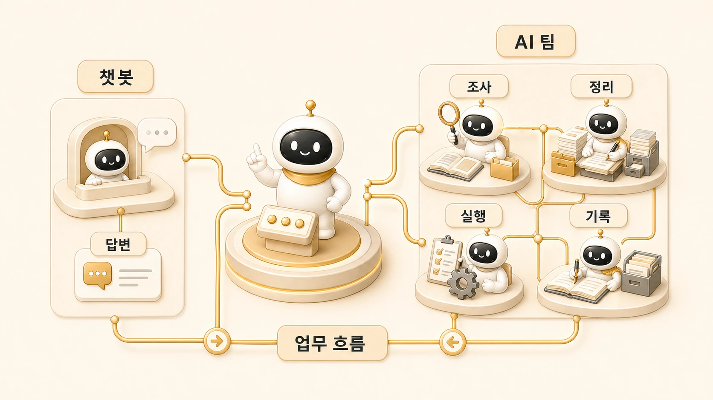

## 1장. 왜 AI 챗봇이 아니라 AI 팀인가

[0장 기초 가이드](https://wikidocs.net/346135)에서 에르메스 에이전트(Hermes Agent)의 공식 GitHub, 설치, OpenClaw 비교, Claude Code/Codex 비교를 확인했다면 이제 질문은 바뀐다. 1장의 답은 분명하다. Hermes Agent는 좋은 답변을 한 번 받는 도구가 아니라, AI 개인비서와 역할형 에이전트로 실제 업무 흐름을 굴리기 위한 운영 구조다.

반복 업무가 늘어나면 질문 하나를 잘 던지는 것만으로는 부족해진다. 조사해야 할 것이 있고, 정리해야 할 문서가 있고, 실행해야 할 작업이 있고, 나중에 다시 꺼내볼 기록도 필요하다. 그래서 이 책은 [AI를 챗봇 하나로 보지 않고](https://wikidocs.net/345923), **AI 개인비서와 역할형 에이전트가 함께 움직이는 업무 자동화 흐름**으로 본다.

1장은 기초 설치 가이드가 아니라 운영 관점의 출발점이다. 챗봇과 [AI 개인비서](https://wikidocs.net/345923)가 어떻게 다른지, 혼자 일해도 왜 [AI 팀 구조](https://wikidocs.net/345924)가 필요한지, 하비/방울이/뽀동이 같은 운영 이름을 어떻게 읽으면 되는지 먼저 정리한다. 뒤에서 나오는 MCP, cron, skill, memory, WikiDocs 같은 기능은 [에르메스 에이전트(Hermes Agent)의 핵심 개념](https://wikidocs.net/346055)과 [운영 시스템 관점](https://wikidocs.net/345890) 위에서 이해하면 훨씬 덜 복잡하다.

## 이 장에서 다루는 것

| 글 | 질문 | 핵심 |
|---|---|---|
| 01-1 | AI 챗봇과 AI 개인비서는 어떻게 다를까 | 답변 중심 사용과 업무 흐름 중심 사용의 차이 |
| 01-2 | 나만의 AI 팀은 어떻게 구성할까 | 조사/정리/실행처럼 역할을 나누는 기준 |
| 01-3 | 하비/방울이/뽀동이는 어떻게 읽어야 할까 | 내부 이름을 세계관이 아니라 역할 예시로 읽는 법 |
| 01-4 | 에르메스 에이전트(Hermes Agent)는 왜 운영 시스템인가 | 대화, 실행, 기록, 재사용이 이어지는 구조 |

## 왜 챗봇 관점만으로는 부족할까

챗봇 관점에서는 대화가 끝나면 일이 끝난 것처럼 보인다. 질문을 던지고, 답을 받고, 필요한 문장을 복사하면 된다. 짧은 작업에는 충분하다.

하지만 실제 업무에서는 답변 이후가 더 길다.

- 조사 결과가 충분한지 확인해야 한다.
- 문서 구조를 독자에게 맞게 다시 잡아야 한다.
- 도구를 실행하거나 파일을 수정해야 한다.
- 결과를 WikiDocs, 블로그, 강의, 체크리스트 같은 기록 자산으로 남겨야 한다.
- 다음번에 같은 시행착오를 반복하지 않도록 기준을 만들어야 한다.

이 단계가 붙는 순간 AI는 “질문에 답하는 도구”를 넘어선다. 요청을 받아 역할을 나누고, 결과를 통합하고, 다시 쓸 수 있는 형태로 남기는 운영 흐름이 필요해진다.

## AI 팀은 에이전트를 많이 늘리는 이야기가 아니다

AI 팀이라고 해서 무조건 여러 봇을 많이 만드는 뜻은 아니다. 오히려 역할이 많아질수록 입구가 복잡해지고 책임이 흐려질 수 있다. 중요한 것은 숫자가 아니라 **역할의 경계**다.

예를 들어 “기존 글을 WikiDocs 책으로 정리해줘”라는 요청 하나에도 서로 다른 일이 섞여 있다.

- 원래 글이 빠짐없이 옮겨졌는지 확인한다.
- 공식 문서나 실제 운영 기준과 어긋난 부분이 없는지 본다.
- 블로그 문체를 책 문체로 바꾼다.
- 본문 링크와 이미지가 독자 화면에서 자연스럽게 이어지는지 확인한다.
- 기록용 메모와 읽는 사람에게 필요한 설명을 구분한다.
- 발행 후 다시 고칠 수 있게 기준을 남긴다.

이 모든 일을 한 에이전트가 즉석에서 처리하면 빠를 수는 있다. 하지만 반복되면 품질이 흔들리고, 어디에서 문제가 생겼는지 찾기 어려워진다. 그래서 조사형, 정리형, 실행형, 이미지형처럼 역할을 나누고, AI 개인비서가 그 흐름을 묶는 구조가 필요하다.

## 이 장을 읽을 때의 기준

이 장의 목적은 Hermes Agent의 모든 기능을 한 번에 설명하는 것이 아니다. 먼저 다음 세 가지 질문에 답할 수 있으면 된다.

1. 나는 AI에게 답변을 받고 싶은가, 아니면 반복되는 일을 함께 굴리고 싶은가?
2. 내 업무에서 조사/정리/실행/기록은 어디에서 섞이고 있는가?
3. 하나의 AI 개인비서가 요청을 받고, 필요한 역할로 나누고, 다시 결과를 통합하는 구조가 필요한가?

이 질문에 답할 수 있으면 뒤의 장에서 다루는 memory, profile, skill, MCP, cron, WikiDocs가 단순 기능 목록이 아니라 하나의 업무 자동화 구조로 보인다.

## 이어서 읽기

먼저 [AI 챗봇과 AI 개인비서는 어떻게 다를까](https://wikidocs.net/345923)를 읽는다. 그다음 [나만의 AI 팀은 어떻게 구성할까](https://wikidocs.net/345924)에서 역할을 나누는 기준을 잡고, [하비/방울이/뽀동이는 어떻게 읽어야 할까](https://wikidocs.net/345935)에서 이 책에 나오는 운영 예시 이름을 확인하면 된다.
