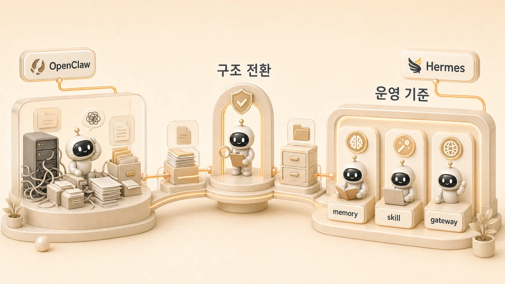

## 에르메스 에이전트(Hermes Agent)와 OpenClaw는 무엇이 다를까

에르메스 에이전트(Hermes Agent)와 OpenClaw의 차이는 이름이나 UI의 차이가 아니다. 이 글의 질문은 “어느 쪽이 더 멋진가”가 아니라 **에이전트를 실제 업무에서 오래 굴릴 수 있는 운영 구조로 세울 수 있는가**다. AI 개인비서가 요청을 받는 메인 창구, 조사형/정리형/실행형으로 나뉘는 [역할형 에이전트](https://wikidocs.net/345925), 기억 경계, 도구 연결, 기록 자산화를 한 흐름으로 보려면 현재 기준점을 분명히 해야 한다.



이 글은 전환의 세부 설정을 설명하기 위한 글이 아니다. OpenClaw에서 Hermes로 넘어올 때 무엇이 헷갈리기 쉬운지, 그리고 그 혼선을 어떤 기준으로 정리하면 되는지 보는 글이다. 실제 마이그레이션 절차와 복구 기준은 9장의 [OpenClaw에서 Hermes로 넘어올 때 무엇을 점검해야 할까](https://wikidocs.net/345920)에서 더 자세히 다룬다.

## 이 글의 답

OpenClaw에서 Hermes로 넘어온 이유는 단순했다. **잘 말하는 에이전트보다, 실제로 굴러가는 에이전트 시스템이 더 필요해졌기 때문**이다.

조금 더 풀면 세 가지다.

- 사용자가 여러 에이전트를 직접 관리하지 않게 만들 **메인 창구**가 필요했다.
- session, memory, Skill, [profile](https://wikidocs.net/346126), identity를 한 덩어리 감각이 아니라 **운영 가능한 층**으로 봐야 했다.
- 대화에서 끝나지 않고, 도구 실행과 [Obsidian](https://wikidocs.net/346129) 기록, 블로그/강의 자산화까지 이어지는 **업무 흐름**이 필요했다.

그래서 Hermes는 OpenClaw의 부정이 아니라, 그 유산 위에서 현재 실행 기준을 더 선명하게 만든 다음 단계에 가깝다.

## 많은 전환이 실패하는 이유

에이전트 시스템을 갈아탈 때 사람들은 보통 이렇게 생각한다.

- 이름 바꾸면 되겠지.
- 프롬프트만 조금 손보면 되겠지.
- 기존 감각을 새 시스템에 그대로 옮기면 되겠지.

하지만 실제 운영은 다른 문제를 꺼낸다.

- 사용자는 누구를 먼저 불러야 하는지 고민하고 싶지 않다.
- 좋은 대화는 쌓이는데 다시 꺼내 쓰기는 어렵다.
- 반복 작업은 계속 생기는데 절차는 재사용되지 않는다.
- 도구를 붙이면 설정, 인증, 프로세스, 기록이 서로 얽힌다.
- 과거 시스템 흔적과 현재 기준이 섞이면 체감 혼선이 커진다.

즉 문제는 “에이전트가 똑똑한가”보다 **운영 구조가 얼마나 선명한가**로 이동한다.

## OpenClaw에서 Hermes로 넘어오며 바뀐 것

| 바뀐 지점 | OpenClaw 감각 | Hermes에서 다시 잡은 기준 |
|---|---|---|
| 사용자 창구 | 개별 에이전트와의 상호작용이 먼저 보임 | 하비 같은 메인 창구가 요청을 받고 결과를 통합함 |
| 역할 분리 | 캐릭터나 개별 봇 감각이 먼저 보임 | 조사/정리/실행/이미지처럼 실패 패턴과 책임으로 나눔 |
| 기억 체계 | 대화, 규칙, 절차, 정체성이 섞여 보일 수 있음 | session/memory/profile/Skill/원본 기준을 분리함 |
| 도구 사용 | 대화 중심 인상이 강함 | 실행, 검증, 기록, 복구까지 함께 봄 |
| 문서화 | 전환 흔적과 현재 기준이 섞일 수 있음 | 현재 기준 문서와 과거 기록의 위치를 나눔 |

이 표에서 중요한 건 우열이 아니다. **무엇을 현재 기준점으로 삼을 것인가**다.

## 단일 창구가 먼저 필요해진 이유

실무에서는 에이전트가 여러 명 있는 것보다 사용자가 누구를 어떻게 불러야 하는지 고민하지 않아도 되는 구조가 더 중요했다. 그래서 Hermes에서는 하비가 메인 창구가 된다.

| 운영 이름 | 역할 개념 |
|---|---|
| 하비 | 메인 창구 / 판단 / 통합 |
| 방울이 | 조사형 에이전트 |
| 뽀동이 | 정리형 에이전트 |
| 하망이 | 이미지 제작형 에이전트 |
| 봉구 | 실행과 검증 |
| 비벙이 | 제품/기능 흐름 정리 |

겉으로는 한 창구처럼 보이지만, 안에서는 역할이 나뉘어 움직인다. 사용자 경험은 단순하게, 내부 책임은 더 선명하게 가져가는 것이 핵심이다.

## 기억을 한 덩어리로 보지 않게 됐다

운영이 길어질수록 “기억”은 하나가 아니었다. 실제로는 아래를 분리해서 봐야 했다.

| 층 | 맡는 것 |
|---|---|
| session | 현재 대화와 작업 맥락 |
| memory | 장기 선호와 반복 규칙 |
| Skill | 재사용 가능한 절차 |
| AGENTS/SOUL/profile | 역할, 정체성, 도구 경계 |
| shared-memory/Obsidian | 팀 기준과 누적 운영 지식 |
| WikiDocs | 함께 읽을 수 있게 정리한 공개 지식 |

이걸 하나로 뭉개서 보면 “왜 같은 하비인데 오늘은 다르게 느껴지지?” 같은 질문이 반복된다. Hermes는 이 문제를 감각이 아니라 경계와 저장소의 문제로 번역하기 더 좋은 체계였다.

## 전환은 이름 교체가 아니라 위치 정리다

OpenClaw에서 Hermes로 넘어오는 일은 “옛날 이름 지우고 새 이름 붙이기”처럼 깔끔하게 끝나지 않는다. 실제 시스템 전환에는 흔적이 남는다.

예를 들면 이런 혼선이다.

- 예전 용어가 현재 문서 안에 남아 있는 문제
- 자동 실행이나 gateway 관련 흔적이 현재 기준과 섞이는 문제
- 이전 identity와 현재 SOUL/AGENTS 문서의 역할이 다르게 느껴지는 문제
- profile을 바꿨을 때 같은 에이전트가 다르게 느껴지는 문제
- 과거 memory와 현재 원본 기준이 어디까지 이어지는지 모호한 문제

이건 실패한 전환이라서가 아니다. 실제 시스템 전환이 원래 이렇게 덜 깔끔하기 때문이다. 그래서 전환의 핵심은 삭제가 아니라 **거버넌스와 위치 정리**다.

## 정체성 문서와 운영 문서를 나누는 기준

전환 과정에서 특히 중요한 문제는 “과거의 정체성이나 운영 감각을 현재 구조 어디에 둘 것인가”다. 예를 들어 특정 에이전트의 말투와 미션은 SOUL.md에 가깝고, 실제 작업 원칙과 출력 형식은 AGENTS.md에 가깝다. 오래 유지할 사용자 선호는 memory에, 반복 절차는 Skill에, 팀 공통 기준은 shared-memory에 둔다.

```text
SOUL.md → 정체성, 성격, 톤, 미션
AGENTS.md → 실제 작업 원칙, 라우팅, 출력 형식
memory → 오래 유지할 사용자 선호와 운영 규칙
Skill → 반복 가능한 절차
shared-memory → 팀 공통 기준과 handoff
```

전환에서 중요한 것은 과거를 그대로 복사하는 것이 아니다. 과거의 유산을 현재 구조에서 다시 쓸 수 있는 위치로 옮기는 것이다.

## 공식 migration과 실제 운영 전환은 다르다

공식 문서는 OpenClaw에서 Hermes로 옮길 때 `hermes claw migrate` 흐름을 제공한다. 이 명령은 기존 설정과 기억을 Hermes 구조로 옮기는 출발점이다. 하지만 실제 운영 전환은 명령 하나로 끝나지 않는다. 어떤 기억을 옮길지, 어떤 Skill은 새로 만들지, 어떤 profile과 원본 기준을 현재 기준으로 삼을지 다시 정해야 한다.

그래서 공식 migration은 baseline이고, 이 책의 관심사는 그다음이다. 전환 이후 사용자가 헷갈리지 않도록 메인 창구, 역할형 에이전트, memory/profile/Skill 경계, gateway/cron 흔적을 정리하는 기준이 필요하다.

## 전환 기록을 운영 지식으로 정리할 때의 기준

| 확인할 것 | 책에 남겨도 좋은 것 |
|---|---|
| 전환 전후에 무엇이 헷갈렸는가 | 역할, 기억, 실행 책임이 어떻게 달라졌는지 |
| 현재 기준점은 무엇인가 | 어떤 문서를 기준으로 판단해야 하는지 |
| 과거 자료는 어떻게 다룰 것인가 | 지울 것, 옮길 것, 참고만 할 것을 나누는 기준 |
| 다시 쓸 수 있는 교훈은 무엇인가 | 같은 전환을 할 때 먼저 점검할 질문 |

책에 남길 것은 전환의 이야기와 판단 기준이다. 세부 설정값이나 사적인 운영 정보는 독자에게도 필요 없고, 운영 리스크만 만든다.

## 결론

OpenClaw에서 Hermes로 넘어온 건 더 화려한 이름을 찾은 일이 아니었다. 핵심은 에이전트를 말 잘하는 존재로 두는 대신, 실제로 굴러가는 운영 시스템으로 다시 세우는 일이었다.

남길 기준은 분명하다.

- 좋은 에이전트는 답변만 잘하면 안 된다.
- 메인 창구와 역할 분리가 필요하다.
- 기억은 한 덩어리가 아니라 레이어다.
- 도구와 기록이 이어져야 운영이 된다.
- 과거 유산은 지우지 말고, 현재 기준점만 분명히 세워야 한다.
- 사례에는 이야기와 기준만 남기고, 불필요한 내부 디테일은 제거해야 한다.

그래서 Hermes는 단순 리브랜딩이 아니라 **운영 구조를 다시 세운 다음 단계**였다.

## FAQ

### OpenClaw와 Hermes는 완전히 다른 시스템인가요?

완전히 단절된 시스템이라기보다, OpenClaw의 유산 위에서 Hermes가 현재 실행 기준을 더 선명하게 세운 체계에 가깝다.

### 왜 전환 후에도 OpenClaw 흔적이 보였나요?

실제 시스템 전환은 문서, 자동 실행, Skill, runtime 흔적이 모두 한 번에 정리되지 않기 때문이다. 이상한 일이 아니라 자연스러운 전환 후유증에 가깝다.
