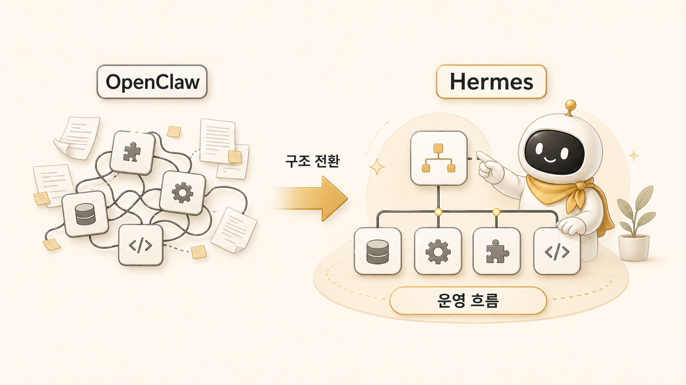
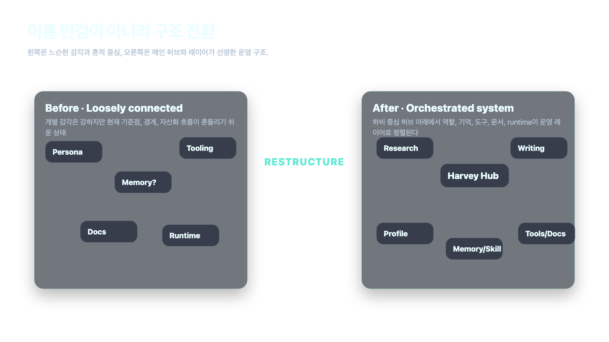
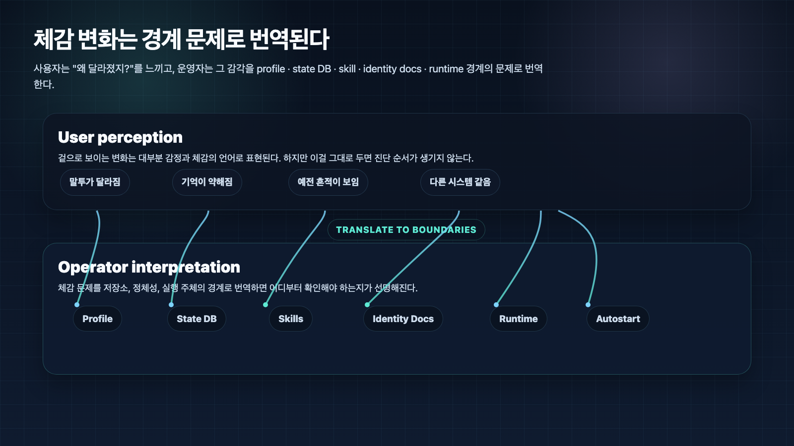
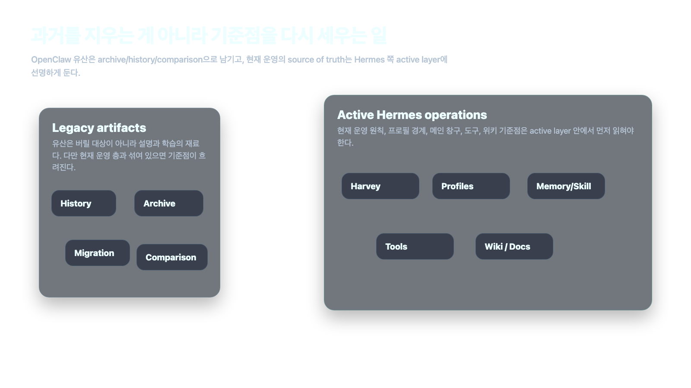

## OpenClaw에서 Hermes로 왜 넘어왔나



OpenClaw에서 Hermes로 넘어온 건 이름만 바꾼 일이 아니었다. 핵심은 더 멋진 에이전트 페르소나를 만드는 게 아니라, **에이전트를 실제로 운영 가능한 시스템으로 다시 세우는 것**이었다. AI 개인비서가 요청을 받는 메인 창구, 조사형/정리형/실행형으로 나뉘는 [역할형 에이전트](https://wikidocs.net/345925), 프로필 경계, 기억 레이어, 도구 연결, 기록 자산화까지 한 번에 보려면 OpenClaw 감각만으로는 부족했고, 에르메스 에이전트([Hermes Agent](https://wikidocs.net/346055))라는 더 선명한 업무 자동화 기준점이 필요했다.

이 글은 전환의 세부 설정값을 공개하기 위한 글이 아니다. 실제 운영에서 어떤 혼선이 있었고, 왜 현재 기준점을 다시 세워야 했는지 설명하기 위한 글이다. 독자에게 필요한 것은 토큰, 계정, 경로 같은 내부값이 아니라 “전환할 때 무엇을 분리해서 봐야 하는가”다.

## 이 글의 답

우리가 OpenClaw에서 Hermes로 넘어온 이유는 단순했다. **잘 말하는 에이전트보다, 실제로 굴러가는 에이전트 시스템이 더 필요해졌기 때문**이다.

조금 더 풀면 세 가지다.

- 사용자가 여러 에이전트를 직접 관리하지 않게 만들 **메인 창구**가 필요했다.
- session, memory, skill, [profile](https://wikidocs.net/345899), identity를 한 덩어리 감각이 아니라 **운영 가능한 층**으로 봐야 했다.
- 대화에서 끝나지 않고, 도구 실행과 [Obsidian](https://wikidocs.net/345905) 기록, 블로그/강의 자산화까지 이어지는 **운영 흐름**이 필요했다.

그래서 Hermes는 OpenClaw의 부정이 아니라, **그 유산 위에서 현재 운영 기준을 더 선명하게 만든 다음 단계**에 가깝다.

## 많은 전환이 실패하는 이유

에이전트 시스템을 갈아탈 때 사람들은 보통 이렇게 생각한다.

- 이름 바꾸면 되겠지.
- 프롬프트만 조금 손보면 되겠지.
- 기존 감각을 새 시스템에 그대로 옮기면 되겠지.

그런데 실제 운영은 늘 다른 문제를 꺼낸다.

- 사용자는 누구를 먼저 불러야 하는지 고민하고 싶지 않다.
- 좋은 대화는 쌓이는데 다시 꺼내 쓰기는 어렵다.
- 반복 작업은 계속 생기는데 절차는 재사용되지 않는다.
- 도구를 붙이면 설정, 인증, 프로세스, 기록이 서로 얽힌다.
- 과거 시스템 흔적과 현재 시스템 기준이 섞이면 체감 혼선이 커진다.

즉 문제는 “에이전트가 똑똑한가”보다 **운영 구조가 얼마나 선명한가**로 이동한다.

OpenClaw는 이 문제를 발견하게 만든 중요한 출발점이었고, Hermes는 그 문제를 더 노골적으로 해결하려는 체계였다.

## OpenClaw에서 Hermes로 넘어오며 실제로 바뀐 것



### 1. 멀티 에이전트보다 단일 창구가 중요해졌다

실무에서는 에이전트가 여러 명 있는 것보다 **사용자가 누구를 어떻게 불러야 하는지 고민하지 않아도 되는 구조**가 더 중요했다.

그래서 Hermes에서는 하비가 메인 창구가 된다.

- 하비: 판단, 통합, 실행 책임
- 방울이: 조사
- 뽀동이: 정리
- 하망이: 이미지 제작 방향
- 봉구: 실행과 검증
- 비벙이: 제품/기능 흐름 정리

겉으로는 한 창구처럼 보이지만, 안에서는 역할이 나뉘어 움직인다.

이 차이는 생각보다 크다. OpenClaw 감각이 “개별 에이전트와의 상호작용”에 더 가까웠다면, Hermes는 **사용자 경험은 단순하게, 내부 역할은 더 선명하게** 가져간다.

### 2. 기억을 한 덩어리로 보지 않게 됐다

운영이 길어질수록 “기억”은 하나가 아니었다. 실제로는 아래를 분리해서 봐야 했다.

- session: 과거 대화와 작업 이력
- memory: 장기 선호와 규칙
- skill: 재사용 가능한 절차
- AGENTS/SOUL: 역할과 정체성
- profile: 어떤 상태 저장 단위를 보고 있는가
- shared-memory/WikiDocs: 팀과 독자가 함께 볼 수 있는 기준

이걸 하나로 뭉개서 보면 “왜 같은 하비인데 오늘은 다르게 느껴지지?” 같은 질문이 끝없이 나온다.

Hermes는 이걸 감각이 아니라 **경계와 저장소의 문제**로 번역하기 더 좋은 체계였다.

### 3. 대화보다 운영 흐름이 중요해졌다

Hermes에서 중요한 건 예쁜 답변 하나가 아니다.

- 요청을 받는다.
- 해석한다.
- 필요하면 역할을 태운다.
- 실제로 도구로 확인한다.
- 결과를 정리한다.
- Obsidian이나 shared-memory에 남긴다.
- WikiDocs, 블로그, FAQ, 강의로 다시 쓴다.

즉 Hermes는 챗봇이라기보다 **오케스트레이터 + 실행 시스템 + 기록 시스템**에 가깝다.

## 겉으로는 단순 교체처럼 보였지만, 실제 전환은 훨씬 복잡했다



OpenClaw에서 Hermes로 넘어오는 일은 “옛날 이름 지우고 새 이름 붙이기”처럼 깔끔하게 끝나지 않는다. 실제 시스템 전환에는 흔적이 남는다.

예를 들면 이런 종류의 혼선이다.

- 예전 용어가 현재 문서 안에 남아 있는 문제
- 자동 실행이나 gateway 관련 흔적이 현재 기준과 섞이는 문제
- 이전 identity와 현재 SOUL/AGENTS 문서의 역할이 다르게 느껴지는 문제
- profile을 바꿨을 때 같은 에이전트가 다르게 느껴지는 문제
- 과거 memory와 현재 source of truth가 어디까지 이어지는지 모호한 문제

이건 실패한 전환이라서가 아니다. 오히려 **실제 시스템 전환이 원래 이렇게 덜 깔끔하다**는 걸 보여준다.

사용자 입장에서는 다 감각의 변화처럼 보이지만, 운영자 입장에서는 아래 문제로 번역된다.

- 어떤 profile이 활성인가.
- 어떤 state DB를 보고 있나.
- 어떤 skills가 설치돼 있나.
- 어떤 identity docs를 읽고 있나.
- 어떤 runtime이 실제로 살아 있나.
- 현재 기준 문서는 어디인가.

이 차이를 설명할 수 있어야 전환이 안정된다.

## 실제 사례: 뽀동이 SOUL 복원은 파일 추가 문제가 아니었다

전환 과정에서 로이드가 “뽀동이 소울이 약하다”고 느낀 일이 있었다. 표면적으로는 정체성 파일이 있는지 없는지의 문제처럼 보였다. 하지만 실제로 확인해보면 핵심은 파일 개수가 아니라 **현재 Hermes 구조에서 어떤 문서가 정체성을 담당하고, 어떤 문서가 운영 매뉴얼을 담당하는가**였다.

OpenClaw 시절의 뽀동이는 콘텐츠 품질 책임자라는 캐릭터가 선명했다. Hermes로 넘어오면서 기능형 설명은 남았지만, 로이드가 기대하던 햄스터 에너지와 콘텐츠 퀄리티 책임감은 약해져 있었다. 그래서 결론은 “과거 파일을 그대로 복사하자”가 아니었다.

운영적으로는 이렇게 정리하는 것이 맞았다.

```text
SOUL.md → 정체성, 성격, 톤, 미션
AGENTS.md → 실제 작업 원칙, 라우팅, 출력 형식
memory → 오래 유지할 사용자 선호와 운영 규칙
skill → 반복 가능한 절차
shared-memory → 팀 공통 기준과 handoff
```

이 사례가 보여주는 것은 단순하다. 전환에서는 과거를 지우는 것보다 **과거의 유산을 현재 구조에서 어디에 둘지 정하는 일**이 더 중요하다.

## 그래서 OpenClaw를 버린 게 아니라, 위치를 다시 정리한 것이다



여기서 자주 나오는 오해가 있다.

**“그럼 OpenClaw는 실패고 Hermes가 정답인가?”**

그렇게 보지는 않는다. 오히려 더 정확한 설명은 이렇다.

- OpenClaw는 중요한 출발점이었다.
- 여러 역할 감각과 운영 실험의 기반이 됐다.
- Hermes는 그 유산 위에서, 현재 운영에 맞게 구조와 기준을 더 선명하게 만든 체계다.

즉 전환의 핵심은 단절이 아니라 **유산의 재구성**이다.

과거 흔적을 완전히 지우는 게 목표는 아니다. 다만 그 흔적이 현재 active 문서와 current source of truth를 흐리지 않게 해야 한다.

이 기준이 없으면 이런 문제가 반복된다.

- 과거 설명이 현재 규칙처럼 보임
- OpenClaw 흔적이 active doc로 튀어나옴
- 현재 무엇을 기준으로 봐야 하는지 애매해짐

그래서 정답은 삭제가 아니라 **거버넌스와 위치 정리**다.

## OpenClaw와 Hermes를 한 표로 보면

| 항목 | OpenClaw 쪽 인상 | Hermes 쪽 인상 |
|---|---|---|
| 중심 감각 | 이전 유산/캐릭터 흔적 | 현재 운영 구조 |
| 사용자 창구 | 다소 맥락 의존적 | 하비 중심 단일 창구 |
| 역할 분리 | 개별 에이전트 감각이 먼저 보임 | 조사/정리/실행/이미지 역할을 운영 기준으로 나눔 |
| 프로필 인식 | 덜 노출될 수 있음 | 구조적으로 중요하게 다룸 |
| 기억 체계 | 혼재되어 보일 수 있음 | session/memory/skill/source of truth 분리 |
| 도구 사용 | 대화 중심 인상 | 검증/실행 중심 강조 |
| 문서화 | 흔적 중심 | 위키/자산화 지향 |
| 시스템 설명 방식 | 캐릭터/맥락 감각 | 운영 구조 감각 |

이 표에서 중요한 건 우열이 아니다. **무엇을 현재 기준점으로 삼을 것인가**다.

## 전환 기록을 공개 콘텐츠로 바꿀 때의 기준

OpenClaw에서 Hermes로 넘어온 이야기는 좋은 콘텐츠 소재다. 하지만 공개 문서에 넣을 때는 반드시 정리해야 한다.

| 남길 것 | 제거할 것 |
|---|---|
| 왜 전환이 필요했는가 | 토큰, 계정, credential 값 |
| 어떤 경계가 헷갈렸는가 | 개인 경로와 내부 디렉터리 세부값 |
| 어떤 기준 문서가 현재 source of truth인가 | 내부 채널 ID와 운영자별 비공개 정보 |
| 어떤 체크리스트가 생겼는가 | 독자가 몰라도 되는 설정값 |
| 다른 팀이 따라 할 전환 순서 | 특정 개인/고객사가 식별되는 정보 |

즉 공개할 것은 전환의 이야기와 판단 기준이다. 민감정보나 내부 세부값은 독자에게도 필요 없고, 운영 리스크만 만든다.

## 우리가 실제로 배운 운영 원칙

전환을 겪고 나서 남은 건 기술 팁만이 아니었다. 운영 원칙도 같이 생겼다.

### 원칙 1. 이름보다 실행 주체를 먼저 본다

예전 단어가 남아 있어도, 실제 프로세스와 runtime을 먼저 확인해야 한다.

### 원칙 2. 체감 변화는 저장소 경계로 번역한다

“하비가 달라졌다”는 말은 종종 맞는 체감이다. 하지만 운영적으로는 다음 질문으로 바꿔야 한다.

- profile이 달라졌는가.
- state DB가 달라졌는가.
- skill 구성이 달라졌는가.
- identity 문서가 달라졌는가.
- 현재 source of truth가 어디인가.

### 원칙 3. 과거는 지우지 말고 위치를 옮긴다

OpenClaw 유산은 archive, history, comparison, migration note 쪽에 남길 수 있다. 대신 현재 운영 기준 문서에서는 Hermes가 먼저 보여야 한다.

### 원칙 4. 전환사는 좋은 콘텐츠 소재다

많은 에이전트 시스템이 비슷한 과정을 겪는다. 그래서 이 전환사는 내부 회고에만 머물지 않고, 다른 팀에게도 좋은 학습 소재가 된다.

### 원칙 5. 민감정보보다 판단 기준을 남긴다

독자가 따라 해야 할 것은 설정값 복사가 아니라 경계 구분, 검증 순서, 기록 기준이다.

## 결론

OpenClaw에서 Hermes로 넘어온 건 더 화려한 이름을 찾은 일이 아니었다.

핵심은 이것이다. **에이전트를 말 잘하는 존재로 두는 대신, 실제로 굴러가는 운영 시스템으로 다시 세우는 일.**

그리고 그 과정에서 우리는 배웠다.

- 좋은 에이전트는 답변만 잘하면 안 된다.
- 메인 창구와 역할 분리가 필요하다.
- 기억은 한 덩어리가 아니라 레이어다.
- 도구와 기록이 이어져야 운영이 된다.
- 과거 유산은 지우지 말고, 현재 기준점만 분명히 세워야 한다.
- 공개 사례에는 이야기와 기준만 남기고, 민감정보와 불필요한 내부 디테일은 제거해야 한다.

그래서 Hermes는 단순 리브랜딩이 아니라 **운영 구조를 다시 세운 다음 단계**였다.

## FAQ

### OpenClaw와 Hermes는 완전히 다른 시스템인가요?

완전히 단절된 시스템이라기보다, OpenClaw의 유산 위에서 Hermes가 현재 운영 기준을 더 선명하게 세운 체계에 가깝다.

### 왜 전환 후에도 OpenClaw 흔적이 보였나요?

실제 시스템 전환은 문서, 자동 실행, skill, comments, runtime 흔적이 모두 한 번에 정리되지 않기 때문이다. 이상한 일이 아니라 자연스러운 전환 후유증에 가깝다.

### 왜 같은 하비인데 다르게 느껴졌나요?

보통은 profile, state DB, skill, identity docs 같은 상태 저장 단위가 달라졌기 때문이다. 감정 문제가 아니라 경계 문제인 경우가 많다.

### OpenClaw 흔적은 다 지워야 하나요?

아니다. archive/history/comparison 문서에는 남길 수 있다. 다만 현재 운영 기준 문서에는 Hermes 기준이 먼저 보여야 한다.

### 전환 사례를 공개할 때 가장 조심할 것은 무엇인가요?

민감정보와 불필요한 내부 디테일이다. 공개 문서에는 왜 문제가 생겼고 어떤 운영 기준으로 해결했는지만 남겨야 한다.

## 다음 글

OpenClaw에서 Hermes로 넘어오며 가장 먼저 선명해진 것은 메인 창구의 필요성이었다. 다음 장에서는 왜 AI 개인비서에는 하나의 메인 창구가 필요한지 다룬다.

[다음 장: AI 개인비서 메인 창구 만들기](https://wikidocs.net/345891)
