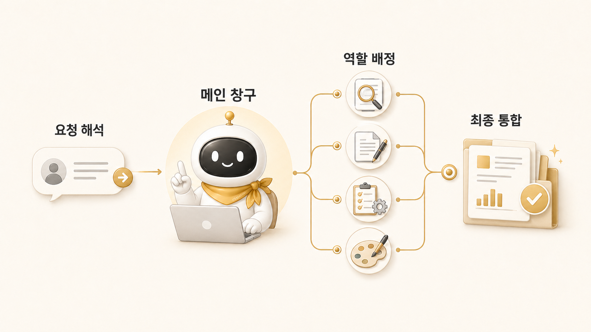

## 2장. AI 개인비서 메인 창구 만들기



AI 팀을 만들 때 가장 먼저 무너지는 지점은 에이전트의 성능이 아니다. 사용자가 매번 “이번 일은 누구에게 시켜야 하지?”를 판단해야 하는 순간이다. 조사형, 정리형, 실행형, 이미지 제작형 에이전트가 늘어날수록 사용자는 더 편해질 것 같지만, 메인 창구가 없으면 오히려 더 바빠진다.

그래서 2장의 핵심은 하비라는 이름보다 먼저 **[AI 개인비서](https://wikidocs.net/345923) 메인 창구**다. [Hermes Agent](https://wikidocs.net/346055)를 업무 자동화에 붙일 때 사용자는 한곳으로 요청하고, 메인 창구가 요청 해석, 직접 처리/위임 판단, 결과 통합, 최종 보고를 맡아야 한다.

우리 운영에서는 이 역할을 하비가 맡는다. 하비는 모든 일을 직접 하는 만능 에이전트가 아니라, 로이드가 여러 봇을 관리하지 않게 만드는 앞단의 운영자다. 뒤에는 [역할형 에이전트](https://wikidocs.net/345925)가 있고, 앞에는 사용자의 요청이 있다. 메인 창구는 이 둘 사이에서 복잡도를 줄인다.

## 이 장에서 다루는 문제

| 순서 | 글 | 핵심 질문 |
|---|---|---|
| 02-1 | AI 개인비서 메인 창구는 왜 필요할까 | 사용자가 여러 에이전트를 직접 지휘하면 왜 AI 팀이 피곤해질까 |
| 02-2 | 직접 처리할 일과 역할형 에이전트에 맡길 일 | 하비가 붙잡을 일과 방울이/뽀동이/봉구/하망이에게 넘길 일은 어떻게 나눌까 |
| 02-3 | 메인 창구의 강점과 병목 | 단일 창구 구조는 왜 편하지만, 어디서 막힐 수 있을까 |

## 실제로 이런 장면에서 필요했다

WikiDocs 책을 다듬는 작업만 봐도 그렇다. 로이드의 요청은 처음에 “전체 독자 흐름을 최종 검수하고, 내부 링크도 보고, 내용도 더 채워야 하지 않나”처럼 들어왔다. 겉으로는 문서 리뷰 요청이지만 실제로는 여러 일이 섞여 있었다.

| 섞여 있던 일 | 필요한 역할 |
|---|---|
| 기존 블로그 내용이 잘 옮겨졌는지 확인 | 조사/대조 |
| 공식 Hermes docs가 빠지지 않았는지 확인 | 근거 확인 |
| 독자 흐름과 장별 순서 점검 | 구조화 |
| 본문 내 contextual hyperlink 보강 | 문서 편집/검증 |
| 실제 운영 케이스를 민감정보 없이 녹이기 | 판단/리라이트 |
| GitHub 커밋/푸시와 WikiDocs 반영 확인 | 실행/검증 |

사용자가 이 모든 단계를 직접 나눠 지시하면 AI 팀은 도구 목록이 된다. 반대로 메인 창구가 있으면 요청은 하나로 들어오고, 안쪽에서 필요한 역할로 분해된다. 하비가 전체 방향을 잡고, 방울이가 근거를 찾고, 뽀동이가 책 흐름으로 정리하고, 필요한 경우 봉구나 하망이가 실행/시각화 흐름을 맡는 식이다.

## 처음에 생기는 착각

역할형 에이전트를 만들면 일이 자동으로 나뉠 것처럼 보인다. 하지만 실제 운영에서는 에이전트가 많을수록 사용자의 판단 비용이 커진다.

```text
이건 방울이에게 먼저 조사시킬까?
뽀동이가 바로 정리해도 될까?
봉구가 파일 수정과 검증을 맡아야 하나?
하망이에게 이미지 방향까지 넘겨야 하나?
하비가 최종 통합해야 하나?
```

이 질문을 매번 사용자가 붙잡으면 [나만의 AI 팀](https://wikidocs.net/345924)은 팀이 아니라 “봇을 관리하는 또 다른 일”이 된다. 메인 창구의 목적은 사용자가 에이전트 구조를 덜 신경 쓰게 만드는 것이다.

## 2장에서 세우는 운영 기준

이 장을 읽고 나면 아래 기준이 남아야 한다.

| 기준 | 설명 |
|---|---|
| 단일 진입점 | 사용자는 먼저 누구에게 말하는지 헷갈리지 않는다 |
| 직접 처리 기준 | 짧은 판단/우선순위/최종 보고는 메인 창구가 잡는다 |
| 위임 기준 | 조사/정리/실행/이미지처럼 깊이가 필요한 일은 역할형 에이전트로 보낸다 |
| 결과 계약 | 위임 결과는 그대로 전달하지 않고 하나의 판단으로 묶는다 |
| 보고 형식 | 사용자가 다시 묻지 않도록 완료/남음/다음이 보이게 한다 |
| 멈춤 기준 | 위험하거나 범위가 흔들리면 메인 창구가 멈추고 확인한다 |

## 독자가 적용할 때의 순서

먼저 [AI 개인비서 메인 창구는 왜 필요할까](https://wikidocs.net/345892)에서 단일 창구가 줄여주는 부담을 본다. 그다음 [직접 처리할 일과 역할형 에이전트에 맡길 일](https://wikidocs.net/345893)에서 하비가 직접 할 일과 뒤로 넘길 일을 나눈다.

마지막으로 [메인 창구의 강점과 병목](https://wikidocs.net/345894)을 읽으며 단일 창구가 언제 막히는지 확인한다. 이 기준이 잡혀야 3장의 조사형/정리형/실행형 에이전트 분리가 실제 운영 구조로 이어진다.

## 다음 장으로 가기 전 체크 질문

내 AI 팀에서 사용자는 누구에게 먼저 말하는가?

이 질문에 바로 답하지 못한다면 아직 메인 창구가 잡히지 않은 상태다. 에이전트 이름을 늘리기 전에 먼저 진입점을 하나로 정해야 한다.

## 이어서 읽기

- 첫 글은 [AI 개인비서 메인 창구는 왜 필요할까](https://wikidocs.net/345892)다. 사용자가 여러 에이전트를 직접 지휘하지 않게 만드는 기준을 잡는다.
- 위임 기준은 [직접 처리할 일과 역할형 에이전트에 맡길 일](https://wikidocs.net/345893)에서 이어서 본다.
- 실제 Slack 운영에서 메인 창구가 어떻게 분배하는지는 [Slack 스레드에서 하비가 일을 분배하는 방식](https://wikidocs.net/345995)과 함께 읽으면 좋다.
