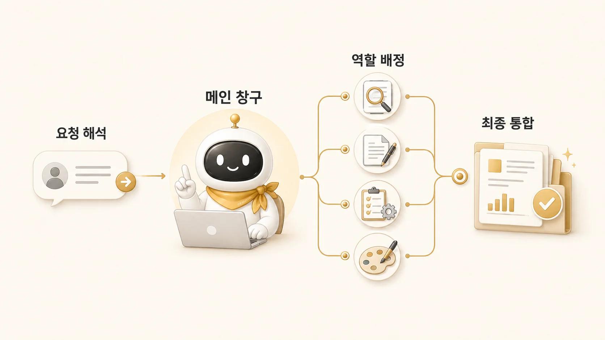

## 2장. AI 개인비서 메인 창구 만들기

1장에서 AI를 단순 챗봇이 아니라 역할이 나뉜 팀으로 보기 시작했다. 그런데 팀이 생기면 바로 다음 문제가 생긴다. 사용자는 어디로 말해야 할까? 조사형, 정리형, 실행형, 이미지형 에이전트가 있어도 사용자가 매번 담당자를 골라야 한다면 자동화가 아니라 관리 업무가 하나 더 생긴다.



2장은 [AI 개인비서](https://wikidocs.net/345923)를 메인 창구로 세우는 장이다. 메인 창구는 모든 일을 직접 처리하는 만능 에이전트가 아니다. 요청을 먼저 받고, 직접 할 일과 넘길 일을 나누고, 여러 결과를 다시 하나의 답으로 묶는 앞단이다. 이 책에서는 그 예시로 하비를 사용한다.

## 이 장에서 다루는 것

| 글 | 질문 | 핵심 |
|---|---|---|
| 02-1 | AI 개인비서 메인 창구는 왜 필요할까 | 사용자가 여러 에이전트를 직접 지휘하면 왜 피곤해지는가 |
| 02-2 | 직접 처리할 일과 역할형 에이전트에 맡길 일 | 메인 창구가 붙잡을 일과 넘길 일을 어떻게 나누는가 |
| 02-3 | 메인 창구의 강점과 병목 | 단일 창구는 왜 편하고, 어디서 막히는가 |

## 메인 창구가 필요한 순간

예를 들어 “WikiDocs 책 흐름을 다시 봐줘”라는 요청은 단순 문서 리뷰처럼 보인다. 실제로는 원본 대조, 근거 확인, 장별 흐름 점검, 링크 검증, 문장 리라이트, 발행 확인이 함께 들어 있다.

사용자가 이 단계를 매번 직접 나누면 AI 팀은 도구 목록이 된다. 반대로 메인 창구가 있으면 요청은 하나로 들어오고, 안쪽에서 필요한 역할로 분해된다. 이 장에서는 세부 역할보다 먼저 “누가 요청을 받고, 누가 결과를 묶는가”를 정한다. 역할별 분리는 3장에서 이어서 다룬다.

## 메인 창구를 세울 때 정할 것

| 기준 | 확인 질문 |
|---|---|
| 단일 진입점 | 사용자는 먼저 누구에게 말하면 되는가 |
| 직접 처리 기준 | 짧은 판단, 우선순위, 최종 보고는 누가 맡는가 |
| 위임 기준 | 조사/정리/실행/이미지처럼 깊이가 필요한 일은 어디로 넘기는가 |
| 결과 계약 | 위임 결과를 그대로 전달하지 않고 하나의 판단으로 묶는가 |
| 멈춤 기준 | 위험하거나 범위가 흔들릴 때 누가 확인을 요청하는가 |

이 기준이 없으면 역할형 에이전트를 많이 만들어도 사용자는 계속 판단해야 한다.

```text
이건 먼저 조사해야 하나?
바로 문서로 정리해도 되나?
파일 수정과 검증까지 맡겨도 되나?
최종 결과는 누가 묶어야 하나?
```

메인 창구의 목적은 사용자가 에이전트 구조를 덜 신경 쓰고, 요청과 결과에 집중하게 만드는 것이다.

## 읽는 순서

먼저 [AI 개인비서 메인 창구는 왜 필요할까](https://wikidocs.net/345892)에서 단일 창구가 줄여주는 부담을 본다. 그다음 [직접 처리할 일과 역할형 에이전트에 맡길 일](https://wikidocs.net/345893)에서 메인 창구가 직접 할 일과 뒤로 넘길 일을 나눈다.

마지막으로 [메인 창구의 강점과 병목](https://wikidocs.net/345894)을 읽으며 단일 창구가 언제 막히는지 확인한다. 이 기준이 잡혀야 3장의 [조사형/정리형/실행형 에이전트](https://wikidocs.net/345925) 분리가 실제 운영 구조로 이어진다.
