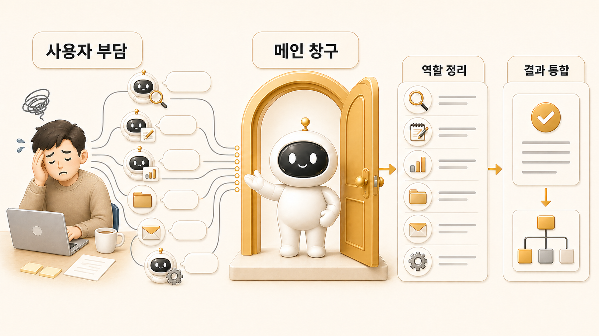

## AI 개인비서 메인 창구는 왜 필요할까



[AI 개인비서](https://wikidocs.net/345923)에는 메인 창구가 필요하다. 이유는 단순하다. 사용자가 매번 조사형, 정리형, 실행형, 이미지 제작형 에이전트를 직접 고르고 지시하면 AI 팀은 편해지는 게 아니라 더 피곤해진다.

[Hermes Agent](https://wikidocs.net/346055)를 실제 업무에 붙이면 요청은 대부분 한 문장으로 들어온다. “이 주제 정리해줘”, “오늘 브리핑 만들어줘”, “WikiDocs 2장 다시 봐줘”처럼 시작한다. 그런데 그 안에는 조사, 판단, 구조화, 파일 수정, 이미지 방향, 최종 보고가 섞여 있다.

메인 창구는 이 섞인 요청을 먼저 받아 흐름을 나누는 역할이다. 우리 운영에서는 하비가 그 역할을 맡는다. 하비는 모든 일을 직접 처리하는 만능 에이전트가 아니라, 요청을 읽고 필요한 [역할형 에이전트](https://wikidocs.net/345925)에게 넘긴 뒤 결과를 다시 하나로 묶는 AI 개인비서다.

## 멀티 에이전트가 쉽게 피곤해지는 이유

역할형 에이전트가 많아지면 처음에는 좋아 보인다. 조사형은 조사만 잘하고, 정리형은 문서만 잘하고, 실행형은 파일 수정과 검증을 맡는다. 문제는 사용자가 그 모든 역할을 직접 호출하기 시작할 때 생긴다.

예를 들어 이런 식이다.

```text
방울이한테 먼저 조사시킬까?
아니면 뽀동이한테 구조를 먼저 잡게 할까?
봉구가 파일을 고쳐야 하나?
하망이에게 이미지 방향도 같이 넘겨야 하나?
```

이 판단을 사용자가 계속 해야 하면 AI 팀은 자동화가 아니라 운영 부담이 된다. 메인 창구는 이 부담을 줄이기 위해 존재한다.

## 메인 창구가 책임지는 것

AI 개인비서 메인 창구는 보통 다섯 가지를 책임진다.

| 책임 | 의미 | 실패하면 생기는 일 |
|---|---|---|
| 요청 해석 | 사용자가 진짜 원하는 결과를 읽는다 | 답은 했지만 필요한 결과물이 아님 |
| 직접 처리/위임 판단 | 짧게 끝낼 일과 맡길 일을 나눈다 | 하비가 병목이 되거나 위임이 과해짐 |
| 역할 배정 | 방울이/뽀동이/봉구/하망이 중 누구에게 맡길지 정한다 | 여러 결과가 따로 놀게 됨 |
| 중간 검수 | 조사 결과나 초안의 품질을 확인한다 | 그럴듯하지만 틀린 결과가 통과함 |
| 최종 통합 | 사용자에게 하나의 흐름으로 돌려준다 | 산출물이 조각난 채로 남음 |

## 실제 운영 예시

로이드는 보통 이렇게 말한다.

```text
하비야, 2장 흐름 다시 봐줘.
제목은 너무 길지 않게 하되 AI 개인비서랑 메인 창구 키워드는 살리고,
필요하면 방울이 시켜서 공식 문서 기준 확인하고,
뽀동이가 WikiDocs 책 흐름에 맞게 다시 정리해줘.
```

이 요청에서 사용자는 [방울이](https://wikidocs.net/345895)와 뽀동이를 직접 따로 호출하지 않는다. 하비가 메인 창구로 요청을 받고, 필요한 경우 역할을 나눠 처리한다. 사용자는 최종 결과와 다음 액션을 받으면 된다.

## 왜 하비가 메인 창구가 되었나

하비가 메인 창구가 된 이유는 가장 똑똑해서가 아니다. 사용자가 일을 시작하는 자연스러운 위치가 하비였기 때문이다. Slack이나 대화창에서 “하비야”라고 부르면 요청 해석, 우선순위, 위임, 최종 보고가 한 흐름으로 이어진다.

메인 창구는 능력보다 위치가 중요하다. 사용자가 어디로 말해야 하는지 분명해야 하고, 그 창구가 내부 역할을 감춰줘야 한다.

## 운영 기준

AI 개인비서 메인 창구를 만들 때는 아래 기준을 먼저 정한다.

- 사용자는 누구에게 먼저 말하는가?
- 메인 창구가 직접 처리할 수 있는 작업 범위는 어디까지인가?
- 조사형, 정리형, 실행형, 이미지 제작형 에이전트로 넘길 기준은 무엇인가?
- 중간 결과를 누가 검수하는가?
- 최종 결과는 어떤 형식으로 사용자에게 돌아오는가?
- 실패했을 때 책임 지점은 어디인가?

## FAQ

### 메인 창구 하나만 있으면 다른 에이전트는 필요 없나요?

아니다. 메인 창구는 모든 일을 대신하는 존재가 아니라 일을 나누고 다시 묶는 창구다. 조사, 정리, 실행처럼 깊이가 필요한 일은 역할형 에이전트가 맡아야 한다.

### 하비가 직접 다 하면 더 빠르지 않나요?

짧은 판단은 빠를 수 있다. 하지만 근거 확인, 긴 문서 정리, 파일 수정, 이미지 제작 방향처럼 성격이 다른 일이 섞이면 직접 처리보다 위임과 통합이 더 안정적이다.

### 메인 창구가 병목이 되지 않게 하려면 어떻게 해야 하나요?

직접 처리 기준, 위임 기준, 보고 형식을 정해야 한다. 하비가 모든 일을 붙잡고 있으면 메인 창구가 아니라 병목이 된다.

## 다음 글

다음 글에서는 하비가 직접 처리할 일과 역할형 에이전트에 맡길 일을 나누는 기준을 정리한다.

[다음 글: 직접 처리할 일과 역할형 에이전트에 맡길 일](https://wikidocs.net/345893)
