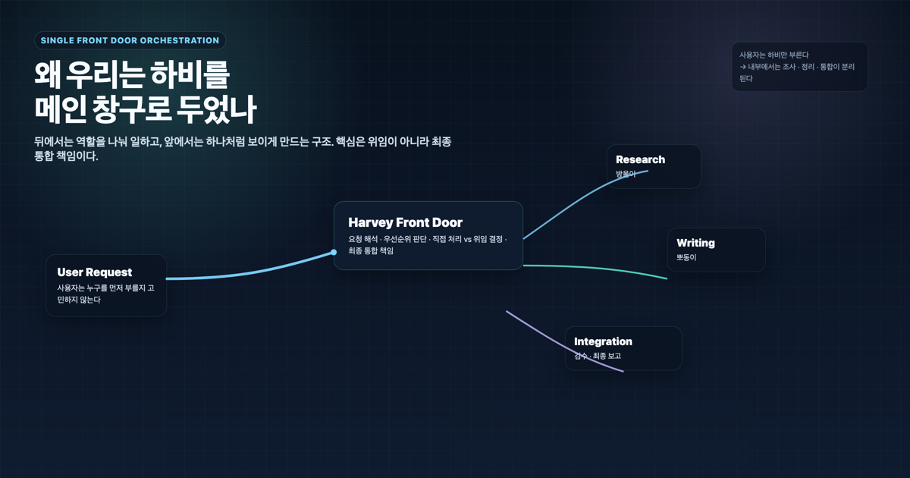
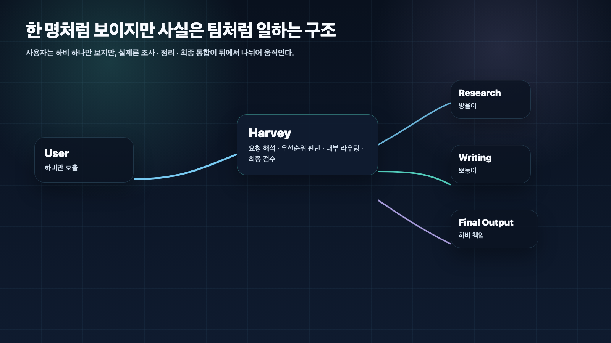
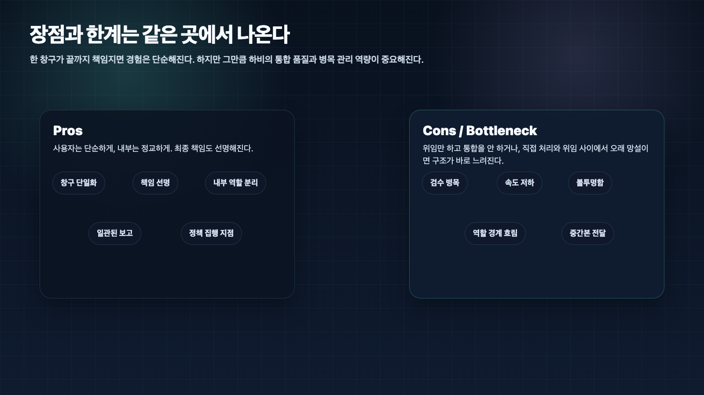

## 왜 AI 개인비서에는 메인 창구가 필요할까

> 이 글은 **에르메스 에이전트(Hermes Agent)**를 AI 개인비서와 역할형 에이전트로 운영하며 정리한 실전 기록입니다.

AI 개인비서에 메인 창구가 필요한 이유는 사용자가 여러 에이전트를 직접 관리하지 않게 만들기 위해서다. 조사형 에이전트, 정리형 에이전트, 실행형 에이전트가 따로 있어도 사용자가 매번 “이번엔 누구에게 시켜야 하지?”를 고민하면 그 시스템은 오래 가지 못한다.

우리 운영에서는 이 메인 창구 역할을 하비가 맡는다. 하비를 앞에 둔 이유는 하비가 모든 일을 혼자 하게 만들기 위해서가 아니다. 사용자의 요청을 한 곳에서 받고, 필요한 경우 방울이 같은 조사형 에이전트나 뽀동이 같은 정리형 에이전트로 나누고, 마지막에는 다시 하나의 결과로 묶기 위해서다.

핵심은 **사용자는 단순하게, 내부는 정교하게**다. 좋은 AI 팀은 여러 에이전트가 많이 보이는 구조가 아니라, 사용자가 한 곳에 말해도 뒤에서 역할이 잘 나뉘는 구조다.

## 멀티 에이전트가 쉽게 피곤해지는 이유

처음에는 에이전트가 여러 명이면 더 좋아 보인다. 조사 담당, 정리 담당, 실행 담당이 따로 있으면 더 전문적으로 움직일 것 같다.

하지만 실제 업무에 붙이면 피로가 다른 곳에서 생긴다.

- 사용자가 누구를 먼저 부를지 매번 판단해야 한다.
- 조사부터 할지, 정리부터 할지 사용자가 정해야 한다.
- 서로 다른 에이전트가 다른 답을 내면 누가 최종본인지 애매하다.
- 중간 산출물이 많아질수록 사용자가 다시 편집자가 된다.

즉 멀티 에이전트의 문제는 에이전트 수가 많다는 데 있지 않다. **창구가 많아질수록 책임과 흐름이 흐려진다**는 데 있다.

그래서 우리는 반대로 설계했다. 뒤에서는 역할을 나누되, 앞에서는 창구를 하나로 유지한다.

## 메인 창구는 무엇을 책임지는가

AI 개인비서의 메인 창구는 단순한 대화 상대가 아니다. 운영 관점에서는 다섯 가지를 책임진다.

### 1. 요청을 해석한다

사용자의 말은 늘 깔끔한 작업 지시로 들어오지 않는다. “이거 정리해줘”, “어디까지 됐지?”, “다음 장 가자” 같은 말에는 맥락, 우선순위, 이전 작업 상태가 같이 들어 있다.

메인 창구는 먼저 이 요청이 질문인지, 문서 작업인지, 실행 작업인지, 조사 요청인지 해석해야 한다.

### 2. 직접 처리할지 위임할지 고른다

짧은 판단이나 현재 맥락 요약은 메인 창구가 직접 처리하는 편이 빠르다. 반대로 근거 수집이 필요하면 조사형 에이전트가 낫고, 긴 원고를 읽기 좋은 구조로 바꾸는 일은 정리형 에이전트가 낫다.

이 판단을 사용자가 매번 하게 만들면 AI 개인비서가 아니라 AI 인력 관리 도구가 된다.

### 3. 중간 결과를 검수한다

위임은 끝이 아니다. 조사 결과가 충분한지, 정리 초안이 목적에 맞는지, 실행 결과가 검증됐는지 다시 봐야 한다.

메인 창구가 이 검수를 하지 않으면 사용자는 여러 에이전트의 중간 산출물을 그대로 받게 된다.

### 4. 최종 결과를 한 흐름으로 묶는다

사용자가 원하는 것은 보통 “각 에이전트가 한 말 모음”이 아니다. 바로 쓸 수 있는 결론, 문서, 보고, 다음 액션이다.

메인 창구는 중간 결과를 사용자에게 맞는 형식으로 다시 묶어야 한다.

### 5. 책임 지점을 선명하게 만든다

실패했을 때도 중요하다. 결과가 약하면 조사 부족인지, 정리 문제인지, 실행 검증 누락인지, 요청 해석 오류인지 봐야 한다.

메인 창구가 있으면 이 진단의 시작점이 생긴다.

## 왜 하비가 메인 창구가 되었나

우리 운영에서 하비는 사용자가 가장 먼저 부르는 AI 개인비서다. 공개 개념으로 말하면 “메인 창구”이고, 내부 운영 이름으로 말하면 하비다.

하비를 메인 창구로 둔 이유는 세 가지다.

### 1. 사용자가 여러 봇 운영자가 되면 안 되기 때문이다

좋은 구조는 사용자가 에이전트 구조를 관리하지 않게 만들어야 한다.

사용자가 계속 이런 걸 고민하게 하면 안 된다.

- 이건 방울이에게 물어야 하나?
- 이건 뽀동이가 더 잘하나?
- 둘 다 시켜야 하나?
- 지금 나온 답은 중간본인가 최종본인가?

메인 창구 구조는 이 피로를 줄인다. 사용자는 하비만 부르고, 하비가 내부 라우팅을 판단한다.

### 2. 역할은 나누되 사용자 경험은 단순해야 하기 때문이다

실제 운영에서 조사, 정리, 최종 판단은 서로 다른 근육을 쓴다.

- 방울이: 조사, 탐색, 근거 수집, 비교
- 뽀동이: 정리, 문서화, 초안화, 발표용 재구성
- 하비: 요청 해석, 우선순위 판단, 위임 결정, 중간 검수, 최종 통합

역할은 나뉘어야 한다. 하지만 그 분리를 사용자에게 그대로 노출하면 구조는 피곤해진다.

겉으로는 한 팀, 한 창구처럼 보이게 하고, 안에서는 더 정교하게 나눠 일하도록 설계한 이유가 여기에 있다.

### 3. 최종 책임이 선명해야 품질이 올라가기 때문이다

많은 멀티 에이전트 구조는 여기서 무너진다. 조사한 결과를 그대로 던지고, 정리한 초안을 검수 없이 넘기고, 중간 산출물을 최종본처럼 말한다.

그러면 사용자가 느끼는 것은 결국 하나다.

“결국 내가 다시 편집해야 하네.”

하비 구조는 이걸 막기 위한 구조다. 위임은 하더라도 결과를 받고, 검수하고, 충돌을 조정하고, 최종 보고 형식으로 묶는 책임은 하비에게 남는다.

## 메인 창구 구조의 장점

### 1. 사용자는 구조를 공부하지 않아도 된다

사용자는 “하비야” 하고 부르면 된다. 이건 단순 편의가 아니다. AI 업무 자동화 시스템이 오래 가려면 사용자가 내부 구조를 외우지 않아도 되어야 한다.

### 2. 내부 역할 분리와 외부 일관성을 동시에 잡는다

방울이는 조사에 집중하고, 뽀동이는 정리에 집중하고, 하비는 판단과 통합에 집중한다. 각자 다른 역할을 맡지만 사용자 앞에서는 하나의 서비스처럼 보인다.

### 3. 운영 규칙을 한 곳에 모으기 쉽다

메인 창구가 있으면 이런 기준이 한 점에 모인다.

- 언제 직접 처리할지
- 언제 위임할지
- 어떤 형식으로 보고할지
- 리스크를 어디까지 같이 말할지
- 결과를 어디에 기록할지

즉 하비는 단순 응답자가 아니라 **운영 정책의 집행 지점**이 된다.

## 장점이 곧 한계가 되기도 한다

메인 창구 구조의 강점은 동시에 한계가 된다. 모든 요청이 하비를 거치면 하비의 판단 속도와 검수 품질이 전체 흐름의 속도가 된다.

특히 아래 상황에서 병목이 생긴다.

- 동시에 여러 작업이 몰릴 때
- 중간 산출물 품질이 낮아 검수 시간이 길어질 때
- 직접 처리와 위임 사이에서 오래 망설일 때
- 위임만 하고 최종 통합을 하지 않을 때

이때 문제를 “하비가 느리다”로만 보면 해결이 어렵다. 보통은 라우팅 기준, 검수 기준, 역할 경계가 흔들린 것이다.

## 우리가 실제로 세운 운영 원칙

### 원칙 1. 사용자는 메인 창구만 부르면 된다

사용자가 에이전트 구조를 관리하게 만들면 오래 못 간다.

### 원칙 2. 메인 창구는 내부 라우팅을 책임진다

누굴 태울지, 어느 순서로 태울지, 중간 결과를 어떻게 엮을지는 메인 창구의 일이다.

### 원칙 3. 위임해도 최종 통합 책임은 남는다

조사형/정리형 에이전트가 일을 잘해도 최종본의 품질과 전달 형식은 메인 창구가 책임진다.

### 원칙 4. 병목이 생기면 사람보다 흐름을 먼저 본다

느려졌다고 바로 개인 능력 문제로 보면 안 된다. 먼저 직접 처리 기준, 위임 기준, 검수 기준을 본다.

## FAQ

### 1. 왜 사용자가 직접 조사형/정리형 에이전트를 부르면 안 되나요?

필요한 경우 직접 호출할 수는 있다. 다만 기본값이 직접 호출이면 사용자가 매번 AI 팀을 관리해야 한다. 기본 창구는 하나가 더 안정적이다.

### 2. 메인 창구가 있으면 결국 더 느려지지 않나요?

그럴 수 있다. 그래서 메인 창구는 모든 일을 직접 하면 안 된다. 빠르게 직접 처리할 일과 위임할 일을 나누고, 위임 결과를 짧게 검수해 통합해야 한다.

### 3. 메인 창구와 멀티 에이전트는 모순 아닌가요?

모순이 아니다. 사용자 경험은 단일 창구에 가깝고, 내부 운영은 멀티 에이전트에 가깝다. 핵심은 둘 중 하나를 고르는 것이 아니라 둘을 동시에 잡는 것이다.

## 다음 글

다음 글에서는 메인 창구가 언제 직접 처리하고, 언제 조사형/정리형 에이전트에게 위임해야 하는지 기준을 정리한다.

[다음 글: AI 개인비서는 언제 직접 처리하고 언제 위임해야 할까](18-when-harvey-should-handle-directly-vs-delegate.md)
