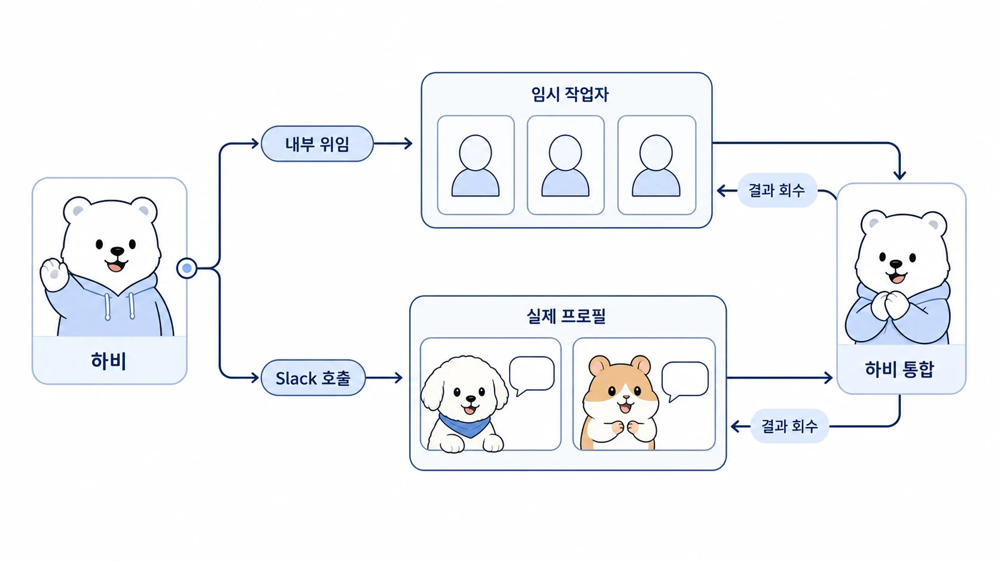

## delegate_task와 실제 에이전트 호출은 어떻게 다를까

Hermes Agent에서 AI 개인비서가 다른 역할형 에이전트에게 일을 맡기는 방식은 하나가 아니다. 겉으로는 모두 “방울이에게 조사시키기”, “뽀동이에게 정리 맡기기”처럼 보이지만, 실제 실행 구조는 크게 두 가지로 나뉜다.

하나는 `delegate_task`로 현재 작업 안에서 임시 subagent에게 맡기는 방식이다. 다른 하나는 Slack 같은 메시징 플랫폼에서 실제 역할형 에이전트 profile을 멘션해 호출하는 방식이다. 이 둘을 구분하지 않으면 “진짜 방울이가 한 일인지”, “하비가 내부 조사 작업자를 쓴 것인지”, “왜 봇이 답하지 않았는지”가 헷갈린다.



[TOC]

## 먼저 결론: 내부 위임과 실제 호출은 다르다

`delegate_task`는 현재 에이전트가 하위 작업자를 만들어 일을 나누는 내부 병렬 처리 방식이다. 실제 방울이/뽀동이 profile로 전환되는 것은 아니다.

Slack 멘션 호출은 해당 역할형 에이전트의 gateway/profile이 Slack 이벤트를 받아 직접 응답하는 방식이다. 이때는 해당 에이전트의 설정, 메모리, Slack 응답 규칙, toolset이 적용된다.

| 구분 | `delegate_task` 내부 위임 | Slack 멘션 기반 실제 호출 |
|---|---|---|
| 실행 주체 | 현재 에이전트가 띄운 임시 subagent | 멘션된 역할형 에이전트 profile |
| persistent memory | 실제 역할형 profile의 memory를 자동 상속하지 않음 | 해당 profile의 memory와 규칙이 적용됨 |
| Slack 정체성 | 없음 | 해당 Slack 봇 정체성으로 응답 |
| 사용자와 직접 대화 | 불가 | 가능 |
| 결과 회수 | 부모 에이전트가 요약 결과를 받음 | Slack 스레드에 직접 보고 |
| 좋은 경우 | 빠른 조사, 비교, 리뷰, 병렬 확인 | 고유한 역할 기준, 기억, 말투, Slack 협업 흐름이 중요할 때 |
| 주의점 | 지시문에 범위와 출력 형식이 선명해야 함 | 채널 초대, 멘션, gateway 설정이 맞아야 함 |

## `delegate_task`는 “방울이로 빙의”가 아니다

로이드가 하비에게 “방울이 시켜서 조사해줘”라고 말하면, 하비는 상황에 따라 `delegate_task`로 조사형 subagent를 실행할 수 있다. 운영상으로는 “방울이식 조사 역할을 태웠다”고 말할 수 있지만, 기술적으로는 실제 방울이 profile로 빙의한 것이 아니다.

`delegate_task` subagent는 독립된 작업 컨텍스트를 갖지만, 실제 방울이 profile의 persistent memory를 자동으로 상속하지 않는다. 다만 하비가 작업 지시문에 포함해 넘긴 맥락은 사용할 수 있다.

예를 들어 이런 작업에는 `delegate_task`가 빠르다.

```text
공식 Hermes Agent 문서 기준으로 delegation과 profile 호출의 차이를 확인해줘.
각 방식의 장점, 한계, 문서화할 때 조심할 표현을 표로 정리해줘.
```

이 방식의 장점은 빠르다는 것이다. 하비가 여러 하위 조사를 동시에 보내고, 결과만 받아 최종 판단을 통합할 수 있다. 반대로 단점은 실제 역할형 에이전트의 장기 기억, Slack 정체성, 프로필별 운영 규칙이 그대로 적용되는 구조는 아니라는 점이다.

## Slack 멘션 호출은 실제 역할형 에이전트를 부르는 방식이다

Slack에서 실제 방울이/뽀동이 같은 역할형 에이전트를 멘션하면, 해당 profile의 gateway가 Slack 이벤트를 받고 직접 응답한다. 이때는 그 에이전트의 memory, skill, config, Slack 응답 규칙이 살아난다.

예시는 다음과 같다.

```text
<@방울이_USER_ID> 이 스레드 기준으로 확장 조사해줘.

목표:
- 관련 자료 확인
- 근거 링크 정리
- 미확인 사항 분리

결과 형식:
- 발견
- 근거
- 미확인
- 추천

완료하면 <@하비_USER_ID>를 멘션해서 검토 루프를 넘겨줘.
```

여기서 중요한 점은 마지막 줄이다. 보조 에이전트가 단순 보고만 하고 멈추면, 메인 창구가 다시 이어받지 못할 수 있다. 그래서 멀티봇 Slack 협업에서는 완료 보고에 하비를 다시 멘션해 검토, 통합, 최종 보고 루프가 돌아오게 해야 한다.

## `send_message`는 실행기가 아니라 메시징 도구다

하비가 Slack에서 다른 에이전트를 호출할 때는 `send_message` 도구를 사용할 수 있다. 하지만 `send_message` 자체가 방울이나 뽀동이를 실행하는 함수는 아니다.

정확히는 이렇게 이해하는 편이 좋다.

```text
delegate_task = 내부 subagent에게 직접 위임
send_message = Slack에 메시지를 보내 실제 봇을 멘션 호출
```

즉 하비가 `send_message`로 같은 스레드에 `<@방울이_USER_ID>` 메시지를 보내면, Slack gateway를 통해 실제 방울이 profile이 그 멘션을 감지하고 응답한다. `send_message`는 연결된 플랫폼에 메시지를 보내는 Hermes Agent 공통 메시징 도구이고, 실제 응답은 대상 에이전트의 gateway/profile이 담당한다.

## Slack에서 실제 호출이 되려면 필요한 조건

Slack 멘션 호출은 단순히 이름을 적는다고 항상 작동하지 않는다. 다음 조건이 맞아야 한다.

| 조건 | 설명 |
|---|---|
| 대상 봇이 채널 멤버여야 함 | 방울이/뽀동이 봇이 해당 채널이나 스레드가 속한 채널에 들어와 있어야 한다 |
| 정확한 Slack user ID 멘션이 필요함 | 안전하게 호출하려면 `<@U...>` 형식을 사용한다 |
| 대상 gateway가 실행 중이어야 함 | 해당 profile의 Slack gateway가 살아 있어야 이벤트를 받는다 |
| 봇 메시지에 반응해야 하면 설정이 필요함 | 하비가 보낸 메시지도 봇 메시지이므로, 대상 profile이 봇 멘션을 받을 수 있어야 한다 |
| 설정 변경 후 재시작이 필요함 | config를 바꾼 뒤 gateway를 restart해야 반영된다 |

하비가 방울이/뽀동이를 부르는 운영에서는 보통 대상 profile의 Slack 설정에 다음과 같은 옵션이 필요할 수 있다.

```yaml
slack:
  allow_bots: mentions
```

이 설정은 “모든 봇 메시지에 반응한다”가 아니라, 봇 메시지라도 자신이 명시 멘션된 경우에는 반응하도록 여는 운영 방식이다. 멀티봇 스레드가 시끄러워지는 것을 막으면서도 하비가 보조 에이전트를 호출할 수 있게 만든다.

설정 변경 후에는 대상 profile의 gateway를 재시작해야 한다.

```bash
hermes -p bangwooli gateway restart
hermes -p ppodongi gateway restart
```

## 언제 어떤 방식을 쓰면 좋을까

| 상황 | 추천 방식 |
|---|---|
| 빠른 비교 조사나 병렬 검토가 필요하다 | `delegate_task` |
| 결과를 하비가 조용히 받아 최종 통합하면 된다 | `delegate_task` |
| 특정 에이전트의 고유 memory/skill/말투가 중요하다 | Slack 멘션 호출 |
| Slack 스레드에서 실제 협업 흔적을 남겨야 한다 | Slack 멘션 호출 |
| 사용자가 직접 방울이/뽀동이와 이어서 대화해야 한다 | Slack 멘션 호출 |
| 오래 걸리는 독립 실행이나 파일 수정이 필요하다 | 별도 profile 실행, background 작업, worktree 실행 |

핵심은 “강한 방식이 항상 좋은 방식은 아니다”라는 점이다. 간단한 확인을 위해 실제 Slack 봇을 깨우면 오버헤드가 커진다. 반대로 장기 기억과 역할 규칙이 중요한 일을 `delegate_task`로만 처리하면 역할형 에이전트를 나눈 장점이 줄어든다.

## 하비가 메인 창구일 때의 좋은 운영 흐름

하비를 메인 창구로 두는 이유는 사용자가 여러 에이전트를 직접 관리하지 않게 만들기 위해서다. 따라서 좋은 흐름은 “사용자가 다 부른다”가 아니라 “하비가 판단해서 필요한 에이전트만 부르고 다시 통합한다”에 가깝다.

```text
1. 사용자가 하비에게 요청한다.
2. 하비가 직접 처리할지, 내부 위임할지, 실제 역할형 에이전트를 부를지 판단한다.
3. 빠른 하위 작업이면 delegate_task를 쓴다.
4. 실제 profile의 기억과 정체성이 필요하면 Slack에서 해당 에이전트를 멘션한다.
5. 보조 에이전트는 완료 보고에 하비를 멘션해 검토 루프를 돌려준다.
6. 하비가 결과를 검토하고 최종 보고한다.
```

이렇게 해야 Slack 대화가 단순 보고 더미가 아니라 실제 협업 루프가 된다.

## 실제 예시: 조사형과 정리형을 함께 쓰기

WikiDocs에 새 페이지를 추가하는 요청이라면 하비는 이렇게 나눌 수 있다.

| 단계 | 담당 | 실행 방식 |
|---|---|---|
| 기존 대화와 공식 문서 기준 확인 | 하비 또는 조사형 subagent | `delegate_task` 또는 직접 확인 |
| 기술 차이 검토 | 방울이 | Slack 멘션 호출 또는 내부 조사 위임 |
| 문서 구조 초안 | 뽀동이 | Slack 멘션 호출 |
| 최종 문장, 링크, 발행 검토 | 하비 | 직접 통합 |
| GitHub 반영과 공개 확인 | 하비 또는 실행형 에이전트 | terminal, GitHub, WikiDocs 확인 |

이 흐름에서 뽀동이가 좋은 초안을 만들더라도 작업은 끝난 것이 아니다. 하비가 기술 정확도, 독자 이해, 기존 목차와의 연결, 발행 상태를 검토한 뒤 최종 보고해야 한다.

## 운영 체크리스트

- 이 작업은 실제 profile의 memory/skill/정체성이 필요한가?
- 단순 병렬 확인이면 `delegate_task`로 충분한가?
- Slack에서 실제 에이전트를 부를 경우 대상 봇이 채널에 들어와 있는가?
- 멘션은 `<@USER_ID>` 형식으로 정확히 보냈는가?
- 봇이 봇 메시지에 반응해야 한다면 `allow_bots: mentions`가 켜져 있는가?
- 설정 변경 후 gateway를 재시작했는가?
- 보조 에이전트 완료 보고가 하비에게 다시 돌아오도록 멘션했는가?
- 하비가 최종 검토와 통합 보고를 했는가?

## FAQ

### `delegate_task`를 쓰면 방울이 profile로 실행되는 건가요?

아니다. `delegate_task`는 현재 에이전트가 임시 subagent에게 일을 맡기는 내부 위임 방식이다. 조사형 역할을 맡길 수는 있지만, 실제 방울이 profile의 persistent memory, Slack 정체성, gateway 설정이 자동 적용되는 것은 아니다.

### 진짜 방울이/뽀동이를 부르려면 어떻게 해야 하나요?

Slack에서 해당 에이전트 봇을 정확히 멘션해야 한다. 예를 들어 `<@방울이_USER_ID>`처럼 Slack user ID 기반 멘션을 사용한다. 대상 봇은 해당 채널에 들어와 있어야 하고, gateway가 실행 중이어야 한다.

### 봇이 다른 봇의 메시지에 반응하지 않으면 어떻게 하나요?

대상 profile이 봇 메시지 멘션을 받을 수 있도록 설정해야 한다. 예를 들어 Slack 설정에 `allow_bots: mentions`를 추가한 뒤 gateway를 재시작한다. 그래야 하비가 보낸 멘션 메시지에 방울이/뽀동이가 반응할 수 있다.

### 하비가 “방울이 시켜서 조사했다”고 하면 항상 진짜 방울이가 한 건가요?

항상 그렇지는 않다. 빠른 내부 위임이면 `delegate_task` subagent가 한 것이고, Slack에서 실제 방울이 봇을 멘션했다면 방울이 profile이 직접 응답한 것이다. 결과 보고에서 어떤 실행 방식을 썼는지 구분해두면 혼선이 줄어든다.

### 보조 에이전트가 완료 보고만 남기면 왜 문제가 되나요?

메인 창구가 다시 호출되지 않으면 작업이 “보고됨” 상태에서 멈출 수 있다. 하비가 최종 통합 책임자라면 보조 에이전트는 완료 보고에 하비를 멘션해 검토와 최종 보고가 이어지게 해야 한다.
