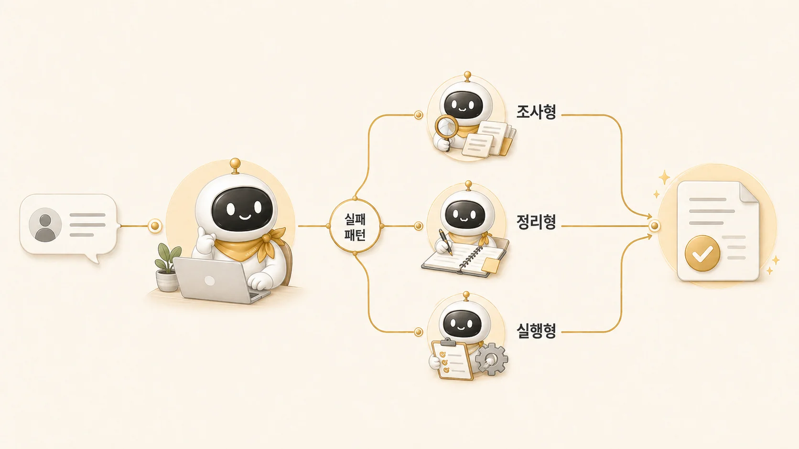

## 3장. 조사형/정리형/실행형 에이전트와 멀티 에이전트 운영

AI 개인비서 메인 창구가 잡히면 다음 문제는 역할 분리다. [메인 창구](https://wikidocs.net/345891)가 모든 일을 직접 처리하면 병목이 생기고, 반대로 기준 없이 에이전트를 늘리면 누가 무엇을 책임지는지 흐려진다. 메인 창구가 모든 일을 직접 처리하면 병목이 생기고, 반대로 기준 없이 에이전트를 늘리면 누가 무엇을 책임지는지 흐려진다.

3장은 일을 **[조사형/정리형/실행형](https://wikidocs.net/345925)**으로 나누는 기준을 다룬다. 검색어로 말하면 멀티 에이전트 시스템, 멀티 에이전트 운영, 멀티 에이전트 오케스트레이션에 가깝지만, 이 책에서는 거창한 아키텍처보다 실제 업무에서 실패 지점을 잘 보이게 만드는 역할 분리를 먼저 본다. 근거가 부족한 문제인지, 구조가 약한 문제인지, 실행과 검증이 빠진 문제인지 구분할 수 있어야 좋은 멀티 에이전트 사례가 된다.

## 이 장에서 다루는 것

| 글 | 질문 | 핵심 |
|---|---|---|
| 03-1 | 역할형 에이전트는 어떤 기준으로 나눌까 | 역할은 능력이 아니라 실패 패턴으로 나눈다 |
| 03-2 | 조사형 에이전트는 어디서 강하고 어디서 흔들릴까 | 근거를 넓히되 결론을 서두르지 않는다 |
| 03-3 | 정리형 에이전트는 어디서 강하고 어디서 흔들릴까 | 읽히는 구조를 만들되 재료 없이 꾸미지 않는다 |
| 03-4 | 조사형/정리형 에이전트는 왜 다르게 실패할까 | 같은 품질 문제라도 고쳐야 할 지점이 다르다 |
| 03-5 | 조사형 에이전트는 왜 자주 결론을 서두를까 | 사실, 해석, 가설을 나눠 넘긴다 |
| 03-6 | 정리형 에이전트는 왜 그럴듯하지만 약한 글을 만들까 | 매끄러운 문장보다 실제 장면과 판단 기준이 중요하다 |

## 역할이 갈라지는 순간

예를 들어 “이 책이 처음 읽는 사람에게 잘 읽히는지 봐줘”라는 요청은 단순 문장 교정이 아니다. 안에는 서로 다른 일이 섞여 있다.

| 섞여 있는 일 | 필요한 역할 |
|---|---|
| 기존 글과 현재 페이지가 잘 연결됐는지 확인 | 조사형 |
| 공식 설명과 실제 운영 기준이 어긋나지 않는지 확인 | 조사형 |
| 장별 흐름이 독자 여정으로 이어지는지 정리 | 정리형 |
| 기록용 문장을 읽기 쉬운 사례로 바꾸기 | 정리형 |
| 링크, 이미지, 서식, 발행 상태 확인 | 실행형 |
| 여러 결과를 하나의 판단으로 묶기 | 메인 창구 |

한 에이전트가 이 모든 일을 한 번에 처리할 수도 있다. 하지만 문제가 생겼을 때 원인을 찾기 어렵다. 글이 약한 이유가 근거 부족인지, 구조 문제인지, 검증 누락인지 모호해진다.

## 처음에 생기는 착각

역할형 에이전트를 나눈다고 해서 모든 문제가 자동으로 해결되지는 않는다. 멀티 에이전트 시스템이나 멀티 에이전트 아키텍처도 호출 순서, 입력물, 완료 기준이 없으면 오히려 혼란이 커진다. 흔한 착각은 세 가지다.

1. 조사형에게 맡기면 결론까지 알아서 좋아질 것이다.
2. 정리형에게 맡기면 재료가 부족해도 글이 좋아질 것이다.
3. 실행형에게 맡기면 검증 기준 없이도 안전하게 처리될 것이다.

실제로는 반대다. 역할을 나눌수록 각 역할의 입력물과 완료 기준이 더 분명해야 한다. 조사형에게는 범위와 근거 수준이 필요하고, 정리형에게는 독자와 원자료가 필요하고, 실행형에게는 작업 범위와 검증 기준이 필요하다.

## 3장을 마치면 남아야 할 것

| 남아야 할 것 | 확인 질문 | 연결되는 글 |
|---|---|---|
| 역할 분리 기준 | 일을 기능이 아니라 실패 패턴으로 나눴는가 | [역할형 에이전트 분리 기준](https://wikidocs.net/345925) |
| 조사형 요청법 | 방울이에게 사실/해석/미확인을 나눠 달라고 했는가 | [조사형 에이전트](https://wikidocs.net/345895) |
| 정리형 요청법 | 뽀동이에게 독자/목적/근거/완료 기준을 줬는가 | [정리형 에이전트](https://wikidocs.net/345896) |
| 충돌 처리 기준 | 조사 결과와 정리 결과가 다를 때 다시 확인할 순서가 있는가 | [조사형/정리형 실패 차이](https://wikidocs.net/345897) |

## 이 장에서 가져갈 기준

- 조사형은 근거를 넓힌다. 최종 결론을 서두르지 않는다.
- 정리형은 흐름을 만든다. 재료가 부족한 상태에서 그럴듯하게 꾸미지 않는다.
- 실행형은 상태를 바꾼다. 범위와 검증 기준 없이 움직이면 위험하다.
- 메인 창구는 역할을 나누고, 결과를 다시 하나로 묶는다.
- 역할 분리는 속도보다 품질 관리와 책임 경계를 위해 필요하다.

## 이어서 읽기

먼저 [역할형 에이전트는 어떤 기준으로 나눌까](https://wikidocs.net/345925)를 읽는다. 그다음 조사형과 정리형의 강점/실패 패턴을 나눠 보고, 4장에서는 이 역할들이 memory, session, profile 경계와 어떻게 연결되는지 확인한다.
