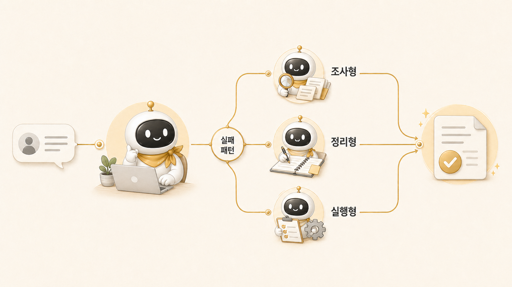

## 3장. 조사형/정리형/실행형 에이전트 나누기

[AI 개인비서 메인 창구](https://wikidocs.net/345892)가 잡히면 다음 문제는 역할 분리다. 하비가 모든 일을 직접 처리하면 병목이 되고, 반대로 아무 기준 없이 위임하면 결과가 흩어진다. 그래서 3장에서는 조사형/정리형/실행형 에이전트를 왜 나눠야 하는지 정리한다.

역할형 에이전트는 캐릭터를 늘리는 장치가 아니다. 실패 패턴을 나누는 운영 구조다. 방울이는 확장조사와 근거 수집에 강하지만 결론을 서두를 수 있고, 뽀동이는 문서 구조와 전달력에 강하지만 재료가 부족하면 그럴듯한 빈 글을 만들 수 있다. 봉구 같은 실행형은 실제 파일 수정과 검증에 강하지만 범위가 흐리면 과하게 실행할 수 있다.

이 장의 목표는 “누가 귀엽냐”가 아니라 “어떤 일을 어떤 기준으로 맡길 것인가”다.

## 이 장에서 다루는 문제

| 순서 | 글 | 핵심 질문 |
|---|---|---|
| 03-1 | 역할형 에이전트는 어떤 기준으로 나눌까 | 역할은 기능이 아니라 실패 패턴 기준으로 나누는가 |
| 03-2 | 조사형 에이전트는 어디서 강하고 어디서 흔들릴까 | 방울이는 언제 강하고 언제 결론을 서두르는가 |
| 03-3 | 정리형 에이전트는 어디서 강하고 어디서 흔들릴까 | 뽀동이는 언제 글을 살리고 언제 약한 초안을 만드는가 |
| 03-4 | 조사형/정리형 에이전트는 왜 다르게 실패할까 | 같은 기준으로 교정하면 왜 안 되는가 |
| 03-5 | 조사형 에이전트는 왜 자주 결론을 서두를까 | 근거, 해석, 가설을 어떻게 분리할까 |
| 03-6 | 정리형 에이전트는 왜 그럴듯하지만 약한 글을 만들까 | 재료, 목적, 독자 기준을 어떻게 줄까 |

## 처음에 생기는 착각

역할형 에이전트를 만들면 자동으로 일이 잘 나뉠 것처럼 보인다. 하지만 실제 운영에서는 이름만 나눈다고 달라지지 않는다. 조사형에게 최종 판단까지 맡기거나, 정리형에게 근거 수집까지 맡기거나, 실행형에게 범위 없는 수정 요청을 던지면 실패는 그대로 반복된다.

역할을 나눈다는 것은 책임과 금지선을 같이 정한다는 뜻이다.

## 이 장에서 얻을 기준

- 조사형 에이전트는 최종본이 아니라 근거와 선택지를 만든다.
- 정리형 에이전트는 없는 재료를 꾸미는 역할이 아니라 목적과 독자에 맞게 구조를 잡는다.
- 실행형 에이전트는 실제 상태를 바꾸기 때문에 범위, 검증, 중단 기준이 필요하다.
- 역할형 에이전트는 많을수록 좋은 것이 아니라 실패 패턴이 다를 때 나눈다.
- 하비는 위임 결과를 모아 사용자에게 하나의 판단으로 돌려줘야 한다.

## 다음 장으로 가기 전 체크 질문

지금 맡기려는 일은 조사, 정리, 실행 중 어디에 가까운가?

이 질문에 답할 수 있어야 역할형 에이전트를 제대로 나눌 수 있다. 다음 장에서는 이 역할들이 안정적으로 일하려면 기억, 컨텍스트, 프로필 경계를 어떻게 나눠야 하는지 다룬다.

## 이어서 읽기

- 먼저 [역할형 에이전트는 어떤 기준으로 나눌까](https://wikidocs.net/345925)에서 역할 분리의 기준을 잡는다.
- 조사형과 정리형의 차이는 [조사형 에이전트는 어디서 강하고 어디서 흔들릴까](https://wikidocs.net/345895), [정리형 에이전트는 어디서 강하고 어디서 흔들릴까](https://wikidocs.net/345896)를 이어서 본다.
- 실제 handoff 흐름은 [방울이 확장조사와 뽀동이 글쓰기는 어떻게 이어질까](https://wikidocs.net/345993)에서 확인할 수 있다.
