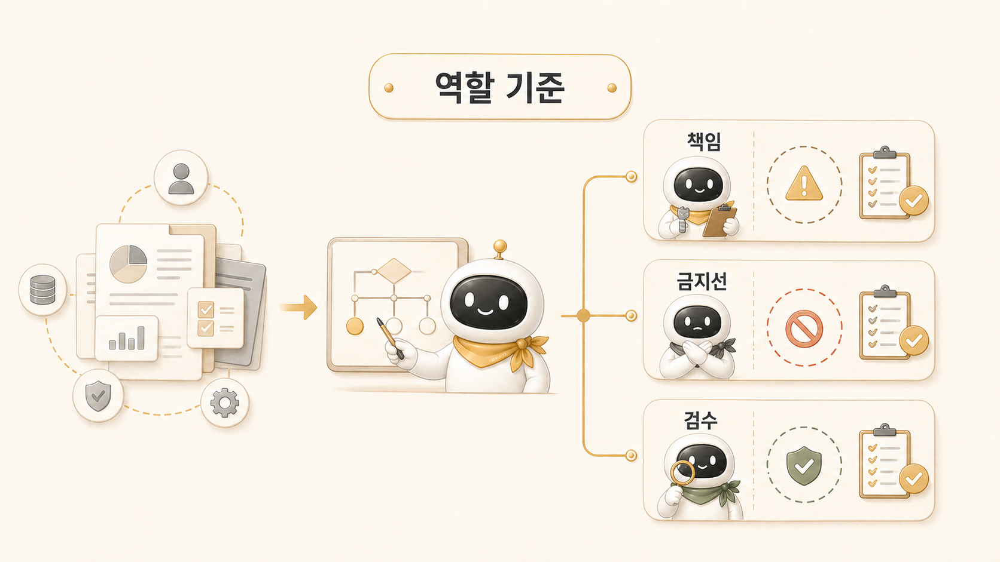

## 역할형 에이전트는 어떤 기준으로 나눌까



역할형 에이전트는 기능 이름보다 실패 패턴으로 나누는 편이 안전하다. “조사도 하고 정리도 하고 실행도 하는 AI”는 처음에는 편해 보이지만, 결과가 약할 때 어디서 무너졌는지 찾기 어렵다.

[Hermes Agent](https://wikidocs.net/346055) 업무 자동화에서 역할을 나누는 이유는 에이전트 수를 늘리기 위해서가 아니다. [AI 개인비서 메인 창구](https://wikidocs.net/345891)가 사용자의 요청을 받고, 조사형/정리형/실행형 에이전트가 각자의 책임 구간을 맡으면 결과의 품질을 더 정확히 점검할 수 있다.

## 역할을 나누는 첫 번째 기준: 실패 패턴

좋은 역할 분리는 “누가 무엇을 잘하는가”보다 “누가 어디서 자주 실패하는가”를 먼저 본다.

| 역할 | 잘하는 일 | 흔한 실패 | 필요한 기준 |
|---|---|---|---|
| 조사형 | 근거 수집, 비교, 누락 탐색 | 근거보다 결론을 먼저 말함 | 사실/해석/미확인 분리 |
| 정리형 | 문서 구조화, 메시지 정리, 가독성 개선 | 재료 없이 그럴듯한 글을 씀 | 원자료/독자/목적 확인 |
| 실행형 | 파일 수정, 명령 실행, 검증 | 범위가 흐리면 과하게 실행 | 변경 범위/되돌림/검증 기준 |
| 이미지형 | 메시지 시각화, 본문 이미지 제작 | 예쁘지만 메시지와 어긋남 | 핵심 문장/텍스트 QA/삽입 위치 |
| 메인 창구 | 요청 해석, 분배, 최종 통합 | 모든 일을 쥐고 병목이 됨 | 직접 처리/위임/통합 기준 |

이 표가 있으면 에이전트 이름을 몰라도 운영할 수 있다. 방울이, 뽀동이, 봉구, 하망이는 이 기준을 실제로 부르기 쉽게 만든 운영 이름일 뿐이다.

## 실제 운영 예시: WikiDocs 보강 요청

로이드가 “전체 독자 흐름 최종 검수”, “본문 내부 링크 보강”, “블로그와 공식 docs가 잘 옮겨졌는지 확인”, “내용을 더 풍부하게 채우기”를 한 번에 요청했다고 하자. 이 요청을 한 역할로 처리하면 작업이 겹친다.

역할을 나누면 흐름이 이렇게 바뀐다.

```text
하비가 요청을 해석한다
→ 방울이가 원문/공식 docs/기존 운영 기록을 확인한다
→ 뽀동이가 독자 흐름과 문장 구조로 다시 쓴다
→ 실행형이 파일 수정, 링크 검증, 커밋/push를 처리한다
→ 하비가 최종 결과와 남은 일을 통합 보고한다
```

이 흐름에서 방울이는 최종 문장을 책임지지 않는다. 뽀동이는 없는 근거를 만들어내지 않는다. 실행형은 독자 흐름을 임의로 바꾸지 않는다. 하비는 모든 결과를 묶되, 각 역할의 검증 기준을 지운 채로 통합하지 않는다.

## 역할 분리의 운영 기준

역할을 나눌 때는 아래 순서로 판단한다.

1. 결과가 틀렸을 때 무엇을 다시 봐야 하는가?
2. 그 재검토를 가장 잘하는 역할은 누구인가?
3. 역할 간 넘겨줄 산출물은 무엇인가?
4. 최종 통합자는 누구인가?
5. 민감정보 제거와 공개 기준 검수는 어디서 하는가?

이 기준이 없으면 역할 분리는 금방 “누가 답할지 모르는 멀티봇 스레드”가 된다. 그래서 팀 규칙에서는 기본 흐름을 하비 경유로 두고, 필요한 때만 방울이/뽀동이/하망이/실행형으로 넘긴다.

## 좋은 handoff와 나쁜 handoff

역할형 에이전트 운영의 핵심은 handoff다. handoff가 약하면 다음 역할은 이전 역할의 의도를 다시 추측해야 한다.

| handoff | 문제 | 좋은 형태 |
|---|---|---|
| “이거 조사했어, 써줘” | 근거와 미확인이 섞임 | 출처/핵심 발견/미확인/추천 구조를 분리 |
| “이거 예쁘게 정리해줘” | 독자와 목적이 없음 | 독자/목표/톤/금지 표현/다음 링크를 지정 |
| “파일 고쳐줘” | 변경 범위가 없음 | 수정 대상/검증 기준/되돌림 가능성을 명시 |
| “이미지 만들어줘” | 메시지가 없음 | 페이지 핵심 문장/텍스트/삽입 위치를 전달 |

우리 운영에서는 방울이가 조사 결과를 사실/근거/미확인/다음 확인 포인트로 넘기고, 뽀동이는 이를 독자 흐름에 맞게 구조화한다. 이 handoff가 선명해야 [정리형 에이전트](https://wikidocs.net/345896)가 강해진다.

## 공식 기능과 운영 기준은 다르다

Hermes Agent에는 delegation이나 parallel work처럼 여러 작업을 나눠 처리하는 기능이 있다. 하지만 공식 기능이 있다고 해서 곧바로 좋은 역할 분리가 되는 것은 아니다. 기능은 “나눌 수 있다”를 제공하고, 운영 기준은 “무엇을 왜 나눌지”를 정한다.

그래서 3장에서 말하는 역할 분리는 기능 설명이 아니라 운영 판단이다. 조사형은 근거를 모으고, 정리형은 읽히는 구조를 만들고, 실행형은 변경과 검증을 분리한다. 이 구분이 있어야 5장의 [외부 도구/MCP/자동화 운영](https://wikidocs.net/345907)으로 넘어가도 자동화가 흐트러지지 않는다.

## 운영 체크리스트

역할형 에이전트를 나누기 전 아래를 확인한다.

- 이 일은 조사/정리/실행/시각화/통합 중 어디에 가까운가?
- 결과물이 다음 역할에게 바로 넘어갈 수 있는 형태인가?
- 결론, 근거, 미확인, 제안을 구분했는가?
- 공개 글이라면 민감정보와 독자가 몰라도 되는 내부 디테일을 제거했는가?
- 최종 통합자가 품질 기준과 검증 결과를 확인했는가?

## FAQ

### 역할형 에이전트는 몇 개가 적당한가요?

처음부터 많이 만들 필요는 없다. 메인 창구 1개와 조사형/정리형/실행형 정도면 시작할 수 있다. 이미지나 제품 문서처럼 반복되는 일이 생기면 그때 이미지형/제품형을 분리한다.

### 역할을 나누면 속도가 느려지지 않나요?

초기에는 느려 보일 수 있다. 하지만 재작업이 줄어든다. 특히 공개 문서, GitHub 반영, WikiDocs 발행처럼 검증이 필요한 작업에서는 역할 분리가 오히려 전체 시간을 줄인다.

### 에이전트 이름이 꼭 필요할까요?

필수는 아니다. 다만 반복 운영에서는 이름이 있으면 호출과 책임이 쉬워진다. “방울이 시켜서 확장조사”, “뽀동이가 구조 정리”처럼 부르면 역할이 바로 보인다.

## 다음 글

- 다음은 [조사형 에이전트는 어디서 강하고 어디서 흔들릴까](https://wikidocs.net/345895)에서 방울이 같은 조사형의 강점과 위험을 본다.
- 역할 분리가 실제 케이스로 어떻게 이어지는지는 [방울이 확장조사와 뽀동이 글쓰기는 어떻게 이어질까](https://wikidocs.net/345993)에서 다시 확인할 수 있다.
