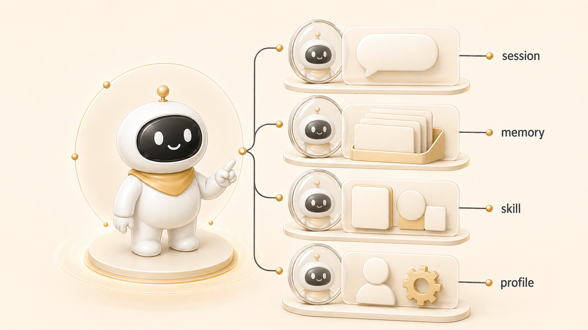

## 같은 AI 개인비서인데 기억은 왜 다르게 느껴질까

같은 AI 개인비서라도 대화마다 다르게 느껴질 수 있다. 이유는 하나의 “기억”이 있는 것이 아니라 [session](https://wikidocs.net/346055), memory, profile, shared-memory, Obsidian 같은 여러 층이 함께 작동하기 때문이다.

우리가 Hermes Agent를 운영하면서 배운 핵심은 기억을 많이 넣는 것이 아니라, 기억의 자리를 정확히 나누는 것이다. 모든 것을 memory에 넣으면 다음 대화에 많이 주입될 것 같지만, 실제로는 중요한 규칙과 임시 작업 기록이 섞여 더 헷갈린다.

## 기억은 하나가 아니라 층이다

| 층 | 담는 것 | 넣으면 안 되는 것 |
|---|---|---|
| session | 지금 대화의 요청, 작업 범위, 최근 결정 | 다음 달에도 필요한 장기 규칙 |
| memory | 오래 유지될 선호, 반복 교정, 안정적 사실 | 일일 로그, 작업 진행 내역, 긴 초안 |
| profile | 에이전트 역할, 도구, 말투, 권한 경계 | 다른 에이전트의 임시 업무 상태 |
| shared-memory | 팀 공통 규칙, handoff, 공용 작업 원본 | 개인 취향의 장황한 기록 |
| Obsidian/HALOX Brain | 누적 지식, 모니터링 원장, 연결형 위키 | 짧은 시스템 규칙 전체 |

이 구분은 [Hermes Agent 주요 개념과 기능](https://wikidocs.net/346055)의 핵심이다. memory는 똑똑해지는 저장소가 아니라, 다음 세션에 반드시 주입되어야 할 작은 규칙 저장소에 가깝다.

## 실제 운영 장면: 뽀동이 보고 방식이 길어졌을 때

한 번은 뽀동이의 Slack 보고가 너무 장황하다는 피드백이 있었다. 이 피드백은 단순히 “이번 답변을 짧게 해라”가 아니었다. 앞으로 반복될 선호였기 때문에 memory와 프로필 운영 문서에 남겨야 했다.

반대로 “이번 WikiDocs 3장 커밋이 어디까지 됐는가” 같은 내용은 memory에 넣으면 안 된다. 그것은 세션 기록이나 GitHub 로그에서 확인할 일이다. 실제 운영에서는 이 둘을 구분하지 못할 때 “왜 기억을 못 하지?”라는 착각이 생긴다.

## 왜 같은 하비가 다르게 느껴지는가

| 상황 | 사용자가 느끼는 문제 | 실제 원인 |
|---|---|---|
| 다른 profile에서 대화함 | 같은 하비인데 도구가 다름 | profile별 권한/설정 차이 |
| 긴 대화가 압축됨 | 앞부분 합의가 약해짐 | session context가 줄어듦 |
| 작업 로그를 memory에 안 넣음 | 지난 작업을 모르는 듯함 | session_search나 GitHub 로그로 찾아야 함 |
| Obsidian과 shared-memory가 충돌함 | 어느 문서가 맞는지 애매함 | source of truth 순서 미정 |

## 운영 기준

- 반복될 선호와 역할 규칙만 memory에 남긴다.
- 작업 진행 상황은 memory보다 세션 기록, GitHub 로그, shared-memory handoff에서 찾는다.
- profile은 에이전트 정체성과 도구 경계를 나누는 단위로 본다.
- HaloX 질문은 memory만 보고 답하지 않고 Obsidian/HALOX Brain과 shared-memory를 함께 확인한다.
- 공개 글에는 실제 경로, 계정, 토큰, 내부 채널 ID 같은 독자가 몰라도 되는 값을 넣지 않는다.

## FAQ

### memory에 많이 넣으면 더 잘 기억하지 않나요?

아니다. memory는 압축된 장기 규칙에 가깝다. 많이 넣을수록 임시 로그와 핵심 규칙이 섞여 다음 판단을 흐릴 수 있다.

### session_search와 memory는 어떻게 다른가요?

memory는 항상 주입되는 안정적 사실이고, session_search는 과거 대화에서 필요한 작업 맥락을 찾아오는 회수 도구다. WikiDocs 보강처럼 이전 세션 흐름이 필요할 때는 memory보다 session_search가 맞다.

### profile을 나누면 기억도 나뉘나요?

운영상 그렇게 느껴질 수 있다. profile은 도구, 말투, 역할, 설정이 다르기 때문에 같은 요청도 다르게 처리한다. 그래서 [역할형 에이전트](https://wikidocs.net/345925)를 운영할 때 profile 경계가 중요하다.

## 다음 글

다음은 [파일은 있는데 도구는 왜 못 읽을까](https://wikidocs.net/345900)에서 기억 문제가 아니라 경로/권한/동기화 문제를 어떻게 구분하는지 본다.
