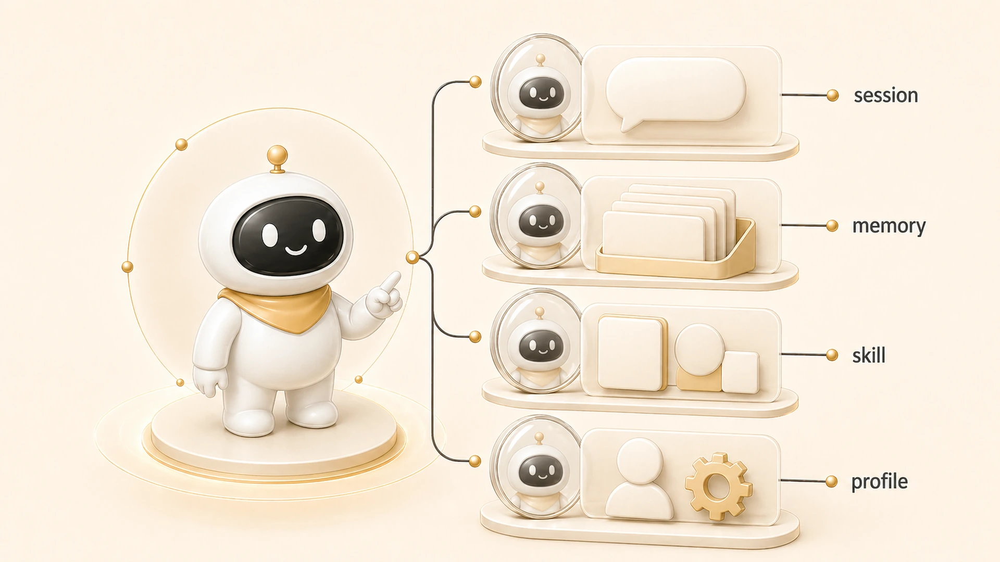

## AI 개인비서는 무엇을 기억해야 할까

AI 개인비서가 기억해야 할 것은 모든 대화가 아니다. 앞 장의 [AI 개인비서 메인 창구](https://wikidocs.net/345891)가 요청의 입구를 다룬다면, 이 글은 그 입구가 무엇을 장기 기준으로 남겨야 하는지 다룬다. 오래 쓰는 AI 개인비서일수록 “많이 기억하는가”보다 “다시 판단할 기준만 남겼는가”가 중요하다.



에르메스 에이전트(Hermes Agent)에서 하비가 강해지는 지점도 여기에 있다. 하비는 요청을 처리하는 창구이면서, 새 정보가 들어왔을 때 그것을 memory로 남길지, 현재 session에서만 다룰지, shared-memory나 Obsidian 같은 다른 층으로 보낼지 판단한다. 이 역할은 뒤에서 다루는 [하비 기억 오케스트레이터](https://wikidocs.net/346133)와 이어진다.

## 모든 것을 기억하려고 하면 왜 망가질까

AI 운영에서 가장 흔한 착각은 중요한 것을 모두 memory에 넣으면 된다는 생각이다. 하지만 memory는 항상 주입되는 짧은 장기 기준에 가깝다. 여기에 일일 로그, 긴 조사 원문, 프로젝트 진행 상황, 임시 결정까지 넣으면 다음 대화에서 오히려 판단이 흐려진다.

| 정보 | 잘못 넣는 곳 | 더 맞는 위치 |
|---|---|---|
| 매번 지켜야 할 말투 선호 | 긴 문서/Slack 로그 | memory / USER.md |
| 오늘 작업한 파일 목록 | memory | session / GitHub log |
| 팀 전체가 따라야 할 운영 규칙 | 개인 memory | shared-memory |
| 누적 조사와 모니터링 원장 | memory | Obsidian LLM Wiki |
| 반복 실행 절차 | 대화 기록 | Skill / 체크리스트 |
| 오래된 작업 회상 | 항상 주입 | session_search |

## 기억할 가치가 있는 정보의 기준

AI 개인비서가 기억해야 할 정보는 다음 조건을 만족해야 한다.

1. 앞으로도 반복해서 적용된다.
2. 사용자가 다시 말하지 않으면 품질이 떨어진다.
3. 짧게 압축해도 의미가 유지된다.
4. 특정 날짜의 작업 상태가 아니라 판단 기준이다.
5. 여러 에이전트가 따라야 하면 shared-memory로 승격할 수 있다.

이 기준을 통과하지 못하면 memory가 아니라 session, shared-memory, Obsidian, GitHub log, Skill, WikiDocs 중 다른 층을 봐야 한다.

## 운영 예시: 피드백을 memory로 승격하는 기준

보고 방식 피드백은 좋은 예다. “이번 답변만 짧게 해줘”는 session에 가깝지만, “앞으로 보고는 완료/남음/다음 중심으로 짧게 해줘”는 반복 선호다. 이 차이를 구분하지 못하면 AI 개인비서는 같은 지적을 계속 듣는다.

```text
입력: 보고가 너무 장황하다
판단: 반복될 문체/보고 선호인가?
결과: 예 → memory 또는 USER.md에 짧게 저장
주의: 이번 작업의 진행 상황까지 함께 저장하지 않는다
```

| 상황 | 저장 위치 | 이유 |
|---|---|---|
| 앞으로 보고를 짧게 하라는 선호 | memory / USER.md | 다음 세션에도 반복 적용된다 |
| 방금 수정한 파일 목록 | session / GitHub log | 현재 작업 상태일 뿐이다 |
| 팀 전체의 보고 템플릿 | shared-memory | 여러 에이전트가 함께 따라야 한다 |
| 공유 글의 문체 기준 | Skill / 작성 가이드 | 반복 작업 절차로 재사용된다 |

## memory가 길어질 때의 정리 기준

memory는 무한한 창고가 아니다. 그래서 “좋은 내용이니까 저장”이 아니라 “짧게 압축해도 계속 쓸 기준인가”를 먼저 본다.

| memory에 남길 문장 | 남기면 안 되는 문장 |
|---|---|
| 사용자는 Slack 보고를 완료/남음/다음 중심으로 짧게 선호한다 | 오늘 4장 OpenViking 문단을 수정했다 |
| WikiDocs 글은 SEO/GEO와 전자책 구조를 함께 본다 | 방금 읽은 세션 검색 결과 전문 |
| 조회 우선순위는 원본 지식층 → 공용 규칙 → 개인 memory 순서다 | 이번 작업에서 확인한 파일 목록 전체 |

긴 피드백은 그대로 저장하지 않는다. 반복될 기준만 뽑아 짧은 문장으로 남기고, 작업 상태는 session이나 GitHub log에서 확인한다.

## 자주 헷갈리는 질문

### memory에 많이 넣으면 더 개인화되지 않나요?

일시적으로는 그렇게 느껴질 수 있다. 하지만 memory가 길어질수록 핵심 선호와 임시 기록이 섞인다. 개인화는 장기 기준을 짧게 유지하고, 필요한 작업 맥락은 session_search나 Obsidian에서 회수할 때 더 안정적이다.

### 작업 진행 상황은 어디에 남겨야 하나요?

현재 대화에서는 session과 todo가 맞다. 완료된 변경은 GitHub log나 WikiDocs 원본에서 확인한다. 팀이 이어받아야 하는 상태는 shared-memory handoff에 남긴다.
