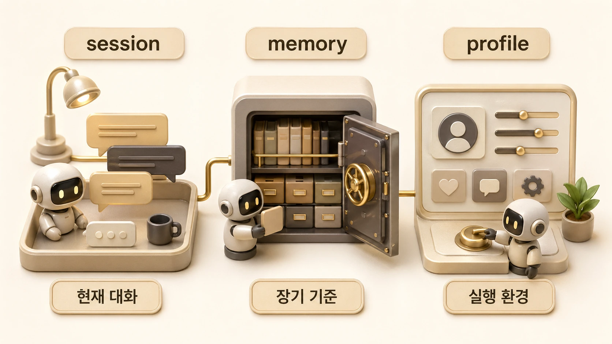

## session/memory/profile은 어떻게 다를까

AI 개인비서가 다르게 느껴지는 가장 큰 이유는 session, memory, profile이 서로 다른 층이기 때문이다. 이 구분은 앞 글인 [AI 개인비서는 무엇을 기억해야 할까](https://wikidocs.net/346125)의 기준을 실제 운영 단위로 나누는 작업이다. 같은 모델을 쓰더라도 현재 대화 맥락, 장기 기억, 실행 프로필이 다르면 결과는 달라진다.



이 차이를 이해하지 못하면 “왜 기억을 못 하지?”라는 질문이 반복된다. 실제로는 기억 문제가 아니라 현재 session이 바뀌었거나, profile의 도구 권한이 다르거나, memory에 넣지 말아야 할 작업 로그를 기대하고 있는 경우가 많다. 그래서 다음 단계에서는 [AGENTS.md와 USER.md](https://wikidocs.net/346127)가 어떤 기억을 고정하는지 봐야 한다.

## 세 층의 역할

| 층 | 맡는 것 | 대표 예시 |
|---|---|---|
| session | 지금 대화의 요청, 범위, 임시 결정 | 이번 장을 어디까지 고칠지, 지금 받은 피드백 |
| memory | 오래 유지될 선호와 안정적 기준 | 사용자는 짧은 Slack 보고를 선호함 |
| profile | 에이전트 역할, 도구, 권한, 말투 | 하비/방울이/뽀동이의 역할과 사용 가능한 도구 |

session은 현재 대화를 이어가기 위한 작업대다. memory는 다음 대화에도 반복될 작은 기준이다. profile은 누가 어떤 성격과 도구로 실행하는지 정하는 단위다.

## 실제 운영 장면: 같은 하비가 다르게 느껴질 때

하비는 메인 창구지만, 하비가 모든 것을 한 덩어리로 기억하는 것은 아니다. 하비 profile에는 하비의 역할, 도구, 보고 방식, 라우팅 기준이 붙는다. 반면 뽀동이 profile에는 글쓰기와 문서화 기준이 더 강하게 붙는다.

그래서 같은 사용자의 요청도 어느 profile에서 처리하느냐에 따라 우선 보는 문서와 실행 도구가 달라질 수 있다. 이것은 오류라기보다 역할형 에이전트 운영의 기본 구조다. 문제는 이 차이를 모른 채 “같은 AI인데 왜 다르지?”라고 느끼는 순간 생긴다.

## 파일은 있는데 도구가 못 읽는 문제도 여기서 생긴다

profile은 말투만 나누는 것이 아니다. HOME, 권한, token, 연결된 도구, 기본 작업 경로도 달라질 수 있다. 사람이 Finder나 Obsidian에서 파일을 봤다고 해서 모든 profile의 도구가 그 파일을 읽을 수 있는 것은 아니다.

특히 Obsidian/iCloud/GitHub repo/shared-memory가 섞이면 경로와 권한 문제가 자주 생긴다. 이때는 “파일이 있나”보다 “현재 profile의 도구가 그 경로를 볼 수 있나”를 먼저 확인해야 한다.

## 세 층을 헷갈리지 않는 기준

1. 현재 대화에서만 필요한 내용은 session에 둔다.
2. 반복될 선호와 안정적 기준만 memory에 남긴다.
3. 에이전트 역할, 말투, 도구 경계는 profile/AGENTS.md/SOUL.md로 본다.
4. profile이 다르면 같은 파일도 접근 가능성이 달라질 수 있다.
5. 작업 로그는 memory가 아니라 session_search, GitHub log, shared-memory handoff로 회수한다.
6. source of truth가 따로 있으면 memory보다 원본을 먼저 본다.

## Before/After: 기억층을 섞었을 때

같은 요청도 어디에 남기느냐에 따라 다음 결과가 달라진다. 문제는 기억이 없는 것이 아니라, 임시 상태와 장기 기준이 같은 곳에 들어가는 것이다.

| 구분 | 잘못된 운영 | 더 나은 운영 |
|---|---|---|
| 작업 진행 | memory에 “4장 수정 중”을 저장 | session/todo/GitHub log에서 확인 |
| 말투 선호 | 대화 끝나면 사라짐 | memory/USER.md에 짧게 저장 |
| 에이전트 역할 | 매번 프롬프트로 설명 | profile/AGENTS.md에 고정 |
| 팀 공통 기준 | 개인 memory에만 저장 | shared-memory로 승격 |

```text
session = 지금 이어지는 대화의 작업대
memory = 다음에도 반복 적용할 짧은 기준
profile = 에이전트가 어떤 주체로 행동할지 정하는 역할 기억
```

## profile 경계가 기억 품질에 영향을 주는 이유

같은 사람이 같은 요청을 해도 하비에서 볼 때와 뽀동이에서 볼 때 결과가 달라질 수 있다. 이것은 모델의 변덕이 아니라 profile이 다르기 때문이다. profile은 역할뿐 아니라 HOME, 기본 경로, 연결된 도구, 인증 범위, 로드되는 AGENTS.md/SOUL.md까지 바꾼다.

우리 운영에서도 이 차이가 중요했다. GitHub repo는 특정 macOS 사용자 HOME의 credential을 봐야 push가 되고, Obsidian HALOX Brain은 iCloud 경로에 있으며, shared-memory는 여러 에이전트가 공통으로 보는 원본이다. 따라서 “기억에 있다/없다”만 볼 것이 아니라 “현재 profile이 그 기억층에 접근할 수 있는가”를 함께 봐야 한다.

| 질문 | 확인할 층 |
|---|---|
| 지금 대화에서 이미 합의한 내용인가 | session / compaction summary |
| 다음 세션에도 반복될 선호인가 | memory / USER.md |
| 이 에이전트의 역할과 도구 경계인가 | profile / AGENTS.md / SOUL.md |
| 팀 전체의 source of truth인가 | shared-memory |
| 누적 지식이나 운영 원장인가 | Obsidian HALOX Brain |
| 과거 작업을 회수해야 하는가 | session_search / GitHub log |

## Memory.md가 길어질 때의 분리 기준

초기에는 모든 것을 `memory.md`나 한 파일에 넣고 싶어진다. 하지만 실제 운영에서는 기억 파일이 길어질수록 에이전트가 더 똑똑해지기보다, 무엇이 현재 기준이고 무엇이 과거 로그인지 구분하기 어려워진다.

| 정보 종류 | 둘 곳 | 이유 |
|---|---|---|
| 사용자의 오래가는 선호 | memory/user profile | 매번 반복해서 적용해야 한다 |
| 현재 작업 진행 상황 | session/todo/GitHub log | 끝나면 사라지거나 바뀐다 |
| 팀 전체 규칙 | shared-memory/AGENTS.md | 여러 에이전트가 같은 기준을 봐야 한다 |
| 긴 자료/외부 지식 | Obsidian/Notion/RAG | 본문 전체를 매번 prompt에 넣지 않는다 |
| 반복 절차 | Skill | 실행 순서와 검증 방법이 중요하다 |

좋은 기억 시스템은 많이 저장하는 시스템이 아니라, 다시 찾을 위치가 분명한 시스템이다. “나중에도 같은 방식으로 적용될 사실인가”가 아니면 memory에 넣기보다 세션 기록이나 문서 저장소로 보내는 편이 낫다.

## 자주 헷갈리는 질문

### session이 길어지면 memory가 되나요?

아니다. 긴 대화가 자동으로 장기 기억이 되지는 않는다. 장기적으로 반복될 기준만 memory로 승격해야 한다.

### profile을 나누면 기억도 나뉘나요?

운영상 그렇게 느껴질 수 있다. profile마다 역할과 도구가 다르기 때문이다. 공통 규칙이 필요하면 개인 profile에 복붙하지 말고 shared-memory에 둬야 한다.

### 파일 접근 실패는 기억 문제인가요?

항상 그렇지는 않다. 경로, 권한, 동기화, profile HOME, tool sandbox 문제일 수 있다. 그래서 memory 문제로 보기 전에 실행 환경을 확인해야 한다.
