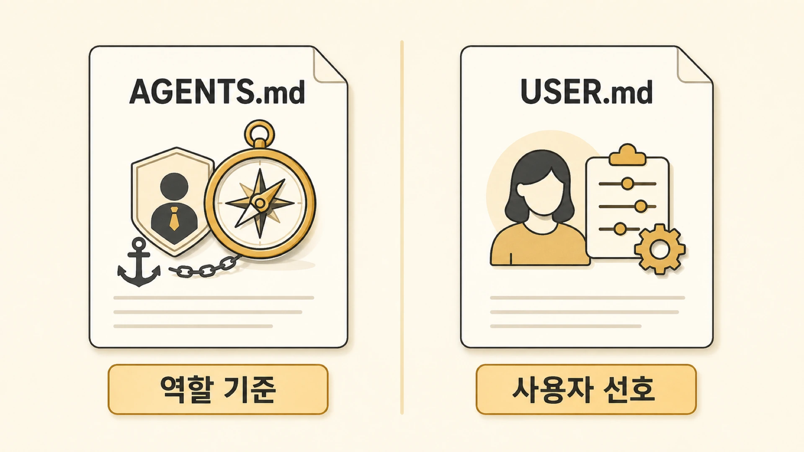

## AGENTS.md와 USER.md는 기억에서 어떤 역할을 할까

AI 에이전트의 기억은 사용자 선호만으로 만들어지지 않는다. [session/memory/profile 경계](https://wikidocs.net/346126)가 내부 기억층을 나눈다면, 이 글은 문서가 그 기억층을 어떻게 고정하는지 설명한다. 누가 어떤 역할을 맡는지, 어떤 톤으로 말하는지, 어떤 도구를 쓸 수 있는지도 기억의 일부다. Hermes Agent에서는 이 역할을 AGENTS.md, SOUL.md, USER.md, profile이 나눠 맡는다.



이 구분이 없으면 에이전트가 “사용자를 기억하는 것”과 “자기 역할을 아는 것”이 섞인다. 하비가 해야 할 판단을 뽀동이가 하거나, 뽀동이가 지켜야 할 글쓰기 기준이 하비의 라우팅 규칙 속에 묻히는 식이다. 개인 역할이 정리된 뒤에는 팀 전체가 함께 보는 [shared-memory](https://wikidocs.net/346128)가 필요해진다.

## 역할 기억과 사용자 기억은 다르다

| 문서/층 | 주로 담는 것 | 예시 |
|---|---|---|
| SOUL.md | 에이전트의 정체성, 미션, 성격 | 뽀동이는 콘텐츠 품질을 책임지는 햄스터 |
| AGENTS.md | 운영 매뉴얼, 작업 원칙, 도구 사용 규칙 | WikiDocs 작업 전 검증 기준을 따른다 |
| USER.md | 사용자 선호, 반복 교정, 협업 방식 | 사용자는 Slack 보고를 짧게 선호한다 |
| profile | 실행 환경, 도구 노출, 권한 경계 | 하비와 뽀동이가 가진 도구/역할 차이 |
| memory | 항상 주입할 압축된 장기 기준 | source of truth 우선순위 |

SOUL.md는 “누구인가”에 가깝고, AGENTS.md는 “어떻게 일하는가”에 가깝다. USER.md는 “사용자가 무엇을 선호하는가”를 담는다. SOUL.md를 실제로 어떻게 작성하고 테스트할지는 [SOUL.md로 AI 에이전트 성격은 어떻게 정의할까](https://wikidocs.net/346292)에서 더 자세히 다룬다.

## 뽀동이의 톤이 약해졌을 때

OpenClaw에서 Hermes로 넘어오며 뽀동이의 SOUL은 남아 있었지만, 예전보다 기능형 문서화 에이전트처럼 보이는 상태가 있었다. 파일이 없어진 것은 아니었다. 다만 책과 콘텐츠의 구조와 품질을 책임지는 정체성이 약해져 있었다.

이 문제는 USER.md에 넣을 일이 아니었다. 사용자의 선호가 아니라 에이전트 정체성과 역할 기억의 문제였기 때문이다. 그래서 SOUL.md와 AGENTS.md의 역할을 나눠 보고, 정체성은 SOUL.md에, 운영 방식은 AGENTS.md에 정리하는 것이 맞았다.

## USER.md에 넣을 것과 넣지 않을 것

USER.md에는 사용자가 반복해서 원하는 방식이 들어간다. 예를 들어 사용자가 역할과 개성이 분리된 에이전트 운영을 선호한다거나, 뽀동이 보고가 짧고 핵심 위주이길 원한다는 내용은 USER.md나 memory에 남길 가치가 있다.

하지만 “오늘 4장 파일을 어디까지 고쳤다” 같은 내용은 USER.md에 넣지 않는다. 그것은 사용자의 장기 선호가 아니라 작업 상태다. 작업 상태는 session, todo, GitHub log, shared-memory handoff가 맡아야 한다.

## 역할 문서와 사용자 문서를 나누는 기준

1. 에이전트 정체성은 SOUL.md에 둔다.
2. 작업 방식과 검증 규칙은 AGENTS.md에 둔다.
3. 사용자 선호와 반복 교정은 USER.md/memory에 둔다.
4. 임시 작업 상태는 USER.md에 넣지 않는다.
5. 여러 에이전트가 함께 따라야 하는 규칙은 shared-memory로 승격한다.
6. profile별 문서에 공통 규칙을 복붙하지 말고 source of truth를 둔다.

## 문서 예시

역할 문서와 사용자 문서를 나누면 “누가 어떻게 일해야 하는가”와 “사용자가 무엇을 선호하는가”가 섞이지 않는다. 실제 파일명이나 내부 경로를 그대로 옮기기보다, 아래처럼 개념 구조로 설명하는 편이 안전하다.

```md
에이전트 역할 문서 예시
- 역할: 정리형 에이전트
- 강점: 문서화 / 구조화 / 발행 전 품질 점검
- 먼저 확인할 것: 원본 자료 / 읽는 사람 / 공유 범위
- 하지 말 것: 근거 없는 내용 추가 / 불필요한 세부값 노출

사용자 선호 문서 예시
- 보고는 짧게 한다
- 공유할 글은 자연스러운 한국어를 우선한다
- 내부 이름은 역할 설명 뒤에 사례로 쓴다
```

이렇게 나누면 에이전트가 바뀌어도 사용자 선호는 유지되고, 같은 사용자를 상대해도 에이전트별 역할은 다르게 작동한다.

## AGENTS.md / USER.md / memory가 정착한 방식

운영 초기에 가장 헷갈렸던 부분은 “어디까지가 사용자 기억이고, 어디부터가 에이전트 운영 규칙인가”였다. 사용자 선호를 AGENTS.md에 넣으면 다른 사용자나 다른 상황에서도 과하게 적용될 수 있고, 에이전트 역할 규칙을 USER.md에 넣으면 역할형 에이전트의 개성이 흐려진다.

그래서 지금은 세 층을 이렇게 나눈다.

| 층 | 맡는 질문 | 실제 운영 예 |
|---|---|---|
| USER.md / user memory | 사용자가 반복해서 원하는 방식은 무엇인가 | 사용자는 뽀동이 보고를 짧고 핵심 위주로 선호한다 |
| AGENTS.md | 이 에이전트는 어떤 기준으로 일해야 하나 | WikiDocs 작업 전 관련 skill을 로드하고 검증 후 커밋/푸시한다 |
| SOUL.md | 이 에이전트는 어떤 정체성과 톤을 갖나 | 뽀동이는 콘텐츠 퀄리티를 책임지는 햄스터다 |
| profile config | 어떤 도구와 실행 환경을 갖나 | 하비/뽀동이/방울이는 서로 다른 역할과 도구 구성을 가진다 |
| persistent memory | 매 세션 짧게 주입될 핵심 사실은 무엇인가 | source of truth 우선순위, 장기 선호, 안정적 판단 기준 |

## 관리 원칙 예시

```text
사용자가 선호를 말한다
  ↓
반복 선호면 USER.md / memory
이번 작업 지시면 session
팀 전체 규칙이면 shared-memory
에이전트 정체성 문제면 SOUL.md
작업 절차가 반복되면 skill
```

이 구분 덕분에 “하비는 메인 창구”, “방울이는 조사형”, “뽀동이는 정리형”, “하망이는 이미지 제작형” 같은 역할이 유지된다. 동시에 사용자의 보고 선호나 WikiDocs 문체 기준처럼 사용자별로 반복되는 기준은 따로 유지된다.

## 자주 헷갈리는 질문

### AGENTS.md와 memory는 무엇이 다른가요?

AGENTS.md는 에이전트가 어떻게 일할지 설명하는 운영 문서다. memory는 항상 주입되는 압축된 장기 기준이다. AGENTS.md가 길고 구조적인 매뉴얼이라면, memory는 꼭 필요한 핵심만 담는 짧은 기억이다.

### USER.md에 모든 사용자 정보를 넣으면 안 되나요?

안 된다. USER.md는 사용자 선호와 반복 교정을 담는 곳이다. 프로젝트 로그나 임시 요청을 넣으면 다음 판단이 흐려진다.
