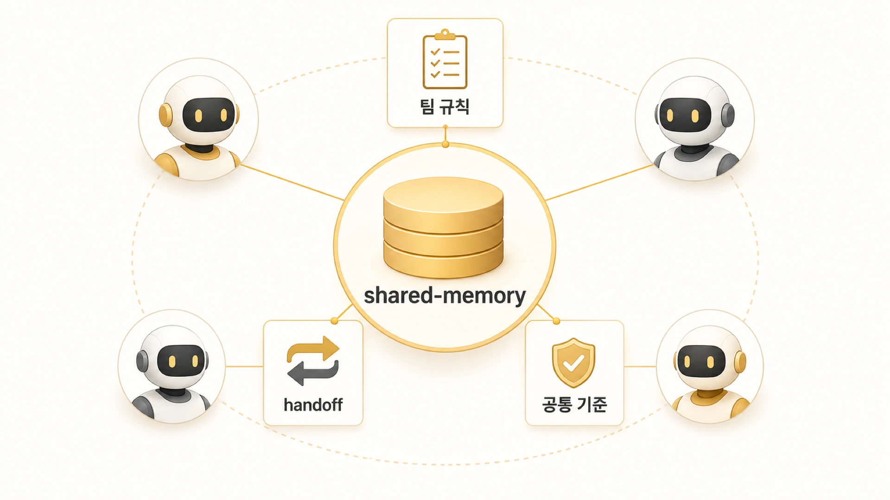

## shared-memory는 팀 공통 기억으로 어떻게 써야 할까

Hermes Agent에서 역할형 AI 팀을 운영하면 개인 에이전트 memory만으로는 부족하다. [AGENTS.md와 USER.md](https://wikidocs.net/346127)가 개인 역할과 사용자 선호를 나눈다면, shared-memory는 팀 전체가 함께 보는 기준을 맡는다. 하비/방울이/뽀동이/봉구/비벙이/하망이가 같은 기준을 봐야 하는 순간이 생긴다. 이때 필요한 층이 shared-memory다.



shared-memory는 단순 폴더가 아니다. 팀 공통 규칙, source of truth, handoff, 인덱스, 콘텐츠 패키지, 체크리스트를 담는 공용 기억층이다. 개인 에이전트가 각자 기억하면 어긋날 내용을 한곳에 두는 장치다. 더 오래 누적되는 지식은 [Obsidian LLM Wiki](https://wikidocs.net/346129)로 넘겨 외부 장기 기억으로 관리한다.

## 왜 개인 memory만으로는 부족할까

개인 memory는 해당 에이전트가 반복해서 따라야 할 짧은 기준에 적합하다. 하지만 팀 전체가 공유해야 하는 규칙을 각 profile memory에 복사하면 곧 문제가 생긴다.

| 상황 | 개인 memory에 두면 생기는 문제 | shared-memory에 두는 이유 |
|---|---|---|
| 팀 공통 라우팅 규칙 | 에이전트마다 버전이 달라짐 | 하나의 원본을 함께 봄 |
| 콘텐츠 패키지 상태 | 누가 최신인지 모름 | 작업 원본과 handoff가 연결됨 |
| 조사 결과 인계 | 대화 안에서 사라짐 | 방울이에서 뽀동이로 이어짐 |
| 디자인 시스템 기준 | 결과물마다 톤이 달라짐 | 하망이/뽀동이가 같은 기준을 봄 |
| 운영 체크리스트 | 실수 교정이 반복되지 않음 | 재사용 가능한 기준으로 남음 |

## HaloX 기록이 세 층으로 나뉘는 이유

HaloX 운영에서는 memory, shared-memory, HALOX Brain을 나눠 쓴다. memory는 장기 규칙과 선호, shared-memory는 공용 작업 원본과 handoff, HALOX Brain은 누적 지식과 운영 원장을 맡는다.

예를 들어 방울이가 조사한 내용이 콘텐츠 후보가 되면, 원장은 Obsidian에 남기고 후속 작업 패키지는 shared-memory로 이어진다. 사용자가 “넘겨”라고 판단하면 뽀동이, 하비, 하망이가 그 패키지를 보고 이어받을 수 있어야 한다.

## shared-memory에 둘 것

1. 팀 전체 공통 규칙
2. source of truth 문서와 인덱스
3. 역할형 에이전트 간 handoff
4. 콘텐츠 패키지와 작업 원본
5. 반복되는 운영 체크리스트
6. 디자인/이미지/문서화 기준
7. 프로젝트 공용 상태와 다음 액션

반대로 개인의 말투 선호나 특정 에이전트의 장기 성격은 profile memory나 SOUL.md가 더 맞다. 모든 것을 shared-memory에 넣으면 공용 원본이 아니라 잡동사니 폴더가 된다.

## shared-memory에 남길 때의 기준

- 팀 공통 규칙은 shared-memory에 원본을 둔다.
- profile별 문서에는 공통 내용을 복붙하지 말고 원본을 참조한다.
- handoff는 다음 에이전트가 바로 이어받을 수 있는 형태로 쓴다.
- 오래 지속되는 임시 규칙은 handoff에서 꺼내 공용 문서로 승격한다.
- Obsidian 원장과 shared-memory 작업 패키지는 서로 추적 가능해야 한다.
- 공유 글로 정리할 때는 내부 경로와 운영 세부값을 제거하고 판단 기준만 남긴다.

## shared-memory 예시 구조

shared-memory는 개인 기억보다 크고, Obsidian보다 작업 원본에 가깝다. 운영에서는 여러 에이전트가 같은 기준을 봐야 할 때 이 층이 필요하다.

```text
shared-memory/
  team-rules.md          # 팀 공통 규칙
  decisions.md           # 반복되는 운영 결정
  handoff/               # 이어받기 기록
  content-packages/      # 글/이미지/발행 작업 원본
  indexes/               # 어디에 무엇이 있는지 알려주는 색인
```

| 질문 | shared-memory로 보낼까? |
|---|---|
| 한 에이전트만 알면 되는 선호인가 | 아니오, memory가 더 맞다 |
| 여러 에이전트가 같이 따라야 하는가 | 예 |
| 계속 갱신되는 작업 원본인가 | 예 |
| 누적 지식으로 오래 탐색해야 하는가 | Obsidian이 더 맞다 |

## shared-memory가 만들어진 이유

shared-memory는 처음부터 예쁘게 설계된 폴더가 아니라, 여러 에이전트가 같은 기준을 보지 못해 생긴 문제를 줄이기 위해 정착했다. 개인 memory에 공통 규칙을 넣으면 특정 에이전트만 알고 끝난다. Slack 대화에만 두면 다음 세션이나 다른 에이전트가 회수하기 어렵다. Obsidian에만 두면 실행 중인 작업 패키지와 handoff가 느슨해질 수 있다.

그래서 shared-memory는 “팀 공통 운영 spine” 역할을 맡는다. 팀 규칙, 결정, 콘텐츠 패키지, research queue, handoff, 디자인 시스템처럼 여러 에이전트가 바로 실행에 써야 하는 원본을 둔다.

| 문제가 생긴 지점 | shared-memory로 해결한 방식 |
|---|---|
| 에이전트별 프로필에 공통 규칙이 복붙됨 | 공통 규칙은 shared-memory 원본으로 모으고 각 프로필은 참조만 한다 |
| 콘텐츠 작업 원본이 Slack/로컬/노트에 흩어짐 | content-system/packages와 인덱스로 작업 패키지를 관리한다 |
| 조사 결과가 글쓰기까지 이어지지 않음 | research queue와 handoff로 방울이 → 뽀동이 → 하비 흐름을 만든다 |
| 이미지/디자인 기준이 매번 달라짐 | design-system을 공통 참조 축으로 둔다 |
| Obsidian 원장과 실행 파일이 끊김 | shared-memory 패키지와 HALOX Brain 노트를 서로 추적 가능하게 둔다 |

## shared-memory와 Obsidian을 함께 쓰는 흐름

```text
방울이 조사 / 크론 모니터링
  ↓
강한 신호는 shared-memory research queue나 content package로 구조화
  ↓
HALOX Brain에는 원장/MOC/관련 노트로 연결
  ↓
뽀동이가 글이나 WikiDocs 구조로 정리
  ↓
하비가 최종 통합과 기억 위치를 확인
```

이 구조가 생긴 뒤부터 “누가 어디까지 했는가”보다 “다음 에이전트가 무엇을 보면 되는가”가 더 분명해졌다.

## 자주 헷갈리는 질문

### shared-memory와 memory의 가장 큰 차이는 무엇인가요?

memory는 개인 에이전트나 사용자 선호에 가까운 장기 기준이고, shared-memory는 팀 전체가 함께 보는 공용 작업 원본이다.

### shared-memory와 Obsidian은 어떻게 다르나요?

shared-memory는 실행과 handoff에 가깝다. Obsidian은 누적 지식, 원장, 연결형 위키에 가깝다. 둘은 대체 관계가 아니라 연결 관계다.

### 모든 프로젝트 상태를 shared-memory에 남겨야 하나요?

아니다. 반복해서 이어받아야 하거나 팀 공통으로 봐야 하는 상태만 남긴다. 단순 작업 완료 이력은 GitHub log나 발행 기록으로 충분할 수 있다.
