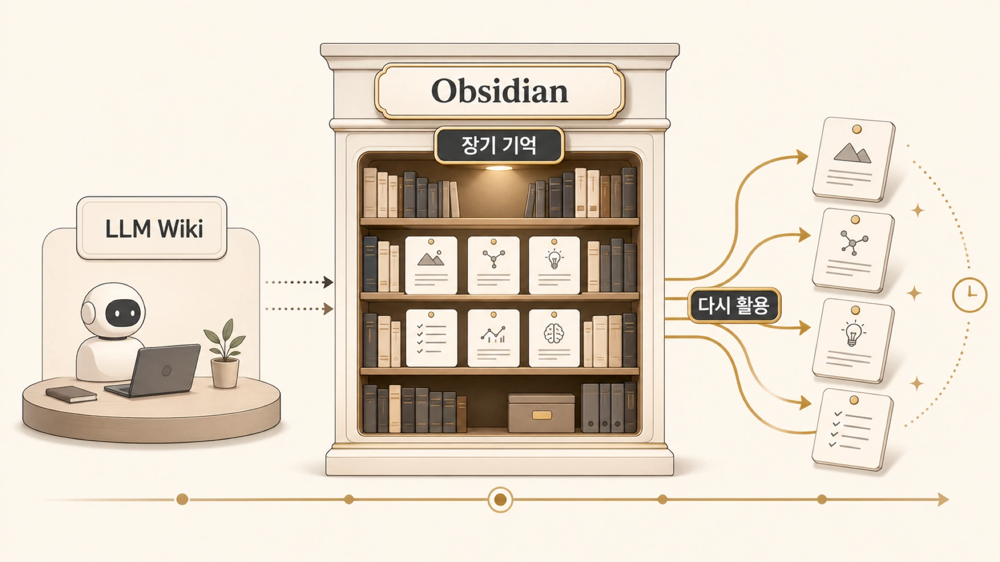

## Obsidian LLM Wiki는 외부 장기 기억으로 어떻게 쓰일까

Obsidian LLM Wiki의 가치는 메모를 많이 쌓는 데 있지 않다. [shared-memory](https://wikidocs.net/346128)가 실행과 handoff의 공용 작업층이라면, Obsidian은 시간이 지나며 누적되는 외부 장기 기억층이다. 나중에 AI 개인비서와 역할형 에이전트가 다시 꺼내 쓸 수 있는 구조로 운영 지식을 남기는 데 있다. 특히 HaloX처럼 모니터링, 콘텐츠, 제품 신호, 운영 판단이 함께 움직이는 환경에서는 Obsidian이 기억층의 핵심이 된다.



따라서 Obsidian은 강의 시스템이나 콘텐츠 제작 도구에만 묶으면 안 된다. HALOX Brain은 누적 지식 베이스, 운영 원장, 연결형 LLM Wiki 역할을 맡는 외부 장기 기억층이다. 이 지식층이 커질수록 [OpenViking/RAG](https://wikidocs.net/346131)처럼 필요한 내용을 회수하는 구조가 중요해진다.

## Obsidian은 memory보다 크고 shared-memory보다 누적형이다

Hermes Agent의 memory는 항상 주입되는 짧은 장기 기준이다. shared-memory는 공용 작업 원본과 handoff에 가깝다. Obsidian은 시간이 갈수록 쌓이고 연결되는 지식층이다.

| 층 | 핵심 역할 | 좋은 사용 예 |
|---|---|---|
| memory | 짧은 장기 규칙 | 사용자별 반복 선호 |
| shared-memory | 공용 작업 원본 | 콘텐츠 패키지, handoff, 팀 규칙 |
| Obsidian LLM Wiki | 누적 지식/운영 원장 | 모니터링 기록, MOC, product signal, 발행 연결 |
| WikiDocs | 읽기 쉬운 공유 지식 | 내부 경험을 정리한 책 페이지 |

Obsidian은 사람이 탐색하기에도 좋고, 나중에 RAG나 OpenViking 같은 회수층과 연결하기에도 좋다. 그래서 “기록 저장소”가 아니라 “AI 팀이 다시 쓸 수 있는 지식 구조”로 설계해야 한다.

## 실제 케이스: HALOX Brain과 shared-memory를 나눈 이유

HaloX 운영에서는 매일 조사/모니터링 결과가 쌓인다. 이 결과를 전부 memory에 넣으면 다음 세션이 무거워지고, 핵심 규칙이 묻힌다. 반대로 Slack에만 두면 나중에 회수하기 어렵다.

그래서 누적 원장은 HALOX Brain에, 작업 패키지와 handoff는 shared-memory에, 반복될 선호와 팀 규칙은 memory/team-rules에 둔다. 예를 들어 방울이의 조사 결과가 콘텐츠 후보가 되면, 원장은 Obsidian에 남기고 후속 작업 패키지는 shared-memory로 이어진다.

## LLM Wiki로 쓰려면 무엇이 달라져야 할까

사람이 읽기 좋은 메모와 LLM이 회수하기 좋은 지식은 겹치지만 완전히 같지는 않다. LLM Wiki로 쓰려면 최소한 다음 구조가 필요하다.

| 요소 | 필요한 이유 |
|---|---|
| 명확한 제목 | 검색과 회수의 첫 단서가 됨 |
| frontmatter/status | 현재성, 소유자, 상태를 구분함 |
| 원자료 링크 | 근거를 다시 확인할 수 있음 |
| 판단 요약 | 왜 이 기록이 중요한지 남김 |
| 연결 노트 | 관련 개념, 콘텐츠, 제품 신호와 이어짐 |
| 다음 액션 | 후속 작업자가 이어받을 수 있음 |

이 구조가 있어야 나중에 하비가 “이건 어디서 봐야 하지?”라고 판단할 때 Obsidian을 기억층으로 쓸 수 있다.

## Obsidian을 기억층으로 쓸 때의 기준

1. 일일 로그와 긴 브리프를 memory에 넣지 않는다.
2. 누적 지식과 운영 원장은 Obsidian에 둔다.
3. shared-memory는 작업 원본과 handoff로 쓴다.
4. Obsidian 노트는 원자료/판단/상태/연결/다음 액션을 갖추게 한다.
5. RAG/OpenViking 연결을 염두에 두고 제목과 구조를 정리한다.
6. 공유 콘텐츠로 정리할 때는 불필요한 세부값을 제거하고 WikiDocs용으로 다시 쓴다.

## Obsidian/Notion/RAG를 연결할 때의 질문

커뮤니티 대화에서도 “기존 지식관리 시스템과 에이전트를 어떻게 연결할까”라는 질문이 반복됐다. 답은 도구 이름이 아니라 역할 분리다. Obsidian, Notion, OpenViking 같은 RAG 계층은 memory를 대체하는 것이 아니라 memory가 감당하지 못하는 긴 맥락을 찾아주는 층이다.

| 질문 | 판단 기준 |
|---|---|
| 매번 자동 주입해야 하는가 | 그렇다면 memory/profile 후보 |
| 필요할 때 검색해서 찾으면 되는가 | Obsidian/Notion/RAG 후보 |
| 팀 전체가 같은 기준으로 봐야 하는가 | shared-memory 후보 |
| 공유 지식으로 재작성할 가치가 있는가 | WikiDocs 후보 |
| 실행 순서까지 재사용해야 하는가 | Skill 후보 |

이 기준을 세우지 않으면 knowledge base가 또 하나의 큰 memory 파일이 된다. 에이전트가 잘 쓰는 외부 기억은 “전부 넣어둔 창고”가 아니라 “질문이 들어왔을 때 어떤 문서를 찾을지 알 수 있는 색인”에 가깝다.

## 운영 원장으로 쓰는 방식

Obsidian을 기억층으로 쓴다는 말은 모든 대화를 노트로 복사한다는 뜻이 아니다. 시간이 지나도 다시 찾을 가치가 있는 지식, 서로 연결되어야 의미가 커지는 지식, 사람과 AI가 함께 읽어야 하는 운영 원장을 남긴다는 뜻이다.

```text
일일 조사 / 모니터링
  ↓
강한 신호만 선별
  ↓
프레임워크 / 기능 아이디어 / 콘텐츠 원장으로 승격
  ↓
필요할 때 하비나 전문 에이전트가 다시 회수
```

| 층 | 좋은 저장 대상 | 피해야 할 것 |
|---|---|---|
| memory | 짧은 장기 선호 | 긴 원문 로그 |
| shared-memory | 공용 작업 원본 | 개인만 보는 생각 메모 |
| Obsidian LLM Wiki | 연결형 운영 지식 | 임시 작업 상태 |
| WikiDocs | 정리된 공유 지식 | 불필요한 세부값 |

## HALOX Brain을 LLM Wiki로 보강해 온 히스토리

Obsidian은 처음에는 사람이 보기 좋은 노트 공간에 가까웠다. 하지만 운영이 커지면서 단순 메모로는 부족했다. 모니터링 결과, 콘텐츠 브리프, 제품 신호, glossary, MOC, 운영 규칙이 서로 연결되어야 했고, 하비와 역할형 에이전트가 나중에 다시 회수할 수 있어야 했다.

그래서 HALOX Brain에는 LLM Wiki 운영 규칙이 생겼다. 새 작업을 시작할 때 INDEX, HALOX MEMORY OPS, HARVEY WAREHOUSE MANAGER, knowledge schema, raw/compiled link rules, operating guide, content stage policy, MOC를 보는 흐름을 만들었다. 핵심 노트는 최소 2개 이상의 관련 노트와 연결하고, glossary_terms/related_content/content_tags를 채워 검색과 회수 단서를 남기게 했다.

| 보강 단계 | 바뀐 점 |
|---|---|
| 메모 저장 | 개별 조사와 아이디어를 노트로 남김 |
| MOC 구성 | HALOX Home, Monitoring Pipeline, Content Connections 같은 진입점을 만듦 |
| raw/compiled 분리 | 원자료와 정리된 판단 노트를 구분함 |
| 운영 규칙 미러 | shared-memory 원본과 Obsidian 열람용 미러를 나눔 |
| LLM 회수 준비 | 제목/상태/연결/태그/다음 액션을 정리해 RAG 후보로 만들기 시작함 |

## LLM Wiki 링크 구조 예시

공유 글에서는 내부 파일 경로를 그대로 드러낼 필요는 없다. 대신 구조를 이해하면 된다.

```text
HALOX Home MOC
  ↓
운영 규칙: HALOX MEMORY OPS / HARVEY WAREHOUSE MANAGER
  ↓
지식 스키마: glossary / framework / product / content / monitoring
  ↓
작업 원본: shared-memory package / research queue / handoff
  ↓
공개 산출물: WikiDocs / blog / lecture derivative
```

이 구조에서 Obsidian은 “글쓰기 전에 참고하는 자료함”이 아니다. AI 팀이 나중에 회수할 수 있게 누적 지식을 연결해 두는 외부 장기 기억층이다.

## 우리 운영에서 Obsidian을 쓰는 방식

| 상황 | Obsidian에 남기는 것 | shared-memory에 남기는 것 |
|---|---|---|
| 일일 모니터링 | daily 원장, 강한 신호, MOC 연결 | 후속 조사 큐, 콘텐츠 갭, 작업 패키지 |
| 콘텐츠 제작 | brief/draft/published 연결과 관련 개념 | 실제 원고 패키지, 이미지, 메타, 발행 체크 |
| 제품 신호 | feature idea, backlog, roadmap 연결 | 실행용 handoff와 우선순위 메모 |
| 운영 규칙 변경 | 열람용 미러와 MOC 연결 | canonical 원본과 팀 공통 규칙 |

## 자주 헷갈리는 질문

### Obsidian과 WikiDocs는 어떻게 나누나요?

Obsidian은 내부 운영 지식과 원장이고, WikiDocs는 읽는 사람에게 설명하는 책이다. 같은 이야기도 독자가 읽을 글로는 다시 써야 한다.

### 모든 대화를 Obsidian에 옮겨야 하나요?

아니다. 판단 기준, 근거, 후속 작업이 있는 것만 남긴다. 일상 대화 전체를 옮기면 오히려 회수가 어려워진다.

### Obsidian이 있으면 RAG가 필요 없나요?

아니다. Obsidian은 지식을 사람이 관리하는 공간이고, RAG는 필요한 지식을 검색해 모델에 주입하는 실행 구조다. Obsidian이 잘 정리되어 있을수록 RAG 품질도 좋아진다.
