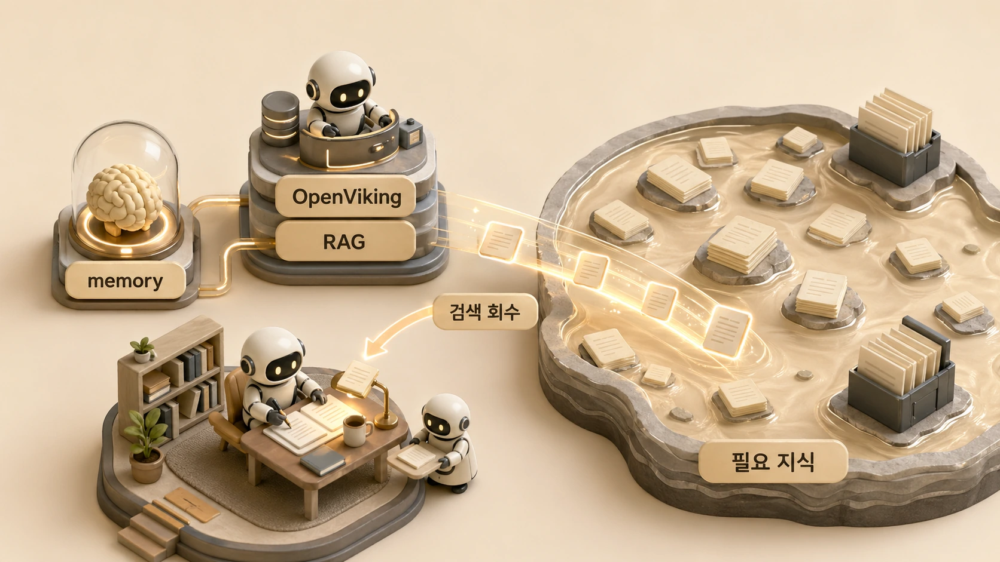

## OpenViking과 RAG는 기억을 어떻게 강화할까



Hermes Agent에서 AI 에이전트의 기억을 강화한다는 말은 모든 지식을 프롬프트에 더 많이 붙인다는 뜻이 아니다. [OpenClaw에서 Hermes로 기억을 옮기는 기준](https://wikidocs.net/346130)이 과거 유산 정리라면, OpenViking/RAG는 앞으로 쌓일 지식을 회수하는 강화층이다. 오래 운영할수록 지식은 늘어나고, 매번 전부 넣을 수는 없다. 그래서 필요한 것이 OpenViking 같은 외부 메모리 레이어와 RAG 회수 구조다.

에르메스 에이전트(Hermes Agent)에서 memory는 항상 주입할 짧은 기준을 맡고, Obsidian LLM Wiki는 누적 지식과 운영 원장을 맡는다. OpenViking/RAG는 이 둘 사이에서 필요한 지식을 검색하고, 관련성이 높은 조각을 다시 모델에게 건네는 기억 강화층으로 볼 수 있다. 다만 회수한 지식도 긴 대화 속에서는 흐려질 수 있으므로 [context compaction과 handoff](https://wikidocs.net/346132) 기준이 함께 필요하다.

## memory와 RAG는 목적이 다르다

memory와 RAG를 같은 것으로 보면 설계가 흔들린다. memory는 적고 강해야 하고, RAG는 넓고 회수 가능해야 한다.

| 구분 | memory | OpenViking / RAG |
|---|---|---|
| 목적 | 항상 필요한 장기 기준 주입 | 필요한 지식 검색/회수 |
| 크기 | 작게 유지 | 크게 확장 가능 |
| 내용 | 선호, 규칙, 역할 기준 | 문서, 노트, 원장, 지식 조각 |
| 위험 | 너무 길어지면 판단 흐림 | 잘못 회수하면 근거 왜곡 |
| 검증 | 기억할 가치 판단 | 검색 적중률/근거 품질 평가 |

그래서 “중요하니까 memory에 넣자”와 “나중에 찾아야 하니까 RAG 대상으로 만들자”는 다른 판단이다.

## OpenViking을 도입하는 이유

OpenViking 도입의 의미는 기억을 한 단계 더 체계화하는 데 있다. HALOX Brain과 shared-memory에 쌓인 운영 지식을 외부 메모리/RAG 레이어로 회수할 수 있게 만들면, 하비는 더 많은 맥락을 필요할 때 찾아볼 수 있다.

다만 도입했다고 바로 모든 기억 문제가 해결되는 것은 아니다. 외부 메모리 레이어는 다음 질문을 함께 가져야 한다.

1. 어떤 문서를 넣을 것인가?
2. 어떤 단위로 쪼갤 것인가?
3. 어떤 질문에서 잘 찾아와야 하는가?
4. 회수된 결과가 실제 답변 품질을 높였는가?
5. 보호해야 할 정보나 불필요한 내부값이 섞이지 않았는가?

## Honcho류 메모리 시스템과 비교할 때 볼 기준

외부 메모리 시스템을 비교할 때는 이름보다 역할을 봐야 한다. Honcho류 시스템이 사용자 상태나 대화 기반 기억 모델링에 초점을 둔다면, OpenViking/RAG는 운영 지식과 문서 회수층으로 볼 수 있다. 실제 선택 기준은 “무엇을 기억하게 할 것인가”다.

| 비교 축 | 봐야 할 질문 |
|---|---|
| 기억 대상 | 사용자 선호인가, 운영 문서인가, 제품 지식인가 |
| 회수 방식 | 대화 기반 상태 모델링인가, 문서 검색인가 |
| 검증 방식 | 개인화 품질을 볼 것인가, 검색 적중률을 볼 것인가 |
| 보안 범위 | 내부 원문이 어디까지 들어가는가 |
| 운영 난이도 | 동기화, 인덱싱, 업데이트, 실패 복구가 가능한가 |

이 비교를 해두면 “새 메모리 도구가 좋아 보인다”에서 멈추지 않고, Hermes Agent의 어떤 기억층을 보강하는지 판단할 수 있다.


## OpenViking / Honcho 비교와 링크

OpenViking과 Honcho는 둘 다 “에이전트 기억”을 다루지만 초점이 다르다. OpenViking은 공식 소개에서 AI Agent를 위한 open-source context database라고 설명하며, memory/resources/skills를 파일 시스템 패러다임으로 통합 관리하는 쪽에 가깝다. Honcho는 stateful agent를 만들기 위한 open-source memory library와 managed service를 제공하며, 사용자/에이전트/그룹/아이디어 같은 entity의 상태를 계속 모델링하는 쪽에 강하다.

| 항목 | OpenViking | Honcho |
|---|---|---|
| 공식 링크 | [GitHub](https://github.com/volcengine/OpenViking) / [Website](https://openviking.ai) | [GitHub](https://github.com/plastic-labs/honcho) / [Docs](https://docs.honcho.dev) / [App](https://app.honcho.dev) |
| 공식 설명에 가까운 위치 | AI Agent용 context database | stateful agent용 memory library / managed service |
| 기억 대상 | memory, resources, skills, 운영 문서, 에이전트 context | users, agents, groups, ideas 같은 entity 상태 |
| 운영 감각 | Obsidian/HALOX Brain과 shared-memory를 회수하는 RAG/context layer 후보 | 개인화/상태 기반 agent memory 후보 |
| 라이선스 | GitHub 기준 AGPL-3.0 | GitHub 기준 AGPL-3.0 |
| 비용 관점 | 오픈소스 자체는 공개되어 있으나 모델 API, 임베딩, 서버 운영 비용은 별도 | README 기준 managed service 가입 시 $100 free credits 언급, self-host는 테스트/평가용으로 가능 |
| 우리 운영 판단 | 하비가 정리한 지식층을 더 잘 회수하게 만드는 retrieval layer | 사용자/대상별 상태 모델링이 필요할 때 비교할 후보 |

이 비교에서 중요한 것은 “어느 도구가 더 좋다”가 아니다. 우리에게 필요한 기억층이 무엇인지다. HALOX Brain과 shared-memory에 쌓인 운영 지식을 하비가 다시 찾게 하려면 OpenViking 쪽 관점이 자연스럽고, 사용자나 팀원별 상태 변화를 장기적으로 모델링하려면 Honcho류 관점이 필요해진다.

## Hermes 공식 플러그인 관점에서 보는 기억 확장

Hermes Agent는 외부 도구와 플러그인을 통해 기능을 붙일 수 있다. 메모리 확장도 같은 관점에서 봐야 한다. 핵심 기능은 “모델에게 더 길게 말하기”가 아니라, 외부 기억층을 어떤 도구로 연결하고 어떤 질문에서 회수할지 정하는 것이다.

```text
Hermes Agent 요청
  ↓
하비가 기억 범위 판단
  ↓
내장 memory / session_search / shared-memory / Obsidian 확인
  ↓
필요하면 OpenViking 같은 context database 또는 Honcho류 memory service 후보 검토
  ↓
회수 결과를 근거/최신성/보호 범위 기준으로 검증
```

우리 OpenViking 파일럿도 이 기준으로 봤다. 패키지 설치와 파일럿 문서는 준비됐지만, 서버 기동과 provider 설정 검증이 끝나야 실사용 전환이 가능했다. 그래서 공개 문서에서는 “이미 모든 기억 문제가 해결됐다”가 아니라 “외부 회수층을 붙이는 방향으로 기억 시스템을 확장하고 있다”라고 설명하는 것이 정확하다.

## RAG 회수층을 붙일 때의 기준

- 항상 필요한 기준은 memory에 둔다.
- 넓게 검색해야 할 지식은 Obsidian/OpenViking/RAG 대상으로 본다.
- RAG에 넣기 전 source of truth와 공유 범위를 확인한다.
- 회수 품질은 느낌이 아니라 질문 세트로 검증한다.
- 검색 결과를 바로 답으로 쓰지 말고 근거와 최신성을 확인한다.
- 보호해야 할 정보, 내부 경로, token, 계정 정보는 RAG 대상에서 제외하거나 별도 보호한다.

## RAG 회수층을 붙이는 운영 흐름

OpenViking/RAG 같은 기억 강화층은 memory를 대체하지 않는다. 항상 주입해야 할 짧은 기준은 memory에 두고, 크고 변하는 지식은 검색/회수 대상으로 둔다. 핵심은 “프롬프트를 길게 만드는 것”이 아니라 “필요한 순간에 맞는 지식을 꺼내는 것”이다.

```text
사용자 요청
  ↓
하비가 필요한 지식 범위 판단
  ↓
memory / shared-memory / Obsidian / RAG 후보 조회
  ↓
관련 지식만 현재 작업 컨텍스트에 주입
  ↓
답변 / 문서 / 실행 결과로 변환
```

| 판단 질문 | RAG가 필요한 경우 |
|---|---|
| 지식이 너무 커서 memory에 넣기 어려운가 | 예 |
| 자주 바뀌거나 계속 쌓이는가 | 예 |
| 검색해서 일부만 가져와도 충분한가 | 예 |
| 항상 모든 대화에 주입해야 하는가 | 아니오, memory가 더 맞다 |

## 자주 헷갈리는 질문

### RAG를 붙이면 memory가 필요 없어지나요?

아니다. memory는 항상 필요한 짧은 기준이고, RAG는 필요한 지식을 찾아오는 구조다. 둘은 대체 관계가 아니라 보완 관계다.

### Obsidian을 잘 쓰면 OpenViking이 필요 없나요?

항상 그렇지는 않다. Obsidian은 사람이 지식을 관리하는 층이고, OpenViking/RAG는 그 지식을 모델이 회수하기 위한 실행층이다. 운영 규모가 커질수록 둘을 연결할 가치가 생긴다.

### 외부 메모리에 모든 문서를 넣어도 되나요?

안 된다. 보호해야 할 정보, 불필요한 내부값, 오래된 문서, source of truth가 아닌 자료를 그대로 넣으면 잘못된 회수가 늘어난다. 넣기 전에 정리와 평가 질문이 필요하다.

## 다음에 읽을 글

다음은 [긴 대화와 context compaction은 어떻게 관리할까](https://wikidocs.net/346132)에서 단기 맥락이 흐려지는 문제를 본다.
