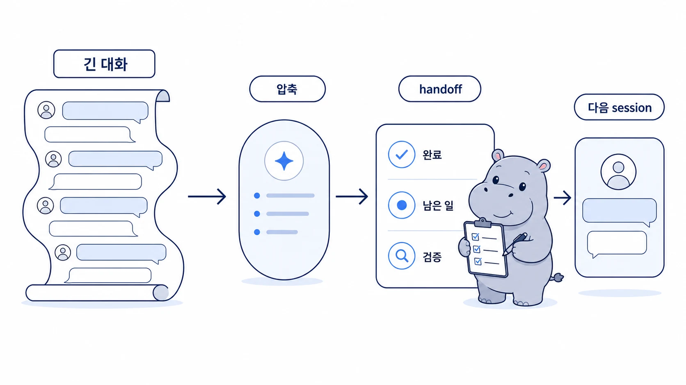

## 긴 대화와 context compaction은 어떻게 관리할까

긴 대화는 편하지만 위험하다. [OpenViking/RAG](https://wikidocs.net/346131)가 외부 지식 회수층이라면, context compaction과 handoff는 현재 대화의 단기 맥락을 잃지 않게 만드는 운영 장치다. 앞에서 합의한 기준, 완료한 작업, 남은 범위가 계속 쌓이면 AI 개인비서는 모든 것을 기억하는 것처럼 보이다가 어느 순간 흐려진다. 이때 필요한 것은 더 긴 대화가 아니라 handoff, 원본 기준, 검증 기준이다.


에르메스 에이전트(Hermes Agent)의 context compaction은 긴 대화를 이어가게 도와준다. 하지만 압축은 마법이 아니다. 무엇을 남기고 무엇을 버릴지 기준이 없으면, 압축된 요약도 잘못된 방향을 오래 유지할 수 있다. 이 기준을 실제로 적용하는 주체가 [하비 기억 오케스트레이터](https://wikidocs.net/346133)다.



[TOC]

## 컨텍스트가 흐려지는 순간

| 신호 | 실제 위험 | 필요한 조치 |
|---|---|---|
| “아까 말한 것”이 많아짐 | 범위가 암묵적으로 변함 | 현재 작업 목록과 완료 기준 재정리 |
| 여러 장을 한 번에 고침 | 범위 밖 변경이 섞임 | git diff와 대상 파일 검증 |
| 보호 기준이 흐려짐 | 공유 글에 불필요한 세부값이 들어갈 수 있음 | 함께 읽어도 되는 이야기만 남김 |
| 링크/이미지/TOC가 많아짐 | 기술 검증이 빠짐 | WikiDocs 검증 스크립트 실행 |
| 메모리와 작업 로그가 섞임 | 다음 세션 판단이 오염됨 | memory와 session 기록 분리 |

## WikiDocs 장별 리라이트가 길어질 때

WikiDocs 책을 장별로 다시 쓸 때 대화는 길어졌다. 각 장마다 세션 기록, Slack 스레드, shared-memory, profile 문서를 확인했고, 수정 후 검증/커밋/푸시까지 이어졌다. 이 과정에서 다음 장을 시작할 때마다 “현재 HEAD가 어디인지”, “작업트리가 clean인지”, “이번 장 범위가 어디까지인지”를 다시 확인해야 했다.

긴 대화의 위험은 실력 문제가 아니다. 작업 범위가 길어질수록 작은 변경이 섞이기 쉽다. 그래서 context compaction을 믿고 계속 밀기보다, 중간마다 원본 기준과 검증 기준을 다시 잡아야 한다.

## handoff가 필요한 순간

handoff는 대화를 요약하는 문서가 아니다. 다음 사람이 바로 이어받을 수 있게 현재 상태, 결정, 남은 일, 검증 기준을 남기는 작업이다.

좋은 handoff에는 다음이 들어간다.

1. 현재 목표
2. 완료된 것
3. 남은 것
4. 바꾸면 안 되는 기준
5. 참조해야 할 원본 기준
6. 보호 정보/공유 범위 주의점
7. 다음 실행자가 바로 할 수 있는 첫 행동

## handoff를 남길 때의 기준

- 긴 대화가 이어지면 중간마다 작업 범위와 완료 기준을 다시 쓴다.
- context compaction은 요약이지 검증이 아니다.
- 작업 로그를 memory에 넣지 않는다.
- 다음 실행자가 필요하면 shared-memory handoff로 남긴다.
- 변경 전후에는 원본 기준과 git 상태를 확인한다.
- 공유 콘텐츠는 보호 정보 제거 기준을 매번 다시 적용한다.

## handoff에 남겨야 하는 것

긴 WikiDocs 작업처럼 여러 단계가 이어지는 일은 대화가 길어질수록 핵심이 흐려진다. 이때 필요한 것은 모든 메시지의 복사본이 아니라, 다음 작업자가 바로 이어받을 수 있는 최소 상태다.

```md
Active Task
- 지금 이어서 해야 하는 일

Completed Actions
- 이미 끝난 검증 / 수정 / 발행

Key Decisions
- 다시 뒤집으면 안 되는 판단

Remaining Work
- 다음에 실제로 해야 할 작업

Sensitive Boundary
- 공유 문서에 쓰면 안 되는 불필요한 세부값
```

| 넣을 것 | 빼야 할 것 |
|---|---|
| 현재 목표와 남은 일 | 전체 대화 원문 |
| 변경된 파일과 검증 결과 | 토큰/계정/내부 접속값 |
| 결정 이유 | 사적인 잡담 |
| 다음 작업자의 첫 행동 | 이미 폐기된 시도 전체 |

## context compaction은 자동으로 일어날 수 있다

context compaction은 사용자가 “지금 압축해”라고 말해야만 생기는 수동 작업으로만 보면 안 된다. 긴 대화가 계속되거나 시스템이 대화 맥락을 줄여야 하는 상황에서는 이전 대화가 요약된 형태로 남고, 세부 메시지는 뒤로 밀릴 수 있다. 이때 에이전트는 이어지는 것처럼 보이지만, 실제로는 압축된 요약을 기반으로 판단한다.

그래서 긴 작업에서는 compaction 이후에도 반드시 현재 원본을 다시 확인해야 한다. 특히 WikiDocs 작업처럼 파일을 직접 고치고 발행하는 일은 압축된 기억보다 git status, TOC, 실제 파일 내용, WikiDocs 동기화 상태가 더 믿을 만하다.

## 압축 기준은 무엇을 조정하나

Hermes Agent의 압축은 “대화가 길어졌으니 아무거나 줄인다”가 아니라 설정값에 따라 작동한다. 운영자가 자주 보는 값은 `enabled`, `threshold`, `target_ratio`, `protect_last_n`, `summary_model`, `summary_provider`다.

| 설정 | 뜻 | 운영 판단 |
|---|---|---|
| `enabled` | 자동 context compaction을 켤지 정한다 | 긴 작업이 많으면 켜두는 편이 낫다 |
| `threshold` | 컨텍스트가 어느 정도 찼을 때 압축을 시작할지 정한다 | 낮을수록 빨리 압축되고, 높을수록 원문을 오래 유지한다 |
| `target_ratio` | 압축 후 어느 정도 크기로 줄일지 정한다 | 낮을수록 강하게 줄지만 세부 맥락 손실이 커진다 |
| `protect_last_n` | 최근 몇 개 메시지를 압축에서 보호할지 정한다 | 최근 결정/수정 지시가 중요하면 크게 잡는다 |
| `summary_model` | 압축 요약을 만들 모델 | 일반 답변 모델과 별개로 호출될 수 있다 |
| `summary_provider` | 압축 요약 모델을 어느 provider로 호출할지 정한다 | API key가 실제로 있는 provider와 맞아야 한다 |

압축값은 작업 성격에 맞춰 조정해야 한다. 짧은 Q&A 위주라면 빨리 압축해도 큰 문제가 없지만, WikiDocs 발행, 코드 수정, Slack 스레드 운영처럼 결정과 파일 상태가 중요한 작업은 너무 이른 압축이 위험하다.

| 성향 | 예시 값 | 장점 | 위험 |
|---|---|---|---|
| 공격적 압축 | `threshold: 0.5`, `target_ratio: 0.2`, `protect_last_n: 20` | 긴 대화를 빨리 가볍게 만든다 | 파일명/결정 이유/예외 조건이 사라질 수 있다 |
| 안정형 압축 | `threshold: 0.7`, `target_ratio: 0.3`, `protect_last_n: 30` | 최근 맥락과 작업 기준을 더 오래 보존한다 | 토큰 사용량은 조금 더 늘 수 있다 |

실전 운영에서는 안정형 기준이 더 안전하다. 특히 에르메스 에이전트(Hermes Agent)를 AI 개인비서와 역할형 에이전트 팀으로 오래 운영한다면, 속도보다 “이전 결정이 왜 그렇게 내려졌는가”가 더 중요할 때가 많다.

```yaml
compression:
  enabled: true
  threshold: 0.7
  target_ratio: 0.3
  protect_last_n: 30
  summary_model: google/gemini-3-flash-preview
  summary_provider: openrouter
```

## 압축에도 API 호출이 필요하다

context compaction은 로컬에서 단순히 문장을 잘라내는 기능이 아니다. 압축 요약을 만들기 위해 별도의 모델 호출이 일어날 수 있다. 그래서 일반 대화가 되는 상태라도 압축만 실패할 수 있다. 이유는 압축 요약에 쓰는 `summary_model`과 `summary_provider`가 실제 API key, OAuth, credential pool과 맞지 않을 수 있기 때문이다.

예를 들어 `summary_model`이 `google/gemini-3-flash-preview`인데 현재 profile에는 Gemini 직접 API key가 없고 OpenRouter API key만 있다면, `summary_provider`를 `openrouter`로 맞추는 편이 안정적이다. 반대로 Gemini 직접 키를 쓰려면 provider와 환경변수가 그 경로에 맞아야 한다.

운영자가 확인할 순서는 이렇다.

1. `config.yaml`에서 `compression.summary_model`을 본다.
2. 같은 파일에서 `compression.summary_provider`를 본다.
3. active profile의 `.env`에 해당 provider API key가 있는지 확인한다.
4. profile `.env`에 없으면 global `.env` 또는 credential pool을 쓰는 구조인지 확인한다.
5. 압축 실패가 반복되면 summary provider를 실제 키가 있는 provider로 고정한다.

중요한 점은 API key 값을 문서나 Slack에 노출하지 않는 것이다. 문서에는 “어떤 provider에 키가 있는지”만 남기고, 실제 키는 `.env`나 credential store에만 둔다.

## 수동 압축은 어떻게 실행하나

긴 스레드를 계속 이어가야 한다면 사용자가 직접 압축을 요청할 수 있다. CLI에서는 보통 다음처럼 실행한다.

```text
/compress
```

특정 주제를 중심으로 남기고 싶다면 focus topic을 붙인다.

```text
/compress WikiDocs 04-08 context compaction 기준과 Slack slash command 설정을 중심으로 압축해줘
```

Slack에서는 두 가지 경로가 있다.

```text
/compress
```

또는 Hermes gateway가 `/hermes` 단일 명령으로 subcommand를 받도록 구성되어 있다면 다음처럼 쓴다.

```text
/hermes compress
```

다만 Slack slash command는 Hermes 내부 명령만 있다고 바로 동작하지 않는다. Slack App Manifest의 `features.slash_commands`에 `/compress`나 `/hermes`가 등록되어 있어야 하고, `commands` scope와 app reinstall도 필요하다. 등록이 없으면 Slack이 Hermes gateway로 요청을 보내기 전에 “없는 명령”으로 막는다.

## 압축 실패 메시지는 어떻게 읽나

압축 중 이런 메시지가 보일 수 있다.

```text
Compression summary failed: peer closed connection without sending complete message body. Inserted a fallback context marker.
```

이 메시지는 “대화가 압축됐다”가 아니라 “압축 요약을 만들려고 했지만 실패해서 fallback marker만 넣었다”는 뜻에 가깝다. 정상 압축이면 이전 대화의 핵심 요약이 남지만, fallback marker는 요약 대신 실패 표식만 남긴다. 이 상태에서는 에이전트가 이어서 답할 수 있어도 오래된 세부 맥락이 충분히 보존됐다고 믿으면 안 된다.

복구 순서는 단순하다.

1. 지금 해야 할 일을 짧게 다시 써준다.
2. 완료된 작업/남은 작업/바꾸면 안 되는 기준을 알려준다.
3. 파일 작업이면 실제 파일과 git 상태를 다시 확인한다.
4. API/provider 설정을 확인한다.
5. 필요하면 `threshold`, `target_ratio`, `protect_last_n`, `summary_provider`를 조정한다.


| compaction 이후 확인할 것 | 이유 |
|---|---|
| 현재 작업트리 상태 | 압축 요약이 실제 파일 상태와 다를 수 있다 |
| 대상 파일 목록 | 범위 밖 파일을 건드리지 않기 위해 필요하다 |
| 최근 커밋/원격 HEAD | 이미 다른 세션에서 반영됐을 수 있다 |
| 검증 스크립트 결과 | 요약이 아니라 실제 출판 조건을 확인해야 한다 |
| 남은 일과 완료 기준 | 다음 행동이 추측으로 흐르지 않게 한다 |

## 긴 대화에서 쓰는 재개 템플릿

```md
현재 목표
- 무엇을 끝내야 하는가

근거로 확인한 것
- session_search / Slack / shared-memory / Obsidian / GitHub 중 무엇을 확인했는가

수정 범위
- 건드릴 파일
- 건드리지 않을 파일

검증 기준
- WikiDocs formatting
- 링크/이미지
- middle-dot 사용 여부
- 책이나 팀 문서에 그대로 드러내면 안 되는 세부값

다음 행동
- 바로 실행할 첫 명령 또는 첫 편집
```

이 템플릿은 대화를 예쁘게 요약하기 위한 것이 아니라, 압축 이후에도 같은 실수를 반복하지 않게 하는 운영 장치다.

## 자주 헷갈리는 질문

### context compaction은 언제 필요하나요?

장별 리라이트처럼 작업이 여러 단계로 이어지고, 앞선 결정과 현재 파일 상태가 모두 중요할 때 필요하다.

### 긴 대화가 무조건 나쁜가요?

아니다. 다만 긴 대화는 “한 번에 다 알고 있다”는 착각을 만든다. 그래서 검증과 원본 기준 확인이 같이 있어야 한다.
