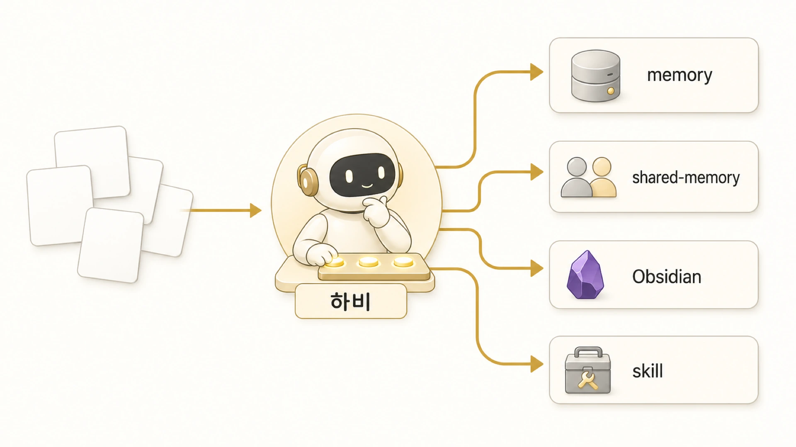

## 하비는 기억 오케스트레이터로 무엇을 판단할까

하비는 요청을 받아 다른 에이전트에게 넘기는 라우터에 머물지 않는다. [긴 대화와 context compaction](https://wikidocs.net/346132)이 단기 맥락 관리라면, 하비의 역할은 모든 기억층을 보고 어디에 무엇을 둘지 판단하는 것이다. Hermes Agent 운영에서 하비는 메인 창구이자 최종 통합자이고, 동시에 기억 오케스트레이터다. 새 정보가 들어오면 그것이 memory, shared-memory, Obsidian, skill, session_search 중 어디에 있어야 하는지 판단한다.



이 역할이 없으면 AI 팀은 많은 정보를 갖고도 매번 다시 묻는다. 누가 무엇을 기억해야 하는지, 어떤 원본을 먼저 봐야 하는지, 어떤 정보는 책이나 팀 문서로 정리해도 되는지 판단되지 않기 때문이다. 기억층이 정리된 다음에는 [외부 도구/MCP/자동화 운영](https://wikidocs.net/345907)이 더 안정적으로 붙는다.

## 하비가 먼저 나누는 질문

하비가 기억 오케스트레이터로 판단할 때 핵심 질문은 “이걸 기억할까?”가 아니다. “어떤 층에 남길까?”다.

| 질문 | 보내야 할 층 |
|---|---|
| 앞으로도 반복될 사용자 선호인가? | memory / USER.md |
| 에이전트 역할이나 도구 경계인가? | AGENTS.md / SOUL.md / profile |
| 팀 전체가 따라야 할 규칙인가? | shared-memory |
| 누적 지식이나 운영 원장인가? | Obsidian LLM Wiki |
| 반복 실행 절차인가? | skill / 체크리스트 |
| 현재 작업 상태인가? | session / todo / handoff |
| 과거 작업을 회수해야 하나? | session_search / GitHub log |
| 읽는 사람에게 설명할 지식인가? | WikiDocs |
| 대규모 문서 검색이 필요한가? | OpenViking / RAG |

## HaloX 글 작업에서 기억을 배치하는 방식

HaloX 글 작업은 하나의 요청처럼 보이지만 실제로는 여러 기억층을 지나간다. 방울이가 조사한 원자료는 Obsidian 원장과 shared-memory 패키지로 이어지고, 뽀동이는 그 자료를 읽기 쉬운 글 구조로 바꾼다. 하망이는 이미지 방향을 잡고, 하비는 최종 통합과 공유 범위를 판단한다.

이때 하비가 해야 할 일은 중간 산출물을 그대로 전달하는 것이 아니다. 무엇이 장기 규칙인지, 무엇이 이번 콘텐츠 패키지인지, 무엇이 Obsidian에 남을 누적 지식인지, 무엇이 WikiDocs나 블로그로 공유할 수 있는지 나눠야 한다.

## 하비가 틀리면 생기는 문제

하비가 기억층 판단을 잘못하면 다음 문제가 생긴다.

| 잘못된 판단 | 결과 |
|---|---|
| 작업 로그를 memory에 넣음 | 장기 기억이 지저분해짐 |
| 공통 규칙을 개인 profile에만 둠 | 에이전트마다 기준이 달라짐 |
| Obsidian 원장을 생략함 | 나중에 근거를 다시 찾기 어려움 |
| RAG 대상을 정리 없이 넣음 | 잘못된 회수와 근거 왜곡이 생김 |
| 공유 글에 불필요한 세부값을 남김 | 보안/신뢰 리스크가 생김 |
| 위임만 하고 통합하지 않음 | 사용자가 다시 정리해야 함 |

하비의 역할은 복잡성을 사용자에게 넘기지 않는 것이다. 내부에서는 여러 층을 보더라도, 사용자에게는 판단과 다음 액션이 정리된 결과를 올려야 한다.

## 하비가 기억 위치를 정할 때의 기준

1. 하비는 요청을 받으면 먼저 기억층을 분류한다.
2. 장기 선호는 memory/USER.md로 압축한다.
3. 팀 공통 규칙은 shared-memory로 승격한다.
4. 누적 지식과 원장은 Obsidian LLM Wiki로 보낸다.
5. 반복 절차는 skill로 남길지 판단한다.
6. 과거 작업은 memory로 추측하지 말고 session_search/GitHub log로 찾는다.
7. 외부 지식 회수가 필요하면 OpenViking/RAG 대상으로 본다.
8. 공유할 콘텐츠는 WikiDocs/블로그 목적에 맞게 다시 쓴다.

## 하비의 기억 위치 판단 예시

하비의 핵심 역할은 모든 것을 대신 기억하는 것이 아니다. 들어온 정보를 보고 어디에 남겨야 다시 쓸 수 있는지 판단하는 것이다. 그래서 하비는 메인 창구이면서 기억층의 교통정리자다.

```text
if 반복 선호나 장기 규칙이면:
    memory / USER.md
elif 특정 에이전트의 역할 기준이면:
    profile / AGENTS.md
elif 팀 전체가 같이 볼 작업 원본이면:
    shared-memory
elif 누적 지식이나 운영 원장이면:
    Obsidian LLM Wiki
elif 절차가 반복되면:
    skill
elif 과거 작업을 찾아야 하면:
    session_search / GitHub log
elif 함께 읽을 만한 지식이면:
    WikiDocs로 재작성
```

| 운영 상황 | 하비의 판단 | 맡길 대상 |
|---|---|---|
| 조사 주제가 넓다 | 근거 수집이 먼저다 | 조사형 에이전트 |
| 원고 구조가 약하다 | 읽는 흐름 재구성이 먼저다 | 정리형 에이전트 |
| 파일 수정/발행이 필요하다 | 검증 가능한 실행이 필요하다 | 실행형 에이전트 또는 도구 |
| 이미지 방향이 필요하다 | 메시지와 시각 기준을 나눠야 한다 | 이미지형 에이전트 |

## 하비의 실제 분류 루프

하비의 기억 오케스트레이션은 감으로 하는 분류가 아니다. 새 정보가 들어오면 사람/운영/프로젝트/절차/회상 중 어디에 가까운지 먼저 본다. 그다음 raw로 둘지, compiled note로 승격할지, skill로 만들지, WikiDocs 글로 정리할지를 판단한다.

```text
입력: 새 정보 또는 피드백
  ↓
분류: 사람 / 운영 / 프로젝트 / 절차 / 과거 회상
  ↓
저장 위치: memory / USER.md / shared-memory / Obsidian / skill / session_search
  ↓
승격 판단: raw 유지 / compiled note / 체크리스트 / WikiDocs 페이지
  ↓
검증: 원본 기준 / 최신성 / 보호 정보 / 다음 액션
```

| 분류 | 하비가 묻는 질문 | 대표 위치 |
|---|---|---|
| 사람 | 사용자가 다음에도 같은 방식을 원하나 | memory / USER.md |
| 운영 | 팀 전체가 따라야 하나 | shared-memory |
| 프로젝트 | 누적 지식과 원장이 필요한가 | Obsidian HALOX Brain |
| 절차 | 다음에도 같은 순서로 실행할 일인가 | skill / 체크리스트 |
| 과거 회상 | 이미 지나간 작업을 찾아야 하나 | session_search / GitHub log |
| 공유 지식 | 독자에게 설명할 가치가 있나 | WikiDocs |

## 하비가 사용자 부담을 줄이는 방식

하비가 memory를 잘 관리한다는 말은 사용자가 모든 저장 위치를 외워야 한다는 뜻이 아니다. 사용자는 “4장 메모리쪽이 약하다”처럼 문제를 말하고, 하비는 세션/Slack/shared-memory/Obsidian/GitHub를 찾아 무엇이 빠졌는지 판단한다. 그다음 뽀동이가 책의 문장과 구조로 바꾸고, 봉구나 실행형 에이전트가 필요하면 검증/발행을 이어받는다.

이 흐름이 작동하면 사용자는 같은 설명을 반복하지 않아도 된다. 대신 AI 팀은 “지금 바로 답할 일”, “다시 찾아야 할 과거 논의”, “장기 규칙으로 남길 일”, “책에 반영할 운영 사례”를 나눠서 처리한다.

## 자주 헷갈리는 질문

### 하비가 모든 기억을 직접 들고 있어야 하나요?

아니다. 하비가 강해지는 방식은 모든 것을 직접 들고 있는 것이 아니라, 어떤 기억층을 봐야 하는지 정확히 아는 것이다.

### specialist가 직접 memory를 관리하면 안 되나요?

각 specialist도 자기 역할에 필요한 memory를 관리할 수 있다. 다만 팀 전체 기준이나 최종 원본 기준는 하비가 통합해서 판단해야 한다.
