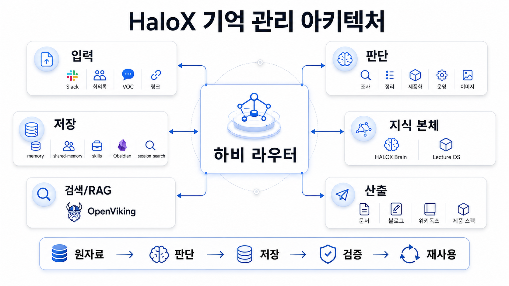
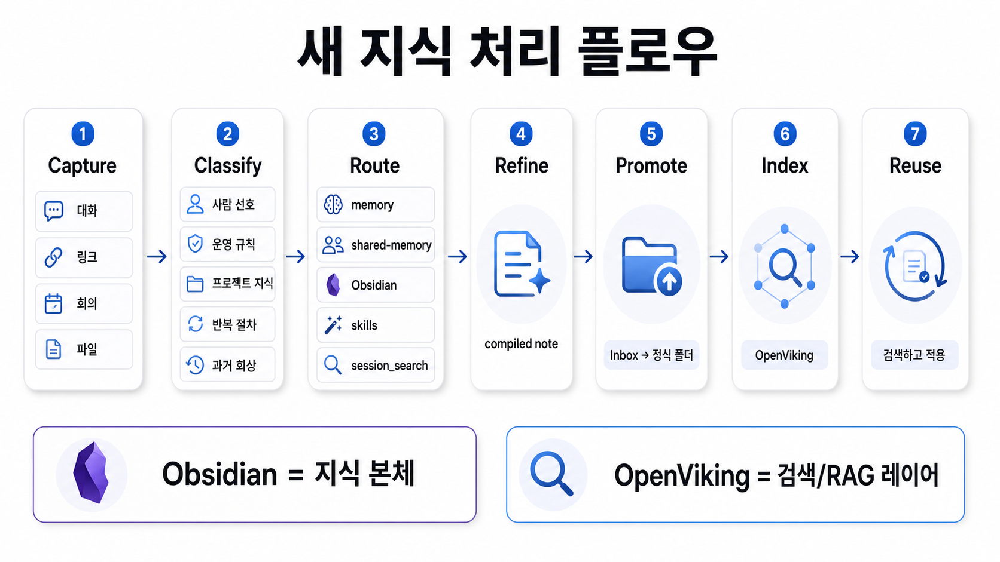
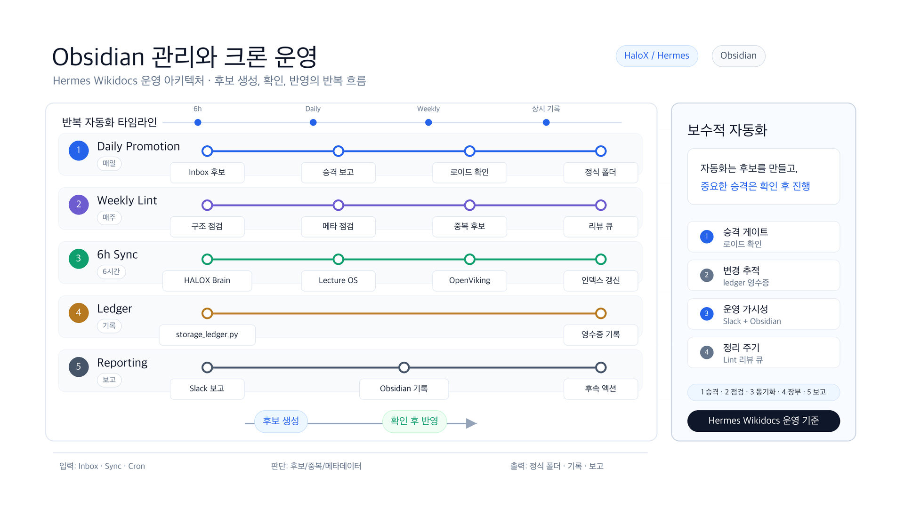

## AI 에이전트 기억 관리 아키텍처는 어떻게 나눌까

AI 에이전트의 기억 관리는 “중요한 것을 전부 저장하는 일”이 아니다. 오래 쓰는 에이전트일수록 대화, 파일, 회의록, 조사 결과, 제품 아이디어, 운영 규칙이 계속 쌓인다. 이때 모든 것을 하나의 memory에 넣으면 장기 기억은 금방 무거워지고, 정작 매번 필요한 기준은 묻힌다. 반대로 아무 곳에도 정리하지 않으면 에이전트는 같은 설명을 계속 다시 요구한다.

그래서 기억 시스템은 저장소의 크기보다 역할 분리가 먼저다. 항상 필요한 짧은 기준은 memory에 두고, 팀이 함께 봐야 하는 작업 원본은 shared-memory에 둔다. 반복 실행 절차는 skills로 만들고, 누적 지식과 운영 원장은 Obsidian 같은 외부 지식 베이스에 남긴다. 과거 대화는 session_search로 회상하고, 넓은 문서 검색이 필요할 때는 OpenViking 같은 RAG 인덱스를 붙인다.

예를 들어 한 팀이 개인 비서형 에이전트, 조사형 에이전트, 정리형 에이전트를 함께 운영한다고 하자. 내부에서는 하비, 방울이, 뽀동이 같은 이름을 붙일 수 있지만 공개적으로 중요한 것은 이름이 아니라 역할이다. 누가 새 정보를 받아 분류하고, 누가 원자료를 조사하고, 누가 정리된 글로 바꾸며, 어떤 지식이 장기 기억으로 승격되는지를 분명히 나누는 것이 기억 관리 아키텍처의 핵심이다.

[TOC]

## 기억 관리는 많이 저장하는 문제가 아니다

기억이 많아질수록 에이전트가 똑똑해지는 것은 아니다. 오히려 분류되지 않은 기억은 매번 불필요한 컨텍스트를 불러오고, 오래된 결정을 최신 기준처럼 보이게 만든다.

좋은 기억 시스템은 저장할 것과 저장하지 않을 것을 나누고, 저장하더라도 어느 층에 둘지 먼저 판단한다. 핵심은 “나중에 다시 쓸 때 어떤 형태로 꺼내야 하는가”다.

## 세 가지를 먼저 구분해야 한다

AI 에이전트가 다루는 정보는 크게 세 가지로 나뉜다.

| 구분 | 설명 | 예시 |
|---|---|---|
| 사용자 기준 | 앞으로도 계속 영향을 주는 선호와 규칙 | 문체, 금지 표현, 기본 시간대 |
| 프로젝트 지식 | 특정 일이나 사업을 이해하는 데 필요한 누적 정보 | 제품 구조, 고객 VOC, 콘텐츠 전략 |
| 운영 절차 | 반복 실행할 수 있는 방법과 점검 순서 | 배포 절차, 문서 QA, 이미지 제작 흐름 |

이 셋을 구분하지 않으면 memory, 문서, skill, 검색 인덱스가 뒤섞인다. 그러면 에이전트는 기억을 가진 것처럼 보이지만 실제로는 매번 다시 해석해야 한다.

## 기억층별 역할을 나누기

| 기억층 | 맡는 역할 | 넣기 좋은 것 | 넣으면 위험한 것 |
|---|---|---|---|
| memory | 항상 필요한 짧은 장기 기준 | 사용자 선호, 반복 규칙 | 긴 로그, 일회성 작업 |
| shared-memory | 팀 공통 작업 원본 | 운영 규칙, handoff, 공용 패키지 | 개인 메모, 미검증 원문 |
| skills | 반복 가능한 절차 | 명령 순서, QA 루틴, 체크리스트 | 단순 참고 지식 |
| Obsidian | 지식 본체와 운영 원장 | 프로젝트 지식, 개념, 결정 기록 | 정제되지 않은 원문 더미 |
| session_search | 과거 대화 회상 | 이전 논의, 지나간 작업 맥락 | 장기 기준의 대체물 |
| OpenViking/RAG | 검색과 회수 인덱스 | Obsidian 기반 검색 대상 | 검증 안 된 민감 원문 |

## Obsidian은 지식 본체, OpenViking은 검색 인덱스다

Obsidian은 사람이 읽고 고칠 수 있는 지식 본체다. 프로젝트의 원칙, 회의에서 나온 결정, 콘텐츠 자산, 고객 피드백, 운영 원장은 여기에 남긴다.

OpenViking 같은 RAG 인덱스는 그 지식을 더 잘 찾기 위한 검색 레이어다. 인덱스가 지식 본체를 대체하면 안 된다. 본문은 Obsidian에 있고, 검색은 OpenViking이 돕는 구조가 안정적이다.

## 새 정보가 들어오면 먼저 분류한다

새로운 대화, 링크, 회의록, 파일이 들어왔을 때 바로 저장부터 하면 안 된다. 먼저 “이 정보는 나중에 무엇으로 다시 쓰일 것인가”를 판단해야 한다.

분류 기준은 단순하게 시작할 수 있다.

| 들어온 정보 | 저장 위치 |
|---|---|
| 사람의 장기 선호 | memory |
| 팀 공통 운영 규칙 | shared-memory |
| 프로젝트 지식과 결정 | Obsidian |
| 반복 실행 절차 | skills |
| 과거 대화 맥락 | session_search |

## raw source를 바로 기억으로 넣지 않는다

원문은 중요하지만 원문 자체가 곧 기억은 아니다. Slack 대화, 회의록, 링크 모음, 조사 결과를 그대로 장기 기억에 넣으면 나중에 다시 읽을 때 비용이 커진다.

장기 기억에는 원문보다 정제된 메모가 들어가야 한다. 이 정제된 메모를 compiled note라고 부를 수 있다. compiled note는 출처를 잃지 않으면서도 결론, 적용 규칙, 다음 행동을 분리해 둔 형태다.

## 자동화는 후보를 만들고, 중요한 승격은 확인 후 진행한다

기억 관리 자동화는 모든 것을 자동으로 저장하는 방향이 아니다. 좋은 자동화는 후보를 만들고, 중복을 찾고, 빠진 메타데이터를 알려준다. 하지만 중요한 승격과 삭제는 사람의 확인을 거치는 편이 안전하다.

예를 들어 다음과 같은 운영 루프를 둘 수 있다.

| 루프 | 역할 |
|---|---|
| Daily Promotion | Inbox 후보를 찾아 정식 폴더 승격 후보로 보고 |
| Weekly Lint | 구조, 메타데이터, 중복 후보, 리뷰 큐 점검 |
| 6h Sync | Obsidian 변경 사항을 검색 인덱스에 반영 |
| Storage Ledger | 무엇을 어디에 왜 저장했는지 영수증 기록 |
| Slack Reporting | 운영 상태와 다음 행동을 짧게 보고 |

## storage ledger가 필요한 이유

지식 시스템은 시간이 지나면 “왜 이게 여기 있지?”라는 질문이 생긴다. storage ledger는 저장 자체보다 저장의 이유를 남긴다.

한 줄짜리 영수증만 있어도 나중에 다음을 추적할 수 있다.

• 어떤 정보가 들어왔는지
• 누가 판단했는지
• 어디에 저장했는지
• 왜 그 위치가 맞다고 봤는지
• 다음에 검토할 일이 남았는지

## 공개 문서로 바꿀 때는 내부명을 일반화한다

내부 운영에서는 에이전트마다 이름을 붙이는 것이 좋다. 하지만 공개 문서에서는 이름보다 역할을 먼저 설명해야 한다.

하비는 메인 오케스트레이터, 방울이는 조사형 에이전트, 뽀동이는 정리형 에이전트라는 식으로 풀어 쓸 수 있다. 독자가 가져가야 할 것은 특정 이름이 아니라 역할 분리와 기억 흐름이다.

## 체크리스트: 새 정보를 어디에 둘지 판단하는 질문

새 정보가 들어왔을 때 다음 질문을 순서대로 물어보면 된다.

1. 이 정보는 앞으로도 매번 필요한 기준인가?
2. 팀 전체가 공유해야 하는 운영 규칙인가?
3. 특정 프로젝트의 지식 본체로 남겨야 하는가?
4. 반복 실행 가능한 절차인가?
5. 과거 대화에서 회상만 하면 충분한가?
6. 검색 인덱스에 넣기 전에 사람이 읽을 수 있는 본문이 있는가?
7. 지금 바로 저장할 것인가, 후보로만 남길 것인가?

## 정리: 기억 시스템은 저장소가 아니라 운영 구조다

AI 에이전트의 장기 기억은 하나의 저장소로 해결되지 않는다. 짧은 기준, 팀 공통 규칙, 반복 절차, 프로젝트 지식, 과거 대화, 검색 인덱스가 각자 다른 역할을 가져야 한다.

좋은 구조는 에이전트가 모든 것을 기억하게 만드는 것이 아니라, 필요한 순간에 맞는 기억을 꺼낼 수 있게 만든다. 그래서 기억 관리 아키텍처의 핵심은 저장량이 아니라 분류, 정제, 승격, 검증, 재사용의 운영 흐름이다.
