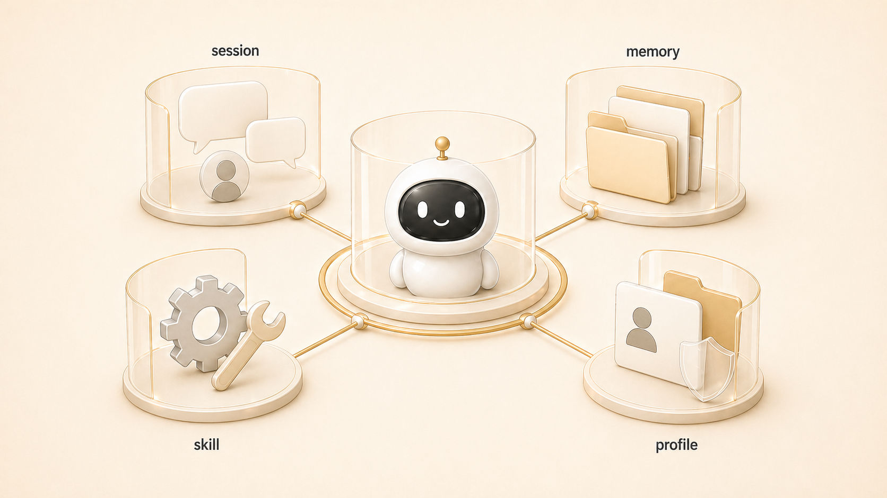

## 4장. AI 에이전트 기억 시스템은 어떻게 설계해야 할까

AI 개인비서를 오래 쓰다 보면 “왜 이건 기억하고, 저건 또 모를까?”라는 순간이 온다. 이 문제는 모델이 똑똑한가 아닌가보다 기억을 어디에 두고, 어떤 순서로 다시 꺼내는가에 더 가깝다.

에르메스 에이전트(Hermes Agent)를 실제 업무 자동화에 붙여보면 기억은 하나의 저장소가 아니다. 지금 대화의 session, 장기 선호를 담는 memory, 역할과 권한을 나누는 profile/AGENTS.md, 팀 공통 기준을 담는 shared-memory, 누적 지식 원장인 Obsidian LLM Wiki, 그리고 OpenViking/RAG 같은 외부 회수층이 함께 움직인다.

이 장은 AI 에이전트에게 더 많은 내용을 외우게 하는 법이 아니라, 기억을 층으로 나누고 하비 같은 메인 창구가 그 기억층을 어떻게 관리해야 하는지 설명한다. 마지막에는 [하비가 기억 오케스트레이터로 판단하는 기준](https://wikidocs.net/346133)까지 연결한다.

## 이 장에서 다루는 문제

| 질문 | 잘못 접근하면 생기는 문제 | 이 장에서 잡을 기준 |
|---|---|---|
| AI 개인비서는 무엇을 기억해야 할까 | 모든 기록을 memory에 넣으려 함 | 다시 판단할 기준만 장기 기억으로 남김 |
| session/memory/profile은 어떻게 다를까 | 현재 대화와 장기 규칙이 섞임 | 단기 맥락/장기 규칙/실행 주체를 분리 |
| AGENTS.md와 USER.md는 왜 필요한가 | 에이전트 역할과 사용자 선호가 뒤섞임 | 역할 기억과 사용자 기억을 분리 |
| shared-memory는 어디에 쓰나 | 팀 공통 기준이 개인 memory에 흩어짐 | 공용 규칙/인덱스/handoff를 한 층으로 관리 |
| Obsidian은 콘텐츠 도구인가 | 강의나 글쓰기 자료로만 좁게 봄 | 외부 장기 기억/운영 원장/LLM Wiki로 운영 |
| OpenViking/RAG는 왜 필요한가 | 모든 지식을 프롬프트에 넣으려 함 | 필요할 때 검색/회수하는 기억 강화층을 둠 |

## 기억은 하나가 아니라 층이다

AI 팀의 기억 시스템은 “어디에 저장했는가”보다 “언제, 누가, 어떤 목적으로 다시 꺼내는가”가 중요하다. 그래서 Hermes Agent 운영에서는 기억을 다음처럼 나눈다.

| 기억층 | 맡는 역할 | 넣으면 안 되는 것 |
|---|---|---|
| session | 현재 대화의 요청/범위/임시 맥락 | 오래 유지될 규칙 |
| memory / USER.md | 반복 선호/장기 규칙/사용자 기준 | 작업 로그/긴 원문 |
| AGENTS.md / SOUL.md / profile | 에이전트 역할/말투/권한/도구 경계 | 프로젝트별 임시 상태 |
| shared-memory | 팀 공통 규칙/인덱스/handoff/작업 원본 | 개인 취향만 담긴 기록 |
| Obsidian LLM Wiki | 누적 지식/운영 원장/연결형 지식베이스 | 즉시 실행해야 할 짧은 지시 |
| OpenViking / RAG | 외부 지식 회수/기억 강화 | 검증되지 않은 원자료 전체 |
| session_search / GitHub log | 과거 작업 회수/변경 이력 확인 | 항상 주입할 장기 기억 |
| WikiDocs | 함께 읽을 지식으로 정리한 결과물 | 드러내면 안 되는 내부값과 불필요한 운영 흔적 |

이 구조가 잡혀야 [AI 개인비서 메인 창구](https://wikidocs.net/345891)도 안정된다. 메인 창구가 기억을 직접 다 들고 있는 것이 아니라, 어떤 층을 먼저 봐야 하는지 판단하기 때문이다.

## 실제 운영에서 생긴 장면

하비의 역할을 다시 정리하면서 중요한 문장이 생겼다. 하비는 단순 라우터가 아니라 HaloX/Hermes 지식 구조의 창고 관리자다. 새 정보가 들어오면 사람/운영/프로젝트/절차/과거 회상으로 분류하고, memory/shared-memory/Obsidian/skills/session_search 중 어디에 둘지 결정한다.

이 관점에서 Obsidian은 콘텐츠 시스템의 하위 도구가 아니다. HALOX Brain은 누적 지식, 운영 원장, LLM Wiki 역할을 맡는 외부 장기 기억층이다. 방울이의 조사 결과, 뽀동이의 글 구조, 비벙이의 제품 신호, 봉구의 운영 정렬은 모두 필요하면 Obsidian과 shared-memory를 통해 다시 회수될 수 있어야 한다.

OpenViking 도입도 같은 흐름이다. 기억을 더 길게 프롬프트에 붙이는 방식이 아니라, 외부 메모리/RAG 레이어를 통해 필요한 지식을 다시 찾고 적중률을 검증하는 방향이다. 그래서 이 장은 단순 memory 설명이 아니라 AI 팀의 지식층 설계에 가깝다.

## 실제 운영에서 4장이 생긴 이유

이 장은 처음부터 계획된 추상 이론이 아니었다. WikiDocs 원고를 정리하던 중 memory, session, AGENTS.md, USER.md, shared-memory, Obsidian, OpenViking/RAG 이야기가 여러 장에 흩어져 있다는 문제가 보였다. 독자가 처음 읽으면 “그래서 에이전트의 기억은 어디에 남기는가”를 한 번에 잡기 어려웠다.

그래서 4장은 단순한 기능 설명이 아니라, 실제 운영 중 생긴 질문을 장 구조로 바꾼 사례다. 요청 하나가 들어오면 하비가 기억 위치를 판단하고, 뽀동이가 책의 흐름에 맞게 다시 구조화한다. 이 과정에서 불필요한 내부값은 덜어내고, 읽는 사람이 적용할 수 있는 기준만 남긴다.

```text
운영 중 생긴 문제
  ↓
하비가 기억층과 source of truth 확인
  ↓
뽀동이가 책의 흐름에 맞게 구조화
  ↓
WikiDocs에 함께 읽을 수 있는 지식으로 정리
```

## 기억 시스템을 설계할 때 남길 기준

1. memory는 많이 넣는 곳이 아니라 짧고 안정적인 장기 기준을 넣는 곳이다.
2. session은 현재 작업 맥락이고, 다음 달에도 필요한 사실 저장소가 아니다.
3. AGENTS.md/SOUL.md/profile은 에이전트의 역할 기억과 도구 경계를 만든다.
4. USER.md는 사용자 선호와 반복 교정을 담되, 작업 진행 로그를 대신하지 않는다.
5. shared-memory는 팀 공통 규칙, 인덱스, handoff, 작업 원본을 맡는다.
6. Obsidian LLM Wiki는 누적 지식과 운영 원장으로 보고, 콘텐츠 시스템에만 묶지 않는다.
7. OpenViking/RAG는 대규모 지식을 필요할 때 회수하는 기억 강화층이다.
8. 하비는 어떤 정보를 어느 층에 둘지 판단하는 기억 오케스트레이터다.

## 다음 장으로 가기 전 체크 질문

1. 지금 남기려는 정보는 단기 맥락인가, 장기 규칙인가?
2. 이 정보는 개인 에이전트가 기억해야 하나, 팀 전체가 함께 봐야 하나?
3. 누적 지식으로 연결해야 할 내용인데 memory에 넣으려 하고 있지는 않은가?
4. 검색/회수해야 할 지식인데 프롬프트에 계속 붙이려 하고 있지는 않은가?
5. 책이나 팀 문서로 바꿀 때 드러내면 안 되는 내부값과 불필요한 운영 흔적을 덜어냈는가?

## 다음에 읽을 흐름

먼저 [AI 개인비서는 무엇을 기억해야 할까](https://wikidocs.net/346125)에서 기억의 기준을 잡는다. 그다음 [session/memory/profile은 어떻게 다를까](https://wikidocs.net/346126)에서 내부 기억층을 나눈다.
