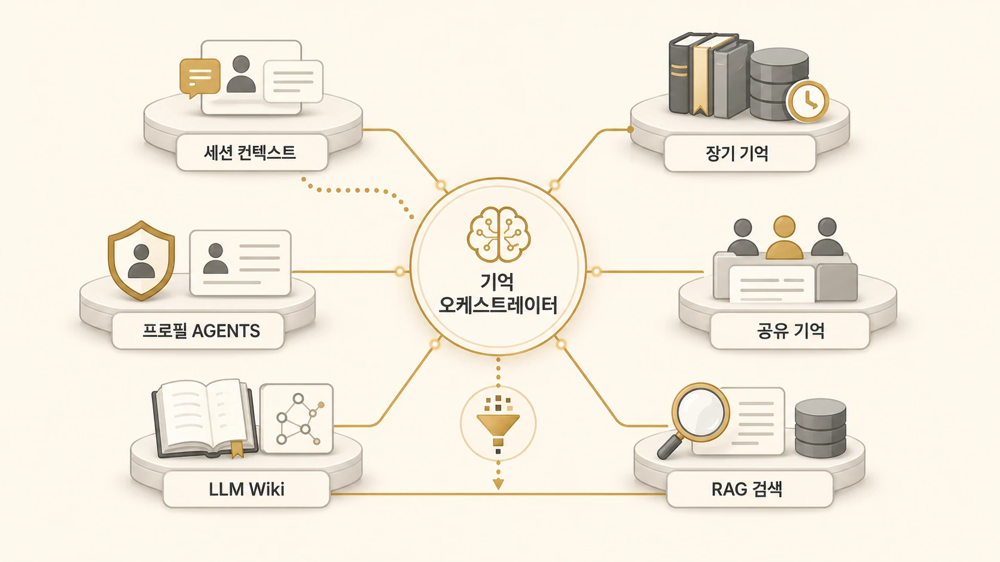

## 4장. AI 에이전트 기억 시스템은 어떻게 설계해야 할까

역할을 나누면 곧바로 기억 문제가 생긴다. 조사형은 근거를 다시 찾아야 하고, 정리형은 독자와 문체 기준을 기억해야 하며, 실행형은 파일과 검증 상태를 확인해야 한다. AI 개인비서를 오래 쓰다 보면 “왜 이건 기억하고, 저건 또 모를까?”라는 순간이 오는데, 이 문제는 모델 성능보다 기억을 어디에 두고 어떤 순서로 꺼내는가에 가깝다.



에르메스 에이전트(Hermes Agent)의 기억은 하나의 저장소가 아니다. 지금 대화의 session, 장기 선호를 담는 memory, 역할과 권한을 나누는 profile/AGENTS.md, 팀 공통 기준을 담는 shared-memory, 누적 지식 원장인 Obsidian LLM Wiki, 그리고 OpenViking/RAG 같은 외부 회수층이 서로 다른 일을 맡는다.

## 이 장에서 다루는 문제

| 질문 | 잘못 접근하면 생기는 문제 | 이 장에서 잡을 기준 |
|---|---|---|
| AI 개인비서는 무엇을 기억해야 할까 | 모든 기록을 memory에 넣으려 함 | 다시 판단할 기준만 장기 기억으로 남김 |
| session/memory/profile은 어떻게 다를까 | 현재 대화와 장기 규칙이 섞임 | 단기 맥락/장기 규칙/실행 주체를 분리 |
| AGENTS.md와 USER.md는 왜 필요한가 | 에이전트 역할과 사용자 선호가 뒤섞임 | 역할 기억과 사용자 기억을 분리 |
| shared-memory는 어디에 쓰나 | 팀 공통 기준이 개인 memory에 흩어짐 | 공용 규칙/인덱스/handoff를 한 층으로 관리 |
| Obsidian은 어디에 놓을까 | 콘텐츠 자료로만 좁게 봄 | 외부 장기 기억/운영 원장/LLM Wiki로 운영 |
| OpenViking/RAG는 왜 필요한가 | 모든 지식을 프롬프트에 넣으려 함 | 필요할 때 검색/회수하는 기억 강화층을 둠 |
| SOUL.md는 어디에 쓰나 | 성격과 작업 규칙을 한 파일에 섞음 | 정체성은 SOUL.md, 운영 규칙은 AGENTS.md로 나눔 |

## 기억은 하나가 아니라 층이다

| 기억층 | 맡는 역할 | 넣으면 안 되는 것 |
|---|---|---|
| session | 현재 대화의 요청/범위/임시 맥락 | 오래 유지될 규칙 |
| memory / USER.md | 반복 선호/장기 규칙/사용자 기준 | 작업 로그/긴 원문 |
| AGENTS.md / SOUL.md / profile | 에이전트 역할/말투/권한/도구 경계 | 프로젝트별 임시 상태 |
| shared-memory | 팀 공통 규칙/인덱스/handoff/작업 원본 | 개인 취향만 담긴 기록 |
| Obsidian LLM Wiki | 누적 지식/운영 원장/연결형 지식베이스 | 즉시 실행해야 할 짧은 지시 |
| OpenViking / RAG | 외부 지식 회수/기억 강화 | 검증되지 않은 원자료 전체 |
| session_search / GitHub log | 과거 작업 회수/변경 이력 확인 | 항상 주입할 장기 기억 |
| WikiDocs | 함께 읽을 지식으로 정리한 결과물 | 드러내면 안 되는 세부값과 운영 흔적 |

이 구조가 잡혀야 [AI 개인비서 메인 창구](https://wikidocs.net/345891)도 안정된다. 메인 창구가 모든 기억을 직접 들고 있는 것이 아니라, 어떤 층을 먼저 봐야 하는지 판단하기 때문이다.

## 실제 운영에서 기억 기준이 흔들리는 장면

새 정보가 들어오면 바로 저장하는 것이 능사는 아니다. 사람 선호인지, 팀 운영 규칙인지, 프로젝트 지식인지, 반복 절차인지, 과거 작업 회상인지 먼저 나눠야 한다. 그다음 memory, shared-memory, Obsidian, Skill, session_search 중 어느 층에 둘지 정한다.

```text
새 정보
  ↓
사람 선호 / 팀 규칙 / 프로젝트 지식 / 반복 절차 / 과거 회상으로 분류
  ↓
memory / USER.md / AGENTS.md / shared-memory / Obsidian / Skill / session_search / RAG 중 선택
  ↓
필요하면 WikiDocs에서 함께 읽을 수 있는 지식으로 재작성
```

이 장을 따로 둔 이유도 여기에 있다. 기억 이야기가 여러 장에 흩어지면 독자는 “그래서 어디에 남기라는 건가?”에서 막힌다. 4장은 memory 기능 소개가 아니라 AI 팀의 지식층을 설계하는 장이다.

## 기억 시스템으로 남길 산출물

| 남아야 할 것 | 확인 질문 | 연결되는 글 |
|---|---|---|
| 기억 배치표 | session/memory/profile/shared-memory/Obsidian/RAG 중 어디에 둘지 판단할 수 있는가 | [session/memory/profile 경계](https://wikidocs.net/346126) |
| 역할 문서 기준 | AGENTS.md, USER.md, SOUL.md, Skill을 섞지 않았는가 | [AGENTS.md와 USER.md](https://wikidocs.net/346127) / [SOUL.md](https://wikidocs.net/346292) |
| 팀 공통 기억 기준 | 개인 선호와 팀 공통 규칙을 분리했는가 | [shared-memory](https://wikidocs.net/346128) |
| 회수/복구 기준 | 긴 대화와 외부 기억층에서 필요한 정보를 다시 찾을 수 있는가 | [context compaction](https://wikidocs.net/346132) / [OpenViking과 RAG](https://wikidocs.net/346131) |

## 다음 장으로 가기 전 체크 질문

1. 지금 남기려는 정보는 단기 맥락인가, 장기 규칙인가?
2. 이 정보는 개인 에이전트가 기억해야 하나, 팀 전체가 함께 봐야 하나?
3. 누적 지식으로 연결해야 할 내용인데 memory에 넣으려 하고 있지는 않은가?
4. 검색/회수해야 할 지식인데 프롬프트에 계속 붙이려 하고 있지는 않은가?
5. 도구 자동화가 같은 기준을 보도록 원본 기준이 정리되어 있는가?
