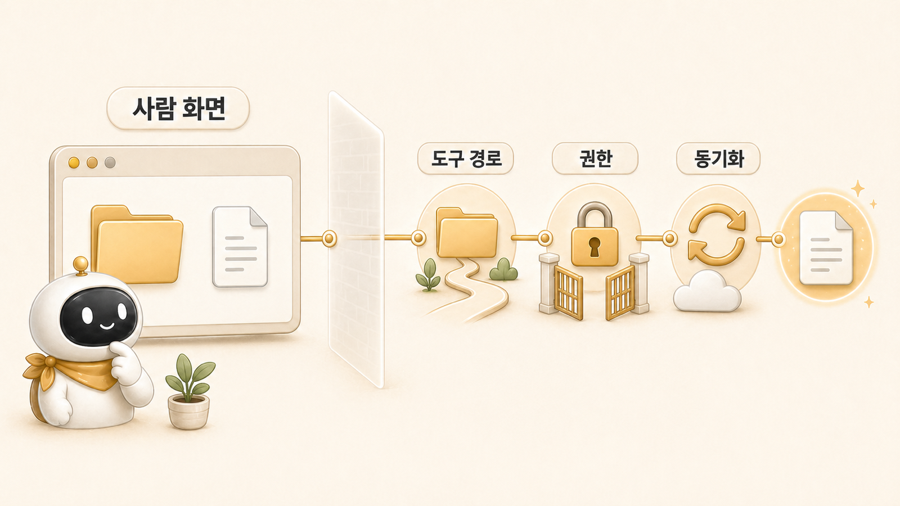

## 파일은 있는데 도구는 왜 못 읽을까

사람 눈에는 파일이 있는데 AI 도구는 못 읽는 일이 있다. 이때 바로 “도구가 이상하다”고 보면 해결이 늦어진다. 파일 존재, 경로, 권한, 동기화, 실행 profile은 서로 다른 문제다.

Hermes Agent 운영에서는 특히 Obsidian, iCloud, GitHub repo, profile별 HOME이 섞일 때 이 문제가 자주 보인다. 사람이 Finder에서 보는 위치와 도구가 실행되는 환경이 다르면 같은 파일도 없는 것처럼 보인다.

## 파일이 없는 것과 못 읽는 것은 다르다

| 증상 | 먼저 볼 것 | 판단 기준 |
|---|---|---|
| 경로를 찾지 못함 | 절대경로/상대경로 | 현재 workdir가 맞는가 |
| 파일이 동기화되지 않음 | iCloud/Obsidian 상태 | 로컬에 실제 파일이 내려와 있는가 |
| 권한이 없음 | tool 권한/profile | 읽기 가능한 profile에서 실행 중인가 |
| GitHub에는 있는데 로컬에 없음 | git pull/status | source of truth와 작업트리가 맞는가 |
| 이미지가 깨짐 | 상대경로 기준 | page 파일 위치에서 asset 경로가 맞는가 |

이 문제는 [memory/profile/session](https://wikidocs.net/345899) 경계와도 연결된다. 같은 요청을 해도 profile이 다르면 HOME, config, token, 사용 가능한 도구가 다를 수 있다.

## 실제 운영 장면: HALOX Brain과 shared-memory 경계

HaloX 운영 기록은 Obsidian/HALOX Brain, shared-memory, memory로 나뉜다. 사람이 보기에는 모두 “기록”이지만 도구 입장에서는 위치와 접근 방식이 다르다. HaloX 관련 질문을 할 때 generic Obsidian 경로를 기본값으로 잡으면 엉뚱한 볼트를 볼 수 있고, shared-memory 원본을 보지 않으면 최신 운영 규칙을 놓칠 수 있다.

그래서 운영 기준은 “어디엔가 있다”가 아니라 “어느 계층의 어떤 원본을 봐야 하는가”로 바뀌어야 한다. WikiDocs 원고도 마찬가지다. 공개 본문은 WikiDocs에 보이지만 원본 수정은 GitHub repo에서 해야 한다.

## 실제 운영 장면: WikiDocs 이미지와 링크

WikiDocs 본문 이미지는 사람이 화면에서 볼 때는 괜찮아 보여도, GitHub 원본 기준 상대경로가 틀리면 PDF나 WikiDocs 동기화에서 깨질 수 있다. 또 본문 내부 링크도 GitHub `.md` 링크로는 로컬에서 자연스러워 보였지만, WikiDocs 독자 화면에서는 제대로 동작하지 않았다.

이 문제는 도구 실패가 아니라 배포 채널의 경로 기준을 잘못 잡은 문제였다. 그래서 본문 내부 링크는 WikiDocs page ID URL로 바꾸고, `TOC.md`만 GitHub 구조에 맞춰 `.md` 링크를 유지했다.

## 운영 기준

1. 사람이 본 위치와 도구가 실행되는 위치를 분리해서 본다.
2. 상대경로가 실패하면 절대경로와 workdir를 먼저 확인한다.
3. Obsidian/iCloud 파일은 로컬 동기화 상태를 확인한다.
4. profile별 HOME과 tool 권한을 확인한다.
5. GitHub-linked WikiDocs에서는 원본 수정과 공개 페이지 링크 기준을 나눠 본다.
6. 공개 문서에는 개인 경로, 계정명, token 위치 같은 내부값을 쓰지 않는다.

## FAQ

### Finder에서 보이면 도구도 읽을 수 있는 것 아닌가요?

아니다. Finder에서 보이는 것과 도구 실행 환경에서 접근 가능한 것은 다르다. 특히 iCloud 동기화, sandbox, profile HOME 차이가 있으면 같은 파일도 다르게 보인다.

### 상대경로와 절대경로 중 무엇을 써야 하나요?

문서에는 상대경로가 좋고, 작업 중 도구 확인에는 절대경로가 안전하다. 원인을 찾을 때는 절대경로로 확인한 뒤, 공개 문서에는 repo 기준 상대경로로 정리한다.

### 이 문제는 5장 도구 자동화와도 관련 있나요?

그렇다. [MCP/cron/gateway](https://wikidocs.net/345907)는 모두 실행 환경과 권한을 탄다. 파일 접근 경계를 모르면 자동화 실패도 원인 분리가 어렵다.

## 다음 글

다음은 [과거 유산과 현재 기준은 어떻게 나눌까](https://wikidocs.net/345915)에서 예전 설정과 현재 운영 기준이 섞일 때의 정리법을 본다.
