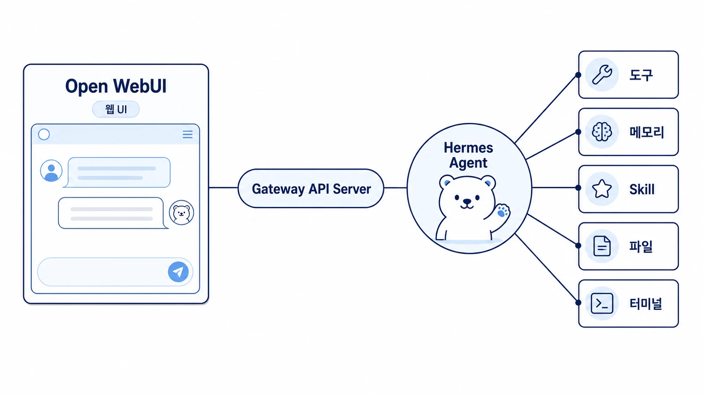

## Hermes Agent Gateway로 Open WebUI 붙이기: 웹에서 쓰는 AI 개인비서 만들기

에르메스 에이전트(Hermes Agent)는 터미널에서만 쓰는 도구가 아니다. Gateway의 API Server를 켜면 OpenAI 호환 엔드포인트처럼 연결할 수 있고, Open WebUI 같은 웹 인터페이스에서 AI 개인비서처럼 사용할 수 있다. 이 구조는 Hermes Agent 공식 문서의 Open WebUI Integration 흐름을 바탕으로 한다.

다만 핵심은 Open WebUI 자체가 아니다. 중요한 것은 Hermes Agent가 CLI, Slack, cron, MCP뿐 아니라 웹 UI에서도 같은 에이전트 경험을 제공할 수 있다는 점이다. 그래서 이 연동은 “웹 화면이 있는 챗봇 만들기”가 아니라, 나만의 AI 팀을 보여주는 데모 입구로 보는 편이 좋다.

[TOC]

## 이 연동을 하면 무엇이 좋아질까

Open WebUI를 붙이면 Hermes Agent의 장점을 비개발자에게 설명하기 쉬워진다. 터미널 화면보다 웹 채팅 화면이 익숙하고, 대화 기록/사용자 계정/모델 선택 UI가 이미 준비되어 있기 때문이다.

| 좋아지는 점 | 의미 |
|---|---|
| 데모가 쉬워진다 | 터미널 명령보다 웹 화면이 직관적이다 |
| 비개발자도 이해하기 쉽다 | “로컬 AI 에이전트 허브”를 웹 AI 개인비서처럼 보여줄 수 있다 |
| 운영 확장성이 보인다 | 같은 Hermes Agent를 WebUI/Slack/CLI/cron으로 확장할 수 있다 |
| 역할형 에이전트 설명이 쉬워진다 | 분석/작성/요약 같은 역할 분담을 한 화면에서 보여줄 수 있다 |
| 교육/세일즈 콘텐츠가 된다 | 설치 → 연결 → 업무 요청 → 결과 합성 흐름을 짧게 시연할 수 있다 |

즉 이 구성의 가치는 “Open WebUI가 예쁘다”가 아니라, Hermes Agent가 API Server를 통해 여러 인터페이스와 연결될 수 있다는 점을 눈으로 보여주는 데 있다.

## 전체 구조

전체 흐름은 단순하다.

```text
사용자
↓
Open WebUI
↓
Hermes Gateway/API Server
↓
Hermes Agent
↓
도구/메모리/Skill/파일/터미널
```

Open WebUI는 Hermes Agent를 OpenAI 호환 API처럼 호출한다. 사용자는 웹 화면에 메시지를 입력하고, Hermes Agent는 기존처럼 도구, 메모리, Skill, 파일, 터미널을 사용할 수 있다. 응답은 다시 Open WebUI의 채팅 화면으로 돌아온다.

이 구조를 이해하면 [always-on gateway](https://wikidocs.net/345906)와 [Hermes Agent 도구 실행 결과 검증](https://wikidocs.net/346290)이 왜 중요한지도 보인다. Gateway가 켜졌다는 사실과 사용자가 원하는 화면에서 결과를 받는 것은 별도 검증 대상이다.



## Docker가 꼭 필요할까

Hermes Agent 자체에는 Docker가 필요하지 않다. 로컬에 Hermes Agent를 설치하고 Gateway/API Server를 실행하면 된다.

Docker가 주로 필요한 곳은 Open WebUI를 빠르게 띄우는 단계다. Open WebUI를 직접 설치할 수도 있지만, 데모나 실습에서는 Docker 방식이 가장 간단하다.

| 구성 요소 | Docker 필요 여부 | 이유 |
|---|---|---|
| Hermes Agent 설치/실행 | 필요 없음 | 로컬 CLI로 설치/실행 가능하다 |
| Hermes Gateway/API Server | 필요 없음 | 로컬 프로세스로 실행할 수 있다 |
| Open WebUI 빠른 실행 | 권장 | 공식 예시와 실습 흐름이 Docker 중심이다 |
| 운영 서버 배포 | 선택 | 재현성/재시작/volume 관리가 필요하면 유용하다 |

처음 배우는 독자에게는 이렇게 설명하면 충분하다.

> Hermes Agent는 Docker 없이도 쓸 수 있다. 다만 Open WebUI를 웹 대시보드처럼 빠르게 붙이려면 Docker가 가장 쉽다.

Docker와 Gateway의 더 넓은 운영 기준은 [Hermes Agent Docker/Gateway는 언제 필요할까](https://wikidocs.net/346139)에서 이어서 볼 수 있다.

## 빠른 설정 흐름

아래 흐름은 공식 Open WebUI Integration 문서의 핵심을 WikiDocs 실습용으로 정리한 것이다. 실제 명령은 설치 버전과 운영 환경에 따라 달라질 수 있으므로, 발행 전에는 현재 공식 문서와 로컬 CLI를 함께 확인한다.

### 1. Hermes Agent 설치 확인

이미 설치했다면 버전부터 확인한다.

```bash
hermes --version
```

처음 설치하는 경우에는 [Hermes Agent 설치와 세팅](https://wikidocs.net/346137)을 먼저 확인한다.

### 2. API Server 활성화

`~/.hermes/.env`에 API Server 설정을 추가한다.

```env
API_SERVER_ENABLED=true
API_SERVER_KEY=your-secret-key
```

공유 문서나 스크린샷에는 실제 key를 남기지 않는다. 실습 문서에서는 `your-secret-key`처럼 예시값만 사용한다.

### 3. Gateway 실행

현재 CLI 기준으로는 foreground 실행을 명확히 쓰려면 다음처럼 실행한다.

```bash
hermes gateway run
```

공식 문서나 일부 예시에서 `hermes gateway`처럼 짧게 보일 수 있지만, 실제 CLI에서는 `run`, `start`, `setup`, `status` 같은 하위 명령을 확인하는 편이 안전하다.

실행 후 로그에서 API Server가 열렸는지 확인한다.

```text
[API Server] API server listening on http://127.0.0.1:8642
```

### 4. Open WebUI 실행

Open WebUI를 Docker로 실행한다.

```bash
docker run -d -p 3000:8080 \
  -e OPENAI_API_BASE_URL=http://host.docker.internal:8642/v1 \
  -e OPENAI_API_KEY=your-secret-key \
  --add-host=host.docker.internal:host-gateway \
  -v open-webui:/app/backend/data \
  --name open-webui --restart always \
  ghcr.io/open-webui/open-webui:main
```

브라우저에서 다음 주소를 연다.

```text
http://localhost:3000
```

처음 접속한 사용자가 admin 계정이 된다. 이후 Open WebUI에서 Hermes Agent가 모델처럼 보이는지 확인하고, 간단한 메시지부터 테스트한다.

## 데모 시나리오

이 연동은 단순히 “웹에서 답변이 나온다”를 보여주는 것보다, 업무 흐름을 나눠 처리하는 장면으로 보여줄 때 더 설득력이 있다.

예를 들어 Open WebUI에서 이렇게 요청한다.

```text
지난 4주 채널별 ROAS 비교표를 만들고,
핵심 인사이트를 3줄로 요약해줘.
그리고 이 결과를 바탕으로 45자 광고 카피 3안도 만들어줘.
```

이 요청은 하나의 문장처럼 보이지만 실제로는 여러 역할이 섞여 있다.

| 요청 부분 | 맡기기 좋은 역할 | 결과물 |
|---|---|---|
| 채널별 ROAS 비교 | 분석형 에이전트/분석 Skill | 표/비교/이상치 |
| 핵심 인사이트 3줄 | 정리형 에이전트/요약 Skill | 짧은 판단 메모 |
| 45자 광고 카피 3안 | 작성형 에이전트/카피 Skill | 카피 후보 |

이때 WikiDocs에서는 `writer.skill.toml`, `analyst.skill.toml` 같은 예시를 공식 스킬 포맷처럼 단정하지 않는 편이 안전하다. Hermes Agent의 공식 Skill 운영은 [Hermes Agent Skill은 무엇이고 언제 만들까](https://wikidocs.net/345904)와 [역할형 에이전트별 Skill은 어떻게 나눌까](https://wikidocs.net/346237)에서 설명하는 `SKILL.md` 기반 흐름과 구분해서 다룬다.

## 이 데모가 보여주는 것

Open WebUI 연동 데모가 보여주는 핵심은 세 가지다.

첫째, Hermes Agent는 터미널 안에 갇힌 도구가 아니다. Gateway/API Server를 통해 웹 UI, Slack, cron, webhook 같은 외부 입구와 연결될 수 있다.

둘째, 사용자는 하나의 웹 화면에서 요청하지만, 내부에서는 도구 실행, 기억 참조, 파일 작업, Skill 활용 같은 여러 작업이 이어질 수 있다. 이 점이 단순 AI 챗봇과 AI 개인비서를 가르는 차이다.

셋째, 같은 Hermes Agent를 여러 채널에서 사용할 수 있다. Open WebUI는 웹 데모에 좋고, Slack은 업무 채널 운영에 좋고, CLI는 빠른 진단과 로컬 작업에 좋다. 중요한 것은 채널을 많이 늘리는 것이 아니라, 어떤 업무를 어느 입구에서 받을지 정하는 것이다.

## 실행 검증 체크리스트

WikiDocs에 이 내용을 넣기 전이나 실습에서 안내할 때는 아래 순서로 검증한다.

- `hermes --version`으로 설치와 버전을 확인했는가?
- `.env`에 `API_SERVER_ENABLED=true`와 `API_SERVER_KEY`가 들어갔는가?
- `hermes gateway run` 실행 후 `127.0.0.1:8642` 로그가 보이는가?
- Docker에서 Open WebUI 컨테이너가 정상 실행 중인가?
- Open WebUI가 `http://host.docker.internal:8642/v1`로 Hermes Agent에 연결되는가?
- 첫 메시지에 Hermes Agent가 실제로 응답하는가?
- 도구 사용이 필요한 요청에서 tool 권한/로그/결과가 확인되는가?
- 공유 문서에 실제 API key나 내부 token이 노출되지 않았는가?

이 체크리스트는 연결 성공만 보는 것이 아니라, 실제 사용자가 웹 화면에서 응답을 받는지까지 확인하기 위한 것이다.

## 자주 헷갈리는 지점

### Open WebUI를 붙이면 Hermes Agent 공식 기능인가요?

Open WebUI 자체는 별도 프로젝트다. 다만 Hermes Agent 공식 문서에는 API Server를 이용해 Open WebUI를 연결하는 Integration 흐름이 있다. 따라서 “Hermes Agent의 공식 Open WebUI 연동 가이드에 기반한 외부 UI 연결”이라고 표현하는 것이 정확하다.

### Docker 없이도 할 수 있나요?

Hermes Agent와 Gateway/API Server는 Docker 없이 실행할 수 있다. Docker는 Open WebUI를 빠르게 띄우기 위한 권장 방식에 가깝다. 직접 설치 방식도 가능하지만 초보자 실습이나 데모에서는 Docker가 더 단순하다.

### Open WebUI를 붙이면 Slack이 필요 없어지나요?

아니다. Open WebUI와 Slack은 역할이 다르다. Open WebUI는 웹 화면에서 대화하고 데모하기 좋고, Slack은 실제 팀 업무 채널에서 호출하고 결과를 받기 좋다. 둘 중 하나가 다른 하나를 대체한다기보다, 같은 Hermes Agent를 어떤 입구로 사용할지 고르는 문제다.

### 역할형 에이전트도 자동으로 생기나요?

Open WebUI를 붙인다고 역할형 에이전트가 자동으로 생기지는 않는다. 역할 분담은 Hermes Agent의 profile, Skill, toolset, 위임 방식, 운영 규칙으로 설계해야 한다. Open WebUI는 그 결과를 보여주는 인터페이스에 가깝다.

## 다음으로 이어질 글

이 글을 이해했다면 다음에는 세 방향으로 이어갈 수 있다.

- 상시 운영을 고민한다면 [always-on gateway는 왜 자주 헷갈릴까](https://wikidocs.net/345906)를 본다.
- 반복 절차를 역할별로 나누고 싶다면 [Hermes Agent Skill 운영](https://wikidocs.net/346235)으로 넘어간다.
- Slack/cron까지 붙여 실제 자동화를 만들고 싶다면 [Daily Briefing Bot workflow](https://wikidocs.net/345926)와 [Hermes Agent에서 일을 나누는 네 가지 실행 방식](https://wikidocs.net/346124)을 함께 본다.
