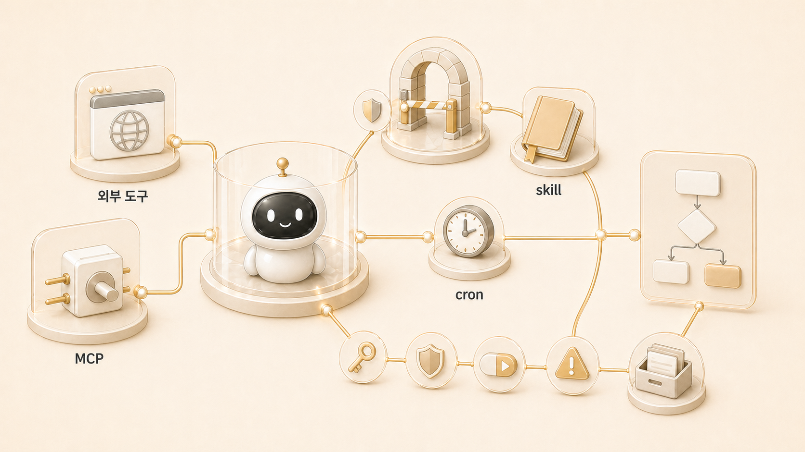

## 5장. 외부 도구/MCP/자동화 운영

Hermes Agent가 강해지는 순간은 답변을 잘할 때가 아니라 외부 도구와 연결되어 실제 업무를 움직일 때다. Google Workspace, MCP, skill, cron, gateway, Daily Briefing Bot은 모두 “기능 목록”이 아니라 업무 흐름을 이어주는 연결 장치다.

하지만 외부 도구는 붙였다고 끝나지 않는다. 계정이 맞는지, 권한 범위가 맞는지, gateway가 살아 있는지, cron prompt가 혼자 실행될 만큼 충분한지, 결과가 어디로 전달되는지까지 봐야 한다. 5장은 바로 이 운영 기준을 다룬다.

## 이 장에서 다루는 문제

| 기능 | 흔한 착각 | 실제 운영 기준 |
|---|---|---|
| MCP | 연결만 되면 자동화가 끝난다 | 어떤 업무 흐름에 붙을지 먼저 정한다 |
| Google Workspace | API 인증만 되면 된다 | 계정/권한/삭제 위험/공유 범위를 분리한다 |
| skill | 많이 만들수록 좋다 | 반복 절차와 검증 기준이 있을 때 만든다 |
| gateway | status가 OK면 끝이다 | 메시징 delivery, cron 실행, 로그를 함께 본다 |
| Daily Briefing Bot | 뉴스 요약 예제다 | fresh session 기반 자동화 패턴이다 |
| 실행 방식 | 에이전트를 나누면 알아서 운영된다 | 직접 처리/profile/delegation/subagent/cron을 구분한다 |

## 공식 docs 기능별 mini 정의

공식 Hermes Agent 문서를 5장에서 그대로 옮기지는 않는다. 대신 독자가 기능명을 검색했을 때 바로 이해할 수 있도록 “공식 기능의 뜻”과 “실제 운영에서 봐야 할 기준”을 나눠서 읽게 한다.

| 기능 | 공식 기준으로 보는 뜻 | 실제 운영에서의 질문 |
|---|---|---|
| MCP | 외부 서비스와 도구를 Hermes Agent 대화 흐름에 연결하는 방식 | 어떤 계정/권한/scope로 연결했고, 위험 작업은 어디서 멈출 것인가 |
| cron | 정해진 시간이나 주기에 fresh session으로 작업을 실행하는 예약 자동화 | prompt가 혼자 실행될 만큼 충분하고, 결과가 어디로 전달되는가 |
| skill | 반복 절차, 도구 사용법, 실패 패턴, 검증 기준을 재사용하는 운영 지식 | 이번 일은 기억할 선호인가, 반복 절차인가, 예약 실행인가 |
| gateway | 메시징 플랫폼, cron 실행, delivery를 이어주는 always-on 운영 축 | process가 살아 있는 것과 실제 메시지가 도착한 것을 구분했는가 |
| Daily Briefing Bot | cron, search, summarization, messaging delivery가 묶인 예제 | 뉴스 요약을 넘어 정기 모니터링/신호 분류/후속 실행으로 확장할 수 있는가 |
| delegation/subagent | 작업을 하위 에이전트나 별도 실행 단위로 나누는 방식 | 역할 분리와 실행 방식을 섞지 않고 최종 통합자를 정했는가 |

## 실제 운영 장면

WikiDocs 작업에서도 외부 도구 운영 기준이 계속 등장했다. GitHub가 source of truth였고, WikiDocs는 공개 배포 채널이었다. 그래서 원고를 고친 뒤에는 “파일이 바뀌었는가”만 보지 않고, 공개 화면에서 본문 링크와 이미지가 제대로 작동하는지까지 확인해야 했다. 실제로 본문 링크가 `.md`로 남아 WikiDocs에서 raw 파일 경로처럼 보일 위험이 생겼고, WikiDocs page ID를 확인해 공개 URL로 바꾸는 작업이 필요했다.

또 다른 장면은 콘텐츠 자동화다. 방울이의 크론 조사는 매일 신호를 찾고, 좋은 신호만 shared-memory와 Obsidian으로 이어진다. 사용자가 “넘겨”라고 판단하면 뽀동이가 본문 구조를 만들고, 하비가 최종 통합하며, 필요하면 하망이가 이미지를 만든다. 여기서 cron은 신호를 찾는 장치이고, shared-memory는 handoff 위치이며, WikiDocs는 공개 자산이 된다. 이것은 단일 기능이 아니라 [역할형 에이전트](https://wikidocs.net/345925)와 도구가 연결된 운영 흐름이다.

## 이 장에서 얻을 기준

- MCP는 “도구 연결”이지 “운영 완성”이 아니다.
- cron은 혼자 실행되는 fresh session이므로 prompt 안에 필요한 맥락이 있어야 한다.
- skill은 반복 가능한 절차, 실패 패턴, 검증 방법이 생겼을 때 만든다.
- gateway는 항상 켜져 있다는 느낌보다 실제 전달/로그/상태를 함께 봐야 한다.
- 외부 도구 작업에는 삭제/공개/권한 변경 같은 위험 작업을 분리하는 승인 기준이 필요하다.

5장을 읽을 때 핵심은 “무슨 도구를 붙였나”가 아니다. 같은 작업도 사람이 즉시 시키는 on-demand 호출인지, 매일 혼자 도는 cron인지, 반복 절차로 남길 skill인지에 따라 필요한 맥락과 검증이 달라진다.

이 기준은 [AI 에이전트 기억 시스템](https://wikidocs.net/345902)와 이어진다. 도구 자동화가 실패할 때도 많은 원인은 모델이 아니라 profile, 권한, 경로, source of truth 경계에 있다.

## 다음 장으로 가기 전 체크 질문

1. 이 일은 on-demand 도구 호출인가, cron 자동화인가?
2. 반복 절차가 skill로 남길 만큼 안정됐는가?
3. gateway가 살아 있는 것과 실제 메시지 delivery가 되는 것을 구분했는가?
4. 권한 변경/삭제/외부 공개처럼 승인 필요한 작업을 분리했는가?

## 이어서 읽기

먼저 [Google Workspace와 MCP 연동은 왜 오래 걸릴까](https://wikidocs.net/345903)를 읽고, 이어서 [Hermes Agent 스킬은 언제 만들고 어떻게 관리할까](https://wikidocs.net/345904)로 넘어가면 도구 연결과 절차 재사용의 차이가 보인다. 역할을 실제로 어떻게 움직일지는 [Hermes Agent에서 일을 나누는 네 가지 실행 방식](https://wikidocs.net/346124)에서 이어서 본다.
