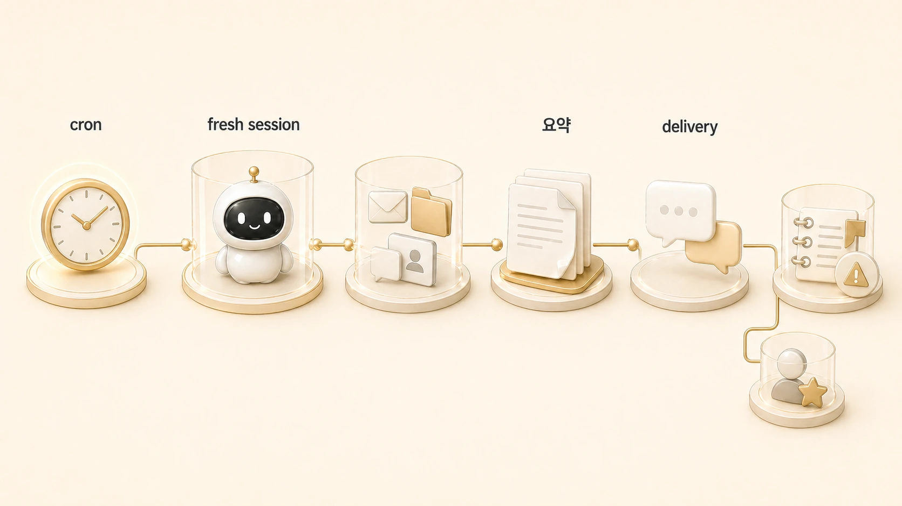

## Hermes Agent cron과 Daily Briefing Bot은 어떻게 작동할까

Daily Briefing Bot은 단순한 뉴스 요약 예제가 아니다. Hermes Agent에서 반복 업무를 자동화할 때 필요한 기본 패턴을 보여준다. 정해진 시간에 fresh session이 열리고, 필요한 자료를 찾고, 판단 기준에 맞게 요약하고, 정해진 대상에게 전달한다.

이 패턴은 HaloX 운영에서도 그대로 쓰인다. 구체적인 흐름은 [크론 조사에서 WikiDocs 발행까지 이어지는 AI 업무 자동화 케이스](https://wikidocs.net/345992)에서 더 자세히 볼 수 있다. 방울이의 매일 아침 SEO/GEO 모니터링은 “새로운 변화가 있는지 찾고, 강한 신호만 골라, 필요한 곳으로 넘기는” 자동화다. 사용자가 `넘겨`라고 판단하면 뽀동이/하비/하망이까지 이어지는 콘텐츠 제작 흐름이 시작된다.

## 이 예제가 중요한 이유

| 구성 요소 | Daily Briefing Bot에서의 의미 | 실제 운영 확장 |
|---|---|---|
| cron | 정해진 시간 실행 | 매일 모니터링/주간 리뷰/정기 요약 |
| fresh session | 이전 대화에 의존하지 않음 | prompt 안에 필요한 맥락 포함 |
| search/tool | 새 정보 수집 | 웹, Slack, Obsidian, GitHub 확인 |
| summarization | 읽을 수 있게 압축 | 보고서/브리프/콘텐츠 초안 |
| delivery | 결과 전달 | Slack thread, home channel, local output |

## 실제 운영 장면: 크론 조사에서 콘텐츠 제작으로

방울이의 정기 조사는 매일 같은 질문을 반복하지 않는다. watchlist와 기존 인덱스를 보고, 전일 기준 새로 생긴 변화 중 의미 있는 신호만 고른다. 제품 신호와 콘텐츠 신호도 분리한다. 이 분리는 단순한 보고 양식이 아니라 후속 실행을 바꾸는 기준이다.

콘텐츠 신호가 강하면 뽀동이가 글 구조를 만들고, 하비가 최종 통합하며, 하망이가 이미지 제작 방향을 맡는다. 이 흐름은 [WikiDocs/블로그/강의 콘텐츠 시스템](https://wikidocs.net/345911)과 연결된다. 자동화는 “요약 보내기”에서 끝나는 것이 아니라 다음 역할에게 넘길 수 있어야 한다.

## fresh session이 핵심이다

cron job은 사람이 옆에서 설명해 주지 않는다. 그래서 prompt는 self-contained해야 한다. 어떤 자료를 먼저 볼지, 어떤 기준으로 신호를 고를지, 결과를 어디로 보낼지, 공개하면 안 되는 내부값을 어떻게 다룰지까지 포함해야 한다.

나쁜 cron prompt는 “오늘도 정리해줘”처럼 짧다. 좋은 cron prompt는 목적, 입력 출처, 제외 기준, 출력 형식, delivery target, 실패 시 보고 기준을 갖는다.

예를 들어 좋은 프롬프트는 “어제 이후 새로 나온 AI 검색/콘텐츠/제품 신호를 찾고, 이미 다룬 항목은 제외하고, 콘텐츠 후보와 제품 후보를 나눠서, 근거 링크와 다음 액션을 함께 보고하라”처럼 스스로 판단할 기준을 담는다. 반대로 “오늘 AI 뉴스 정리해줘”는 fresh session에서 너무 많은 것을 추측하게 만든다.

## 공식 기준 mini 정의: Hermes Agent cron

Hermes Agent cron은 정해진 시간이나 주기에 작업을 실행하는 예약 자동화다. 중요한 점은 cron이 기존 대화의 연장이 아니라 fresh session으로 열린다는 것이다.

따라서 cron을 만들 때는 schedule, prompt, 필요한 도구, context source, delivery target, 실패 시 보고 기준을 한 세트로 설계해야 한다. Daily Briefing Bot은 이 기준을 가장 단순하게 보여주는 예제다. 정해진 시간에 새 정보를 찾고, 기준에 맞게 요약하고, 메시징 플랫폼으로 전달한다. 이 패턴이 반복되면 [반복 업무를 Skill로 바꾸는 기준](https://wikidocs.net/346236)을 적용해 prompt, 검증, 보고 형식을 재사용 가능하게 남긴다.

## 실패할 때 먼저 볼 것

1. schedule이 의도한 시간대와 맞는가?
2. prompt가 fresh session에서도 이해될 만큼 충분한가?
3. 필요한 도구와 인증 범위가 현재 profile에서 접근 가능한가?
4. gateway가 실행 중이고 delivery target이 맞는가?
5. 결과가 없을 때도 운영 확인 메시지를 남기도록 되어 있는가?

## FAQ

### Daily Briefing Bot은 뉴스 요약에만 쓰나요?

아니다. 모니터링, 제품 신호 분류, 콘텐츠 아이디어 수집, 주간 리뷰 같은 반복 업무의 기본 틀로 볼 수 있다.

### cron prompt는 왜 길어야 하나요?

cron은 독립 실행된다. 현재 대화 맥락을 기대하면 실패한다. 필요한 기준은 prompt 안에 있어야 한다.

### 결과를 어디로 보내야 하나요?

작업 성격에 따라 다르다. 즉시 사람이 볼 것은 Slack, 장기 원장은 Obsidian/shared-memory, 테스트 결과는 local output이 맞을 수 있다.

## 다음 글

다음은 [Hermes Agent에서 일을 나누는 네 가지 실행 방식](https://wikidocs.net/346124)으로 넘어가서 자동화, profile 직접 호출, delegation, 독립 subagent 실행을 어떻게 구분하는지 본다.
