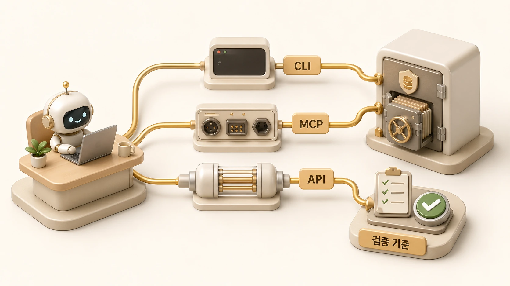

## GitHub CLI와 MCP/API 연결은 어떻게 다를까

에르메스 에이전트(Hermes Agent)에서 GitHub 작업을 자동화할 때는 GitHub CLI, MCP, API를 구분해야 한다. 셋 다 GitHub와 연결할 수 있지만, `GitHub CLI MCP API`, `Hermes Agent GitHub CLI`, `Hermes Agent MCP API` 관점에서 보면 실행 방식과 검증 기준이 다르다.

GitHub는 원본 기준이 되기 쉽다. [GitHub와 WikiDocs로 콘텐츠를 발행하고 고치는 흐름](https://wikidocs.net/345994)에서도 원고를 고치고, 검증하고, GitHub 원본에 반영한 뒤 공개 페이지를 확인하는 흐름은 GitHub가 중심이었다. 그래서 GitHub 연결은 “편의 기능”이 아니라 발행/검증/복구 기준과 함께 설계해야 한다.

[TOC]

## 세 방식의 차이

| 방식 | 강점 | 주의할 점 | 어울리는 작업 |
|---|---|---|---|
| CLI | 로컬 인증과 기존 개발자 워크플로우를 재사용하기 쉽다 | 실행 환경/HOME/path에 따라 인증이 달라질 수 있다 | git status, gh issue/pr 조회, 원격 반영 검증 |
| MCP | 에이전트가 tool 목록으로 이해하기 쉽다 | server 설정, scope, tool permission을 관리해야 한다 | 이슈/PR/파일 정보를 대화 흐름에 붙이기 |
| API | 세밀한 제어와 배치 자동화에 좋다 | token scope, pagination, rate limit, 응답 파싱을 직접 봐야 한다 | 대량 조회, custom report, 운영 대시보드 |

이 셋은 경쟁 관계가 아니다. 같은 운영에서도 함께 쓰일 수 있다. 예를 들어 로컬 repo 검증은 CLI가 빠르고, 이슈/PR 요약은 [MCP 연결](https://wikidocs.net/346231)이 자연스럽고, 대량 통계 수집은 API가 안정적일 수 있다. 반복되는 발행/검증 순서는 [Skill 운영](https://wikidocs.net/346235)으로 남겨야 다음 작업에서 같은 확인을 다시 설명하지 않는다.

## GitHub CLI가 좋은 경우

GitHub CLI는 이미 개발자가 쓰는 방식과 가깝다. `git status`, `git diff`, `gh pr view`, `gh issue list` 같은 명령은 로컬 repo 상태와 함께 보기 좋다. 특히 GitHub-linked WikiDocs처럼 원고 repo가 원본 기준일 때는 CLI 검증이 유용하다.

하지만 CLI는 실행 환경에 민감하다. agent profile의 HOME과 macOS 사용자 HOME이 다르면 인증 상태가 달라질 수 있다. 그래서 “gh auth가 안 된다”는 메시지만 보고 권한이 없다고 단정하면 안 된다. 실제 운영에서는 어느 HOME, 어느 token, 어느 repo remote로 실행되는지 확인해야 한다.

## MCP가 좋은 경우

MCP는 GitHub를 에이전트의 toolset처럼 붙이고 싶을 때 좋다. 사용자는 “이 PR 요약해줘”, “이슈 후보를 분류해줘”처럼 말하고, 에이전트는 연결된 MCP tool을 통해 필요한 정보를 가져올 수 있다.

다만 MCP도 권한 경계가 필요하다. 읽기 tool과 쓰기 tool을 같은 감각으로 열어두면 위험하다. issue close, label 변경, branch push, release 생성 같은 작업은 실행 전 확인이 필요하다.

## API가 좋은 경우

API는 반복 조회와 세밀한 자동화에 좋다. 예를 들어 여러 repo의 issue 수를 모으거나, PR 상태를 표로 만들거나, WikiDocs 발행과 GitHub commit 사이의 상태를 비교하는 작업은 API가 깔끔할 수 있다.

대신 API는 직접 관리할 것이 많다. token scope, pagination, rate limit, 오류 응답, retry, logging을 봐야 한다. 공유 문서에는 실제 token이나 내부 endpoint를 남기지 않고 placeholder로 설명해야 한다.

## 판단 기준

1. repo 상태와 파일 diff는 먼저 CLI로 확인한다.
2. 이슈/PR/프로젝트 정보를 대화 흐름에 붙일 때는 MCP를 검토한다.
3. 대량 조회나 정기 리포트는 API 또는 cron과 함께 설계한다.
4. 쓰기/삭제/공개/권한 변경은 실행 전 승인 기준을 둔다.
5. 인증 실패는 권한 부재가 아니라 환경/HOME/token scope 문제일 수 있다.
6. 결과는 GitHub 상태만 보지 말고 공개 채널, 예를 들어 WikiDocs 화면까지 확인한다.

## 작은 예시: WikiDocs 발행 흐름

WikiDocs 원고를 고칠 때는 먼저 로컬 파일을 수정하고 검증한다. 그다음 GitHub 원본에 변경 이력을 남기고 원본 기준을 갱신한다. 마지막으로 WikiDocs 공개 페이지가 sync됐는지 확인한다. 이 과정에서 CLI는 파일과 git 상태를 확인하고, API나 MCP는 공개/원격 상태 확인을 도울 수 있다.

중요한 것은 한 도구로 모든 것을 하려는 태도가 아니다. 로컬 검증, 원격 반영, 공개 화면 확인을 나눠 보는 것이다. 이 순서가 흔들릴 때는 [운영 체크리스트](https://wikidocs.net/345919)와 [복구 플레이북](https://wikidocs.net/345918)으로 돌아가 무엇을 먼저 확인할지 정한다.

## FAQ

### GitHub CLI만 있으면 MCP가 필요 없나요?

꼭 그렇지는 않다. CLI는 로컬 작업과 검증에 강하고, MCP는 에이전트 대화 흐름에 GitHub 정보를 자연스럽게 붙이는 데 강하다.

### API가 가장 강력한 방식인가요?

세밀한 제어에는 강하지만 운영 부담도 크다. token scope, pagination, rate limit을 직접 관리해야 하므로 단순 작업에는 CLI나 MCP가 더 낫다.
