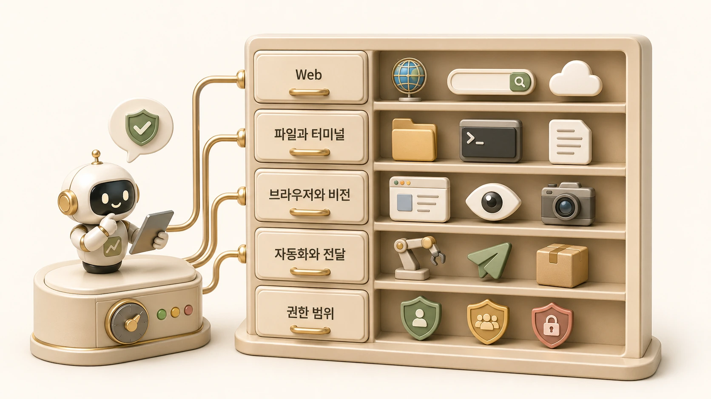

## Hermes Agent 내장 도구와 toolset은 어떻게 분류할까

에르메스 에이전트(Hermes Agent)의 도구 시스템은 “무엇을 할 수 있는가”보다 “어떤 권한으로 어떤 환경에서 실행되는가”를 먼저 봐야 한다. [공식 Tools & Toolsets 문서](https://hermes-agent.nousresearch.com/docs/user-guide/features/tools)는 web search, terminal, file editing, browser automation, media, memory, delegation, cron, messaging delivery, MCP server tools 같은 built-in tools가 toolset 단위로 묶인다고 설명한다. 도구를 열기 전에는 [Hermes Agent MCP 연결 기준](https://wikidocs.net/346231)과 권한 범위를 함께 봐야 한다.



이 장의 목적은 도구 목록을 외우는 것이 아니다. AI 개인비서가 어떤 일을 맡았을 때 web 도구가 필요한지, terminal/file 도구가 필요한지, browser/vision이 필요한지, cron이나 send_message처럼 자동화/전달 도구가 필요한지를 구분하는 기준을 잡는 것이다.

## 공식 docs 기준 도구 분류

| 분류 | 예시 | 운영에서 묻는 질문 |
|---|---|---|
| Web | web search, web extract | 최신 정보가 필요한가, 출처를 확인했는가 |
| Terminal/File | terminal, process, read_file, patch | 로컬 파일/명령을 건드려도 되는가 |
| Browser | browser navigate, snapshot, vision | 로그인/동적 페이지/화면 확인이 필요한가 |
| Media | vision, image generation, TTS | 이미지/음성 산출물이 필요한가 |
| Agent orchestration | todo, clarify, execute_code, delegate_task | 작업을 계획/분해/위임해야 하는가 |
| Memory/recall | memory, session search | 장기 선호나 과거 세션을 봐야 하는가 |
| Automation/delivery | cronjob, send_message | 예약 실행이나 외부 전달이 필요한가 |
| Integrations | MCP server tools, Home Assistant 등 | 외부 서비스 권한과 scope가 준비됐는가 |

이 분류는 기능 설명이 아니라 위험도 분류이기도 하다. Web 검색은 주로 읽기 작업이지만 terminal/file은 수정과 삭제로 이어질 수 있다. send_message는 외부 전달이고, cron은 사람이 없는 fresh session에서 실행된다.

## toolset은 왜 필요한가

toolset은 에이전트가 사용할 수 있는 도구 범위를 줄이는 장치다. 모든 도구를 항상 열어두면 편해 보이지만, 실제 운영에서는 필요하지 않은 권한까지 함께 열린다.

예를 들어 조사형 에이전트는 web/session search 중심이면 충분할 수 있다. 정리형 에이전트는 read_file, search_files, patch, WikiDocs 검증 도구가 필요할 수 있다. 실행형 에이전트는 terminal/process를 쓰지만 그만큼 승인과 복구 기준이 강해야 한다. 이미지형 에이전트는 image generation과 vision 검수가 중요하다.

| 역할 | 기본 도구 범위 | 열기 전에 볼 것 |
|---|---|---|
| 조사형 | web, browser, session search | 출처/시점/근거 분리 |
| 정리형 | file read/search, patch, WikiDocs 검증 | source of truth와 문체 기준 |
| 실행형 | terminal, process, git, deployment tool | 승인/rollback/로그 |
| 자동화형 | cronjob, send_message, web/API | fresh session prompt와 delivery target |
| 이미지형 | image generation, vision | 메시지 일치와 저작권/브랜드 기준 |

## 도구 선택은 작업 단계와 함께 본다

같은 요청도 단계에 따라 필요한 toolset이 달라진다. “새 WikiDocs 페이지를 추가해줘”라는 요청을 예로 들면 처음에는 파일 검색과 기존 TOC 확인이 필요하다. 본문 작성 단계에서는 정리형 기준이 중요하고, 검증 단계에서는 Markdown 검증과 링크 확인이 필요하다. 마지막에는 GitHub 원본 반영과 WikiDocs 공개 페이지 확인이 필요하다.

```text
요청 해석 → 파일/TOC 확인 → 본문 작성 → 검증 → 원격 반영 → 공개 페이지 확인
```

이 흐름을 한 번에 “도구를 많이 써서 해결”로 보면 위험하다. 각 단계마다 도구 권한과 완료 기준이 달라진다.

## 운영 체크리스트

- 이 도구는 읽기 도구인가, 쓰기 도구인가?
- 결과가 외부 채널로 전달되는가?
- 사람 승인 없이 실행해도 되는 범위인가?
- 실패했을 때 로그와 rollback 경로가 있는가?
- 이 작업은 현재 세션에서 끝나는가, 반복되어 Skill/cron으로 남아야 하는가?
- toolset을 줄여도 작업이 가능한가?

## 함께 연결해서 볼 기준

내장 도구와 toolset은 단독 기능이 아니라 [MCP 외부 도구](https://wikidocs.net/346231), [terminal backend](https://wikidocs.net/346289), [도구 실행 결과 검증](https://wikidocs.net/346290)과 함께 판단해야 한다. 예를 들어 파일을 읽는 일은 toolset 선택 문제지만, 외부 계정에 쓰는 일은 MCP/API 권한 문제이고, 시스템을 바꾸는 일은 terminal 위험도와 검증 기준까지 같이 봐야 한다.

## FAQ

### 모든 toolset을 켜두면 더 편하지 않나요?

초기 실험에서는 편할 수 있다. 하지만 운영에서는 필요 없는 권한까지 열린다. 특히 terminal, file write, messaging delivery, cron은 범위를 줄여 두는 편이 안전하다.

### MCP 도구도 built-in tool과 같은 기준으로 보면 되나요?

큰 기준은 같다. 다만 MCP는 외부 서비스의 계정/scope가 붙기 때문에 권한 경계를 더 세밀하게 봐야 한다.
