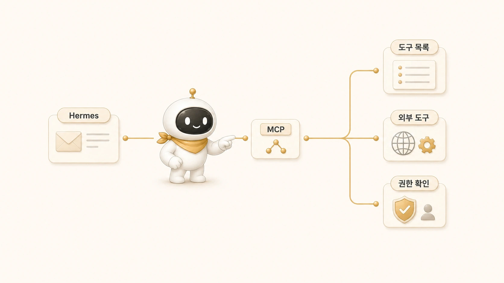

## Hermes Agent MCP는 외부 도구를 어떻게 연결할까

에르메스 에이전트(Hermes Agent)에서 MCP는 외부 도구를 대화 흐름에 붙이는 표준 연결면이다. `Hermes Agent MCP`, `Hermes Agent MCP server`, `Hermes Agent add MCP`를 찾는 독자라면 MCP를 “자동화 버튼”이 아니라 AI 개인비서가 외부 서비스의 도구 목록을 이해하고 호출하는 방식으로 이해해야 한다.

MCP를 붙이면 할 수 있는 일이 늘어난다. 이 기준은 [외부 도구/MCP/채널 연동과 AI 워크플로우 자동화](https://wikidocs.net/345907) 전체와 연결된다. 하지만 위험도도 같이 늘어난다. 캘린더 조회, 문서 검색, GitHub 이슈 확인, Notion 페이지 조회처럼 읽기 중심인 작업과 문서 수정, 공유 범위 변경, 삭제, 배포처럼 되돌리기 어려운 작업은 같은 연결로 다루면 안 된다.

## MCP가 해결하는 문제

AI 개인비서는 자연어 요청을 받는다. 외부 도구는 API, CLI, OAuth, 파일 권한, workspace scope 같은 형식으로 움직인다. MCP는 이 사이를 연결해 “사용자는 자연어로 요청하고, 에이전트는 연결된 도구를 호출하는” 구조를 만든다. 그래서 MCP는 [AI 개인비서 메인 창구](https://wikidocs.net/345891)가 외부 업무 시스템을 다루는 방식과도 이어진다.

다만 MCP가 모든 운영 판단을 대신하지는 않는다. 같은 도구 호출이 반복 절차가 되면 [Hermes Agent Skill](https://wikidocs.net/346235)로 검증 기준을 남기고, 실패했을 때는 [복구 플레이북](https://wikidocs.net/345918)의 순서로 process/log/delivery를 좁혀야 한다.

| 질문 | MCP가 해주는 것 | 사람이 정해야 할 것 |
|---|---|---|
| 어떤 도구가 있는가 | tool 목록과 schema를 노출한다 | 어떤 업무에 쓸지 정한다 |
| 어떤 계정으로 실행되는가 | 연결된 서버/인증 범위 안에서 실행한다 | 계정/scope/위험 작업 기준을 정한다 |
| 결과를 어떻게 받는가 | tool 결과를 대화에 돌려준다 | 보고 형식과 검증 기준을 정한다 |
| 자동으로 돌릴 수 있는가 | 도구 호출은 가능하게 한다 | cron prompt와 schedule은 따로 설계한다 |

## MCP server를 붙이기 전 질문

MCP server를 추가하기 전에는 기능보다 경계를 먼저 봐야 한다.

1. 이 MCP server는 어떤 계정으로 연결되는가?
2. 읽기/쓰기/삭제/공유 변경 중 어디까지 가능한가?
3. tool 이름만 봐도 에이전트가 위험도를 구분할 수 있는가?
4. 실패했을 때 로그를 어디서 볼 수 있는가?
5. cron이나 gateway와 함께 쓸 때 결과가 어디로 전달되는가?
6. 공유 문서나 로그에 token, API key, webhook URL이 남지 않는가?

이 질문이 없으면 MCP는 편한 연결이 아니라 조용한 위험이 된다.

## 도구 연결을 업무 흐름에 붙이면

“지난주 회의록 찾아서 요약해줘”는 MCP와 잘 맞는다. 문서 검색, 파일 읽기, 요약이 중심이고 위험도가 낮다. 반면 “오래된 문서 정리해줘”는 다르다. 파일 이동, 삭제, 공유 범위 변경이 포함될 수 있기 때문이다. 이 경우에는 바로 실행하지 말고 후보 목록, 소유자, 공유 범위, 복구 가능성을 먼저 보고해야 한다.

GitHub도 마찬가지다. 이슈 목록 조회나 PR diff 검토는 낮은 위험 작업이다. 하지만 branch push, release 생성, issue close, 권한 변경은 실행 전 기준이 필요하다. MCP 연결 여부보다 “어디까지 자동 실행해도 되는가”가 먼저다.

## 웹 검색은 MCP로만 설명하면 부족하다

웹 검색/리서치 도구는 MCP/API/CLI 중 하나로만 설명하면 독자가 헷갈린다. 실제 운영에서는 무료 검색 백엔드, 유료 검색 API, 브라우저 직접 확인, AI 검색 서비스를 목적에 따라 섞는다.

가벼운 조사에서는 DuckDuckGo/DDGS처럼 API key 없이 쓸 수 있는 무료 검색이 빠르다. SearXNG는 직접 호스팅하거나 신뢰 가능한 인스턴스를 쓰면 여러 검색원을 묶는 선택지가 된다. Hermes Agent 공식 web backend는 Firecrawl/Parallel/Tavily/Exa처럼 공식 docs에서 지원 범위를 확인하고, Brave/Perplexity 같은 별도 검색 API나 AI 검색은 원문 근거 확인 경로와 분리해서 검토한다.

그래서 리서치형 에이전트에게는 “Brave가 좋다” 또는 “Tavily가 좋다”보다 아래 기준이 더 중요하다.

1. 이 조사는 빠른 후보 탐색인가, 공개 근거 수집인가?
2. 무료 검색으로 충분한가, quota와 SLA가 있는 유료 API가 필요한가?
3. 원문을 직접 열어 확인해야 하는가?
4. 검색 결과를 cron으로 매일 반복할 것인가?
5. 결과를 WikiDocs나 블로그에 인용할 수 있는 출처로 남길 것인가?

## CLI/API/MCP를 고르는 기준

외부 도구를 붙일 때도 “무엇을 연결할 수 있는가”보다 “어떤 방식이 운영에 맞는가”가 중요하다. GitHub, Notion, Google Workspace, WikiDocs 같은 도구는 CLI/API/MCP 중 여러 방식으로 연결될 수 있다.

| 방식 | 강한 경우 | 조심할 점 |
|---|---|---|
| CLI | GitHub처럼 로컬 인증과 명령이 안정적인 도구 | 실행 환경 HOME/path/auth 차이 |
| API | 세밀한 요청/응답과 자동화 제어가 필요할 때 | token scope, rate limit, 오류 처리 |
| MCP | LLM이 도구 목록과 스키마를 이해하고 호출해야 할 때 | credential filtering, tool 권한, 서버 안정성 |
| browser/GUI 자동화 | 공식 API가 부족하거나 사람 화면을 따라가야 할 때 | 느리고 깨지기 쉬우므로 마지막 선택지로 둔다 |

MCP는 좋은 연결 방식이지만 만능 연결 방식은 아니다. 반복 실행 절차가 중요하면 Skill이 필요하고, 예약 실행이면 cron이 필요하며, 사용자가 Slack에서 부르는 흐름이면 gateway까지 함께 봐야 한다.

## MCP와 cron/gateway/skill의 차이

| 기능 | 한 문장 정의 | 헷갈리기 쉬운 지점 |
|---|---|---|
| MCP | 외부 도구를 Hermes Agent 대화 흐름에 붙이는 연결 방식 | MCP 자체가 자동화 일정을 만들지는 않는다 |
| cron | 정해진 시간에 fresh session으로 작업을 실행하는 예약 방식 | prompt가 혼자 이해될 만큼 충분해야 한다 |
| gateway | Slack/Telegram/Discord 같은 채널과 Hermes Agent를 이어주는 상시 입구 | process OK와 실제 delivery 성공은 다르다 |
| skill | 반복 절차와 검증 기준을 재사용하는 운영 지식 | 최신 정보 조회를 skill에 고정하면 낡을 수 있다 |

## FAQ

### MCP server만 붙이면 AI 업무 자동화가 끝나나요?

아니다. MCP는 연결이다. 업무 자동화가 되려면 실행 조건, 권한, 검증, 보고 위치, 실패 처리 기준이 함께 있어야 한다.

### API와 MCP는 무엇이 다른가요?

API는 개발자가 직접 호출 규칙을 다루는 방식이고, MCP는 에이전트가 tool 목록과 schema로 이해하기 쉽게 만든 연결 방식이다. 세밀한 제어는 API가 유리하고, 에이전트 대화 흐름에 붙이기는 MCP가 유리하다.
