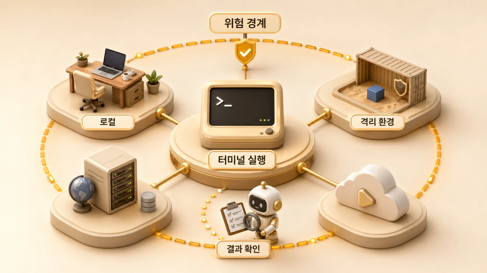

## Hermes Agent terminal 도구는 언제 강하고 언제 위험할까

Hermes Agent terminal 도구는 가장 강력하지만 가장 조심해야 하는 도구다. [공식 Tools & Toolsets 문서](https://hermes-agent.nousresearch.com/docs/user-guide/features/tools#terminal-backends)는 terminal backend를 local, docker, ssh, singularity, modal, daytona처럼 여러 실행 환경으로 나눈다. 즉 terminal은 하나의 명령창이 아니라 실행 위치와 격리 수준을 함께 선택하는 도구다.



AI 개인비서가 terminal을 쓰면 파일 검증, 테스트 실행, git 상태 확인, 빌드, 배포 준비가 빨라진다. 반대로 잘못 쓰면 사용자의 로컬 파일, credential, 운영 repo를 직접 건드릴 수 있다. 그래서 terminal 작업은 “명령을 실행할 수 있는가”보다 “어디서 실행해야 안전한가”가 먼저다.

## terminal backend를 고르는 기준

| backend | 공식 문서 기준 의미 | 좋은 사용처 | 주의점 |
|---|---|---|---|
| local | 현재 machine에서 실행 | 신뢰된 repo, 빠른 검증, 개발 환경 확인 | 사용자 파일/credential에 가까움 |
| docker | 격리 container에서 실행 | 재현성, 위험 명령 분리, 깨끗한 환경 | env 전달 범위 확인 필요 |
| ssh | remote server에서 실행 | agent 코드와 작업 환경 분리 | 서버 권한/네트워크/로그 관리 필요 |
| singularity | HPC/rootless container | cluster/HPC 작업 | 환경 구성 난도가 높음 |
| modal | serverless cloud 실행 | 확장/일시 실행/비용 절감 | cloud credential과 상태 보존 기준 필요 |
| daytona | cloud sandbox workspace | persistent remote dev 환경 | workspace 수명과 비용/권한 확인 필요 |

개인 학습이나 단순 검증은 local이 빠르다. 하지만 위험 명령, 낯선 repo, 대량 삭제/이동, 외부 코드를 실행하는 작업은 docker나 remote sandbox를 먼저 검토한다.

## terminal이 강한 작업

terminal은 다음 작업에서 특히 강하다.

1. `git status`, `git diff`, test 실행처럼 상태를 빠르게 확인하는 일
2. build, lint, validation처럼 결과가 명확한 명령을 돌리는 일
3. package install, script execution처럼 shell 환경이 필요한 일
4. long-running process를 background로 띄우고 log를 확인하는 일
5. CLI 기반 도구를 기존 개발자 워크플로우 그대로 쓰는 일

이 장점 때문에 실행형 에이전트가 terminal을 자주 쓴다. 다만 terminal이 강하다는 말은 “모든 일을 terminal로 처리하라”는 뜻이 아니다. 파일 읽기는 read_file, 검색은 search_files, 작은 수정은 patch처럼 더 안전한 도구가 있으면 그쪽을 먼저 쓰는 편이 좋다.

## terminal이 위험해지는 순간

| 신호 | 왜 위험한가 | 안전한 대응 |
|---|---|---|
| 삭제/이동/권한 변경 | 복구 범위가 커진다 | diff/backup/checkpoint 확인 |
| shell heredoc 대량 작성 | 기존 파일을 덮어쓸 수 있다 | write_file/patch로 의도 명확화 |
| 인증 실패 후 반복 재시도 | account lock/잘못된 권한 추정 | HOME/token/scope부터 확인 |
| background process 방치 | port/log/resource 혼선 | process 관리와 종료 기준 설정 |
| 외부 스크립트 실행 | supply chain 위험 | source 확인 후 sandbox 사용 |
| sudo 사용 | 시스템 범위 영향 | 목적/범위/복구 기준 확인 |

위험 신호가 보이면 먼저 [Hermes Agent 위험 명령 승인 기준](https://wikidocs.net/346260)과 연결해서 본다. terminal은 승인 기준과 격리 기준 없이 쓰면 운영 사고의 지름길이 된다.

## 실행 전 명령을 읽는 방법

terminal 명령은 실행 전에 세 가지로 쪼개서 읽는다.

```text
1. 어디에서 실행되는가: working directory, HOME, profile, container
2. 무엇을 바꾸는가: read/write/delete/network/permission
3. 어떻게 되돌리는가: git diff, checkpoint, backup, rollback
```

이 세 가지가 불분명하면 명령을 바로 실행하지 않는다. 특히 GitHub/WikiDocs 원고 작업에서는 파일 수정 전후에 `git status`와 검증 스크립트를 확인해야 한다.

## 운영 체크리스트

- terminal이 꼭 필요한 작업인가, 더 좁은 도구로 가능한가?
- local에서 실행해도 되는가, docker/ssh/modal 같은 격리가 필요한가?
- working directory와 HOME이 맞는가?
- credential이나 env가 명령 실행 환경에 노출되는가?
- 삭제/이동/쓰기 작업 전에 diff/checkpoint가 있는가?
- background process는 누가 종료하고 어떻게 로그를 볼 것인가?

## 함께 연결해서 볼 기준

terminal은 [내장 도구와 toolset](https://wikidocs.net/346288) 중에서도 실행 영향이 큰 축이다. 그래서 명령을 돌리기 전에는 [도구 실행 결과 검증](https://wikidocs.net/346290) 기준을 같이 보고, 반복되는 명령은 나중에 [Skill 운영](https://wikidocs.net/346235)이나 복구 플레이북으로 옮길 수 있는지 확인하는 편이 안전하다.

## FAQ

### terminal을 쓰면 항상 위험한가요?

아니다. 상태 확인과 검증에는 매우 유용하다. 위험한 것은 terminal 자체가 아니라 범위와 복구 기준 없이 쓰는 것이다.

### Docker backend를 쓰면 안전한가요?

도움은 된다. 하지만 container에 전달한 env나 mounted volume은 여전히 노출될 수 있다. 격리와 credential 최소화를 함께 봐야 한다.
