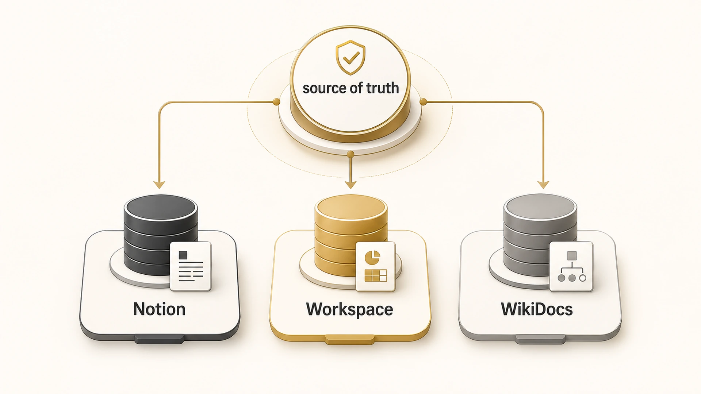

## Notion/Google Workspace/WikiDocs는 어떤 방식으로 연결할까

에르메스 에이전트(Hermes Agent)에서 Notion, Google Workspace, WikiDocs를 연결할 때는 도구 이름보다 역할을 먼저 나눠야 한다. `Hermes Agent Notion`, `Hermes Agent Google Workspace`, `Hermes Agent WikiDocs`, `MCP API CLI 연동`을 찾는 독자라면 “어떤 서비스를 붙일까”보다 “어떤 정보가 어디의 source of truth인가”를 먼저 정해야 한다.

같은 문서 도구처럼 보여도 세 서비스의 역할은 다르다. Notion은 팀 문서/업무 DB가 되기 쉽고, Google Workspace는 메일/일정/드라이브/문서 협업의 중심이 되기 쉽다. WikiDocs는 공개 책/전자책으로 읽히는 발행 채널이다. 이 구분은 [AI 에이전트 기억 시스템](https://wikidocs.net/345902)에서 말하는 source of truth 경계와도 연결된다.

## 도구별 역할을 먼저 나누기

| 도구 | 주 역할 | 연결 방식 후보 | 운영 기준 |
|---|---|---|---|
| Notion | 팀 문서, DB, 프로젝트 기록 | API/MCP/공식 skill | DB schema와 쓰기 권한을 먼저 확인한다 |
| Google Workspace | Gmail, Calendar, Drive, Docs, Sheets | API/MCP/Google toolset | 계정/scope/삭제/공유 변경 기준을 나눈다 |
| WikiDocs | 공개 책, 전자책/PDF, 장기 콘텐츠 자산 | GitHub 연동/API/수동 확인 | GitHub 원본과 공개 페이지 sync를 함께 본다 |
| Slack | 요청/보고/스레드 협업 | gateway/messaging | thread 맥락과 delivery target을 관리한다 |

이 표에서 중요한 것은 연결 방식이 하나로 고정되지 않는다는 점이다. 어떤 도구는 API가 좋고, 어떤 도구는 MCP가 좋고, 어떤 흐름은 GitHub를 중간 source of truth로 두는 편이 안전하다.

## Notion을 연결할 때

Notion은 페이지보다 DB 구조가 핵심일 때가 많다. 그래서 “Notion에 써줘”라는 요청은 단순해 보여도 실제로는 어떤 database에, 어떤 property로, 어떤 상태값을 넣을지 정해야 한다.

읽기 중심 작업은 비교적 쉽다. 예를 들어 회의록을 찾아 요약하거나, 특정 project DB에서 진행 중인 항목을 모으는 일이다. 반면 쓰기 작업은 기준이 필요하다. 새 페이지 생성, 상태 변경, 담당자 변경, 공유 범위 변경은 팀 운영에 영향을 준다.

## Google Workspace를 연결할 때

Google Workspace는 계정과 권한이 가장 중요하다. Gmail, Calendar, Drive, Docs, Sheets가 한 묶음처럼 보여도 위험도는 다르다.

- Gmail 읽기와 메일 발송은 다르다.
- Calendar 조회와 일정 초대 발송은 다르다.
- Drive 파일 검색과 공유권한 변경은 다르다.
- Docs 요약과 문서 덮어쓰기는 다르다.

그래서 Google Workspace 연동은 [MCP 연동이 오래 걸리는 이유](https://wikidocs.net/345903)와 연결된다. 기술 연결보다 계정/scope/위험 작업 기준이 더 오래 걸릴 수 있다.

## WikiDocs를 연결할 때

WikiDocs는 우리 책에서 공개 배포 채널이다. 원고의 source of truth는 GitHub repo에 두고, WikiDocs는 독자가 보는 공개 화면으로 본다. 그래서 WikiDocs 작업은 “파일을 고쳤다”에서 끝나지 않는다.

운영 기준은 세 단계다.

1. GitHub 원고를 수정하고 검증한다.
2. GitHub 원본에 변경 이력을 남기고 갱신한다.
3. WikiDocs 공개 페이지에서 링크, 이미지, 본문 반영을 확인한다.

이 구조 덕분에 전자책/PDF 호환성, SEO/GEO 키워드, 내부 링크, 이미지 경로를 한 번에 관리할 수 있다. 반대로 GitHub와 WikiDocs 중 어디가 원본인지 헷갈리면 같은 글을 두 곳에서 다르게 고치는 문제가 생긴다. 실제 발행 흐름은 [GitHub와 WikiDocs로 콘텐츠를 발행하고 고치는 흐름](https://wikidocs.net/345994)에서, 콘텐츠 채널 기준은 [WikiDocs/블로그/강의 콘텐츠 시스템](https://wikidocs.net/345911)에서 이어서 볼 수 있다.

## API/MCP/CLI 선택 기준

| 상황 | 먼저 볼 방식 | 이유 |
|---|---|---|
| 로컬 repo 수정/검증 | CLI | 파일 상태와 git diff를 바로 확인할 수 있다 |
| 외부 서비스 조회/요약 | MCP | 에이전트 대화 흐름에 붙이기 쉽다 |
| 반복 리포트/대량 조회 | API | pagination, filter, batch 처리가 유리하다 |
| 정기 실행 | cron + API/MCP | fresh session에서 혼자 실행되도록 설계해야 한다 |
| 팀 채널 보고 | gateway + Slack/Telegram/Discord | 결과가 도착할 위치와 스레드 맥락이 중요하다 |

## 공유 문서에 남기면 안 되는 것

도구 연결 글을 쓸 때 가장 위험한 것은 실제 인증값이나 내부 식별값이 섞이는 일이다.

- API key/token/webhook URL
- 내부 channel ID/chat ID
- 개인 계정명과 private workspace 이름
- 로컬 절대 경로
- 삭제/권한 변경을 바로 실행하는 명령

읽는 사람에게 필요한 것은 값 자체가 아니라 판단 기준이다. 예시는 placeholder로 쓰고, 실제 값은 공유 문서에 남기지 않는다.

## FAQ

### Notion은 MCP로 붙이는 게 좋나요, API로 붙이는 게 좋나요?

읽기/요약 중심이면 MCP가 편하고, DB property를 세밀하게 제어하거나 대량 처리해야 하면 API가 나을 수 있다. 먼저 DB schema와 권한 기준을 정해야 한다.

### Google Workspace는 왜 연동이 어렵게 느껴지나요?

도구가 어려워서라기보다 계정/scope/공유권한/삭제 위험이 섞이기 때문이다. 연결보다 운영 기준이 먼저다.

### WikiDocs도 MCP로 바로 고치면 안 되나요?

가능 여부보다 source of truth가 중요하다. 이 책처럼 GitHub 연동 WikiDocs라면 GitHub를 원본으로 보고, WikiDocs는 공개 반영을 확인하는 채널로 보는 편이 안전하다.

## 다음 글

도구 연결 기준을 잡았다면 [Hermes Agent cron과 Daily Briefing Bot](https://wikidocs.net/345926)에서 정기 실행과 결과 전달을 어떻게 설계하는지 이어서 보면 된다.
