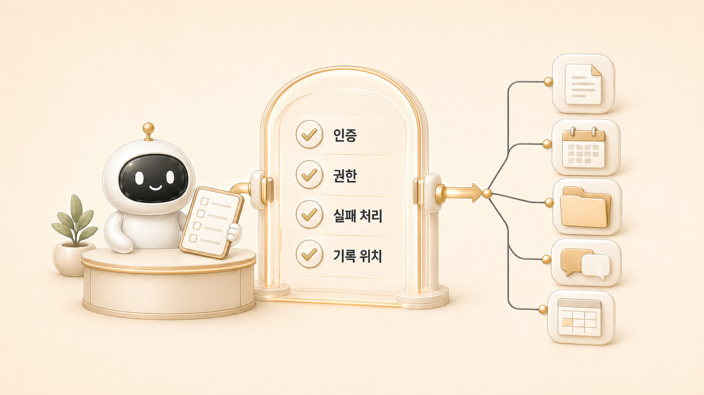

## Google Workspace와 MCP 연동은 왜 오래 걸릴까

에르메스 에이전트(Hermes Agent)에서 Google Workspace나 MCP 연동은 기술적으로 “붙이는 일”처럼 보인다. 하지만 실제 운영에서는 인증보다 계정, 권한, 범위, 위험 작업 기준이 더 오래 걸린다. 연결은 시작이고, 운영 기준은 그 다음이다.

Hermes Agent에서 MCP는 외부 도구를 대화 흐름에 붙이는 수단이다. Gmail, Calendar, Drive, Docs, Sheets 같은 도구가 연결되면 할 수 있는 일이 많아지지만, 그만큼 잘못 실행했을 때의 영향도 커진다.

## 처음에 단순하게 보는 지점

| 착각 | 실제로 봐야 할 것 |
|---|---|
| OAuth만 되면 끝 | 어느 계정으로 연결됐는가 |
| 읽기와 쓰기는 비슷함 | 쓰기/삭제/공유 변경은 승인 기준이 필요함 |
| MCP는 자동화다 | MCP는 도구 연결이고 자동화는 별도 설계다 |
| 한 번 연결하면 계속 안정적 | 권한 범위, profile, gateway 상태가 변할 수 있음 |

## 실제 운영 장면: 메일함과 권한을 먼저 나눈 이유

팀 규칙에서는 메일함과 인증 기준을 분리해 둔다. 이유는 간단하다. 같은 “메일 확인” 요청이라도 어느 계정의 메일함인지, 읽기만 할지 수정/발송까지 할지, Drive 공유권한을 건드릴지에 따라 위험도가 달라진다.

그래서 하비가 CSV, 문서, 이미지, PDF를 검색/분석하는 것은 직접 처리할 수 있지만, 대량 삭제나 외부 공개, 공유권한 변경은 먼저 후보 목록과 영향 범위를 보고해야 한다. 이것은 도구 사용 능력의 문제가 아니라 운영 책임의 문제다.

예를 들어 “지난달 계약서 찾아서 요약해줘”는 읽기 중심 작업이라 계정과 폴더 범위가 맞으면 바로 진행할 수 있다. 하지만 “Drive에서 오래된 파일 정리해줘”는 다르다. 삭제 후보를 먼저 목록화하고, 소유자/공유 범위/복구 가능성을 확인한 뒤 사람이 승인해야 한다. MCP 연결 여부보다 이 차이를 나누는 기준이 먼저다.

## MCP는 도구 연결이지 운영 완성이 아니다

MCP를 붙이면 AI 개인비서가 외부 서비스와 대화할 수 있다. 하지만 “무엇을 언제, 어떤 검증 후에, 어디까지 실행할지”는 별도 기준이다. 이 판단은 [외부 도구/MCP/자동화 운영](https://wikidocs.net/345907) 전체의 출발점이다. 특히 [메인 창구 하비](https://wikidocs.net/345891)가 요청을 해석하고 위험도를 나눈 뒤 필요한 도구만 호출해야 한다.

예를 들어 캘린더 조회, 문서 요약, 파일 목록화는 비교적 낮은 위험 작업이다. 반면 문서 덮어쓰기, 공유권한 변경, 대량 이동은 결과가 되돌리기 어려울 수 있다. 이 둘을 같은 자동화로 다루면 안 된다.

## 공식 기준 mini 정의: MCP

MCP는 Hermes Agent가 외부 도구와 만나는 표준 연결면이다. 사용자는 자연어로 요청하지만, 실제 실행은 연결된 도구의 권한과 scope 안에서 일어난다.

그래서 MCP 페이지의 핵심 질문은 “연결됐는가”가 아니다. “어느 계정의 어떤 권한으로, 어떤 작업까지 실행해도 되는가”다. MCP는 [Hermes Agent cron](https://wikidocs.net/345926)이나 [Skill](https://wikidocs.net/345904)과 함께 쓰일 수 있지만, MCP 자체가 예약 실행이나 절차 재사용을 대신하지는 않는다.

## 운영 기준

1. 먼저 계정과 scope를 확인한다.
2. 읽기/쓰기/삭제/공유 변경을 분리한다.
3. on-demand 호출과 cron 자동화를 나눈다.
4. 자동화는 self-contained prompt와 delivery target을 갖춘 뒤 만든다.
5. 실패 시 profile, 권한 범위, gateway, tool permission 순서로 확인한다.
6. 공개 문서에는 실제 계정명, 인증값 위치, 내부 식별값을 남기지 않는다.

## FAQ

### MCP만 붙이면 자동화가 끝나나요?

아니다. MCP는 외부 도구 연결이다. 자동화가 되려면 반복 조건, 실행 주기, 입력 맥락, 검증, 전달 위치가 따로 필요하다.

### 처음부터 cron으로 돌리면 안 되나요?

반복 기준이 안정되기 전에는 위험하다. 먼저 사람이 요청했을 때 잘 되는 on-demand 흐름을 만들고, 그 다음 cron으로 옮기는 편이 안전하다.

### Google Workspace 연동에서 제일 먼저 볼 것은 무엇인가요?

계정과 권한 범위다. 도구가 되는지보다 “이 계정에서 이 작업을 해도 되는가”가 먼저다.

## 다음 글

다음은 [always-on gateway는 왜 자주 헷갈릴까](https://wikidocs.net/345906)에서 연결된 도구가 실제 채널에서 계속 살아 있는지 확인하는 기준을 본다. 반복 절차를 Skill로 남기는 기준은 6장의 [Hermes Agent Skill 운영](https://wikidocs.net/346235)에서 이어진다.
