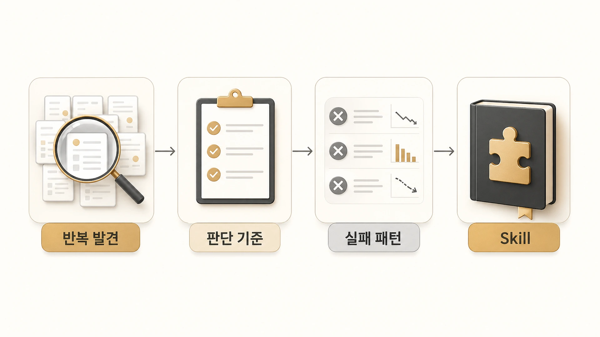

## 반복 업무는 어떻게 Skill이 되는가

에르메스 에이전트(Hermes Agent)에서 반복 업무가 Skill이 되는 순간은 “또 시켰다”가 아니라 “같은 기준으로 다시 처리해야 한다”가 보일 때다. 반복 횟수보다 중요한 것은 절차, 판단 기준, 실패 패턴, 검증 방법이 함께 생겼는지다.

Skill은 최신 정보를 저장하는 곳이 아니다. 오늘의 조사 결과, 일회성 링크, 임시 작업 로그는 session이나 원본 기준에 남기는 편이 맞다. Skill에는 다음에 같은 종류의 일을 할 때 어떤 순서로 확인하고 어떤 도구를 써야 하는지 남긴다.

## 반복 업무가 Skill이 되기 전 단계

| 단계 | 상태 | 남길 곳 |
|---|---|---|
| 1회성 요청 | 결과만 필요하다 | session / 결과물 |
| 두 번째 반복 | 비슷한 실수가 보인다 | 체크리스트 후보 |
| 세 번째 반복 | 순서와 검증 기준이 생긴다 | Skill 후보 |
| 여러 에이전트가 사용 | 역할별 변형이 필요하다 | 공통 Skill / 역할 Skill 분리 |
| 다른 사람도 재사용 가능 | 팀 밖에서도 통하는 절차다 | 공개 GitHub Skill 후보 |

Skill은 “많이 한 일”이 아니라 “다시 할 때 기준이 필요한 일”에서 나온다. 그래서 처음부터 Skill을 만들기보다, 한두 번 직접 처리하면서 실패 패턴을 확인하는 편이 안전하다.

## 사례: WikiDocs 발행은 왜 Skill이 됐나

WikiDocs 발행은 처음엔 단순해 보였다. 글을 고치고, 원격 저장소에 반영하면 끝나는 일처럼 보였다. 하지만 실제 운영에서는 TOC 링크, H1 금지, 이미지 경로, 불필요한 구분 문자, raw `.md` body 링크, WikiDocs 동기화 확인까지 함께 봐야 했다.

여기에 SEO/GEO 기준이 더해졌다. 독자가 `에르메스 에이전트란 무엇인가`로 들어왔을 때 첫 문단에서 답을 얻는지, `Hermes Agent`와 `에르메스 에이전트`가 자연스럽게 같이 쓰이는지, 본문 안의 개념 링크가 독자 이동을 돕는지 확인해야 했다. 이 기준은 [GitHub/WikiDocs 발행 케이스](https://wikidocs.net/345994)와 이어진다.

한 번의 발행 성공이 아니라 여러 번의 발행에서 같은 검증 항목이 반복되면서 Skill이 됐다. 이제 뽀동이는 WikiDocs 작업을 받을 때 먼저 `wikidocs-github-ebook-pipeline`을 로드하고, 원고 품질과 발행 검증을 함께 본다.

## 사례: 이미지 제작도 Skill이 되는 이유

하망이가 WikiDocs 이미지를 만들 때도 반복 기준이 생겼다. 단순히 “예쁜 이미지”를 만드는 것이 아니라, 본문 메시지를 잘 압축했는지, 이전 장의 톤과 이어지는지, 이미지 안의 한글이 맞는지, 잘림이나 워터마크가 없는지 확인해야 했다.

그래서 이미지형 에이전트 Skill에는 프롬프트 작성법만 남지 않는다. 스타일 기준, vision QA, 파일 포맷, 본문 삽입 전 확인 순서까지 함께 남는다. 이 내용은 [하망이와 WikiDocs 이미지를 만든 실제 운영 케이스](https://wikidocs.net/345991)에서 더 구체적으로 볼 수 있다.

## Skill로 만들기 전 확인할 질문

1. 이 작업은 같은 형태로 다시 올 가능성이 높은가?
2. 실패했을 때 확인할 순서가 이미 보이는가?
3. 검증 기준을 명령이나 체크리스트로 적을 수 있는가?
4. 최신 정보는 조회하고, 절차만 Skill에 남길 수 있는가?
5. 이 절차가 특정 에이전트 전용인지, 팀 공통인지 구분되는가?

## Skill에 넣지 말아야 할 것

- API key, token, password, webhook URL 같은 보호해야 할 정보
- 매번 바뀌는 최신 뉴스, 버전, 가격, 검색 결과
- 특정 세션에서만 의미 있는 작업 진행 상태
- 원문 그대로의 대화 로그
- 검증되지 않은 개인 추측

Skill은 오래 살아남는 절차여야 한다. 바뀌는 값은 원본 기준에서 조회하고, Skill에는 조회하는 순서와 판단 기준만 남긴다.

## FAQ

### 반복 업무는 몇 번 해야 Skill로 만들 수 있나요?

정해진 횟수보다 기준이 중요하다. 두 번만 해도 같은 실패가 보이고 검증 순서가 잡히면 Skill 후보가 된다.

### 체크리스트와 Skill은 다른가요?

체크리스트는 확인 항목이고, Skill은 그 체크리스트를 언제 어떤 도구와 함께 쓸지까지 포함한 실행 절차다.
