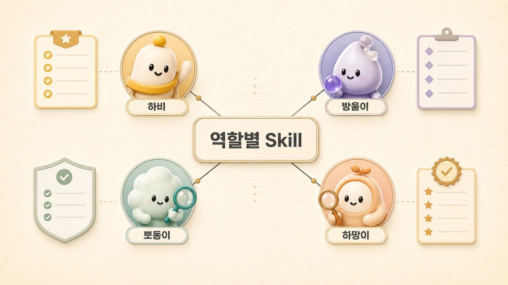

## 역할형 에이전트별 Skill은 어떻게 나눌까

에르메스 에이전트(Hermes Agent)에서 Skill을 잘 쓰려면 역할형 에이전트의 경계를 먼저 봐야 한다. 하비, 방울이, 뽀동이, 하망이, 봉구가 모두 같은 Skill을 쓰면 편해 보이지만, 실제로는 역할마다 필요한 판단 기준과 검증 방식이 다르다.

앞의 [역할형 에이전트 분리](https://wikidocs.net/345925)에서 본 것처럼 조사형/정리형/실행형/이미지형 에이전트는 강점과 실패 방식이 다르다. Skill도 이 차이를 반영해야 한다. Skill은 에이전트를 똑같이 만드는 장치가 아니라, 각 역할이 자기 일을 더 안정적으로 하게 만드는 장치다.

## 역할별 Skill 경계

| 역할 | Skill에 남길 기준 | 피해야 할 것 |
|---|---|---|
| 하비 | 요청 해석, 역할 분배, 최종 통합, 위험 판단 | 모든 세부 절차를 혼자 떠안기 |
| 방울이 | 조사 범위, 근거 품질, source 확인, 비교 기준 | 출처 없이 결론부터 쓰기 |
| 뽀동이 | 문서 구조, SEO/GEO, WikiDocs 발행 검증, 문체 기준 | 근거 없는 내용을 예쁘게 포장하기 |
| 하망이 | 이미지 메시지 압축, 스타일 기준, vision QA, 배포 포맷 | 예쁘지만 본문 메시지와 무관한 이미지 |
| 봉구 | 실행 순서, 명령 검증, 배포/복구 기준 | 범위 확인 없이 바로 실행하기 |

역할 Skill의 핵심은 “누가 더 똑똑한가”가 아니다. 누가 어떤 실패를 자주 만들고, 그 실패를 어떤 기준으로 줄일지다.

## 사례: 뽀동이 Skill과 하비 Skill은 다르다

뽀동이에게 필요한 Skill은 글의 구조, 읽는 흐름, WikiDocs 전자책 호환성, SEO/GEO, 공유 글 품질 검증이다. 그래서 뽀동이는 원고 작업 전 `wikidocs-github-ebook-pipeline` 같은 Skill을 보고, 결과를 반영하기 전 기술 검증과 독자 관점 검증을 함께 한다.

하비에게 필요한 Skill은 다르다. 하비는 사용자의 요청을 받아 직접 처리할지, 방울이에게 조사시킬지, 뽀동이에게 정리시킬지, 봉구에게 실행시킬지 판단해야 한다. 이 기준은 [AI 개인비서 메인 창구](https://wikidocs.net/345892)와 [직접 처리할 일과 역할형 에이전트에 맡길 일](https://wikidocs.net/345893)에 더 가깝다.

둘을 하나의 Skill로 합치면 “문서를 잘 쓰는 기준”과 “일을 나누는 기준”이 섞인다. 그러면 다음 작업에서 어떤 기준을 따라야 할지 흐려진다.

## 사례: 하망이 Skill은 왜 별도 기준이 필요한가

하망이의 Skill은 이미지 생성 도구 사용법만 담지 않는다. 같은 Codex imagegen 계열 도구를 쓰더라도 하망이는 본문 메시지를 이미지로 바꾸는 역할을 맡는다. 그래서 Skill에는 톤 유지, 글자 가독성, 색감, 여백, 한글 QA, vision 검수, Slack이나 WikiDocs에 보낼 파일 형식이 함께 들어간다.

이 기준이 없으면 이미지는 예뻐도 책의 메시지와 따로 논다. 이미지형 에이전트의 Skill은 “그림을 만드는 방법”보다 “본문 이해를 돕는 시각 자료로 통과시키는 기준”에 가깝다.

## 공통 Skill과 역할 Skill을 나누는 법

| 구분 | 적합한 내용 | 예시 |
|---|---|---|
| 공통 Skill | 모든 에이전트가 지켜야 하는 안전/검증 기준 | 보호 정보 제거, 출처 확인, 사용자 확인 필요 조건 |
| 역할 Skill | 특정 역할이 반복 수행하는 절차 | 뽀동이의 WikiDocs 발행 검증, 방울이의 확장조사 기준 |
| 프로젝트 Skill | 특정 프로젝트에서만 반복되는 절차 | Hermes WikiDocs 발행 흐름 |
| 공개 Skill | 외부 사용자도 재사용 가능한 일반 절차 | GitHub PR 리뷰, YouTube transcript 정리 |

## 운영 기준

1. Skill 이름은 역할과 용도가 보이게 짓는다.
2. 공통 안전 기준과 역할별 작업 절차를 섞지 않는다.
3. 같은 도구를 쓰더라도 목적이 다르면 Skill을 나눈다.
4. 하비 같은 메인 창구 Skill에는 “직접 하지 말고 넘길 조건”을 포함한다.
5. 뽀동이 같은 정리형 Skill에는 “근거가 부족하면 더 다듬어야 한다”는 품질 기준을 포함한다.
6. 하망이 같은 이미지형 Skill에는 생성보다 검수 기준을 더 선명하게 둔다.

## FAQ

### 모든 에이전트가 같은 WikiDocs Skill을 써도 되나요?

검증 기준은 공유할 수 있지만, 실제 쓰임은 다르다. 하비는 발행 여부와 역할 분배를 판단하고, 뽀동이는 원고 품질과 링크/형식 검증을 책임지는 식으로 나누는 편이 좋다.

### Skill을 너무 잘게 나누면 복잡하지 않나요?

복잡해질 수 있다. 그래서 도구별이 아니라 실패 패턴별로 나누는 편이 좋다. 같은 실패를 줄이는 기준은 하나의 Skill에 모으고, 역할이 다르면 분리한다.

## 다음 글

다음은 [Skill은 어떻게 보강하고 QA해야 할까](https://wikidocs.net/346238)에서 만든 Skill이 실제 운영과 달라졌을 때 어떻게 고쳐야 하는지 본다.
