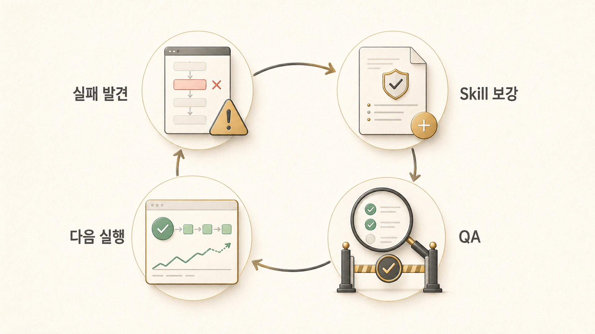

## Skill은 어떻게 보강하고 QA해야 할까

에르메스 에이전트(Hermes Agent)의 Skill은 한 번 만들고 끝나는 문서가 아니다. 실제 운영과 맞지 않는 Skill은 오래될수록 위험해진다. 좋은 Skill 운영은 새 Skill을 많이 만드는 것이 아니라, 틀린 절차를 빨리 고치고 검증 기준을 현재 운영에 맞추는 것이다.

Skill 보강은 “기억을 더 넣는 일”이 아니다. 실패가 발생했을 때 왜 기존 Skill이 막지 못했는지 확인하고, 다음에는 어떤 순서로 막을지 절차를 바꾸는 일이다. 그래서 Skill QA는 문장 교정보다 운영 품질 관리에 가깝다.

## Skill 보강이 필요한 신호

| 신호 | 의미 | 조치 |
|---|---|---|
| 같은 실수가 반복된다 | Skill에 실패 패턴이 빠져 있다 | Pitfall과 검증 단계를 추가한다 |
| 도구 명령이 바뀌었다 | Skill의 실행 절차가 낡았다 | 최신 명령과 확인 방법으로 고친다 |
| 사용자가 같은 피드백을 준다 | 선호/품질 기준이 반영되지 않았다 | 예시와 금지 패턴을 보강한다 |
| 검증은 통과했지만 결과가 약하다 | 기술 검증과 독자 품질이 분리되어 있다 | 품질 체크 항목을 추가한다 |
| 보호해야 할 정보가 노출될 뻔했다 | 공유/내부 경계가 약하다 | redaction 기준을 명시한다 |

## 사례: 검색 화면 한 장이 Skill 기준을 바꿨다

사용자가 Google 검색 결과 화면을 보여주며 “공식 문서를 잘 반영한 게 맞나, SEO 관점에서 괜찮나, 에르메스란 무엇인가가 잘 정리된 게 맞나”라고 물었다. 이 피드백은 단순한 제목 수정 요청이 아니었다. 검색자가 처음 보는 화면에서 정의가 바로 보이는지, 공식 문서의 핵심 기능이 책 구조 안에 들어왔는지, 한국어 검색어와 영어 검색어가 함께 잡히는지 다시 봐야 한다는 신호였다.

그래서 WikiDocs Skill의 검증 기준은 넓어졌다. H1, 이미지, TOC 링크처럼 깨진 곳을 찾는 기술 검증만으로는 부족했다. 첫 문단에서 검색자의 질문에 답하는지, `에르메스 에이전트(Hermes Agent)` 혼용 표기가 자연스러운지, `Hermes Agent란 무엇인가` 같은 진입 페이지가 충분히 선명한지까지 확인하도록 바뀌었다. 이 기준은 [에르메스 에이전트란 무엇인가](https://wikidocs.net/346055) 같은 검색 진입 페이지에서 특히 중요하다.

## 사례: “본문 링크” 피드백이 Skill에 남은 방식

또 다른 피드백은 본문 링크였다. 처음에는 페이지 끝에 “이어서 읽기”를 넣으면 본문 링크를 보강했다고 보기 쉬웠다. 하지만 사용자가 말한 본문 링크는 그런 순차 링크가 아니라, 본문 안에서 개념과 사례가 연결되는 contextual hyperlink였다.

이 피드백 이후 Skill에는 “본문 body link와 footer next link를 구분한다”는 기준이 들어갔다. 이제 WikiDocs 작업에서는 단순히 링크 개수를 세는 것이 아니라, 독자가 [MCP](https://wikidocs.net/346231), `Skill`, [memory](https://wikidocs.net/346126), `하비`, `뽀동이`, `하망이` 같은 개념을 읽는 자리에서 관련 페이지로 이동할 수 있는지 본다.

## 사례: 보고 방식도 Skill과 memory를 함께 고친다

사용자가 “보고가 너무 장황하다”고 말했을 때도 단순히 그 답변만 짧게 고치면 같은 문제가 반복된다. 이 경우에는 사용자 선호는 memory에 남기고, 문서 작업 완료 보고나 Slack 보고의 형식은 Skill과 운영 기준에 반영해야 한다. 예를 들어 `완료 / 남음 / 다음`처럼 짧은 상태 보고를 선호한다는 사실은 장기 선호이고, [WikiDocs 작업](https://wikidocs.net/345994) 후 어떤 검증 항목과 commit hash를 보고할지는 작업 Skill의 일부다.

이처럼 Skill 보강은 한 파일만 고치는 일이 아니다. memory, shared-memory, Skill, session_search가 각자 맡을 자리를 나눠야 다음 작업에서 같은 피드백을 반복하지 않는다.

## Skill QA 체크리스트

1. 이 Skill은 언제 로드해야 하는지 첫 문단에서 알 수 있는가?
2. 절차가 현재 도구/파일 구조/운영 방식과 맞는가?
3. 실패 패턴과 피해야 할 행동이 들어 있는가?
4. 검증 방법이 실제로 실행 가능한가?
5. 공유 문서 작업이라면 보호 정보 제거 기준이 있는가?
6. 사용자가 최근에 준 피드백이 반영되어 있는가?
7. 다른 Skill과 역할이 겹치거나 충돌하지 않는가?

## 보강할 때의 원칙

Skill을 고칠 때는 큰 문서를 다시 쓰기보다, 실패를 막는 문장을 정확한 위치에 넣는 편이 좋다. 예를 들어 “WikiDocs 링크는 `.md`가 아니라 page ID URL을 쓴다”는 규칙은 본문 링크 절차 바로 옆에 있어야 한다. “공유 콘텐츠에는 내부 계정값을 쓰지 않는다”는 규칙은 보호해야 할 정보 처리 절차 옆에 있어야 한다.

또한 Skill에는 작업 완료 로그를 길게 쌓지 않는다. “지난번에 무엇을 했다”는 기록은 session_search나 GitHub log에서 찾고, Skill에는 “다음에도 이렇게 해야 한다”만 남긴다.

## FAQ

### Skill이 틀렸다는 걸 언제 알 수 있나요?

사용자가 같은 피드백을 반복하거나, 검증은 통과했는데 결과물이 기대와 다를 때 알 수 있다. 이때는 결과만 고치지 말고 Skill 기준을 같이 고쳐야 한다.

### Skill 보강도 commit해야 하나요?

파일 기반 Skill이라면 변경 이력이 남는 편이 좋다. 누가 어떤 실패를 계기로 기준을 바꿨는지 추적할 수 있기 때문이다.

### 너무 많은 검증 항목이 들어가면 느려지지 않나요?

느려질 수 있다. 그래서 모든 검증을 넣기보다, 실패 비용이 큰 항목과 자주 반복되는 항목을 우선한다.

## 다음 글

다음은 [공개 GitHub Skill과 내부 Skill은 어떻게 분리할까](https://wikidocs.net/346239)에서 Skill을 공개 GitHub에 둘지, 개인/팀 내부에만 둘지 나누는 기준을 본다.
