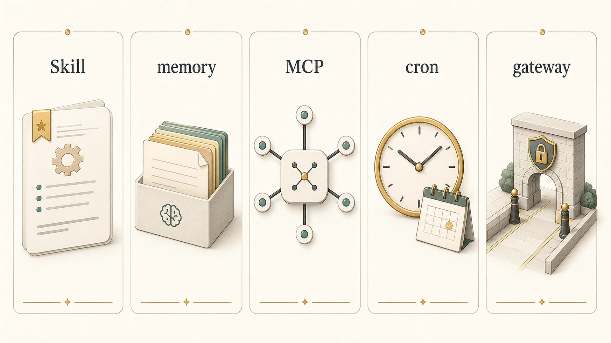

## Skill과 memory/MCP/cron/gateway는 어떻게 다를까

에르메스 에이전트(Hermes Agent)를 운영하다 보면 Skill, memory, MCP, cron, gateway가 모두 “자동화를 돕는 기능”처럼 보인다. 하지만 역할은 다르다. 이 차이를 모르면 모든 것을 memory에 넣거나, 모든 반복 작업을 cron으로 만들거나, 도구 연결을 Skill이라고 착각하기 쉽다.

Skill은 반복 업무의 실행 절차와 검증 기준이다. [memory](https://wikidocs.net/346126)는 장기 맥락과 선호를 기억한다. MCP는 외부 도구를 대화 흐름에 연결한다. [cron](https://wikidocs.net/345926)은 정해진 시간에 작업을 실행한다. gateway는 Slack, Telegram, Discord 같은 채널에서 Hermes Agent를 부르는 입구다. 도구 연결 기준은 [Hermes Agent MCP 연결](https://wikidocs.net/346231)과 함께 읽으면 차이가 더 선명하다.

## 한눈에 보는 차이

| 기능 | 핵심 역할 | 대표 질문 |
|---|---|---|
| memory | 오래 유지해야 할 사용자/운영 맥락 | 다음 세션에도 항상 알아야 하는가 |
| Skill | 반복 절차와 검증 기준 | 다음에도 같은 방식으로 처리해야 하는가 |
| MCP | 외부 도구 연결면 | 어떤 도구를 대화 흐름에서 호출해야 하는가 |
| cron | 예약 실행 | 정해진 시간에 fresh session으로 돌려야 하는가 |
| gateway | 메시징/채널 입구 | 사용자가 어디서 Hermes Agent를 부르는가 |
| session_search | 과거 대화 회수 | 예전에 어떻게 처리했는지 찾아야 하는가 |

이 표에서 중요한 것은 우열이 아니다. 한 작업 안에서도 여러 기능이 함께 쓰인다. 다만 어떤 기능이 어떤 책임을 갖는지 나눠야 운영이 안정된다.

## 사례: 같은 WikiDocs 요청을 기능별로 나누기

사용자가 “WikiDocs SEO를 다시 리뷰해줘”라고 요청하면 gateway는 Slack 요청을 Hermes Agent에게 전달한다. memory는 사용자가 짧은 보고와 자연스러운 한국어를 선호한다는 안정 기준을 제공한다. Skill은 WikiDocs 전자책 호환, SEO/GEO, 내부 링크, 검증/반영/공개 확인 흐름을 제공한다.

필요하면 MCP나 CLI가 GitHub, WikiDocs, 파일 시스템을 연결한다. cron은 같은 일을 매일 자동으로 해야 할 때만 등장한다. 과거에 비슷한 작업을 어떻게 했는지는 session_search나 GitHub log에서 회수한다. 이처럼 하나의 요청도 기능별 책임이 나뉘어야 한다.

## 사례: WikiDocs MCP 연결은 Skill이 아니다

WikiDocs MCP를 연결하면 책, 페이지, 블로그를 만들고 수정하는 도구가 Hermes Agent 안으로 들어온다. 하지만 MCP 연결 자체가 작업 품질을 보장하지는 않는다. 어떤 책이 source of truth인지, GitHub-linked book에서는 어디를 먼저 고쳐야 하는지, 공개 페이지를 어떻게 확인할지는 별도의 운영 기준이 필요하다.

이 운영 기준이 Skill이다. MCP는 문을 열어주고, Skill은 그 문으로 들어가 무엇을 어떤 순서로 할지 정한다.

## 잘못 나누면 생기는 문제

| 착각 | 결과 | 바른 기준 |
|---|---|---|
| 모든 선호를 Skill에 넣는다 | Skill이 비대해지고 역할이 흐려진다 | 안정 선호는 memory, 절차는 Skill |
| MCP를 붙이면 자동화가 끝난다 | 권한/검증/복구 기준이 없다 | MCP는 연결, Skill은 사용 절차 |
| 반복 작업은 모두 cron으로 만든다 | fresh session에서 맥락이 부족하다 | 예약이 필요할 때만 cron |
| gateway가 있으면 AI 팀 운영이 끝난다 | 채널은 열렸지만 처리 기준이 없다 | gateway는 입구, 하비/Skill이 처리 흐름 |
| 과거 작업을 Skill에 다 적는다 | 오래된 로그가 절차를 오염시킨다 | 과거 회수는 session_search, 절차만 Skill |

## 운영 기준

1. 반복 절차는 Skill, 장기 선호는 memory로 나눈다.
2. 도구를 붙이는 일과 도구를 쓰는 기준을 분리한다.
3. cron prompt는 Skill을 불러 쓰더라도 독립 실행 가능해야 한다.
4. gateway는 채널 문제이고, Skill은 처리 방식 문제다.
5. 과거 사례는 session_search나 source of truth에서 찾고, Skill에는 재사용 기준만 남긴다.

## FAQ

### Skill이 있으면 memory가 필요 없나요?

아니다. Skill은 실행 절차이고 memory는 안정 맥락이다. “사용자는 보고를 짧게 선호한다”는 memory에 가깝고, “WikiDocs 발행 전 검증 순서”는 Skill에 가깝다.

### MCP tool 사용법은 Skill인가요?

도구를 연결하는 것은 MCP이고, 그 도구를 어떤 순서와 기준으로 쓸지 정하는 것은 Skill이다. 예를 들어 GitHub MCP를 붙이는 일과 PR 리뷰 절차를 Skill로 남기는 일은 다르다.

### cron에 Skill을 붙이면 끝인가요?

끝이 아니다. cron은 fresh session에서 실행되므로 prompt 자체가 충분히 self-contained해야 한다. Skill은 절차를 돕지만, cron job의 목적/입력/출력/전달 대상은 prompt에 분명해야 한다.

## 다음 글

Skill 기준을 잡았다면 다음은 [WikiDocs/블로그/강의 콘텐츠 시스템](https://wikidocs.net/345911)으로 넘어간다. 반복 검증 기준이 어떻게 WikiDocs, 블로그, 강의, 이미지 자산의 품질을 지키는지 7장에서 이어서 본다.
